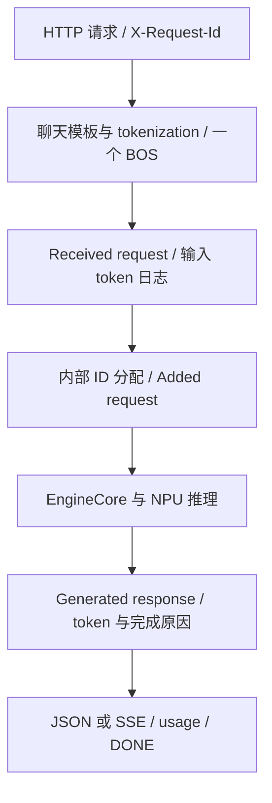

# openPangu Embedded 7B HTTP 服务验证

日期：2026-10-09。11 号机、4 号机依次完成独立单机 HTTP 验证，服务验证后关闭。

## 结果

| 检查 | 11 号机 | 4 号机 |
|---|---|---|
| GET /health、GET /v1/models | HTTP 200，模型名匹配 | 同左 |
| 非流式自我介绍 | 完整中文回答，35 个输出 token | 同左 |
| 非流式 17+25 | 最终答案 42，4 个输出 token | 同左 |
| 流式 17+25 | 最终答案 42，EOS、usage、[DONE] 齐全 | 同左 |
| 显式 stop=["42"] | 文本截去 42，stop_reason="42" | 同左 |
| 服务端输入 | 一个 BOS，日志与响应 token 一致 | 同左 |
| 正常退出与资源释放 | exit 0，进程退出、端口关闭、物理 1 号卡空闲 | 同左 |

两台四组请求的输入和输出 token 序列逐项一致。自我介绍与常规算术请求也与 10 月 8 日最终离线结果一致。

API 保留模型原始标记，常规算术的原始 content 为 ` [unused16] [unused17] 42`；验证脚本提取标记后的最终答案。常规输出 token 为 `[45974, 45982, 89168, 45892]`，分别对应两个标记、答案和 EOS，usage 因此计为 4 个 completion tokens。显式 stop 用例在答案处停止，文本不包含 42，但 token_ids 仍包含触发停止的 token 89168，usage 为 3。

## 环境与启动

本阶段继续使用自有容器 `w00939120`，全部部署文件位于 `/data/docker/w00939120/pangu-deploy`。两台均以容器 root 运行，使用物理 1 号卡，进程内为逻辑 0。

| 项目 | 实际配置 |
|---|---|
| CANN Toolkit / 950 OPS | 私有目录 9.2.0 / V100R001C12B096 |
| 运行栈 | Python 3.11.6、torch 2.9.0、torch_npu 2.9.0.post7.dev20260817、vLLM 0.14.0、Omni-NPU 0.2.0 |
| 模型 | openPangu-Embedded-7B-V1.1，14 个文件逐项校验大小与 SHA256 |
| 推理 | BF16、TP1、eager、seed 0 |
| 容量参数 | max_model_len 1024、max_num_batched_tokens 1024、max_num_seqs 2、gpu_memory_utilization 0.35 |
| 调度参数 | chunked prefill 开启，prefix caching 与 async scheduling 关闭 |
| 服务地址 | 容器内 http://127.0.0.1:18081 |
| 请求采样 | temperature 0、seed 0、max_tokens 128 |
| 单机通信设置 | GLOO_SOCKET_IFNAME=lo、VLLM_HOST_IP=127.0.0.1 |
| 插件 | omni-npu、omni_custom_models、omni_npu_patches |
| 模型代码 | trust_remote_code=True、safetensors |
| 观测 | request/output 日志、DEBUG 输入 token、request-id 响应头、return_token_ids |

启动脚本调用当前版本的 API parser 与 run_server；`async_scheduling=False`、`enable_prefix_caching=False` 在解析后显式赋值。最终参数保存在两台各自的 `server-config.json`。启动过程经既有 `with-pangu7b.py` 和私有 CANN wrapper，不读取 shell profile/rc。

实际 API 主进程与 EngineCore 的 /proc/PID/maps 均显示 ACL、HCCL、opapi 库来自私有 CANN 9.2.0。driver 的 libascend_hal.so 来自宿主驱动挂载。Python、源码、权重和共享配置保持原版本。

## 请求格式与 BOS

当前 vLLM 的 ChatCompletionRequest 将 add_special_tokens 默认设为 false。该模型的 chat template 没有自行加入 BOS，HTTP 请求必须显式传 true。本阶段通过 API 返回的 prompt_token_ids 与服务日志双向核对，输入首 token 为 1，BOS 总数为 1。

```json
{
  "model": "openPangu-Embedded-7B-V1.1",
  "messages": [
    {"role": "user", "content": "请计算17加25，并只给出结果。 /no_think"}
  ],
  "temperature": 0,
  "seed": 0,
  "max_tokens": 128,
  "stream": false,
  "add_special_tokens": true,
  "return_token_ids": true,
  "request_id": "pangu7b-n11-arith-20261009"
}
```

客户端同时发送同值的 X-Request-Id。流式请求另设 `stream=true`、`stream_options={"include_usage": true}`。实际收到 7 个 data 事件：assistant role、三个文本 delta、带 EOS/stop 的末 choice、usage、[DONE]。事件原文与到达时间分别保存在 SSE 和 client-results.json 中。

## 一次请求的日志对应关系

以 11 号机常规算术请求为例：

| 位置 | ID |
|---|---|
| 客户端 request_id / X-Request-Id | pangu7b-n11-arith-20261009 |
| API response.id / 引擎 external_req_id | chatcmpl-pangu7b-n11-arith-20261009 |
| Added request 的内部 ID | chatcmpl-pangu7b-n11-arith-20261009-8a5382f3 |

InputProcessor.assign_request_id 保存 external_req_id，并给内部 request_id 加 8 位随机后缀。不能用完整字符串相等把 API ID 与内部 ID直接拼接；本阶段每组请求单独保存映射。



日志实测覆盖输入 token、接收、入引擎和生成输出；EngineCore 的内部执行在本阶段通过实际 NPU 输出确认。逐请求 Scheduler/P/D 分段和设备 kernel timeline 在后续分析阶段采集。

当前源码定位如下；文件原文与 SHA256 保存在项目证据的 source/ 和两台 manifest 中：

| 环节 | 当前文件与行号 | 本次观测 |
|---|---|---|
| HTTP 入口 | api_server.py:490 | /v1/chat/completions 返回 200 |
| 模板与 add_special_tokens | serving_chat.py:326；serving_engine.py:1227、1259 | 输入 22/26 tokens，首 token 为 1 |
| 输入日志与提交 | serving_chat.py:386、408、418 | Received request 与 prompt token 日志 |
| 内部 ID 与入队 | async_llm.py:331、379；input_processor.py:434 | Added request，随机后缀映射 |
| 完整响应 | serving_chat.py:1606、1656 | 返回实际输入/输出 token |
| 流式响应 | serving_chat.py:750、1167、1347 | role、delta、EOS、usage、[DONE] |
| 输出日志 | entrypoints/logger.py:78 | Generated response |
| Omni-NPU 流式包装 | patch_pangu_serving_dispatch.py:60、325 | 包装按 parser 条件分支，继续委托上游流式实现 |

两台 13 个源码文件的 SHA256 清单一致。上述索引覆盖框架主入口、输入与 ID 分配、输出序列化及已读取的 Omni-NPU 包装；其余补丁层的完整调用图在请求机制分析阶段继续展开。历史 vLLM 0.9.2/vllm-ascend 0.9.2rc1 链路另作参考。

## 启动问题与处理

| 尝试 | 现象 | 检查与修正 | 结果 |
|---|---|---|---|
| 11 号机第一次 | 参数解析报 unrecognized arguments | max_tokens 属于请求参数；当前版本不接受 --disable-async-scheduling | 入口退出，未加载模型 |
| 11 号机第二次 | ModelConfig 要求 trust_remote_code=True | 沿配置加载栈核对本地模型 auto_map，补 --trust-remote-code | 入口退出，未执行推理 |
| 两台最终尝试 | 使用完整已核对配置 | 固定 eager/单机 Gloo，显式关闭 async/prefix cache，校验权重与空闲设备 | HTTP 用例全部完成 |

前两次日志由早期脚本追加到同一 stdout/stderr 文件，保留为原始合并记录；最终运行单独位于 attempt-03。恢复启动前先检查进程和失败层，再修改对应参数。

本阶段没有安装新包、替换 CANN 或下载权重。HTTP 接口验证使用短顺序请求；耗时仅保存在结果中，正式性能基线另行固定负载采集。

## 运行文件与清理

远端脚本：`scripts/http-7b/serve_http_7b.py`、`monitor_http_7b.py`、`verify_http_7b.py`。远端最终证据：`logs/http-7b/2026-10-09/attempt-03/`，含配置、权重清单、客户端请求/响应、SSE、请求日志、库映射、exit 和 postcheck。

| 节点 | API 主进程 | EngineCore | 正常关闭 |
|---|---:|---:|---|
| 11 | 67139 | 67452 | SIGINT 后 exit 0 |
| 4 | 60167 | 60488 | SIGINT 后 exit 0 |

关闭后逐项检查本轮 API、EngineCore、resource_tracker、monitor、client PID 均已不存在；18081 无监听，物理 1 号卡无运行进程。远端容器 shell 使用 HISTFILE=/dev/null，退出清理当次会话 history。

本阶段完成两台独立单机 HTTP 验证。下一步讨论双机通信网卡、地址、rank 与最小 collective 用例；92B 按 PD 混部、PD 分离继续推进。

项目证据与源码：[结果索引](D:/Desktop/Code/CC4Ascend/projects/pangu-92b整网分析/evidence/2026-10-09-seven-b-http/README.md)、[HTTP 入口](D:/Desktop/Code/CC4Ascend/projects/pangu-92b整网分析/runtime/http-7b/README.md)。

