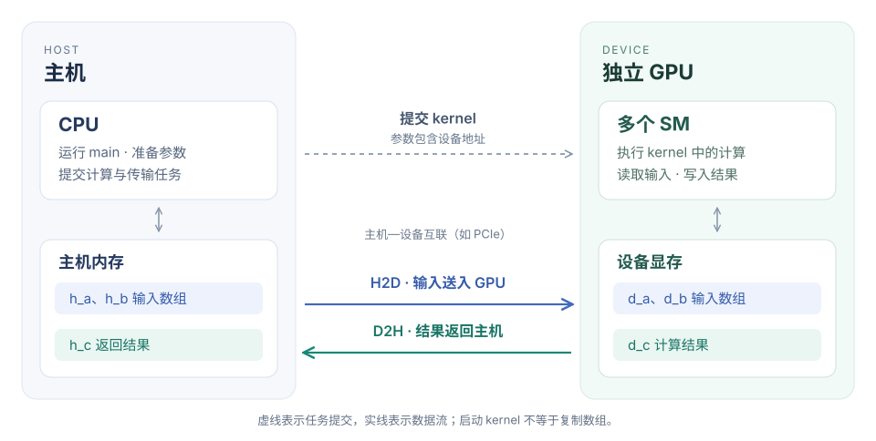
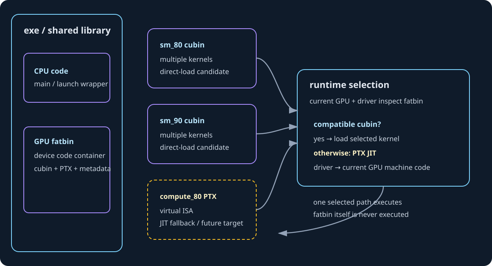

# 第一章 从 CUDA 程序看 GPU 的整体结构

CUDA 程序把工作分成线程、线程块和 grid，GPU 再把这些工作分配给 SM 执行。数据分块、线程分工和物理计算单元是三个不同层次。

一个 64×64 的输出块有 4096 个元素，可以由较少的线程分多次计算；一个包含 256 个线程的 block，也不要求 256 个物理计算单元同时执行。Vector Add 与 MatMul 的地址、线程和数据复用，可以用来观察这层映射。

## 阅读时怎样使用 CUDA 手册

> [!IMPORTANT] 先分清三个层次
> **数据 tile 是工作划分，CUDA 线程是执行实例，SM/CUDA Core 是硬件资源。三者没有固定的一一对应。** 后面的地址映射、寄存器和性能分析都建立在这个区分上。

CUDA 编程模型定义主机、设备、线程和内存之间的关系。具体 API（Application Programming Interface，应用程序编程接口）的同步行为查 API reference，架构差异查对应调优指南；分析代码时将这些条件与实际编译目标一起核对。

## 1. 硬件全貌：为什么需要 CPU 和 GPU 一起工作

### 1.1 吞吐高，不等于单个任务的延迟低

CPU（Central Processing Unit，中央处理器）和 GPU（Graphics Processing Unit，图形处理器）都能执行计算，但设计时面对的主要矛盾不同。CPU 要让一条具有复杂依赖、分支和不规则访问的指令流尽快向前推进；GPU 则要在功耗和面积约束下，让大量工作持续通过计算与存储资源。

以串行链 `x = f(x)` 为例，第 2 次计算依赖第 1 次的结果，第 3 次又依赖第 2 次。即使设备有很多执行资源，也不能把同一条链的所有步骤同时执行。换成 `c[i] = a[i] + b[i]`，不同 i 的结果互不依赖，才出现可以分配给大量线程的工作。**并行度首先来自问题中的独立工作，不是从硬件核心数里凭空产生。**

延迟和吞吐也要分开。假设一条生产线完成一个产品需要 10 个时间单位，但启动后每个时间单位能交付一个产品：单个产品延迟仍是 10，稳定吞吐却是每单位时间 1 个。GPU 利用足够多就绪工作保持管线繁忙，也有类似效果；这个类比只帮助区分两个量，不意味着 GPU 全部执行过程就是一条固定流水线。

“访存延迟可以用更多线程隐藏”的准确含义，是一些线程等待数据时，硬件有机会执行其他就绪工作。那一次内存请求的实际延迟没有消失。如果所有工作都在等同一瓶颈，或者已经达到可持续带宽，再增加线程不会创造额外带宽。

对算子先问三个问题：是否有足够独立工作？工作能否相对规则地组织？计算或复用是否足以摊薄准备与搬运成本？向量加法容易并行，但每个元素只有一次加法、两次读取和一次写入；矩阵乘法则能让同一输入参与很多乘加。两者都运行在 GPU 上，性能限制却不必相同。

### 1.2 Host 与 Device 是角色，不只是指针前缀

CUDA（Compute Unified Device Architecture，统一计算设备架构）采用异构计算模型。程序通常从主机侧开始，由主机代码组织数据、调用运行时并提交设备工作。Host 指主机及其执行环境，通常包括 CPU 与主机内存；Device 指参与计算的 GPU 设备及其可用资源。

先看常见的独立 GPU 系统：

<figure class="diagram-frame">

<figcaption>图：任务提交与数据搬运分开表示。CPU 与 SM 执行计算，主机内存与设备显存保存数组；互联上的两个箭头标明数据方向。</figcaption>
</figure>

H2D（Host to Device，主机到设备）和 D2H（Device to Host，设备到主机）表示传输方向。互联可以是 PCIe（Peripheral Component Interconnect Express，外围组件高速互联）或具体系统提供的其他通道。某种服务器的连接方式不是全部 CUDA 系统共同的物理结构。

图中把“提交任务”和“传输数据”分开。执行 `kernel<<<...>>>(d_a)` 时，传入的是设备指针这个参数的值，不是把它指向的整个数组再复制一次。数组必须已处于 kernel 可合法访问的位置，或由相应内存机制保证可访问。kernel 启动不是自动搬运任意 CPU 数组的操作。

也不能把独立显卡示意图理解成“CPU 与 GPU 永远必须拥有完全分离的物理内存”。集成系统、映射内存、统一内存和硬件一致性平台具有不同的访问与迁移机制。本章用显式分配和复制，是为了把位置与生命周期说清楚，不是说只有这一种方式。

### 1.3 GPU 内部：SM 是一组执行资源，不是一个“大核心”

SM（Streaming Multiprocessor，流式多处理器）是 GPU 中承载线程块执行的一组硬件资源，也是理解 CUDA 执行的重要硬件层次。一个 SM 包含线程状态所需的寄存器资源、指令调度与发射资源、计算和访存管线，以及片上缓存和共享内存相关资源。多个 SM 共同访问设备级缓存和显存系统。

下面是组织关系图，不是某一芯片的精确版图，也不表示每次访存都必须经过图中的所有层级：

<figure class="diagram-frame">

<figcaption>图：框的嵌套表示资源归属，不表示固定的访存路径。GPC 为 Graphics Processing Cluster（图形处理集群）；矩阵计算能力取决于具体架构。</figcaption>
</figure>

GPC 内还可能有 TPC（Texture Processing Cluster，纹理处理集群）等组织层次，但普通 CUDA 程序通常不通过 TPC 编号划分任务。这个名称帮助你阅读硬件框图，不意味着所有图形专用模块都需要成为通用计算的调度接口。

寄存器文件的“文件”不是磁盘文件，而是一组高速存储资源。线程私有是其编程可见范围：一个线程不能因为寄存器物理上位于同一 SM，就任意读另一个线程的局部变量。物理资源共同存在，不等于变量访问权限共同存在。

共享内存为线程块内部协作提供数据空间。普通线程块之间的共享内存不因驻留同一 SM 就变成共同可读写的数组。支持硬件上的集群级分布式共享内存属于显式扩展，不能用它改写普通线程块的语义。

L1（Level 1，一级）和 L2（Level 2，二级）缓存保存部分数据副本，减少访问更远存储的需求。缓存与共享内存即使共用部分物理资源，控制方式也不同：程序用共享内存地址显式组织协作数据，缓存则按缓存策略服务访问。它们都“在片上”，不代表可以互换使用方式。

设备显存通常由 DRAM（Dynamic Random-Access Memory，动态随机存取存储器）实现。HBM（High Bandwidth Memory，高带宽存储器）与 GDDR（Graphics Double Data Rate，图形双倍数据速率存储器）是不同的显存技术，不是所有 NVIDIA GPU 都使用 HBM。容量回答“能放多少”，带宽回答“每单位时间能搬多少”，不能用一个指标代替另一个。

Tensor Core 是支持特定矩阵运算的硬件计算单元，不是另一组执行任意 C++ 语句的通用线程。普通加法、地址计算、条件判断和矩阵乘加可能使用不同管线。写了矩阵乘法的数学表达式，并不意味着编译器一定选择 Tensor Core；输入格式、表达方式、指令与架构支持都参与决定。后续会把它具体落实到矩阵指令和布局。

### 1.4 “设备内部的快”与“整个程序的快”

假设把两个长度为 N 的 float 数组送入设备，完成加法，再取回结果。只按有效载荷记账，H2D 是 `2×N×4` 字节，D2H 是 `N×4` 字节；kernel 本身又有两个读取和一个写入，逻辑流量为 `3×N×4` 字节。

两组字节走的不是同一条路径。前者经过主机—设备互联，后者在 GPU 存储体系中发生。kernel 的 12N 字节是算法口径的有效流量，也不一定等于实际显存总线流量：缓存命中、访问粒度和存储行为可能改变物理流量。

端到端耗时还可能包含分配、初始化、提交与同步。即使把 kernel 时间减半，如果它只占总耗时的一小部分，整个任务的收益仍然有限。反过来，多个算子连续在 GPU 上执行，输入只传一次，中间结果留在设备，搬运成本就可以被多次计算摊薄。这解释了为什么既需要单 kernel 优化，也要保留模型级分析。

**追问：CPU 擅长串行，所以 GPU 不能写循环吗？**

可以写。关键是循环内部与线程之间有哪些依赖。不同线程各自执行独立任务的循环，仍能并行；所有工作围绕单一依赖链，才难以利用大量资源。“代码里有循环”与“问题只能串行”不是同一个判断。

## 2. 编程模型：工作怎样组织，硬件怎样承接

### 2.1 kernel、grid、block、thread 回答不同的问题

kernel（核函数）说明参与线程执行什么设备代码；kernel launch（核函数启动）指定这次调用采用什么执行配置。grid（线程块网格）是这次启动组织出的线程块集合；thread block（线程块）是其中一个可协作的线程组；thread（线程）是执行代码、具有自身索引与局部状态的逻辑实例。

论文和底层资料中的 CTA（Cooperative Thread Array，协作线程数组），在通常讨论 CUDA 线程块的语境中，指的就是 thread block。遇到 CTA，不需要在已有 block 之外再想象一层新硬件。

~~~cpp
vector_add_kernel<<<4, 256>>>(d_a, d_b, d_c, 1000);
~~~

4 是 grid 中线程块的数量；256 是每个线程块的线程数。总共组织 1024 个逻辑线程，每个线程执行同一份核函数，但读取不同的内建索引，决定处理哪个元素。

“同一份代码”不等于“同一份局部状态”。每个线程算出的 i 可以不同，条件 `i < n` 的结果也可能不同。变量名在代码中只写一次，但其执行实例属于各线程，不是所有线程共同修改唯一一个 i。

“组织 1024 个线程”也不等于“1024 个线程同时执行某条机器指令”。执行配置描述程序；实际并发还由设备资源、线程块需求、指令和数据依赖等决定。程序必须在允许的调度方式下都正确，不能依赖想象中的同时启动时间。

### 2.2 一个 block 在一个 SM 上执行，不代表一个 SM 只有一个 block

普通线程块的线程在同一 SM 上执行，使块内共享内存和同步成为可能。资源允许时，一个 SM 可以同时驻留多个线程块；很大的 grid 则可以分批安排到有限数量的 SM 上。

假设设备有 2 个 SM，grid 有 6 个 block；为讨论进一步假设每个 SM 此时只能驻留 1 个 block。开始时最多有 2 个 block 驻留，某个 block 结束并释放资源后，后续 block 才有机会进入。但没有规定“必须先执行 block 0 和 block 1”，也没有规定“某个 block 必须对应某个 SM”。

若每个 SM 能驻留 2 个 block，就可能同时容纳 4 个 block。调度能力改变，不改变 `blockIdx` 的含义：它仍是程序中的块索引，不是物理 SM 编号。把它用作矩阵输出块编号是正确的；直接当作硬件核心编号则不正确。

为什么普通 kernel 不应该让 block 0 一直轮询，等待 block 5 写一个标志？等待者可能占住资源，而被等待的 block 尚无法被调度。某次运行没有卡住，不构成正确性保证。跨块协作需要满足前置条件的机制，不能凭某次观察到的执行顺序设计程序。

这不表示“CUDA 永远不能跨块同步”。Cooperative Groups（协作组）中的相关启动与同步机制，以及支持硬件上的 Thread Block Cluster（线程块集群），提供了特定协作范围。手册 §1.2.2.1.1 介绍了计算能力 9.0 及以上支持的集群：同一集群的块在同一 GPC 内协同调度和通信。它需要显式使用，不是普通启动自动获得的全 grid 屏障。

### 2.3 warp 是 32 个逻辑线程，不是永久绑定的 32 个核心

warp（线程束）把同一线程块中的线程按 32 个一组组织。SIMT（Single Instruction, Multiple Threads，单指令多线程）描述这种执行模型：硬件对参与线程发射指令，各线程使用自己的寄存器值和地址，得到各自结果。

256 个线程组成 8 个 warp。线程块若只有 40 个线程，则需要 2 个 warp，第二个只有 8 个有效线程位置。lane（线程束内位置）编号为 0 到 31，不足 32 个线程不意味着 warp 的硬件宽度自动变成 8。

二维、三维线程块也要按线性线程编号分组。二维时：

~~~cpp
const unsigned linear_tid = threadIdx.x + blockDim.x * threadIdx.y;
const unsigned warp_id = linear_tid / 32;
const unsigned lane_id = linear_tid % 32;
~~~

因此 x 方向先变化。二维 block 的“一行”是否正好对应一个 warp，要看 x 方向长度，不能因为数据是矩阵就把 warp 等同于矩阵的一行。

CUDA Core 是某类硬件算术执行资源的产品/架构描述，CUDA thread 是具有执行状态的逻辑线程，没有永久一一对应关系。SM 能保留很多线程的状态，调度它们使用有限的执行管线；不同指令也可能去往不同功能单元。不能把 CUDA Core 数量直接代入 grid×block 的线程数公式。

同一 warp 遇到不同分支时，不同路径在相应活动线程集合上执行；被屏蔽的线程不会在该路径完成相同的有效工作。本章先理解分支可能降低有效利用率，不进一步推断“同一 warp 的线程天然可以不加同步交换共享内存数据”。独立线程调度和内存顺序会影响这种写法，协作仍须使用规定的同步原语。

### 2.4 CUDA 的线程视角与 Triton 的 tile 视角

CUDA C++ 常写“一个线程计算哪个索引”。Triton Vector Add 则写的是“一个 program 处理哪些元素”：

~~~python
pid = tl.program_id(0)
offsets = pid * BLOCK_SIZE + tl.arange(0, BLOCK_SIZE)
mask = offsets < n_elements
~~~

来源：现有 Vector Add 文件。它是本地验证/benchmark wrapper，不是单独归档的平台原始 solve；来源区别必须保留。

offsets 是逻辑索引集合。它有 256 个元素，并不单独决定编译器使用多少线程、每线程持有几个值、怎样安排寄存器。对常规 NVIDIA Triton kernel，program 实例通常对应一个 CUDA 线程块，但具体映射由编译器、执行配置和后端决定；高级集群配置还须检查对应行为。

这与手册 §1.2.2.3 的区分一致：block 是执行组织，tile 是数据组织。不要把该节的 CUDA tile API 与 Triton API 当成同一套语法；它们共享部分抽象思想，不是可直接替换的接口。

“不同 thread 会不会重复读一行？”不能只看地址 tile 判断。地址 tile 只能知道请求了哪些逻辑元素，不能断言每个 CUDA 线程都各自读整行；还要看元素怎样分配、缓存和共享内存是否复用，以及最终访存指令。不同 program 之间可能请求相同输入区域，但请求重复不意味着每次都重新走到显存。

## 3. 完整程序：沿着一次计算走一遍

### 3.1 先看完整代码，再解释每个阶段

下面包含主机初始化、设备分配、输入复制、kernel 启动、两层错误检查、结果复制、参考比较和释放。输入选择较小的整数倍二进制分数，便于此例精确比较；不代表一般浮点归约都应逐位相等。

代码来源：vector_add_walkthrough.cu。这是用于讲解主机—设备执行过程的独立 CUDA 示例，不替换其他实现。网站构建时会检查本节代码块与文件一致；修改示例必须同步正文。

<!-- BEGIN vector_add_walkthrough.cu -->
~~~cpp
#include <cuda_runtime.h>

#include <algorithm>
#include <cmath>
#include <cstddef>
#include <cstdlib>
#include <exception>
#include <iostream>
#include <limits>
#include <stdexcept>
#include <string>
#include <vector>

// 教学示例：展示显式分配、复制、启动、检查和释放的完整路径。
// 正常路径检查 CUDA 返回值；异常清理保留原始异常，不覆盖它。
#define CUDA_CHECK(call)                                                        \
  do {                                                                          \
    const cudaError_t error__ = (call);                                         \
    if (error__ != cudaSuccess) {                                               \
      throw std::runtime_error(std::string("CUDA error at ") + __FILE__ + ":" + \
                               std::to_string(__LINE__) + ": " +               \
                               cudaGetErrorString(error__));                    \
    }                                                                            \
  } while (false)

__global__ void vector_add_kernel(const float* a, const float* b, float* c,
                                  std::size_t n) {
  // 一个 thread 处理一个逻辑元素；block 是调度/资源分配单位。
  const std::size_t i = static_cast<std::size_t>(blockIdx.x) * blockDim.x +
                        threadIdx.x;
  if (i < n) {
    c[i] = a[i] + b[i];
  }
}

void vector_add_cpu(const std::vector<float>& a, const std::vector<float>& b,
                    std::vector<float>* c) {
  if (a.size() != b.size() || a.size() != c->size()) {
    throw std::invalid_argument("CPU vectors have different sizes");
  }
  for (std::size_t i = 0; i < a.size(); ++i) {
    (*c)[i] = a[i] + b[i];
  }
}

int main(int argc, char** argv) {
  try {
    const std::size_t n = argc > 1 ? std::stoull(argv[1]) : 1000;
    if (n == 0) {
      throw std::invalid_argument("N must be greater than zero");
    }
    if (n > std::numeric_limits<std::size_t>::max() / sizeof(float)) {
      throw std::invalid_argument("N * sizeof(float) overflows size_t");
    }

    int device_count = 0;
    CUDA_CHECK(cudaGetDeviceCount(&device_count));
    if (device_count == 0) {
      throw std::runtime_error("no CUDA-capable device is available");
    }
    CUDA_CHECK(cudaSetDevice(0));

    cudaDeviceProp device{};
    CUDA_CHECK(cudaGetDeviceProperties(&device, 0));
    constexpr unsigned int block_size = 256;
    const std::size_t grid_size = n / block_size + (n % block_size != 0);
    if (grid_size > static_cast<std::size_t>(device.maxGridSize[0])) {
      throw std::invalid_argument("N is too large for this 1D grid");
    }

    std::vector<float> h_a(n), h_b(n), h_c(n), h_reference(n);
    for (std::size_t i = 0; i < n; ++i) {
      h_a[i] = static_cast<float>((i % 97) * 0.25);
      h_b[i] = static_cast<float>((i % 53) * -0.5);
    }
    vector_add_cpu(h_a, h_b, &h_reference);

    float* d_a = nullptr;
    float* d_b = nullptr;
    float* d_c = nullptr;
    try {
      const std::size_t bytes = n * sizeof(float);
      CUDA_CHECK(cudaMalloc(&d_a, bytes));
      CUDA_CHECK(cudaMalloc(&d_b, bytes));
      CUDA_CHECK(cudaMalloc(&d_c, bytes));

      // 这里使用默认 stream 的普通 cudaMemcpy，展示阶段顺序：H2D → kernel。
      // 不把 cudaMemcpy 的“同步”泛化到所有方向和 pageable/pinned 情况。
      CUDA_CHECK(cudaMemcpy(d_a, h_a.data(), bytes, cudaMemcpyHostToDevice));
      CUDA_CHECK(cudaMemcpy(d_b, h_b.data(), bytes, cudaMemcpyHostToDevice));

      vector_add_kernel<<<static_cast<unsigned int>(grid_size), block_size>>>(
          d_a, d_b, d_c, n);
      CUDA_CHECK(cudaGetLastError());       // 检查 launch 配置/提交错误
      CUDA_CHECK(cudaDeviceSynchronize());  // 检查执行期异步错误

      // D2H 返回后，本例中的 h_c 已可由 CPU 读取并比较。
      CUDA_CHECK(cudaMemcpy(h_c.data(), d_c, bytes, cudaMemcpyDeviceToHost));

      double max_abs_error = 0.0;
      for (std::size_t i = 0; i < n; ++i) {
        if (!std::isfinite(h_c[i])) {
          throw std::runtime_error("GPU output contains a non-finite value");
        }
        max_abs_error = std::max(
            max_abs_error,
            static_cast<double>(std::fabs(h_c[i] - h_reference[i])));
      }
      if (max_abs_error != 0.0) {
        throw std::runtime_error("GPU result differs from CPU reference: " +
                                 std::to_string(max_abs_error));
      }

      std::cout << "device=" << device.name << " N=" << n
                << " block=" << block_size << " grid=" << grid_size
                << " max_abs_error=" << max_abs_error << " PASS\n";

      CUDA_CHECK(cudaFree(d_c));
      d_c = nullptr;
      CUDA_CHECK(cudaFree(d_b));
      d_b = nullptr;
      CUDA_CHECK(cudaFree(d_a));
      d_a = nullptr;
    } catch (...) {
      // 释放已成功分配的 device memory；不要让错误路径把显存永久留给进程。
      if (d_c != nullptr) cudaFree(d_c);
      if (d_b != nullptr) cudaFree(d_b);
      if (d_a != nullptr) cudaFree(d_a);
      throw;
    }
  } catch (const std::exception& error) {
    std::cerr << "FAILED: " << error.what() << '\n';
    return EXIT_FAILURE;
  }
  return EXIT_SUCCESS;
}
~~~
<!-- END vector_add_walkthrough.cu -->

### 3.2 main、主机数组与设备指针

main 在 CPU 上执行。`std::vector<float>` 分配的是本例的主机数组，`h_a.data()` 返回首元素地址。初始化循环与 CPU reference 都是主机工作；文件包含 CUDA 语法，不意味着所有函数都在 GPU 上运行。

`__global__` 标记核函数。CPU 用三尖括号语法提交设备执行，而不是普通 C++ 函数调用。指针参数的值被传入设备端，线程通过这些参数访问相应存储。

`float* d_a = nullptr` 只定义指针变量，尚未申请数组。`cudaMalloc(&d_a, bytes)` 才申请设备内存，并把返回地址写入 d_a。传 `&d_a`，是因为 API 要修改指针变量，不是写数组第一个 float。

cudaMalloc 的大小单位为字节。1000 个 float 需要 4000 字节，三个设备数组的有效容量为 12000 字节。但这不是 CUDA 进程全部显存开销：上下文、代码和其他运行时资源不在这个数组账本中。

设备分配通常不会替你初始化输入值。两个 H2D 复制填充 d_a、d_b；没有初始化 d_c，是因为每个有效输出都由 kernel 完整覆盖。若改成对已有 d_c[i] 累加，就必须先定义初值。分配成功不等于内容为零。

### 3.3 复制顺序、启动异步性与结果可用性

本例输入复制与 kernel 使用默认 stream（执行流）。stream 是有序提交工作的软件概念，不是 SM，也不是固定物理计算管线。同一流的顺序约束保证后面的 kernel 不会合法地越过前面的输入复制，消费尚未准备好的数据。

“流内有序”和“CPU 被阻塞到何时”是两件事。普通 cudaMemcpy 的主机同步行为取决于方向和主机内存类型：可分页主机内存到设备的复制，主机返回时可能只完成了中间暂存；设备到主机的普通复制则在复制完成后返回。不能把没有 Async 后缀概括成“所有方向都阻塞到 GPU 操作结束”。具体边界见 [Runtime API：同步行为](https://docs.nvidia.com/cuda/cuda-runtime-api/api-sync-behavior.html)。

kernel 启动通常相对提交它的主机线程异步：CPU 可以在 kernel 未完成时继续执行。启动后立即读取 h_c 没有意义——GPU 写的是 d_c，设备工作还可能没有结束。

本例先调用 cudaDeviceSynchronize，等待当前设备、当前上下文相关的先前工作完成并检查错误，再做 D2H。它不是等待整台机器所有进程的 GPU 工作。多流程序应依数据依赖选择更精确的同步，后续课程展开。

在本例相同流的顺序与普通 D2H 条件下，显式设备同步不是让 CPU 最终得到正确结果的唯一写法。把它放在这里，还有明确定位 kernel 执行期错误的作用。不能推广成“每次 kernel 后都必须全设备同步”。

### 3.4 两层错误检查为什么都要有

三尖括号启动表达式不返回 cudaError_t。紧接着调用 cudaGetLastError，可以检查当时的错误状态，例如无效启动配置。它也可能报告先前异步操作留下的错误，因此诊断时需要知道前面的错误是否已经处理。

这一步成功不等于 kernel 已经成功执行，甚至不等于已经开始执行。运行时越界等问题可能稍后暴露，所以后面的同步调用同样检查返回值：

| 检查点 | 本例采用的操作 | 能确认什么 | 仍不能保证什么 |
|---|---|---|---|
| 提交之后 | `cudaGetLastError()` | 当时的 CUDA 错误状态，例如无效启动配置 | kernel 已经完成，或计算结果正确 |
| 等待设备工作 | `cudaDeviceSynchronize()` 并检查返回值 | 相关先前工作完成，执行期错误有机会在这里报告 | 数学索引和算法正确 |
| 结果可读之后 | D2H 并与 CPU reference 比较 | 所测输入满足声明的数值合同 | 所有未测试形状和并发场景都正确 |

数值比较是第三种不同检查。API 不报错不能证明数学索引和逻辑正确。例如把 a[i]+b[i] 写成 a[i]+a[i]，可能合法地访问内存，却算出错误结果。

异常路径尝试释放已分配数组，并保留原始错误；正常路径检查释放结果。正式项目可以用资源所有权封装管理生命周期，这里保留显式操作，是为了能看见分配与释放的对应关系。

### 3.5 怎样编译和检查

在具有 CUDA Toolkit、支持的主机 C++ 编译器与兼容驱动的 Linux 服务器上，从仓库根目录执行：

~~~bash
nvcc -O2 -std=c++17 -lineinfo \
  roadmap/curriculum/gpu/01-gpu-hardware-map-and-generations/examples/vector_add_walkthrough.cu \
  -o /tmp/vector_add_walkthrough

/tmp/vector_add_walkthrough 1
/tmp/vector_add_walkthrough 256
/tmp/vector_add_walkthrough 257
/tmp/vector_add_walkthrough 1000
compute-sanitizer --tool memcheck /tmp/vector_add_walkthrough 1000
~~~

Windows 的输出文件后缀与主机编译器配置不同。nvcc 的默认设备目标取决于工具版本；使用前通过 `nvcc --list-gpu-code`、设备计算能力和版本确认支持范围，必要时显式指定匹配目标的 `-arch`，不照抄固定型号的目标。

示例只检查正确性与执行过程，没有实现可用于性能比较的计时器。进程启动包含上下文初始化及可能的即时编译，shell 测到的整段时间不能当成 kernel 延迟。

## 4. 索引与地址：把线程落到每一个元素

### 4.1 一维索引不是死记的公式

若每个 block 负责长度为 B 的连续区间，第 p 块起点就是 p×B；块内第 t 个线程再偏移 t 个元素，所以：

~~~text
i = blockIdx.x × blockDim.x + threadIdx.x
~~~

它来自“块起点 + 块内偏移”，成立的前提是我们选择一线程一元素的映射。CUDA 没有规定所有 kernel 必须用这条映射，一个线程也可以循环处理多个元素。

对 N=1000、B=256，需要 `ceil(1000/256)=4` 个 block：

| blockIdx.x | 块内 threadIdx.x | 全局 i | 实际工作 |
|---|---|---|---|
| 0 | 0–255 | 0–255 | 全有效 |
| 1 | 0–255 | 256–511 | 全有效 |
| 2 | 0–255 | 512–767 | 全有效 |
| 3 | 0–231 | 768–999 | 有效 |
| 3 | 232–255 | 1000–1023 | 条件不成立，不访问数组 |

第四块仍有 256 个线程，不是临时把尺寸改成 232。条件控制有效访问，不改变 grid 或 block 形状，也没有给数组增加填充元素。

常见向上取整写法为 `(N+B-1)/B`。整除时不会多一块，有余数时进到下一整数。例如 1000+255=1255，整数除以 256 得 4。示例采用 `N/B+(N%B!=0)` 避免巨大 N 的加法溢出，并检查 N×sizeof(float) 是否可表示；N=0 单独拒绝，避免零大小 grid。

**追问：不写 mask，多分配一点内存可以吗？**

那是另一种需要明确定义填充区的合同。所有数组确实有足够合法容量，某些额外访问可能不越界，但仍须考虑无效数据是否进入计算。归约的填充值必须匹配运算；多分配本身不保证数值正确。当前例子没有这样的填充合同，必须保护访问。

### 4.2 二维线程块映射到 3×5 矩阵

设行数 M=3、列数 N=5，按 row-major（行优先）连续存储。选择 block=(4,2)，让 x 对应列、y 对应行：

~~~cpp
dim3 block(4, 2);
dim3 grid((N + block.x - 1) / block.x,
          (M + block.y - 1) / block.y);

// kernel 内：
int col = blockIdx.x * blockDim.x + threadIdx.x;
int row = blockIdx.y * blockDim.y + threadIdx.y;
if (row < M && col < N) {
    int offset = row * N + col;
    // 对 a[offset] 等合法位置进行操作
}
~~~

grid=(2,2)，共 4 块，每块 8 线程，总计 32 线程。但这**不是一个 32 线程的 warp**：warp 不跨线程块拼接，每个 8 线程块各需要一个未填满的 warp。尺寸仅用于手算，不是性能建议。

| blockIdx=(x,y) | 覆盖行 | 覆盖列 | 有效元素个数 |
|---|---|---|---|
| (0,0) | 0、1 | 0、1、2、3 | 8 |
| (1,0) | 0、1 | 4、5、6、7 | 2 |
| (0,1) | 2、3 | 0、1、2、3 | 4 |
| (1,1) | 2、3 | 4、5、6、7 | 1 |

有效个数为 8+2+4+1=15，等于 M×N。右下块不是全无效，它仍有坐标 (2,4)。边界判断必须分别检查行和列。

具体算一个线程：blockIdx=(1,0)、threadIdx=(0,1)，得到 col=1×4+0=4，row=0×2+1=1，所以 offset=1×5+4=9，访问第 2 行第 5 列。另一个线程 blockIdx=(1,1)、threadIdx=(1,0) 得到 row=2、col=5，列已经越界。

更容易忽视的是 row=0、col=5：线性偏移 5 在数组总长度内，却实际落到下一行开头。只检查 offset&lt;M×N 会错把非法列当成合法坐标，并可能与真正的下一行线程写同一地址。二维 mask 必须匹配二维坐标合同。

### 4.3 元素偏移、字节偏移与 stride

| 行 / 列 | 0 | 1 | 2 | 3 | 4 |
|---|---|---|---|---|---|
| 0 | `a[0]` | `a[1]` | `a[2]` | `a[3]` | `a[4]` |
| 1 | `a[5]` | `a[6]` | `a[7]` | `a[8]` | `a[9]` |
| 2 | `a[10]` | `a[11]` | `a[12]` | `a[13]` | `a[14]` |

每跨一行跳过 N 个元素，所以元素偏移为 row×N+col。对 float 指针 a，表达式 a+9 已按类型规则换算成 9 个 float 的距离，不要再乘 sizeof(float) 后加到 float 指针上。

假设基地址为 0x1000，float 为 4 字节，a+9 对应字节地址 0x1000+36=0x1024。它是手算假设，不是实测分配结果。若使用字节指针，才需要自己把元素偏移乘以元素大小。

N 在这里既是逻辑列数，也是相邻行的元素步长，只因为布局连续。有 padding、转置视图或非连续布局时，两者可能不同，一般地址为：

~~~text
元素偏移 = row × stride_row + col × stride_col
~~~

stride（步长）必须声明单位。PyTorch 通常按元素计 stride；CUDA 某些 pitched allocation 接口返回的 pitch 却以字节计。把字节步长当 float 元素步长会多乘一次元素大小。shape 描述多少元素，stride 描述它们在哪里，不能合成一个概念。

### 4.4 地址集合不是读回的值

MatMul LeetGPU 实现中的典型片段是：

~~~python
ptr_a = a + offset_m[:, None] * N + offset_n[None, :]
mask_a = (offset_m[:, None] < M) & (offset_n[None, :] < N)
tile_a = tl.load(ptr_a, mask=mask_a, other=0.0)
~~~

这是已保存的 Triton MatMul 平台代码片段，用于说明地址计算、mask 与读取值之间的关系。

取 offset_m=[1,2]、offset_n=[3,4,5]、N=5，先算元素偏移：

~~~text
offset_m[:, None] * 5        offset_n[None, :]
         [ 5 ]                    [3  4  5]
         [10 ]

广播相加：
[ 8   9  10 ]
[13  14  15 ]
~~~

再加 a 得到对应形状的指针集合，还没有读 A 的数据；tl.load 才请求值。特意让 offset_n 的第三个值为 5，是为了重现二维越界问题：这一列逻辑越界，不能因为 a+10 在整个数组内就读取。

若 M=3，mask 为：

~~~text
[ true  true  false ]
[ true  true  false ]
~~~

other=0.0 给无效位置提供零值，适合矩阵乘法的归约填充。mask 按 tile 位置控制访问，不把整个 tile 变小。tl.store 同样如此：输出指针给出候选位置，输出 mask 决定真正写入哪些位置。

若算法是 C=A@B，累加器从零开始，最后覆盖 C，不需要读旧 C；若变成 C=alpha×(A@B)+beta×C 且 beta 非零，才需要定义和读取旧 C 的贡献。读不读输出由数学合同决定，不是“每个指针都先 load 一遍”。

### 4.5 一线程可以处理多个元素

常见的 grid-stride loop（网格步长循环）让线程从初始索引出发，每轮跨过整个 grid 的线程总数：

~~~cpp
std::size_t start =
    static_cast<std::size_t>(blockIdx.x) * blockDim.x + threadIdx.x;
std::size_t step =
    static_cast<std::size_t>(gridDim.x) * blockDim.x;
for (std::size_t i = start; i < n; i += step) {
    c[i] = a[i] + b[i];
}
~~~

若 2 个 block、每块 256 线程，步长为 512。全局线程 0 处理 0、512；线程 487 处理 487、999；线程 488 只处理 488，因为下一次到 1000 已越界。512 个逻辑线程同样覆盖 1000 个元素。片段假设 n 与步长处于不会使索引溢出的可用范围。

数组长度、每块数据覆盖量、逻辑线程总数、物理执行单元数量是四个不同的量。优化不断改变它们的对应关系，但正确性始终要求：有效输出被处理，输入访问合法，不发生遗漏或不受控制的写入冲突。

## 5. 架构、芯片、产品与软件版本

### 5.1 为什么一张 GPU 的名字不够用

“这是 Ampere GPU”给出架构家族，不给出完整资源预算。某个产品型号也不代替计算能力与运行环境。讨论性能和兼容性，要分开五个问题：

| 层次 | 回答的问题 | 不能直接推断 |
|---|---|---|
| 架构家族 | 属于哪一代设计与能力范围？ | 同家族资源完全相同 |
| 芯片设计 | 采用哪颗芯片及组织？ | 产品启用全部资源 |
| 产品型号 | 系统枚举或购买的设备是什么？ | 所有任务的性能排序 |
| CC：Compute Capability，计算能力 | 支持哪些 CUDA 硬件能力与限制？ | CC 大就一定更快 |
| 软件版本 | 编译器、运行时、驱动、库是什么？ | 更新软件能增加硬件单元 |

同属 Ampere 的 CC 8.0 与 8.6，官方调优指南分别列出不同的最大驻留 warp、共享内存容量和普通 FP32 吞吐特征。这说明“家族相同仍需分支”，不是把某个分支当默认设备。后续资源计算必须读实际属性并核对架构限制。

昇腾经验中“先确认硬件与编译目标，再讨论资源预算”的习惯可以迁移，但不要建立“一个 AI Core 等于一个 SM”的硬对应。软件职责、同步范围与存储管理方式不同，类比帮助提出问题，不能替代 CUDA 定义。

### 5.2 代际不是一条无分支的产品升级链

下面建立能力地图，不列型号性能，也不意味着后来的家族在全部指标上替代先前产品：

| 架构阶段 | 后续课程涉及的变化 | 第一章需要记住的边界 |
|---|---|---|
| Fermi、Kepler、Maxwell、Pascal | 通用计算、存储与执行组织持续演进 | 用于理解历史代码；当前工具是否仍支持要另查 |
| Volta | Tensor Core 与独立线程调度成为重要背景 | 旧的隐式 warp 同步假设不能机械沿用 |
| Turing | 在相关产品方向扩展矩阵与执行能力 | 产品方向与数据格式需具体查 |
| Ampere | 异步 global-to-shared 搬运、矩阵数值模式发展 | 8.0、8.6 等分支不能套同一资源预算 |
| Ada | 面向其产品方向演进计算、缓存与矩阵能力 | 不默认获得 Hopper 全部接口 |
| Hopper | 线程块集群、TMA 等改变协作与搬运 | 新机制需要对应硬件与同步协议 |
| Blackwell | 矩阵计算、低精度和执行/数据组织继续演进 | 存在不同计算能力分支，按具体目标核查 |

TMA（Tensor Memory Accelerator，张量内存加速器）这里只作代际示例：它组织张量数据搬运，不是执行矩阵乘法的 Tensor Core。描述符、传输完成与消费之间的同步，留到后续完整章节。

尤其不要把 Ada 与 Hopper 写成“先 Ada，再把全部部件换成 Hopper”的单线关系。它们服务不同产品方向；相近时期的架构可以在缓存、矩阵指令、互联与协作机制上有不同取舍。判断某项能力能否使用，要查目标设备、CC、API/指令与编译目标，而不是比较架构名出现的先后。

查证入口：[Ampere 调优指南](https://docs.nvidia.com/cuda/ampere-tuning-guide/index.html)、[Ada 调优指南](https://docs.nvidia.com/cuda/ada-tuning-guide/index.html)、[Hopper 调优指南](https://docs.nvidia.com/cuda/hopper-tuning-guide/index.html)、[计算能力表](https://developer.nvidia.com/cuda-gpus)。本表建立方向，不代替硬件规格。

### 5.3 从 CUDA 源码到设备执行，中间有哪些软件

CUDA C++ 的一个重要特点是：host（主机）代码和 device（设备）代码可以写在同一个 `.cu` 源文件里，但它们并不会被同一个编译器路径当成同一种代码处理。`main`、文件 I/O、指针管理和 kernel launch 属于 CPU 路径；标有 `__global__`、`__device__` 的函数以及它们调用到的 device 函数属于 GPU 路径。源文件“同源”只说明它们共享类型、宏和调用关系，不表示 CPU 和 GPU 最终执行同一份机器指令。

`nvcc`（NVIDIA CUDA Compiler）更准确地说是编译驱动（compiler driver）。它负责拆分 host/device 部分，调用用户指定的 host compiler（主机编译器）生成 CPU 代码，同时调用 GPU compiler 生成 PTX，再协调 `ptxas` 将 PTX 汇编为目标 GPU 的二进制，并在需要时完成 device link、host link 和打包。CUDA Toolkit 提供这些开发工具、头文件和库；NVIDIA driver 则负责设备访问、代码加载以及运行时 JIT。Toolkit 和 driver 是两个不同的软件层，版本号也不能混为一谈。

例如 Runtime API（运行时应用程序编程接口）的 `cudaMalloc`、`cudaMemcpy` 和 kernel launch 看起来由 CUDA C++ 程序直接调用，实际仍由 CUDA Runtime library（运行时库）把请求转给更低层的 Driver API（驱动应用程序编程接口）。因此“使用 Runtime API”不等于绕过 driver；它只是选择了更高层的资源管理和加载接口。

#### 5.3.1 同一个 `.cu` 文件怎样走两条编译路径

一份 CUDA 源码可以把 host wrapper、多个 kernel 和 device helper 放在一起。编译时可以把它想成两条在链接处重新汇合的流水线：

| 源码部分 | 编译路径 | 主要产物 |
|---|---|---|
| `main`、`launch_*`、普通 C++ 函数 | host compiler（如 GCC、Clang 或 MSVC） | CPU object code，再链接成可执行文件或库 |
| `__global__` kernel 及其 device call graph | GPU compiler → PTX → `ptxas` | PTX、cubin，或保留在 fatbin 中 |
| 不含 device symbol 的纯 host 编译单元 | 可直接交给 host compiler，也可和 `nvcc` 产生的 object 一起链接 | host object |
| 跨 `.cu` 文件的 device symbol | 按需使用 `-dc`/`-rdc=true` 做 device link | 重新组织后的 device code |

`nvcc` 的 `-v` 可以把这条协调链路打印出来，`--keep` 可以保留编译中间文件。观察中间文件很有价值：它能告诉你某个目标到底生成了什么 PTX、调用了哪个 `ptxas`、最后打包了哪些目标；但看到 PTX 文件本身仍不等于 GPU 已经执行了它。

#### 5.3.2 PTX、cubin 和 fatbin 各自是什么

<strong>PTX（Parallel Thread Execution，并行线程执行）</strong>是 NVIDIA GPU 的版本化 virtual ISA（virtual Instruction Set Architecture，虚拟指令集架构），也可以把它理解为面向 GPU 的 high-level assembly（较高层汇编）。它比 CUDA C++ 更接近硬件，但仍然是物理 GPU ISA 之上的抽象层。GPU compiler、领域专用语言和其他编译器都可以把代码生成 PTX，然后由离线编译或运行时 JIT 生成某一代 GPU 真正可执行的二进制。

所以 PTX 不是 GPU 最终直接执行的机器码。运行时若选择 PTX，driver 会把它编译成当前设备的机器代码；离线阶段若用 `ptxas`，则会把 PTX 汇编成对应目标的 cubin。PTX 的“版本”至少有两个维度不能混写：

| 名称 | 它描述什么 | 例子 |
|---|---|---|
| PTX ISA version | PTX 语言本身的语法、指令和语义版本；由工具链/driver 是否理解决定 | 某个 CUDA 工具链生成的 PTX ISA 版本 |
| `compute_XX` | 生成 PTX 时所针对的 virtual architecture（虚拟架构）和能力下限 | `compute_80` |
| `sm_XX` | 生成 cubin 时所针对的 real hardware ISA（真实硬件指令集） | `sm_86`、`sm_90` |

手册把支持 compute capability 8.0 特性的 PTX 称为 `compute_80`，这不等于“PTX ISA version 就是 8.0”。同样，`sm_86` 是一个目标硬件二进制的简称，不是 PTX 语言版本。设备很新也不意味着旧 driver 一定能解析由新工具链生成的 PTX ISA version；JIT 的前提还包括 driver 能理解该 PTX 版本。

<strong>cubin（CUDA binary）</strong>是面向某个具体 SM（Streaming Multiprocessor，流式多处理器）目标的 GPU 二进制代码对象，例如 `sm_86` cubin。它不是一个完整的 CPU 程序，也不是“一个 kernel 的另一种叫法”。一个 cubin 可以包含同一编译目标下的多个 kernel、device function、常量/全局 device data 以及相关元数据。因此“这个 cubin 里有三个 kernel”是完全正常的；cubin 的边界是设备代码对象/目标，而不是 kernel 数量。

<strong>fatbin（fat binary，胖二进制容器）</strong>是设备代码容器。它通常被嵌入最终 executable（可执行文件）或 shared library（共享库）中，也可以作为独立的设备代码产物检查。一个 fatbin 可以同时放入多个 `sm_XX` cubin，也可以放入一个或多个 `compute_XX` PTX。它并不是整个 `.exe`：CPU binary、导入表、资源和 fatbin 是程序中的不同部分；fatbin 只承载 GPU 代码及其相关数据。

<figure class="diagram-frame">

<figcaption>图 5.3-1　可执行文件或库同时包含 CPU code 与 GPU fatbin；CPU 通过 runtime/driver 发起加载，driver 在 fatbin 内选择目标，不会把 fatbin 本身交给 GPU 执行。</figcaption>
</figure>

#### 5.3.3 一个 fatbin 怎样服务多个 kernel 和多个 GPU

假设一个程序有三个入口：`vec_add`、`softmax_row` 和 `matmul_tile`。编译器可以把三个 kernel 的 `sm_86` 版本放在一个 cubin，把它们的 `sm_90` 版本放在另一个 cubin，再把三个 kernel 的 `compute_80` PTX 放进同一个 fatbin。这里的“版本”是同一个逻辑 kernel 针对不同目标生成的代码，不是运行时把三个版本同时发射。

当 CPU 调用 `softmax_row<<<...>>>` 时，launch 只指定逻辑入口和执行配置。Runtime/Driver 根据当前 GPU 和 fatbin 中的目标做选择，然后把所选 cubin 中的 `softmax_row` 代码加载到设备；如果没有可直接加载的 cubin，才会在有合适 PTX 的情况下把 `softmax_row` 的 PTX JIT 成当前设备机器码。`vec_add` 和 `matmul_tile` 也按同一规则各自查找自己的入口。也就是说，fatbin 中可以有多个 kernel、每个 kernel 可以有多个目标版本，但一次 kernel load 最终只会选用一条可执行路径，不会把多份目标代码叠加执行。

可以把这个过程写成四个分支：

1. 有与当前 GPU 兼容的 cubin：driver 直接加载它，跳过 PTX JIT。
2. 没有兼容 cubin，但有设备能力足够的 PTX，且 driver 能理解该 PTX ISA version：driver JIT 生成当前 GPU 的机器码，再加载执行；JIT 结果通常进入 compute cache。
3. 没有可用 cubin，也没有合适 PTX：kernel load 失败。
4. 即使 fatbin 中“看起来有代码”，如果 cubin 目标不兼容，且当前设备低于 PTX 的 `compute_xx` 要求、Driver 无法解析该 PTX ISA version，或 JIT 被诊断开关禁用，仍然会失败，而不是自动跨过这些约束。

普通 cubin 的兼容规则要写得精确：在同一个 compute capability major 版本内，设备 minor 版本大于或等于 cubin 目标 minor 版本时，才有二进制兼容保证。例如 `sm_86` cubin 可以在 8.6 或 8.9 设备上加载；不能去 8.0，因为设备 minor `0` 小于目标 `6`；也不能去 9.0，因为 major 版本不同。反过来不能把“新卡”笼统理解成“任何旧 cubin 都能直接跑”。

PTX 的方向不同：例如 `compute_80` PTX 可以在满足条件的更高 compute capability 上由 driver JIT，甚至生成更新的 SM 机器码；但 driver 必须理解该 PTX ISA version，且 PTX 不能使用目标设备不具备的前提之外的特性。PTX 提供的是一种面向未来目标的可能性，不是对所有未来 GPU 的无条件保证。

#### 5.3.4 用 `nvcc` 观察具体产物

下面命令以 Linux 的 POSIX shell 为例，路径和变量写法不与 Windows PowerShell 混用。可以把本章第 3 节已经展示的完整 Vector Add 程序保存为 `vector_add.cu` 后直接观察；kernel 数量不会改变 PTX、cubin 与 fatbin 的层次关系。

先分别生成一个面向 `sm_86` 的 cubin 和一个面向 `compute_80` 的 PTX：

```bash
nvcc -std=c++17 -O2 \
  -arch=compute_80 -gpu-code=sm_86 \
  -cubin vector_add.cu -o vector_add_sm86.cubin

nvcc -std=c++17 -O2 \
  -arch=compute_80 \
  -ptx vector_add.cu -o vector_add_compute80.ptx
```

如果要制作一个可嵌入程序的多目标 fatbin，可以把多个 real target 和一个 PTX target 写进 `-gencode`：

```bash
nvcc -std=c++17 -O2 \
  -gencode=arch=compute_80,code=sm_86 \
  -gencode=arch=compute_80,code=sm_89 \
  -gencode=arch=compute_80,code=compute_80 \
  -fatbin vector_add.cu -o vector_add_multi.fatbin
```

这里每个 `-gencode` 都说明“以哪个 virtual architecture 生成中间代码，再保留为哪个 real architecture 或 PTX”。`sm_86`/`sm_89` 是 cubin 目标，`compute_80` 是保留下来的 PTX 目标。`-arch=sm_86` 这类简写也可以生成特定 real target，但部署需要多个目标时，显式 `-gencode` 更容易审查。

去掉 `-fatbin` 并正常链接，便得到同时包含 CPU 程序和内嵌 fatbin 的可执行文件：

```bash
nvcc -std=c++17 -O2 \
  -gencode=arch=compute_80,code=sm_86 \
  -gencode=arch=compute_80,code=compute_80 \
  vector_add.cu -o vector_add
```

要观察 `nvcc` 的中间件和完整调用，可以保留当前构建的中间文件：

```bash
mkdir -p build/keep
nvcc -std=c++17 -O2 --keep --keep-dir build/keep -v \
  -gencode=arch=compute_80,code=sm_86 \
  -gencode=arch=compute_80,code=compute_80 \
  -fatbin vector_add.cu -o build/vector_add.fatbin
```

`--keep`/`--keep-dir` 让中间 PTX、device object 和临时文件留下来，`-v` 显示 host compiler、device compiler、`ptxas` 和链接步骤。这个命令只是在离线阶段生成目标，不能替代在目标 GPU 上运行。

用 `cuobjdump` 检查设备代码容器时，分别看三类信息：

```bash
cuobjdump --list-elf vector_add
cuobjdump --dump-ptx vector_add
cuobjdump --dump-sass vector_add
```

`--list-elf` 列出容器内的 ELF/device code object，`--dump-ptx` 查看嵌入的 PTX，`--dump-sass` 查看已经生成的 SASS（Streaming ASSembler，GPU 机器指令）。在实际 executable 或 shared library 上也可以对该文件运行同样的检查。检查结果应回答“有哪些目标、有哪些 kernel、是否真的嵌入 PTX”，而不是只看文件名猜测。不同 Toolkit 版本的输出排版可能不同，但命令的检查对象分别是容器/ELF、PTX 和 SASS。

#### 5.3.5 JIT、cache 与诊断开关

首次加载 PTX 时，driver 需要把 PTX 编译成当前设备机器码，这会增加 application load time。生成的 binary 通常写入 compute cache，后续相同条件的加载可以复用缓存；driver 升级可能使缓存失效，以便使用新 driver 中的 JIT compiler。因而 benchmark 至少要区分 cold load、首次 kernel launch、cache warm 后的 launch 和稳定迭代时间，不能拿“第一次包含 JIT 的总时间”与“已经预热的库 kernel”直接比较。

为了验证 fatbin 中是否真的带了 PTX、PTX JIT 是否可用，可以在诊断运行中设置 `CUDA_FORCE_PTX_JIT=1`。这个开关会忽略嵌入的 cubin，强制使用嵌入的 PTX；若 PTX 缺失、版本不受支持或 JIT 路径有问题，加载就会暴露出来。相反，`CUDA_DISABLE_PTX_JIT=1` 会禁用嵌入 PTX 的 JIT，只允许使用兼容 cubin；它适合验证“每个 kernel 是否有直接可加载的 cubin”。这两个变量是验证工具，不是生产部署中用来宣称性能的默认配置。做性能测试时应移除它们，并明确记录 cold load、cache warm 与稳定迭代分别采用什么口径。

在 Linux shell 中可以这样做：

```bash
CUDA_FORCE_PTX_JIT=1 ./vector_add
CUDA_DISABLE_PTX_JIT=1 ./vector_add
```

Windows PowerShell 使用对应的进程级写法，避免把 POSIX 的 `VAR=value command` 原样复制过去：

```powershell
$env:CUDA_FORCE_PTX_JIT = "1"; .\vector_add.exe
$env:CUDA_FORCE_PTX_JIT = $null
$env:CUDA_DISABLE_PTX_JIT = "1"; .\vector_add.exe
$env:CUDA_DISABLE_PTX_JIT = $null
```

若禁用 PTX JIT 后某个 kernel load 失败，结论是“当前 fatbin 没有该 kernel 的兼容 cubin”，而不是“CUDA 源码不能运行”。若强制 PTX JIT 后失败，首先检查 PTX 是否被嵌入、`compute_XX` 是否满足目标能力、driver 是否理解 PTX ISA version，再检查 kernel 本身。

这几层产物的取舍也很实际：多放 cubin 可以减少首次 JIT 并让已覆盖的目标直接加载，但会增大程序或库体积，且每个新增目标都要构建和测试；只放 PTX 可以缩小目标组合并给新 GPU 留出 JIT 路径，但首次加载有额外延迟，性能还受 driver 的 JIT 编译器影响；同时放常用 cubin 和一个合适的 PTX，通常是在加载延迟、包体积和未来适配之间做折中。最终应根据部署 GPU 范围决定目标集合，而不是把“目标越多”当成无条件更好。

### 5.4 “能运行”与“按目标优化”不是同一个结论

前一节解决的是设备代码能否加载：兼容 cubin 可以直接加载，合适 PTX 可以经过 JIT。架构专用 `a` 目标与 family-specific `f` 目标还有更具体的兼容规则，不能拿普通 `sm_xx` 的概括覆盖它们，实际部署须查对应指南。本节进一步追问：代码即使能够加载，是否真的针对目标硬件优化？

即使旧代码能运行，也不等于自动用上新架构全部能力。没有表达合适的张量搬运或矩阵计算的程序，不会仅因换卡就必然成为精心设计的新流水线。编译器能优化，但能否生成目标指令、生成后是否更快，还需看代码、编译结果与实测。

“库支持某卡”与“编译的程序携带兼容代码”也是两个问题。分清层次，才能定位 no kernel image、不支持 PTX 版本或不支持编译目标，而不是统一归因于“CUDA 版本不对”。

### 5.5 在服务器上分别查询什么

~~~bash
nvidia-smi
nvcc --version
nvcc --list-gpu-code
~~~

nvidia-smi 帮助确认设备、驱动与运行状态，其中 CUDA Version 表示驱动支持相关 CUDA 能力的版本信息，不证明已安装同版本 Toolkit；nvcc --version 才确认当前调用的编译工具。多个 Toolkit 可以共存，命令搜索路径决定实际调用哪一个。

程序内 cudaGetDeviceProperties 可查询 major、minor、multiProcessorCount、maxThreadsPerBlock 等属性。CC 常写 major.minor，SM 数量与每块线程上限则是不同属性，不能互相替代。

使用 PyTorch、Triton 或预编译库时，还须记录版本与构建信息。框架携带的运行库版本不一定等于系统 nvcc 版本。把硬件、驱动、Toolkit、框架分栏记录，比一句“环境是 CUDA 13”更有诊断价值。

## 6. 概念辨析与常见问题

下面的问答把本章概念放回已有 CUDA、Triton Vector Add 和 MatMul 代码中，重点是区分逻辑组织、地址计算与硬件执行。

| 常见问题 | 核心辨析 | 代码案例 |
|---|---|---|
| CTA 是什么，怎样体现在 Triton？ | CTA 通常指线程块；program 与 tile 要区分 | Vector Add 的 `program_id` 与 CUDA 的 block |
| `ptr_a` 是地址合集吗？ | 指针集合与读取值不同；元素偏移不是字节偏移 | MatMul 的 `ptr_a`、`mask_a` 与 `tl.load` |
| 边界位置怎样处理？ | 按 tile 位置控制访问，不改变逻辑形状 | Vector Add 的 `i < n` 与 MatMul 的二维 mask |
| 不同 thread 会重复读一行吗？ | 广播表达式不能直接说明物理分工 | tile 地址、缓存、共享内存和最终指令 |
| 有 `ptr_c` 就要先 load 吗？ | 覆盖输出与读取旧输出由数学合同决定 | `C=A@B` 与带非零 `beta` 的更新 |

本章 CUDA 示例用于解释执行过程，Triton 片段用于对照地址与 tile；两者的源码路径和适用范围分别标明。

### LeetGPU：正确性与代码归档

题面入口：[Vector Addition](https://leetgpu.com/challenges/vector-addition)、[Matrix Multiplication](https://leetgpu.com/challenges/matrix-multiplication)。MatMul 平台源码保存在 matmul_leetgpu.py；Vector Add 的本地案例保存在 vector_add.py。平台题目中的 `solve`/kernel 与本地 wrapper 应分别保存，不能互相替代。

早期 A1 CUDA Vector Add 已在 LeetGPU 跑通（HISTORY/weekly 记录 2026-06-16），但当前仓库只有 [Lesson 01 的代码快照](../../../../lessons/01-cuda-basics.md)，没有独立的 `solutions/cuda` 原始 `solve` 文件。为便于重学时直接复盘，这里保留该快照；它不是 `source-check` 摘录，也不把快照伪称为原始归档：

~~~cpp
// LeetGPU 的 starter 模板：
#include <cuda_runtime.h>

__global__ void vector_add(const float* A, const float* B, float* C, int N) {
    // TODO: 你来写
    int idx = blockIdx.x * blockDim.x + threadIdx.x;
    if (idx < N) {
        C[idx] = A[idx] + B[idx];
    }
}

extern "C" void solve(const float* A, const float* B, float* C, int N) {
    int threadsPerBlock = 256;
    int blocksPerGrid = (N + threadsPerBlock - 1) / threadsPerBlock;
    vector_add<<<blocksPerGrid, threadsPerBlock>>>(A, B, C, N);
    cudaDeviceSynchronize();
}
~~~

这份快照的技术正确性已完成：题面 `solve` 接收 device pointer，固定 256 threads/block，按 `N` 覆盖尾部并写出 `A[i]+B[i]`；因此不需要为了重新进入模块化课程而重做 A1。归档门槛仍未满足：没有平台原始提交的独立本地文件，故 PATH 中保持“平台正确性已完成、归档缺口”的状态，只有取得原始 `solve` 后才补归档，不将本段升级为 `LEETGPU_PASS`。

同一 A1 周报还记录了 2026-06-16 前后在本地 RTX 4090 的真实性能运行：1M FP32 elements、256 threads/block，`696 GB/s`、`0 error`。Lesson 01 保存的计时/带宽快照如下；它只是教学快照，不是独立 `solutions` 原始文件，也没有可据此还原的完整原始日志：

~~~cpp
cudaEvent_t start, stop;
cudaEventCreate(&start);
cudaEventCreate(&stop);

cudaEventRecord(start);
vector_add_kernel<<<blocks, threads>>>(d_A, d_B, d_C, N);
cudaEventRecord(stop);
cudaEventSynchronize(stop);

float ms;
cudaEventElapsedTime(&ms, start, stop);
printf("Kernel time: %.3f ms\n", ms);

// 算 bandwidth
float gb_per_sec = (3.0f * N * sizeof(float)) / (ms / 1000.0f) / 1e9f;
printf("Bandwidth: %.2f GB/s\n", gb_per_sec);
~~~

这组 `696 GB/s / 0 error` 只支持该 RTX 4090、该 1M FP32 shape、该快照计时口径下的 A1 记录；它与 Triton Vector Add 在 RTX 3090 的 `840.1 GB/s vs torch.add 843.0 GB/s` 不是同一次实验，不能互相比较或合并成单一基线。当前没有保存该次运行的完整 shape/精确计时原始日志，因此不补猜毫秒、warmup 或理论带宽利用率；A1 不需要为重学而重跑，后续只在取得平台原始 `solve` 或需要补齐测量元数据时处理。

本章 `vector_add_walkthrough.cu` 是独立 CUDA 教学案例，没有平台题目的 `solve` 接口。阅读时把它与 Triton 的 program、tile、mask 对照，不需要把两个接口混为一谈。

### 服务器：真实性能

在具备 CUDA Toolkit、兼容主机编译器、驱动和 NVIDIA GPU 的服务器上，运行前文命令，记录设备、计算能力、工具版本和实际输出。该命令用于观察执行路径并检查结果；若要测量性能，应另行设计预热、计时、输入规模和报告指标。

遇到错误时保留原始错误信息，分别检查编译、启动、执行期同步和数值比较。比较性能时固定输入形状、精度、计时范围和设备；某张卡上的结果不能直接推广为通用硬件结论。

## 7. 面试追问：把机制组成完整回答

### 从 NPU 经验迁移：保留分析方法，不照搬执行单位

已有算子经验最值得保留的是分析顺序：先确定数据依赖与工作划分，再预算片上资源，组织搬运与计算，最后验证吞吐。换到 GPU 后，这个顺序仍然成立，但每一步要回答新的硬件问题。

| 已有分析问题 | 在 CUDA 中继续追问 |
|---|---|
| 一个计算块负责哪些输出？ | 输出tile如何分到thread、warp和CTA，grid是否有足够任务？ |
| 输入搬入片上后复用多少次？ | 哪些值留在寄存器，哪些放shared，哪些请求依靠L1/L2缓存？ |
| 搬运能否覆盖计算等待？ | 是主机侧stream重叠，还是kernel内异步copy？哪一个完成事件允许消费和复用buffer？ |
| 扩大tile是否能提高复用？ | 累加器和共享内存是否使驻留减少？lane到地址的映射是否仍有效？ |
| 增加计算核心能否提高并行？ | block是否足够多，尾波次是否过短，实际eligible warp是否足够？ |

NPU上熟悉的“显式搬运后复用”可以帮助理解shared staging，但不能推断每次global load都会访问显存，因为GPU缓存可能已服务该请求。Vector/Cube的职责类比也不能变成CUDA Core/Tensor Core的一一等价：指令粒度、线程协作方式、可见存储和同步协议都要重新查证。

> [!IMPORTANT] 迁移的是优化推理，不是硬件名称
> **Tiling、复用、流水线与资源预算的思路可以迁移；执行单位、地址映射与同步协议必须以CUDA为准。** 新平台上的结果仍须由目标设备的编译产物与测量支持。

**一个 SM 有很多 CUDA Core，启动同样多线程就能跑满吗？**

不能。线程数是软件组织，算术单元数是某类物理资源。线程受 block 组织、资源需求、指令类型、依赖和访存等待约束。先说明没有永久一一对应，再定义“跑满”是在看哪条管线、哪种指令和什么指标，而不是给出核心数相等公式。

**为什么同一个 kernel 可在 SM 数量不同的设备上运行？**

程序把工作分为可独立调度的线程块，运行时安排到可用 SM。更多 SM 可承接更多工作，不改变索引的定义。前提是设备支持相应功能且单块资源可启动；单块需求超限时，即使算法可分块，也可能启动失败。

**同一 block 在一个 SM 上，是不是同时执行？**

“同一 SM”与“同一时刻执行同一条机器指令”不同。一个 block 有多个 warp，SM 还可能驻留多个块，实际发射受就绪工作与管线资源约束。块内协作通过规定的同步机制正确进行，不依赖所有线程恰好齐步完成。

**为什么 3×5 例子共 32 个线程，却不是一个 warp？**

它们分在 4 个 block，每块 8 线程。warp 不跨块拼接，因此是 4 个部分有效 warp，不是一个跨块 warp。这是软件分组影响硬件利用的直接例子。

**把 CPU 指针传给 kernel，会自动复制吗？**

不会。启动传参数值，不自动搬运任意指向数组。设备能否合法访问取决于分配、映射/统一内存与系统能力。本例显式 device allocation 与 H2D，不把特定统一内存系统的现象推广到所有主机数组。

**更新 Toolkit 能让旧 GPU 使用新硬件指令吗？**

更新软件不会创造硬件单元。工具可能增加支持、改进代码生成，也可能移除旧目标。回答须区分工具支持、驱动兼容、设备能力和程序二进制覆盖。

**cudaGetLastError 成功，为什么后面还报错？**

启动异步，检查当时错误状态不代表设备工作完成。执行期间错误可在后续同步或 API 返回。此外还须数值比较：运行时不报错不代表算法正确。

**怎样证明理解了地址 tile，而不是只背语法？**

手算具体行列索引广播后的元素偏移、每个位置的 mask 与合法地址，再说明指针和值不同。随后指出这仍是逻辑层：每线程实际访问哪些位置要检查编译布局与指令，而不是从广播语法猜硬件。

## 知识总结与延伸阅读

主要依据本地手册 §1.1、§1.2、§1.3、§2.1。在线入口：[Introduction](https://docs.nvidia.com/cuda/cuda-programming-guide/01-introduction/introduction.html)、[Programming Model](https://docs.nvidia.com/cuda/cuda-programming-guide/01-introduction/programming-model.html)、[The CUDA platform](https://docs.nvidia.com/cuda/cuda-programming-guide/01-introduction/cuda-platform.html)。API 同步边界另见正文 Runtime API 参考。

读完本章后，应能区分 CPU 与 GPU 的角色、grid/block/thread 与 SM 的层次、逻辑 tile 与物理执行、元素步长与字节步长，以及 Toolkit、驱动、计算能力和目标代码之间的关系。后续学习可以从 CUDA Programming Guide 的 Programming Model、CUDA C++ Memory Model 和对应架构调优指南继续深入。

## 参考阅读

[CUDA Programming Guide 13.3](../../../../downloads/cuda-programming-guide.pdf)。

## 章节导航

[返回第一篇](../README.md) · [CUDA Programming Guide](https://docs.nvidia.com/cuda/cuda-programming-guide/index.html) · [CUDA C++ Programming Guide: Programming Model](https://docs.nvidia.com/cuda/cuda-programming-guide/01-introduction/programming-model.html)
