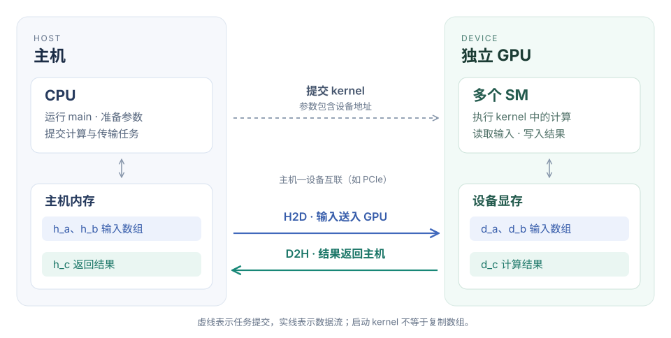
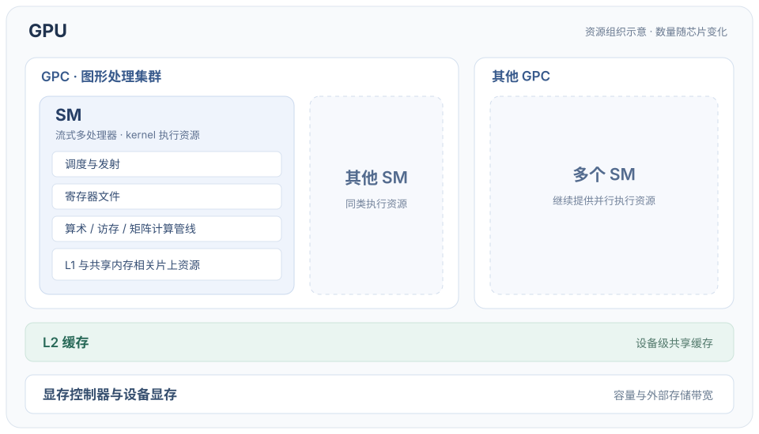
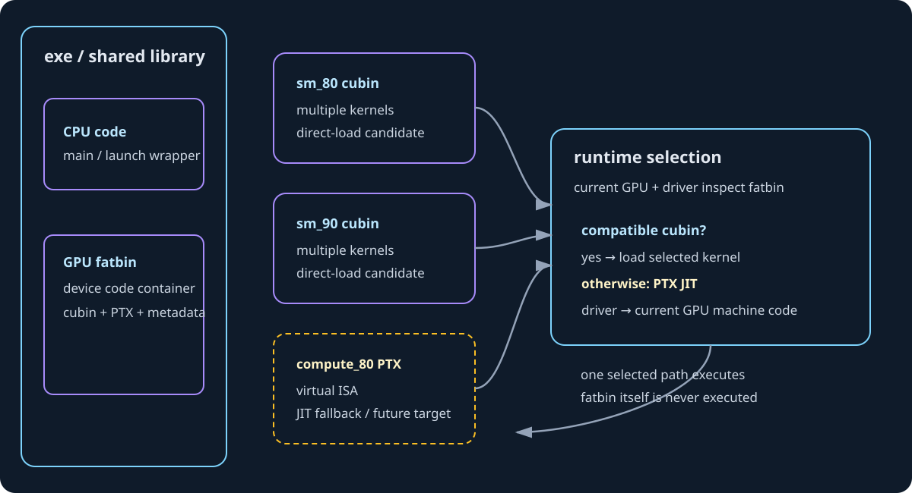

# 第一章 从 CUDA 程序看 GPU 的整体结构

CPU（中央处理器）适合处理依赖复杂、分支多或访问不规则的任务；GPU（图形处理器）适合同时推进大量相互独立的工作。GPU 程序把工作组织为线程和线程块，再由设备上的执行资源分批处理。数据块大小、线程数与物理执行单元数量属于不同层次：例如，一个 64×64 输出块包含 4096 个元素，可以由较少线程分批计算。

迁移已有昇腾经验时，可以保留数据分块、片上复用和搬运流水的分析方法，同时重新确认 CUDA 的执行层次。thread 表示逻辑线程，block 表示可协作的线程组，SM（Streaming Multiprocessor，流式多处理器）提供承载执行的硬件资源。理解这些职责后，再比较两种平台的存储与同步方式。

## 1. CPU 与 GPU 的任务分工

### 1.1 延迟与吞吐

CPU（Central Processing Unit，中央处理器）和 GPU（Graphics Processing Unit，图形处理器）都能执行计算，但设计时面对的主要矛盾不同。CPU 要让一条具有复杂依赖、分支和不规则访问的指令流尽快向前推进；GPU 则要在功耗和面积约束下，让大量工作持续通过计算与存储资源。

以串行链 `x = f(x)` 为例，第 2 次计算依赖第 1 次的结果，第 3 次又依赖第 2 次。即使设备有很多执行资源，也不能把同一条链的所有步骤同时执行。换成 `c[i] = a[i] + b[i]`，不同 i 的结果互不依赖，才出现可以分配给大量线程的工作。**并行度首先来自问题中的独立工作，不是从硬件核心数里凭空产生。**

延迟和吞吐也要分开。假设一条生产线完成一个产品需要 10 个时间单位，但启动后每个时间单位能交付一个产品：单个产品延迟仍是 10，稳定吞吐却是每单位时间 1 个。GPU 利用足够多就绪工作保持管线繁忙，也有类似效果；这个类比只帮助区分两个量，不意味着 GPU 全部执行过程就是一条固定流水线。

“访存延迟可以用更多线程隐藏”的准确含义，是一些线程等待数据时，硬件有机会执行其他就绪工作。那一次内存请求的实际延迟没有消失。如果所有工作都在等同一瓶颈，或者已经达到可持续带宽，再增加线程不会创造额外带宽。

判断算子是否适合 GPU，要看独立工作量、工作组织是否规则，以及计算或数据复用能否抵消准备和搬运成本。向量加法中每个元素只有一次加法、两次读取和一次写入；矩阵乘法则可让输入参与多次乘加，因此两类算子可能受不同因素限制。GPU 程序也可以包含循环；循环本身不决定并行性，关键是循环迭代和不同线程之间是否存在数据依赖。

### 1.2 Host、Device 与数据传输

CUDA（Compute Unified Device Architecture，统一计算设备架构）采用异构计算模型。Host 指主机侧，通常包括 CPU 和主机内存；Device 指 GPU 设备及其可用资源。主机代码负责组织数据、调用运行时并提交设备工作。独立 GPU 系统中，输入常经 H2D（Host to Device，主机到设备）传入设备，结果再经 D2H（Device to Host，设备到主机）返回；互联可以是 PCIe（Peripheral Component Interconnect Express，外围组件高速互联）或系统提供的其他通道。

<figure class="diagram-frame">

<figcaption>任务提交和数组传输是两件事。CPU 与 GPU 执行计算，主机内存与设备显存保存数组，互联上的箭头表示数据方向。</figcaption>
</figure>

在 GPU 上由许多线程执行的函数称为核函数（kernel）。CPU 通过 CUDA 运行时库提交核函数；运行时库负责常用的设备选择、内存分配和任务提交接口。执行 `kernel<<<...>>>(d_a)` 时传入的是设备指针的值，不会自动复制其指向的整个数组。数组必须已经位于 kernel 可访问的位置，或由相应内存机制保证可访问。

集成 GPU、映射内存、统一内存和一致性平台有不同的访问与迁移机制，因此独立显卡图只表示一种常见系统。

### 1.3 GPU 内部的执行与存储资源

SM（Streaming Multiprocessor，流式多处理器）是 GPU 中承载线程块执行的一组硬件资源。一个 SM 包含保存线程状态的寄存器、指令调度与发射资源、计算与访存管线，以及片上缓存和共享内存。线程块（block）是软件定义的协作线程组；一次核函数启动的全部线程块组成 grid。

设备可以按任意顺序把 block 安排到可用 SM。资源允许时，一个 SM 可同时驻留多个 block；较大的 grid 则分批执行。每个 block 的寄存器、共享内存和线程数需求，以及设备的相应上限，共同决定能否驻留和同时驻留多少个 block。

<figure class="diagram-frame">

<figcaption>图中嵌套表示资源归属，不表示每次访存都经过所有层级。GPC（Graphics Processing Cluster，图形处理集群）是更高一级的组织。</figcaption>
</figure>

GPC 内还可能有 TPC（Texture Processing Cluster，纹理处理集群）等组织层次；普通 CUDA 程序通常不通过 TPC 编号划分任务。寄存器是高速存储资源，线程私有是其编程可见范围；线程不能读取其他线程的局部变量。共享内存用于线程块内部协作，普通 block 即使驻留在同一 SM，也不能因此共用同一共享内存。支持线程块集群的硬件另有显式的分布式共享内存机制。

L1（Level 1，一级）和 L2（Level 2，二级）缓存保存部分数据副本，减少访问更远存储的需求。程序显式通过共享内存地址组织协作数据；缓存则由硬件缓存策略服务访问。设备显存通常由 DRAM（Dynamic Random-Access Memory，动态随机存取存储器）实现。HBM（High Bandwidth Memory，高带宽存储器）和 GDDR（Graphics Double Data Rate，图形双倍数据速率存储器）是不同显存技术，并非所有 NVIDIA GPU 都使用 HBM。显存容量与带宽分别表示可保存的数据量和单位时间传输量。

Tensor Core 支持特定矩阵运算，不是执行任意 C++ 语句的通用线程。普通算术、地址计算、条件判断和矩阵乘加可能使用不同管线。写出矩阵乘法表达式并不保证编译器选择 Tensor Core；输入格式、表达方式、指令和架构支持都会影响代码生成。

这一节先回答“设备有哪些执行与存储资源”；下一章再把线程块放入 SM，区分资源已分配、warp 就绪和指令发射。不要把图中的硬件层次直接当成某个 kernel 已经获得的并发度。

### 1.4 Kernel 流量与端到端耗时

两个长度为 N 的 float 数组执行向量加法时，只按有效载荷计算，H2D 为 `2×N×4` 字节，D2H 为 `N×4` 字节；kernel 读取两个输入并写一个输出，逻辑流量为 `3×N×4` 字节。主机—设备传输和 GPU 内部访问经过不同路径。逻辑流量不一定等于显存总线的实际流量，缓存命中、访问粒度和写入行为都会影响它。

总耗时还可能包括分配、初始化、提交与同步。若 kernel 只占端到端时间的一小部分，即使 kernel 时间减半，整体收益也有限。多个算子连续在 GPU 上执行、输入只传一次且中间结果留在设备上时，传输成本可由多次计算共同承担。性能分析应区分 kernel 时间与端到端时间，并结合目标设备的编译结果和测量判断瓶颈。

## 2. 编程模型：kernel、线程和线程块

### 2.1 Kernel、grid、block 与 thread

kernel（核函数）说明参与线程执行什么设备代码；kernel launch（核函数启动）指定这次调用采用什么执行配置。grid（线程块网格）是这次启动组织出的线程块集合；thread block（线程块）是其中一个可协作的线程组；thread（线程）是执行代码、具有自身索引与局部状态的逻辑实例。

论文和底层资料中的 CTA（Cooperative Thread Array，协作线程数组），在通常讨论 CUDA 线程块的语境中，指的就是 thread block。遇到 CTA，不需要在已有 block 之外再想象一层新硬件。

~~~cpp
vector_add_kernel<<<4, 256>>>(d_a, d_b, d_c, 1000);
~~~

4 是 grid 中线程块的数量；256 是每个线程块的线程数。总共组织 1024 个逻辑线程，每个线程执行同一份核函数，但读取不同的内建索引，决定处理哪个元素。

“同一份代码”不等于“同一份局部状态”。每个线程算出的 i 可以不同，条件 `i < n` 的结果也可能不同。变量名在代码中只写一次，但其执行实例属于各线程，不是所有线程共同修改唯一一个 i。

“组织 1024 个线程”也不等于“1024 个线程同时执行某条机器指令”。执行配置描述程序；实际并发还由设备资源、线程块需求、指令和数据依赖等决定。程序必须在允许的调度方式下都正确，不能依赖想象中的同时启动时间。

### 2.2 Block 与 SM 的驻留关系

普通线程块的线程在同一 SM 上执行，使块内共享内存和同步成为可能。资源允许时，一个 SM 可以同时驻留多个线程块；很大的 grid 则可以分批安排到有限数量的 SM 上。

假设设备有 2 个 SM，grid 有 6 个 block；为讨论进一步假设每个 SM 此时只能驻留 1 个 block。开始时最多有 2 个 block 驻留，某个 block 结束并释放资源后，后续 block 才有机会进入。但没有规定“必须先执行 block 0 和 block 1”，也没有规定“某个 block 必须对应某个 SM”。

若每个 SM 能驻留 2 个 block，就可能同时容纳 4 个 block。调度能力改变，不改变 `blockIdx` 的含义：它仍是程序中的块索引，不是物理 SM 编号。把它用作矩阵输出块编号是正确的；直接当作硬件核心编号则不正确。

为什么普通 kernel 不应该让 block 0 一直轮询，等待 block 5 写一个标志？等待者可能占住资源，而被等待的 block 尚无法被调度。某次运行没有卡住，不构成正确性保证。跨块协作需要满足前置条件的机制，不能凭某次观察到的执行顺序设计程序。

这不表示“CUDA 永远不能跨块同步”。Cooperative Groups（协作组）中的相关启动与同步机制，以及支持硬件上的 Thread Block Cluster（线程块集群），提供了特定协作范围。手册 §1.2.2.1.1 介绍了计算能力 9.0 及以上支持的集群：同一集群的块在同一 GPC 内协同调度和通信。它需要显式使用，不是普通启动自动获得的全 grid 屏障。

### 2.3 Warp 组成与硬件线程调度

warp（线程束）把同一线程块中的线程按 32 个一组组织。SIMT（Single Instruction, Multiple Threads，单指令多线程）描述这种执行模型：硬件对参与线程发射指令，各线程使用自己的寄存器值和地址，得到各自结果。

256 个线程组成 8 个 warp。线程块若只有 40 个线程，则需要 2 个 warp，第二个只有 8 个有效线程位置。lane（线程束内位置）编号为 0 到 31，不足 32 个线程不意味着 warp 的硬件宽度自动变成 8。

二维、三维线程块也要按线性线程编号分组。二维时：

~~~cpp
const unsigned linear_tid = threadIdx.x + blockDim.x * threadIdx.y;
const unsigned warp_id = linear_tid / 32;
const unsigned lane_id = linear_tid % 32;
~~~

因此 x 方向先变化。若把同一个 `threadIdx.y` 下的 x 方向线程称为线程块中的“一排”，这一排是否正好是一个 warp，要看 `blockDim.x`；它不等于矩阵的一整行。线程处理哪些矩阵元素，还要看 kernel 的下标公式。

CUDA Core 是某类硬件算术执行资源的产品/架构描述，CUDA thread 是具有执行状态的逻辑线程，没有永久一一对应关系。SM 能保留很多线程的状态，调度它们使用有限的执行管线；不同指令也可能去往不同功能单元。不能把 CUDA Core 数量直接代入 grid×block 的线程数公式。

同一 warp 遇到不同分支时，不同路径由相应活动线程执行，被屏蔽的线程不会完成该路径的有效工作。不能据此认为 warp 内线程可以不加同步地交换共享内存数据；独立线程调度和内存顺序会影响这种写法，协作仍须使用规定的同步原语。

### 2.4 CUDA 的线程视角与 Triton 的 tile 视角

CUDA C++ 通常为每个线程计算标量索引。Triton 的 program（程序实例）一次描述一个逻辑数据块，再通过索引向量表达该块覆盖的元素：

下面是核函数内的片段。`tl` 是 `triton.language` 的常用导入别名；`x_ptr`、`y_ptr`、`out_ptr` 分别指向两个输入和一个输出数组，每个数组有 130 个元素。这里用固定长度说明索引、地址和数据值的区别。

~~~python
pid = tl.program_id(0)
offsets = pid * 128 + tl.arange(0, 128)
mask = offsets < 130
x_ptrs = x_ptr + offsets
x = tl.load(x_ptrs, mask=mask)
y = tl.load(y_ptr + offsets, mask=mask)
tl.store(out_ptr + offsets, x + y, mask=mask)
~~~

当 `pid=1` 时，`offsets` 为 128 到 255，其中只有 128、129 满足 mask。`offsets` 是整数索引向量；加到 `x_ptr` 后的 `x_ptrs` 才是地址向量。Triton 官方 Vector Add 示例的注释把 offsets 称为 pointers，但从运算本身看，它们仍是索引。对常规 NVIDIA Triton kernel，一个 program 实例通常映射到一个 CUDA 线程块；各元素如何分配到硬件线程和寄存器由编译器决定。详见 [Triton 官方 Vector Add 教程](https://triton-lang.org/main/getting-started/tutorials/01-vector-add.html)。

CUDA block 表示执行组织，Triton program 内的 tile 表示数据组织。CUDA Tile API 与 Triton API 语法不同，不能直接替换。

索引向量描述逻辑上请求哪些元素，不能单独说明每个 CUDA 线程实际处理哪些地址，也不能据此判断重复请求是否再次访问显存；还要检查编译后的元素布局、缓存行为和访存指令。

## 3. 完整程序：沿着一次计算走一遍

### 3.1 Vector Add 完整程序

下面包含主机初始化、设备分配、输入复制、kernel 启动、两层错误检查、结果复制、参考比较和释放。输入选择较小的整数倍二进制分数，便于此例精确比较；不代表一般浮点归约都应逐位相等。

<!-- BEGIN vector_add_walkthrough.cu -->
~~~cpp
#include <cuda_runtime.h>

#include <algorithm>
#include <cmath>
#include <cstddef>
#include <cstdlib>
#include <exception>
#include <iostream>
#include <limits>
#include <stdexcept>
#include <string>
#include <vector>

// 教学示例：展示显式分配、复制、启动、检查和释放的完整路径。
// 正常路径检查 CUDA 返回值；异常清理保留原始异常，不覆盖它。
#define CUDA_CHECK(call)                                                        \
  do {                                                                          \
    const cudaError_t error__ = (call);                                         \
    if (error__ != cudaSuccess) {                                               \
      throw std::runtime_error(std::string("CUDA error at ") + __FILE__ + ":" + \
                               std::to_string(__LINE__) + ": " +               \
                               cudaGetErrorString(error__));                    \
    }                                                                            \
  } while (false)

__global__ void vector_add_kernel(const float* a, const float* b, float* c,
                                  std::size_t n) {
  // 一个 thread 处理一个逻辑元素；block 是调度/资源分配单位。
  const std::size_t i = static_cast<std::size_t>(blockIdx.x) * blockDim.x +
                        threadIdx.x;
  if (i < n) {
    c[i] = a[i] + b[i];
  }
}

void vector_add_cpu(const std::vector<float>& a, const std::vector<float>& b,
                    std::vector<float>* c) {
  if (a.size() != b.size() || a.size() != c->size()) {
    throw std::invalid_argument("CPU vectors have different sizes");
  }
  for (std::size_t i = 0; i < a.size(); ++i) {
    (*c)[i] = a[i] + b[i];
  }
}

int main(int argc, char** argv) {
  try {
    const std::size_t n = argc > 1 ? std::stoull(argv[1]) : 1000;
    if (n == 0) {
      throw std::invalid_argument("N must be greater than zero");
    }
    if (n > std::numeric_limits<std::size_t>::max() / sizeof(float)) {
      throw std::invalid_argument("N * sizeof(float) overflows size_t");
    }

    int device_count = 0;
    CUDA_CHECK(cudaGetDeviceCount(&device_count));
    if (device_count == 0) {
      throw std::runtime_error("no CUDA-capable device is available");
    }
    CUDA_CHECK(cudaSetDevice(0));

    cudaDeviceProp device{};
    CUDA_CHECK(cudaGetDeviceProperties(&device, 0));
    constexpr unsigned int block_size = 256;
    const std::size_t grid_size = n / block_size + (n % block_size != 0);
    if (grid_size > static_cast<std::size_t>(device.maxGridSize[0])) {
      throw std::invalid_argument("N is too large for this 1D grid");
    }

    std::vector<float> h_a(n), h_b(n), h_c(n), h_reference(n);
    for (std::size_t i = 0; i < n; ++i) {
      h_a[i] = static_cast<float>((i % 97) * 0.25);
      h_b[i] = static_cast<float>((i % 53) * -0.5);
    }
    vector_add_cpu(h_a, h_b, &h_reference);

    float* d_a = nullptr;
    float* d_b = nullptr;
    float* d_c = nullptr;
    try {
      const std::size_t bytes = n * sizeof(float);
      CUDA_CHECK(cudaMalloc(&d_a, bytes));
      CUDA_CHECK(cudaMalloc(&d_b, bytes));
      CUDA_CHECK(cudaMalloc(&d_c, bytes));

      // 这里使用默认 stream 的普通 cudaMemcpy，展示阶段顺序：H2D → kernel。
      // 不把 cudaMemcpy 的“同步”泛化到所有方向和 pageable/pinned 情况。
      CUDA_CHECK(cudaMemcpy(d_a, h_a.data(), bytes, cudaMemcpyHostToDevice));
      CUDA_CHECK(cudaMemcpy(d_b, h_b.data(), bytes, cudaMemcpyHostToDevice));

      vector_add_kernel<<<static_cast<unsigned int>(grid_size), block_size>>>(
          d_a, d_b, d_c, n);
      CUDA_CHECK(cudaGetLastError());       // 检查 launch 配置/提交错误
      CUDA_CHECK(cudaDeviceSynchronize());  // 检查执行期异步错误

      // D2H 返回后，本例中的 h_c 已可由 CPU 读取并比较。
      CUDA_CHECK(cudaMemcpy(h_c.data(), d_c, bytes, cudaMemcpyDeviceToHost));

      double max_abs_error = 0.0;
      for (std::size_t i = 0; i < n; ++i) {
        if (!std::isfinite(h_c[i])) {
          throw std::runtime_error("GPU output contains a non-finite value");
        }
        max_abs_error = std::max(
            max_abs_error,
            static_cast<double>(std::fabs(h_c[i] - h_reference[i])));
      }
      if (max_abs_error != 0.0) {
        throw std::runtime_error("GPU result differs from CPU reference: " +
                                 std::to_string(max_abs_error));
      }

      std::cout << "device=" << device.name << " N=" << n
                << " block=" << block_size << " grid=" << grid_size
                << " max_abs_error=" << max_abs_error << " PASS\n";

      CUDA_CHECK(cudaFree(d_c));
      d_c = nullptr;
      CUDA_CHECK(cudaFree(d_b));
      d_b = nullptr;
      CUDA_CHECK(cudaFree(d_a));
      d_a = nullptr;
    } catch (...) {
      // 释放已成功分配的 device memory；不要让错误路径把显存永久留给进程。
      if (d_c != nullptr) cudaFree(d_c);
      if (d_b != nullptr) cudaFree(d_b);
      if (d_a != nullptr) cudaFree(d_a);
      throw;
    }
  } catch (const std::exception& error) {
    std::cerr << "FAILED: " << error.what() << '\n';
    return EXIT_FAILURE;
  }
  return EXIT_SUCCESS;
}
~~~
<!-- END vector_add_walkthrough.cu -->

### 3.2 main、主机数组与设备指针

main 在 CPU 上执行。`std::vector<float>` 分配的是本例的主机数组，`h_a.data()` 返回首元素地址。初始化循环与 CPU reference 都是主机工作；文件包含 CUDA 语法，不意味着所有函数都在 GPU 上运行。

`__global__` 标记核函数。CPU 用三尖括号语法提交设备执行，而不是普通 C++ 函数调用。指针参数的值被传入设备端，线程通过这些参数访问相应存储。

`float* d_a = nullptr` 只定义指针变量，尚未申请数组。`cudaMalloc(&d_a, bytes)` 才申请设备内存，并把返回地址写入 d_a。传 `&d_a`，是因为 API 要修改指针变量，不是写数组第一个 float。

cudaMalloc 的大小单位为字节。1000 个 float 需要 4000 字节，三个设备数组合计占用 12000 字节；CUDA 上下文、代码和其他运行时资源还会使用额外显存。

设备分配通常不会替你初始化输入值。两个 H2D 复制填充 d_a、d_b；没有初始化 d_c，是因为每个有效输出都由 kernel 完整覆盖。若改成对已有 d_c[i] 累加，就必须先定义初值。分配成功不等于内容为零。

### 3.3 复制顺序、启动异步性与结果可用性

本例输入复制与 kernel 使用默认 stream（执行流）。stream 是有序提交工作的软件概念，不是 SM，也不是固定物理计算管线。同一流的顺序约束保证后面的 kernel 不会合法地越过前面的输入复制，消费尚未准备好的数据。

“流内有序”和“CPU 被阻塞到何时”是两件事。普通 cudaMemcpy 的主机同步行为取决于方向和主机内存类型：可分页主机内存到设备的复制，主机返回时可能只完成了中间暂存；设备到主机的普通复制则在复制完成后返回。不能把没有 Async 后缀概括成“所有方向都阻塞到 GPU 操作结束”。具体边界见 [Runtime API：同步行为](https://docs.nvidia.com/cuda/cuda-runtime-api/api-sync-behavior.html)。

kernel 启动通常相对提交它的主机线程异步：CPU 可以在 kernel 未完成时继续执行。启动后立即读取 h_c 没有意义——GPU 写的是 d_c，设备工作还可能没有结束。

本例先调用 cudaDeviceSynchronize，等待当前设备、当前上下文相关的先前工作完成并检查错误，再做 D2H。它不是等待整台机器所有进程的 GPU 工作。多流程序应依数据依赖选择更精确的同步，后续课程展开。

在本例相同流的顺序与普通 D2H 条件下，显式设备同步不是让 CPU 最终得到正确结果的唯一写法。把它放在这里，还有明确定位 kernel 执行期错误的作用。不能推广成“每次 kernel 后都必须全设备同步”。

### 3.4 启动错误与执行期错误检查

三尖括号启动表达式不返回 cudaError_t。紧接着调用 cudaGetLastError，可以检查当时的错误状态，例如无效启动配置。它也可能报告先前异步操作留下的错误，因此诊断时需要知道前面的错误是否已经处理。

这一步成功不等于 kernel 已经成功执行，甚至不等于已经开始执行。运行时越界等问题可能稍后暴露，所以后面的同步调用同样检查返回值：

| 检查点 | 本例采用的操作 | 能确认什么 | 仍不能保证什么 |
|---|---|---|---|
| 提交之后 | `cudaGetLastError()` | 当时的 CUDA 错误状态，例如无效启动配置 | kernel 已经完成，或计算结果正确 |
| 等待设备工作 | `cudaDeviceSynchronize()` 并检查返回值 | 相关先前工作完成，执行期错误有机会在这里报告 | 数学索引和算法正确 |
| 结果可读之后 | D2H 并与 CPU reference 比较 | 所测输入满足给定的数值要求 | 所有未测试形状和并发场景都正确 |

数值比较是第三种不同检查。API 不报错不能证明数学索引和逻辑正确。例如把 a[i]+b[i] 写成 a[i]+a[i]，可能合法地访问内存，却算出错误结果。

异常路径尝试释放已分配数组，并保留原始错误；正常路径检查释放结果。正式项目可以用资源所有权封装管理生命周期，这里保留显式操作，是为了能看见分配与释放的对应关系。

### 3.5 怎样编译和检查

在具有 CUDA Toolkit、支持的主机 C++ 编译器与兼容驱动的 Linux 服务器上，从仓库根目录执行：

~~~bash
nvcc -O2 -std=c++17 -lineinfo \
  roadmap/curriculum/gpu/01-gpu-hardware-map-and-generations/examples/vector_add_walkthrough.cu \
  -o /tmp/vector_add_walkthrough

/tmp/vector_add_walkthrough 1
/tmp/vector_add_walkthrough 256
/tmp/vector_add_walkthrough 257
/tmp/vector_add_walkthrough 1000
compute-sanitizer --tool memcheck /tmp/vector_add_walkthrough 1000
~~~

Windows 的输出文件后缀与主机编译器配置不同。nvcc 的默认设备目标取决于工具版本；使用前通过 `nvcc --list-gpu-code`、设备计算能力和版本确认支持范围，必要时显式指定匹配目标的 `-arch`，不照抄固定型号的目标。

示例只检查正确性与执行过程，没有实现可用于性能比较的计时器。进程启动包含上下文初始化及可能的即时编译，shell 测到的整段时间不能当成 kernel 延迟。

## 4. 索引与地址：把线程落到每一个元素

### 4.1 一维索引与尾部边界

若每个 block 负责长度为 B 的连续区间，第 p 块起点就是 p×B；块内第 t 个线程再偏移 t 个元素，所以：

~~~text
i = blockIdx.x × blockDim.x + threadIdx.x
~~~

它来自“块起点 + 块内偏移”，成立的前提是我们选择一线程一元素的映射。CUDA 没有规定所有 kernel 必须用这条映射，一个线程也可以循环处理多个元素。

对 N=1000、B=256，需要 `ceil(1000/256)=4` 个 block：

| blockIdx.x | 块内 threadIdx.x | 全局 i | 实际工作 |
|---|---|---|---|
| 0 | 0–255 | 0–255 | 全有效 |
| 1 | 0–255 | 256–511 | 全有效 |
| 2 | 0–255 | 512–767 | 全有效 |
| 3 | 0–231 | 768–999 | 有效 |
| 3 | 232–255 | 1000–1023 | 条件不成立，不访问数组 |

第四块仍有 256 个线程，不是临时把尺寸改成 232。条件控制有效访问，不改变 grid 或 block 形状，也没有给数组增加填充元素。

常见向上取整写法为 `(N+B-1)/B`。整除时不会多一块，有余数时进到下一整数。例如 1000+255=1255，整数除以 256 得 4。示例采用 `N/B+(N%B!=0)` 避免巨大 N 的加法溢出，并检查 N×sizeof(float) 是否可表示；N=0 单独拒绝，避免零大小 grid。

边界判断保护的是实际访问，不是线程块大小。即使底层缓冲区额外分配了空间，也要确认越界位置是否会参与计算；归约时的填充值还必须符合运算，例如求和用 0，求最大值通常用负无穷。

### LeetGPU：正确性与代码归档

在 [LeetGPU Vector Addition](https://leetgpu.com/challenges/vector-addition) 从空题面完成一维向量加法。这个练习检查刚学过的 block/thread 索引、向上取整计算 block 数、`i < N` 尾部保护，以及每个有效线程写一个输出。平台的 starter 参数是设备指针，本例不负责分配或复制数组。

<!-- 教学整理自早期 LeetGPU Vector Addition 快照；并非 source-check 原始文件。 -->
~~~cpp
#include <cuda_runtime.h>

__global__ void vector_add(const float* A, const float* B, float* C, int N) {
    int idx = blockIdx.x * blockDim.x + threadIdx.x;
    if (idx < N) {
        C[idx] = A[idx] + B[idx];
    }
}

extern "C" void solve(const float* A, const float* B, float* C, int N) {
    constexpr int threadsPerBlock = 256;
    const int blocksPerGrid = (N + threadsPerBlock - 1) / threadsPerBlock;
    vector_add<<<blocksPerGrid, threadsPerBlock>>>(A, B, C, N);
    cudaDeviceSynchronize();
}
~~~

### 服务器：真实性能

记录中的 RTX 4090 Vector Add 测量为 1M FP32 元素、256 threads/block，带宽 696 GB/s，结果 0 error。有效带宽按每元素两次读取加一次写入，即 `3 × N × sizeof(float)` 计算；这是该次 kernel 计时口径下的单组结果，不代表其他设备或形状。

服务器执行使用本节前面的完整 Vector Add 示例，按其编译命令运行，并核对设备名、输入长度和结果。该程序用于正确性检查，不含稳定的性能基准计时；需要重新测量时，应固定预热、迭代次数和同步范围，并把 kernel 时间与整段程序启动时间分开。

实测记录（`kernel ms` 和有效带宽需用 CUDA event 计时后填写；不把程序启动时间当作 kernel 时间）：

| N（FP32 元素） | block 线程数 | 实际 GPU | correctness | kernel ms | 有效带宽 GB/s |
|---:|---:|---|---|---:|---:|
| 1 | 256 | — | — | — | — |
| 256 | 256 | — | — | — | — |
| 257 | 256 | — | — | — | — |
| 1000 | 256 | — | — | — | — |

### 4.2 二维线程块映射到 3×5 矩阵

设行数 M=3、列数 N=5，按 row-major（行优先）连续存储。选择 block=(4,2)，让 x 对应列、y 对应行：

~~~cpp
dim3 block(4, 2);
dim3 grid((N + block.x - 1) / block.x,
          (M + block.y - 1) / block.y);

// kernel 内：
int col = blockIdx.x * blockDim.x + threadIdx.x;
int row = blockIdx.y * blockDim.y + threadIdx.y;
if (row < M && col < N) {
    int offset = row * N + col;
    // 对 a[offset] 等合法位置进行操作
}
~~~

grid=(2,2)，共 4 块，每块 8 线程，总计 32 线程。但这**不是一个 32 线程的 warp**：warp 不跨线程块拼接，每个 8 线程块各需要一个未填满的 warp。尺寸仅用于手算，不是性能建议。

| blockIdx=(x,y) | 覆盖行 | 覆盖列 | 有效元素个数 |
|---|---|---|---|
| (0,0) | 0、1 | 0、1、2、3 | 8 |
| (1,0) | 0、1 | 4、5、6、7 | 2 |
| (0,1) | 2、3 | 0、1、2、3 | 4 |
| (1,1) | 2、3 | 4、5、6、7 | 1 |

有效个数为 8+2+4+1=15，等于 M×N。右下块不是全无效，它仍有坐标 (2,4)。边界判断必须分别检查行和列。

具体算一个线程：blockIdx=(1,0)、threadIdx=(0,1)，得到 col=1×4+0=4，row=0×2+1=1，所以 offset=1×5+4=9，访问第 2 行第 5 列。另一个线程 blockIdx=(1,1)、threadIdx=(1,0) 得到 row=2、col=5，列已经越界。

row=0、col=5 的线性偏移为 5，虽仍在数组总长度内，却已落到下一行开头。只检查 offset&lt;M×N 会把非法列误作合法坐标，并可能与下一行线程写入同一地址。二维 mask 必须分别检查行、列范围。

### 4.3 元素偏移、字节偏移与 stride

| 行 / 列 | 0 | 1 | 2 | 3 | 4 |
|---|---|---|---|---|---|
| 0 | `a[0]` | `a[1]` | `a[2]` | `a[3]` | `a[4]` |
| 1 | `a[5]` | `a[6]` | `a[7]` | `a[8]` | `a[9]` |
| 2 | `a[10]` | `a[11]` | `a[12]` | `a[13]` | `a[14]` |

每跨一行跳过 N 个元素，所以元素偏移为 row×N+col。对 float 指针 a，表达式 a+9 已按类型规则换算成 9 个 float 的距离，不要再乘 sizeof(float) 后加到 float 指针上。

假设基地址为 0x1000，float 为 4 字节，a+9 对应字节地址 0x1000+36=0x1024。它是手算假设，不是实测分配结果。若使用字节指针，才需要自己把元素偏移乘以元素大小。

N 在这里既是逻辑列数，也是相邻行的元素步长，只因为布局连续。有 padding、转置视图或非连续布局时，两者可能不同，一般地址为：

~~~text
元素偏移 = row × stride_row + col × stride_col
~~~

stride（步长）必须声明单位。PyTorch 通常按元素计 stride；CUDA 某些 pitched allocation 接口返回的 pitch 却以字节计。把字节步长当 float 元素步长会多乘一次元素大小。shape 描述多少元素，stride 描述它们在哪里，不能合成一个概念。

### 4.4 Triton 地址与数据值

MatMul LeetGPU 实现中的典型片段是：

~~~python
ptr_a = a + offset_m[:, None] * N + offset_n[None, :]
mask_a = (offset_m[:, None] < M) & (offset_n[None, :] < N)
tile_a = tl.load(ptr_a, mask=mask_a, other=0.0)
~~~

这是已保存的 Triton MatMul 平台代码片段，用于说明地址计算、mask 与读取值之间的关系。

取 offset_m=[1,2]、offset_n=[3,4,5]、N=5，先算元素偏移：

~~~text
offset_m[:, None] * 5        offset_n[None, :]
         [ 5 ]                    [3  4  5]
         [10 ]

广播相加：
[ 8   9  10 ]
[13  14  15 ]
~~~

再加 a 得到对应形状的指针集合，还没有读 A 的数据；tl.load 才请求值。特意让 offset_n 的第三个值为 5，是为了重现二维越界问题：这一列逻辑越界，不能因为 a+10 在整个数组内就读取。

若 M=3，mask 为：

~~~text
[ true  true  false ]
[ true  true  false ]
~~~

other=0.0 给无效位置提供零值，适合矩阵乘法的归约填充。mask 按 tile 位置控制访问，不改变 tile 形状。tl.store 同样如此：输出指针给出候选位置，输出 mask 决定实际写入的位置。

若算法为 `C=A@B`，累加器从零开始并覆盖 C，不需要读取旧 C。若算法为 `C=alpha×(A@B)+beta×C` 且 beta 非零，才需要定义并读取旧 C。是否读取输出由运算要求决定，并非所有输出指针都要先 load。

### 4.5 一线程可以处理多个元素

常见的 grid-stride loop（网格步长循环）让线程从初始索引出发，每轮跨过整个 grid 的线程总数：

~~~cpp
std::size_t start =
    static_cast<std::size_t>(blockIdx.x) * blockDim.x + threadIdx.x;
std::size_t step =
    static_cast<std::size_t>(gridDim.x) * blockDim.x;
for (std::size_t i = start; i < n; i += step) {
    c[i] = a[i] + b[i];
}
~~~

若 2 个 block、每块 256 线程，步长为 512。全局线程 0 处理 0、512；线程 487 处理 487、999；线程 488 只处理 488，因为下一次到 1000 已越界。512 个逻辑线程同样覆盖 1000 个元素。片段假设 n 与步长处于不会使索引溢出的可用范围。

数组长度、每块数据覆盖量、逻辑线程总数、物理执行单元数量是四个不同的量。优化不断改变它们的对应关系，但正确性始终要求：有效输出被处理，输入访问合法，不发生遗漏或不受控制的写入冲突。

## 5. 架构、芯片、产品与软件版本

### 5.1 架构、芯片、产品与计算能力

“这是 Ampere GPU”给出架构家族，不给出完整资源预算。某个产品型号也不代替计算能力与运行环境。讨论性能和兼容性，要分开五个问题：

| 层次 | 回答的问题 | 不能直接推断 |
|---|---|---|
| 架构家族 | 属于哪一代设计与能力范围？ | 同家族资源完全相同 |
| 芯片设计 | 采用哪颗芯片及组织？ | 产品启用全部资源 |
| 产品型号 | 系统枚举或购买的设备是什么？ | 所有任务的性能排序 |
| CC：Compute Capability，计算能力 | 支持哪些 CUDA 硬件能力与限制？ | CC 大就一定更快 |
| 软件版本 | 编译器、运行时、驱动、库是什么？ | 更新软件能增加硬件单元 |

同属 Ampere 的 CC 8.0 与 8.6，官方调优指南分别列出不同的最大驻留 warp、共享内存容量和普通 FP32 吞吐特征。这说明“家族相同仍需分支”，不是把某个分支当默认设备。后续资源计算必须读实际属性并核对架构限制。

昇腾经验中“先确认硬件与编译目标，再讨论资源预算”的习惯可以迁移，但不要建立“一个 AI Core 等于一个 SM”的硬对应。软件职责、同步范围与存储管理方式不同，类比帮助提出问题，不能替代 CUDA 定义。

### 5.2 GPU 架构阶段及能力差异

下面建立能力地图，不列型号性能，也不意味着后来的家族在全部指标上替代先前产品：

| 架构阶段 | 后续课程涉及的变化 | 第一章需要记住的边界 |
|---|---|---|
| Fermi、Kepler、Maxwell、Pascal | 通用计算、存储与执行组织持续演进 | 用于理解历史代码；当前工具是否仍支持要另查 |
| Volta | Tensor Core 与独立线程调度成为重要背景 | 旧的隐式 warp 同步假设不能机械沿用 |
| Turing | 在相关产品方向扩展矩阵与执行能力 | 产品方向与数据格式需具体查 |
| Ampere | 异步 global-to-shared 搬运、矩阵数值模式发展 | 8.0、8.6 等分支不能套同一资源预算 |
| Ada | 面向其产品方向演进计算、缓存与矩阵能力 | 不默认获得 Hopper 全部接口 |
| Hopper | 线程块集群、TMA 等改变协作与搬运 | 新机制需要对应硬件与同步协议 |
| Blackwell | 矩阵计算、低精度和执行/数据组织继续演进 | 存在不同计算能力分支，按具体目标核查 |

TMA（Tensor Memory Accelerator，张量内存加速器）这里只作代际示例：它组织张量数据搬运，不是执行矩阵乘法的 Tensor Core。描述符、传输完成与消费之间的同步，留到后续完整章节。

尤其不要把 Ada 与 Hopper 写成“先 Ada，再把全部部件换成 Hopper”的单线关系。它们服务不同产品方向；相近时期的架构可以在缓存、矩阵指令、互联与协作机制上有不同取舍。判断某项能力能否使用，要查目标设备、CC、API/指令与编译目标，而不是比较架构名出现的先后。

查证入口：[Ampere 调优指南](https://docs.nvidia.com/cuda/ampere-tuning-guide/index.html)、[Ada 调优指南](https://docs.nvidia.com/cuda/ada-tuning-guide/index.html)、[Hopper 调优指南](https://docs.nvidia.com/cuda/hopper-tuning-guide/index.html)、[计算能力表](https://developer.nvidia.com/cuda-gpus)。本表建立方向，不代替硬件规格。

### 5.3 从 CUDA 源码到设备执行，中间有哪些软件

CUDA C++ 的一个重要特点是：host（主机）代码和 device（设备）代码可以写在同一个 `.cu` 源文件里，但它们并不会被同一个编译器路径当成同一种代码处理。`main`、文件 I/O、指针管理和 kernel launch 属于 CPU 路径；标有 `__global__`、`__device__` 的函数以及它们调用到的 device 函数属于 GPU 路径。源文件“同源”只说明它们共享类型、宏和调用关系，不表示 CPU 和 GPU 最终执行同一份机器指令。

`nvcc`（NVIDIA CUDA Compiler）更准确地说是编译驱动（compiler driver）。它负责拆分 host/device 部分，调用用户指定的 host compiler（主机编译器）生成 CPU 代码，同时调用 GPU compiler 生成 PTX，再协调 `ptxas` 将 PTX 汇编为目标 GPU 的二进制，并在需要时完成 device link、host link 和打包。CUDA Toolkit 提供这些开发工具、头文件和库；NVIDIA driver 则负责设备访问、代码加载以及运行时 JIT。Toolkit 和 driver 是两个不同的软件层，版本号也不能混为一谈。

例如 Runtime API（运行时应用程序编程接口）的 `cudaMalloc`、`cudaMemcpy` 和 kernel launch 看起来由 CUDA C++ 程序直接调用，实际仍由 CUDA Runtime library（运行时库）把请求转给更低层的 Driver API（驱动应用程序编程接口）。因此“使用 Runtime API”不等于绕过 driver；它只是选择了更高层的资源管理和加载接口。

#### 5.3.1 同一个 `.cu` 文件怎样走两条编译路径

一份 CUDA 源码可以把 host wrapper、多个 kernel 和 device helper 放在一起。编译时可以把它想成两条在链接处重新汇合的流水线：

| 源码部分 | 编译路径 | 主要产物 |
|---|---|---|
| `main`、`launch_*`、普通 C++ 函数 | host compiler（如 GCC、Clang 或 MSVC） | CPU object code，再链接成可执行文件或库 |
| `__global__` kernel 及其 device call graph | GPU compiler → PTX → `ptxas` | PTX、cubin，或保留在 fatbin 中 |
| 不含 device symbol 的纯 host 编译单元 | 可直接交给 host compiler，也可和 `nvcc` 产生的 object 一起链接 | host object |
| 跨 `.cu` 文件的 device symbol | 按需使用 `-dc`/`-rdc=true` 做 device link | 重新组织后的 device code |

`nvcc` 的 `-v` 可以把这条协调链路打印出来，`--keep` 可以保留编译中间文件。观察中间文件很有价值：它能告诉你某个目标到底生成了什么 PTX、调用了哪个 `ptxas`、最后打包了哪些目标；但看到 PTX 文件本身仍不等于 GPU 已经执行了它。

#### 5.3.2 PTX、cubin 和 fatbin 各自是什么

<strong>PTX（Parallel Thread Execution，并行线程执行）</strong>是 NVIDIA GPU 的版本化 virtual ISA（virtual Instruction Set Architecture，虚拟指令集架构），也可以把它理解为面向 GPU 的 high-level assembly（较高层汇编）。它比 CUDA C++ 更接近硬件，但仍然是物理 GPU ISA 之上的抽象层。GPU compiler、领域专用语言和其他编译器都可以把代码生成 PTX，然后由离线编译或运行时 JIT 生成某一代 GPU 真正可执行的二进制。

所以 PTX 不是 GPU 最终直接执行的机器码。运行时若选择 PTX，driver 会把它编译成当前设备的机器代码；离线阶段若用 `ptxas`，则会把 PTX 汇编成对应目标的 cubin。PTX 的“版本”至少有两个维度不能混写：

| 名称 | 它描述什么 | 例子 |
|---|---|---|
| PTX ISA version | PTX 语言本身的语法、指令和语义版本；由工具链/driver 是否理解决定 | 某个 CUDA 工具链生成的 PTX ISA 版本 |
| `compute_XX` | 生成 PTX 时所针对的 virtual architecture（虚拟架构）和能力下限 | `compute_80` |
| `sm_XX` | 生成 cubin 时所针对的 real hardware ISA（真实硬件指令集） | `sm_86`、`sm_90` |

手册把支持 compute capability 8.0 特性的 PTX 称为 `compute_80`，这不等于“PTX ISA version 就是 8.0”。同样，`sm_86` 是一个目标硬件二进制的简称，不是 PTX 语言版本。设备很新也不意味着旧 driver 一定能解析由新工具链生成的 PTX ISA version；JIT 的前提还包括 driver 能理解该 PTX 版本。

<strong>cubin（CUDA binary）</strong>是面向某个具体 SM（Streaming Multiprocessor，流式多处理器）目标的 GPU 二进制代码对象，例如 `sm_86` cubin。它不是一个完整的 CPU 程序，也不是“一个 kernel 的另一种叫法”。一个 cubin 可以包含同一编译目标下的多个 kernel、device function、常量/全局 device data 以及相关元数据。因此“这个 cubin 里有三个 kernel”是完全正常的；cubin 的边界是设备代码对象/目标，而不是 kernel 数量。

<strong>fatbin（fat binary，胖二进制容器）</strong>是设备代码容器。它通常被嵌入最终 executable（可执行文件）或 shared library（共享库）中，也可以作为独立的设备代码产物检查。一个 fatbin 可以同时放入多个 `sm_XX` cubin，也可以放入一个或多个 `compute_XX` PTX。它并不是整个 `.exe`：CPU binary、导入表、资源和 fatbin 是程序中的不同部分；fatbin 只承载 GPU 代码及其相关数据。

<figure class="diagram-frame">

<figcaption>图 5.3-1　可执行文件或库同时包含 CPU code 与 GPU fatbin；CPU 通过 runtime/driver 发起加载，driver 在 fatbin 内选择目标，不会把 fatbin 本身交给 GPU 执行。</figcaption>
</figure>

#### 5.3.3 一个 fatbin 怎样服务多个 kernel 和多个 GPU

假设一个程序有三个入口：`vec_add`、`softmax_row` 和 `matmul_tile`。编译器可以把三个 kernel 的 `sm_86` 版本放在一个 cubin，把它们的 `sm_90` 版本放在另一个 cubin，再把三个 kernel 的 `compute_80` PTX 放进同一个 fatbin。这里的“版本”是同一个逻辑 kernel 针对不同目标生成的代码，不是运行时把三个版本同时发射。

当 CPU 调用 `softmax_row<<<...>>>` 时，launch 只指定逻辑入口和执行配置。Runtime/Driver 根据当前 GPU 和 fatbin 中的目标做选择，然后把所选 cubin 中的 `softmax_row` 代码加载到设备；如果没有可直接加载的 cubin，才会在有合适 PTX 的情况下把 `softmax_row` 的 PTX JIT 成当前设备机器码。`vec_add` 和 `matmul_tile` 也按同一规则各自查找自己的入口。也就是说，fatbin 中可以有多个 kernel、每个 kernel 可以有多个目标版本，但一次 kernel load 最终只会选用一条可执行路径，不会把多份目标代码叠加执行。

可以把这个过程写成四个分支：

1. 有与当前 GPU 兼容的 cubin：driver 直接加载它，跳过 PTX JIT。
2. 没有兼容 cubin，但有设备能力足够的 PTX，且 driver 能理解该 PTX ISA version：driver JIT 生成当前 GPU 的机器码，再加载执行；JIT 结果通常进入 compute cache。
3. 没有可用 cubin，也没有合适 PTX：kernel load 失败。
4. 即使 fatbin 中“看起来有代码”，如果 cubin 目标不兼容，且当前设备低于 PTX 的 `compute_xx` 要求、Driver 无法解析该 PTX ISA version，或 JIT 被诊断开关禁用，仍然会失败，而不是自动跨过这些约束。

普通 cubin 的兼容规则要写得精确：在同一个 compute capability major 版本内，设备 minor 版本大于或等于 cubin 目标 minor 版本时，才有二进制兼容保证。例如 `sm_86` cubin 可以在 8.6 或 8.9 设备上加载；不能去 8.0，因为设备 minor `0` 小于目标 `6`；也不能去 9.0，因为 major 版本不同。反过来不能把“新卡”笼统理解成“任何旧 cubin 都能直接跑”。

PTX 的方向不同：例如 `compute_80` PTX 可以在满足条件的更高 compute capability 上由 driver JIT，甚至生成更新的 SM 机器码；但 driver 必须理解该 PTX ISA version，且 PTX 不能使用目标设备不具备的前提之外的特性。PTX 提供的是一种面向未来目标的可能性，不是对所有未来 GPU 的无条件保证。

#### 5.3.4 用 `nvcc` 观察具体产物

以下命令使用 Linux POSIX shell。将完整 Vector Add 程序保存为 `vector_add.cu` 后即可检查生成的 PTX、cubin 与 fatbin；同一设备代码容器可以包含多个 kernel。

先分别生成一个面向 `sm_86` 的 cubin 和一个面向 `compute_80` 的 PTX：

```bash
nvcc -std=c++17 -O2 \
  -arch=compute_80 -gpu-code=sm_86 \
  -cubin vector_add.cu -o vector_add_sm86.cubin

nvcc -std=c++17 -O2 \
  -arch=compute_80 \
  -ptx vector_add.cu -o vector_add_compute80.ptx
```

如果要制作一个可嵌入程序的多目标 fatbin，可以把多个 real target 和一个 PTX target 写进 `-gencode`：

```bash
nvcc -std=c++17 -O2 \
  -gencode=arch=compute_80,code=sm_86 \
  -gencode=arch=compute_80,code=sm_89 \
  -gencode=arch=compute_80,code=compute_80 \
  -fatbin vector_add.cu -o vector_add_multi.fatbin
```

这里每个 `-gencode` 都说明“以哪个 virtual architecture 生成中间代码，再保留为哪个 real architecture 或 PTX”。`sm_86`/`sm_89` 是 cubin 目标，`compute_80` 是保留下来的 PTX 目标。`-arch=sm_86` 这类简写也可以生成特定 real target，但部署需要多个目标时，显式 `-gencode` 更容易审查。

去掉 `-fatbin` 并正常链接，便得到同时包含 CPU 程序和内嵌 fatbin 的可执行文件：

```bash
nvcc -std=c++17 -O2 \
  -gencode=arch=compute_80,code=sm_86 \
  -gencode=arch=compute_80,code=compute_80 \
  vector_add.cu -o vector_add
```

要观察 `nvcc` 的中间件和完整调用，可以保留当前构建的中间文件：

```bash
mkdir -p build/keep
nvcc -std=c++17 -O2 --keep --keep-dir build/keep -v \
  -gencode=arch=compute_80,code=sm_86 \
  -gencode=arch=compute_80,code=compute_80 \
  -fatbin vector_add.cu -o build/vector_add.fatbin
```

`--keep`/`--keep-dir` 让中间 PTX、device object 和临时文件留下来，`-v` 显示为生成该 fatbin 实际调用的 host/device 编译工具。使用 `-fatbin` 时输出是独立设备代码容器，不会执行完整 host 链接，也不生成 host 可执行文件。所有这些命令都在离线生成或检查代码，不能替代在目标 GPU 上运行。

用 `cuobjdump` 检查设备代码容器时，分别看三类信息：

```bash
cuobjdump --list-elf vector_add
cuobjdump --dump-ptx vector_add
cuobjdump --dump-sass vector_add
```

`--list-elf` 列出容器内的 ELF/device code object，`--dump-ptx` 查看嵌入的 PTX，`--dump-sass` 查看面向具体 GPU 架构的机器指令反汇编（NVIDIA 工具称为 SASS）。在实际 executable 或 shared library 上也可以对该文件运行同样的检查。检查输出用于确认包含哪些目标、kernel 和 PTX；不同 Toolkit 版本的输出格式可能不同。

#### 5.3.5 JIT、cache 与诊断开关

首次加载 PTX 时，driver 需要把 PTX 编译成当前设备机器码，这会增加 application load time。生成的 binary 通常写入 compute cache，后续相同条件的加载可以复用缓存；driver 升级可能使缓存失效，以便使用新 driver 中的 JIT compiler。因而 benchmark 至少要区分 cold load、首次 kernel launch、cache warm 后的 launch 和稳定迭代时间，不能拿“第一次包含 JIT 的总时间”与“已经预热的库 kernel”直接比较。

诊断 fatbin 是否包含 PTX、PTX JIT 是否可用时，可设置 `CUDA_FORCE_PTX_JIT=1`。这个开关忽略嵌入的 cubin，强制使用嵌入的 PTX；若 PTX 缺失、版本不受支持或 JIT 路径有问题，加载会失败。相反，`CUDA_DISABLE_PTX_JIT=1` 会禁用嵌入 PTX 的 JIT，只允许使用兼容 cubin，可用于检查每个 kernel 是否有直接可加载的 cubin。这两个变量用于诊断，不应用于生产性能测试；测量时应移除它们，并分别记录 cold load、cache warm 与稳定迭代。

在 Linux shell 中可以这样做：

```bash
CUDA_FORCE_PTX_JIT=1 ./vector_add
CUDA_DISABLE_PTX_JIT=1 ./vector_add
```

Windows PowerShell 使用对应的进程级写法，避免把 POSIX 的 `VAR=value command` 原样复制过去：

```powershell
$env:CUDA_FORCE_PTX_JIT = "1"; .\vector_add.exe
$env:CUDA_FORCE_PTX_JIT = $null
$env:CUDA_DISABLE_PTX_JIT = "1"; .\vector_add.exe
$env:CUDA_DISABLE_PTX_JIT = $null
```

若禁用 PTX JIT 后某个 kernel load 失败，结论是“当前 fatbin 没有该 kernel 的兼容 cubin”，而不是“CUDA 源码不能运行”。若强制 PTX JIT 后失败，首先检查 PTX 是否被嵌入、`compute_XX` 是否满足目标能力、driver 是否理解 PTX ISA version，再检查 kernel 本身。

这几层产物的取舍也很实际：多放 cubin 可以减少首次 JIT 并让已覆盖的目标直接加载，但会增大程序或库体积，且每个新增目标都要构建和测试；只放 PTX 可以缩小目标组合并给新 GPU 留出 JIT 路径，但首次加载有额外延迟，性能还受 driver 的 JIT 编译器影响；同时放常用 cubin 和一个合适的 PTX，通常是在加载延迟、包体积和未来适配之间做折中。最终应根据部署 GPU 范围决定目标集合，而不是把“目标越多”当成无条件更好。

### 5.4 设备代码加载与目标架构优化

上一节说明了设备代码的加载条件：兼容 cubin 可以直接加载，合适的 PTX 可以经过 JIT。架构专用 `a` 目标与 family-specific `f` 目标另有兼容规则，部署时需查对应指南。代码能够加载，不代表它已经针对目标硬件优化。

即使旧代码能运行，也不等于自动用上新架构全部能力。没有表达合适的张量搬运或矩阵计算的程序，不会仅因换卡就必然成为精心设计的新流水线。编译器能优化，但能否生成目标指令、生成后是否更快，还需看代码、编译结果与实测。

“库支持某卡”与“编译的程序携带兼容代码”也是两个问题。分清层次，才能定位 no kernel image、不支持 PTX 版本或不支持编译目标，而不是统一归因于“CUDA 版本不对”。

### 5.5 查询设备、驱动与编译环境

`nvidia-smi` 是随 NVIDIA 驱动提供的系统管理工具，可查看驱动识别到的 GPU、驱动版本、显存占用和当前进程等信息。其输出中的 `CUDA Version`（部分新版本显示为 `CUDA UMD Version`；UMD 指用户态驱动）表示驱动支持的 CUDA 版本范围，不是本机已安装的 CUDA Toolkit 版本。字段定义以 [NVIDIA System Management Interface 官方文档](https://docs.nvidia.com/deploy/nvidia-smi/index.html)为准。

`nvcc` 是 CUDA Toolkit 中的编译驱动。`nvcc --version` 显示当前命令搜索路径实际找到的编译器版本；机器可以安装多个 Toolkit，因此还应确认命令路径。`nvcc --list-gpu-code` 列出当前 `nvcc` 支持生成的非架构专用 `sm_XX` 目标，不是本机 GPU 清单；`nvcc --list-gpu-arch` 则列出它支持生成的 `compute_XX` 虚拟架构。官方定义见 [NVCC 文档](https://docs.nvidia.com/cuda/cuda-compiler-driver-nvcc/index.html)。

```bash
nvidia-smi
nvcc --version
nvcc --list-gpu-code
nvcc --list-gpu-arch
```

程序要查询当前可见设备的属性，可用 Runtime API（CUDA 运行时接口）的 `cudaGetDeviceProperties`。该函数把设备属性写入 `cudaDeviceProp` 结构体；下表列出与硬件及线程块资源相关的字段：

| 字段 | 含义 | 关联主题 |
|---|---|---|
| `name` | 设备名称 | 识别实际测试设备；名称本身不说明全部资源 |
| `major`、`minor` | 计算能力的主、次版本 | 与 5.1 的 CC 对应；影响可用特性和目标代码 |
| `multiProcessorCount` | 设备上的 SM 数量 | 对应 1.3 的 SM 层次；不等于可同时执行的 block 总数 |
| `maxThreadsPerBlock` | 单个 block 可配置的最大线程数 | 检查第 2 节的启动配置是否合法；不代表推荐 block 大小 |
| `regsPerMultiprocessor` | 每个 SM 可分配的寄存器数量 | 后续分析寄存器资源对驻留 block 的限制 |
| `sharedMemPerMultiprocessor` | 每个 SM 可用的共享内存容量 | 对应 1.3 的共享内存资源 |

`cudaGetDeviceProperties` 适合查询单个设备；下面的示例固定查询首个可见设备（编号 0）。NVIDIA 的 [cuda-samples `deviceQuery`](https://github.com/NVIDIA/cuda-samples/tree/5443602d89ed99aede2e4b7bf329daddeadb320e/cpp/1_Utilities/deviceQuery) 遍历可见设备，按同一查询链读取设备数量、每台设备的属性，以及 Runtime/Driver 版本。设备属性回答“这台机器有什么”，`nvcc --list-gpu-code` 回答“当前编译器支持生成哪些目标”，两者不能互相替代。

```cpp
#include <cuda_runtime.h>
#include <cstdio>

int main() {
    int count = 0;
    cudaError_t status = cudaGetDeviceCount(&count);
    if (status != cudaSuccess) {
        std::fprintf(stderr, "cudaGetDeviceCount: %s\n", cudaGetErrorString(status));
        return 1;
    }
    if (count == 0) {
        std::fprintf(stderr, "No CUDA device is visible.\n");
        return 1;
    }
    cudaDeviceProp prop{};
    status = cudaGetDeviceProperties(&prop, 0);
    if (status != cudaSuccess) {
        std::fprintf(stderr, "cudaGetDeviceProperties: %s\n",
                     cudaGetErrorString(status));
        return 1;
    }
    int runtimeVersion = 0;
    int driverVersion = 0;
    status = cudaRuntimeGetVersion(&runtimeVersion);
    if (status != cudaSuccess) return 1;
    status = cudaDriverGetVersion(&driverVersion);
    if (status != cudaSuccess) return 1;
    std::printf("device=%s CC=%d.%d SMs=%d maxThreadsPerBlock=%d\n",
                prop.name, prop.major, prop.minor, prop.multiProcessorCount,
                prop.maxThreadsPerBlock);
    std::printf("registers/SM=%d sharedBytes/SM=%zu\n",
                prop.regsPerMultiprocessor,
                static_cast<std::size_t>(prop.sharedMemPerMultiprocessor));
    std::printf("runtime=%d driver-api=%d\n", runtimeVersion, driverVersion);
}
```

将上面代码保存为 `device_properties.cu`，在保存目录打开终端后编译并运行：

```bash
nvcc -std=c++17 device_properties.cu -o device_properties
./device_properties
```

若程序使用 PyTorch 或 Triton，还要查询实际导入的框架及其构建信息，因为框架所用的 CUDA Runtime 可能不同于系统 `nvcc`。例如 PyTorch 可运行 `python -c "import torch; print(torch.__version__, torch.version.cuda); print(torch.cuda.get_device_name(0) if torch.cuda.is_available() else 'no CUDA device')"`。这补充的是应用运行环境，不会改变 `nvcc --version` 所报告的系统编译器版本。

## 知识总结与延伸阅读

主要依据本地手册 §1.1、§1.2、§1.3、§2.1。在线入口：[Introduction](https://docs.nvidia.com/cuda/cuda-programming-guide/01-introduction/introduction.html)、[Programming Model](https://docs.nvidia.com/cuda/cuda-programming-guide/01-introduction/programming-model.html)、[The CUDA platform](https://docs.nvidia.com/cuda/cuda-programming-guide/01-introduction/cuda-platform.html)。API 同步边界另见正文 Runtime API 参考。

需要掌握的关系包括 CPU 与 GPU 的职责、grid/block/thread 与 SM 的层次、逻辑 tile 与物理执行、元素步长与字节步长，以及 Toolkit、驱动、计算能力和目标代码之间的区别。相关细节见 CUDA Programming Guide 的 Programming Model、CUDA C++ Memory Model 和对应架构调优指南。

## 参考阅读

[CUDA Programming Guide 13.3](../../../../downloads/cuda-programming-guide.pdf)。

## 章节导航

[返回第一篇](../README.md) · [CUDA Programming Guide](https://docs.nvidia.com/cuda/cuda-programming-guide/index.html) · [CUDA C++ Programming Guide: Programming Model](https://docs.nvidia.com/cuda/cuda-programming-guide/01-introduction/programming-model.html)
