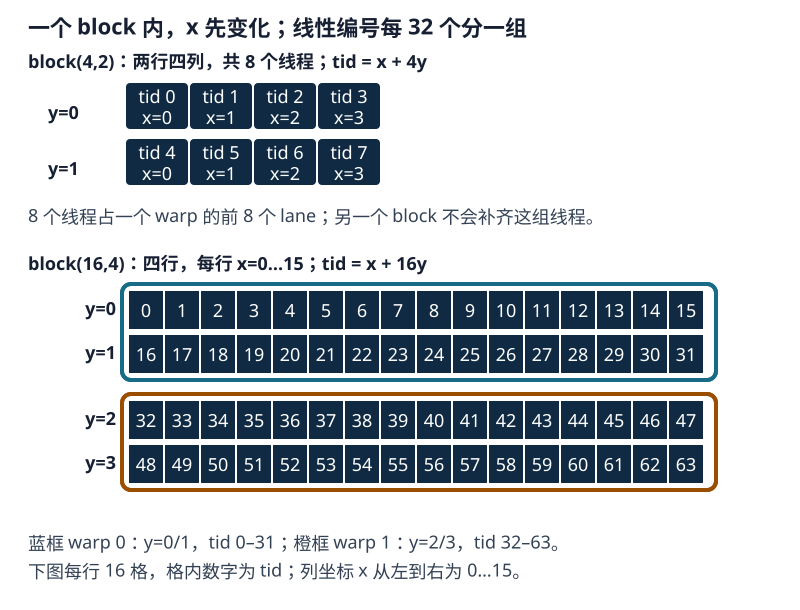

# 第 2 章：CUDA 执行模型与指令调度

CUDA 先按 x、再按 y、最后按 z 的顺序为 block 内线程编号，并按连续 32 个编号组成 warp。这个分组关系可用二维 block 的小例子直接计算。

## 1. 线程编号与 warp 分组

先看一个二维线程块：`dim3 block(4, 2)`。这里 `x=4`、`y=2`，所以总共有 8 个线程。每个线程有一对坐标 `(threadIdx.x, threadIdx.y)`：

| `y` | `x = 0` | `x = 1` | `x = 2` | `x = 3` |
|---:|---:|---:|---:|---:|
| 0 | (0,0) | (1,0) | (2,0) | (3,0) |
| 1 | (0,1) | (1,1) | (2,1) | (3,1) |

线性编号先让 x 从 0 增加到 3，再把 y 加 1。于是 `(0,0)→0`、`(1,0)→1`、`(2,0)→2`、`(3,0)→3`、`(0,1)→4`，最后 `(3,1)→7`。如果用这个编号访问向量，线程 0 处理元素 0，线程 1 处理元素 1。坐标和编号描述的是同一个线程：坐标方便表达二维位置，编号方便顺序分组。

CUDA 把同一个 block 中连续 32 个线性编号归为一个 warp（线程束）。warp 是硬件调度线程的基本组，一个 lane（线程束内位置）对应组内的一条线程，编号为 0 到 31。`block(4,2)` 只有 8 个线程，所以它们占据一个 warp 的前 8 个 lane；本 block 的线程数不会因此补到 32，另一个 block 的线程也不会拼进来。

把线程块 x 方向的一排改为 16 个线程：`dim3 block(16,4)` 有 64 个线程。第一个 warp 取连续的 32 个线性编号，正好包括 `threadIdx.y=0` 的 16 个线程和 `threadIdx.y=1` 的 16 个线程；第二个 warp 则包括 `threadIdx.y=2` 与 `threadIdx.y=3` 的线程。这里的“排”只指线程块坐标，还不是矩阵的一整行；warp 的边界始终由线性编号每 32 个切分。

<figure class="diagram-frame">

<figcaption>格内数字是线程的线性编号。下图的蓝色、橙色边框分别标出 warp 0 和 warp 1；每个边框内包含 32 个线程。</figcaption>
</figure>

现在可以写出一般公式。对二维 block，线性线程编号 `tid = threadIdx.x + blockDim.x × threadIdx.y`。对三维 block，再加上 `blockDim.x × blockDim.y × threadIdx.z`，即：

$$
tid = threadIdx.x + blockDim.x\,threadIdx.y + blockDim.x\,blockDim.y\,threadIdx.z
$$

`warp_id` 表示当前线程属于 block 内第几个 warp；`lane_id` 表示它在该 warp 中的位置：

$$
warp\_id = \left\lfloor\frac{tid}{32}\right\rfloor,\qquad lane\_id = tid\bmod 32
$$

除以 32 得到 warp 编号，取余 32 得到 lane 编号。对 `block(16,4)`，线程 `(x=7,y=1)` 的 tid 为 23，因此属于 warp 0、lane 23。线程 `(x=7,y=2)` 的 tid 为 39，属于 warp 1、lane 7。

每个 block 都从 tid=0 开始独立编号和分组，一个 warp 的线程全部来自同一个 block。

```cpp
__global__ void record_mapping(int* warp_ids, int* lanes) {
    int tid = threadIdx.x + blockDim.x * threadIdx.y;
    warp_ids[tid] = tid / 32;
    lanes[tid] = tid % 32;
}

// 输出数组各有 64 个 int；只启动一个 16×4 block，覆盖 tid=0..63。
dim3 block(16, 4);
record_mapping<<<1, block>>>(warp_ids, lanes);
```

线程坐标通过 kernel 的下标公式对应到数据。下面的 GEMM 让每个线程计算一个输出元素，可以直接看清这层对应关系。

矩阵乘法通常称为 GEMM（General Matrix Multiplication）。下面计算 `A[M,N] × B[N,K] = C[M,K]`：输出的每个元素是 A 的一行与 B 的一列对应相乘后求和。这个简单实现让一个线程计算一个输出元素，因而可以直接从代码看出线程坐标与矩阵坐标的关系。

<!-- source-check: solutions/cuda/gemm/naive_float.cu -->
```cpp
__global__ void matrix_multiplication_kernel(const float* A, const float* B, float* C,
                                             int M, int N, int K) {
    int k = blockDim.x * blockIdx.x + threadIdx.x;  // K 维度索引
    int m = blockDim.y * blockIdx.y + threadIdx.y;  // M 维度索引
    int idx = m * K + k;

    if ((k < K) && (m < M)) {
        float sum = 0;
        for (int n = 0; n < N; n++) {
            sum += A[m * N + n] * B[n * K + k];
        }
        C[idx] = sum;
    }
}

extern "C" void solve(const float* A, const float* B, float* C,
                      int M, int N, int K) {
    dim3 threadsPerBlock(16, 16);
    dim3 blocksPerGrid((K + 15) / 16, (M + 15) / 16);

    matrix_multiplication_kernel<<<blocksPerGrid, threadsPerBlock>>>(A, B, C, M, N, K);
    cudaDeviceSynchronize();
}
```

这份代码中，`k` 是输出列，`m` 是输出行；两者分别由 block 坐标和块内线程坐标计算。`idx=m*K+k` 是行优先数组 C 中的元素位置。每个有效线程沿归约维 `n` 求和，最后写一个 `C[m,k]`。`sum` 从零开始，写回时覆盖旧值。边界判断把行或列越界的线程排除，保护 A、B、C 的访问。

在上述 kernel 中，`threadIdx.x` 增加 1 就向右移动一个输出列，`threadIdx.y` 增加 1 就移动到下一输出行；每个线程只负责一个 `C[m,k]`。因此 `blockDim.x` 是**一个 block 在输出行中最多覆盖的列数**，不是整个矩阵的列数。先看没有越界线程的内部 block：

| 线程块 | warp 0 的 32 个线程 | 对输出 C 的覆盖 |
|---|---|---|
| `block(16,16)` | `y=0,x=0…15`；`y=1,x=0…15` | 相邻两行，各 16 列 |
| `block(32,8)` | `y=0,x=0…31` | 同一行的连续 32 列 |

例如 C 有 64 列，16 列宽的 block 需要沿列方向排 4 个，32 列宽的 block 需要排 2 个。表中的“一行”指 warp 当前负责的输出行片段；完整矩阵行仍有 64 个元素。换一个下标公式，线程负责的数据位置也会随之改变。

取 `M=3,N=2,K=5`，负责 `C[1,2]` 的线程先算 `idx=1*5+2=7`。循环第 0 次读取 `A[2]` 和 `B[2]`，第 1 次读取 `A[3]` 和 `B[7]`，得到 `C[7]=A[2]B[2]+A[3]B[7]`。若算出的行号为 3 或列号为 5，`if` 条件为假，这个线程跳过计算和写回。

线程数也不等于 tile 元素数。NVIDIA transpose 示例使用 32×32 数据 tile，却配置 32×16（512 个线程）的 block；每个线程通过循环搬运两个元素。线程在 tile 中负责哪些元素由索引表达式决定，不能据 tile 大小直接推断线程数。示例见 [CUDA Samples transpose](https://github.com/NVIDIA/cuda-samples/tree/5443602d89ed99aede2e4b7bf329daddeadb320e/cpp/6_Performance/transpose)。

Triton MatMul 用 `pid_m`、`pid_k` 选择输出 tile。程序描述的是一个 program 处理哪些元素；Triton 编译器再安排这些元素由哪些线程和 lane 处理。

## 2. 线程块驻留与 warp 发射

### 2.1 已分配资源：驻留状态

kernel 启动后，设备把 block 分配给 SM。SM 要先为这个 block 留出线程状态、寄存器和共享内存；资源分配完成后，block 处于驻留状态（resident），其中的 warp 才能参与调度。一个 SM 可以同时驻留多个 block，数量由这些资源的上限决定。

Occupancy（占用率）计算的是“当前驻留 warp 数 ÷ 该 SM 支持的最大 warp 数”。例如最大支持 64 个 warp、当前驻留 32 个，occupancy 就是 50%。这些 warp 中仍可能有一部分正在等待数据。

设一个 block 包含 $T_{block}$ 个线程，编译器为每个线程分配 $R_{thread}$ 个 32 位寄存器。该 block 的寄存器用量 $R_{block}$ 和 warp 数量 $W_{block}$ 可先估算为：

$$
R_{block}\approx T_{block}\times R_{thread},\qquad
W_{block}=\left\lceil\frac{T_{block}}{32}\right\rceil
$$

先算出一个 block 的需求，再分别检查 SM 的寄存器、共享内存、线程、warp 和 block 上限。最先用完的资源决定能放下几个 block。寄存器分配还要按硬件的分配单位取整，所以实际用量以编译报告为准。寄存器不足时，编译器可能把部分值移到 local memory；这个过程称为寄存器溢出（spill），会增加设备内存读写。

### 2.2 下一条指令可执行：就绪状态

> [!IMPORTANT] 从驻留到执行
> warp 先取得资源并驻留；下一条指令的数据准备好后进入就绪状态；调度器选中它并发出指令，才开始这次执行。

就绪（eligible）表示 warp 已具备执行下一条指令的条件。比如上一条加载的数据已经返回，或者需要参加同步的线程已经到达。数据未返回、上一条计算尚未产出结果或同步未完成时，这个 warp 继续等待。调度器会从就绪 warp 中选择指令；对应执行管线也必须有接收能力。

指令之间的数据依赖也会影响就绪状态。下面比较两段求和代码；[fmaf(a,b,x)](https://docs.nvidia.com/cuda/cuda-math-api/cuda_math_api/group__CUDA__MATH__SINGLE.html#_CPPv44fmaffff) 表示融合乘加 $a\times b+x$，乘加结果只进行一次舍入，简称 FMA（Fused Multiply-Add）。第一段只有一个累加值，下一次乘加必须等待它更新；第二段维护四个独立累加值，可以交错处理。

```cpp
// 依赖链：每条 FMA 都等待上一个 accumulator 的结果
float x = seed;
for (int k = 0; k < K; ++k) {
    x = fmaf(a[k], b[k], x);
}
```

```cpp
// 四条独立链：调度器有机会在等待一条链时发射另一条链
// 假设 K 是 4 的倍数；一般输入需另加尾部处理。
float x0 = seed, x1 = 0.0f, x2 = 0.0f, x3 = 0.0f;
for (int k = 0; k < K; k += 4) {
    x0 = fmaf(a[k + 0], b[k + 0], x0);
    x1 = fmaf(a[k + 1], b[k + 1], x1);
    x2 = fmaf(a[k + 2], b[k + 2], x2);
    x3 = fmaf(a[k + 3], b[k + 3], x3);
}
float x = x0 + x1 + x2 + x3;
```

第一段的每次 FMA 都依赖上一次 x。第二段有四个独立的累加器：计算 x0 时，可以安排 x1、x2、x3 的指令，不必都等待同一个结果。这提供了指令级并行（Instruction-Level Parallelism，ILP）。

四条累加链会多占寄存器，也改变最终的浮点求和顺序。正确性比较应使用明确的误差容限；性能比较则同时看耗时、寄存器数和驻留 warp 数。若寄存器增加使 SM 能驻留的 warp 大幅减少，拆累加链也可能变慢。

### 2.3 发出指令：Issue

发射（issue）是调度器把指令送入执行管线。以显存加载为例，发射之后还要等数据返回。等待期间，调度器可以发出其他就绪 warp 的指令。当前 warp 的下一条指令若不需要这次加载的结果，也可以继续；遇到要使用该结果的指令时，就要等待。

例如 warp A 读取显存后，要用读取结果做加法，因此暂时等待。warp B 的乘法输入已经准备好，调度器就可以先发出 B 的指令。A 的数据返回后，它的加法也进入候选队列。两个 warp 的寄存器和线程状态都已驻留在 SM 中，切换时可以直接使用。

分析性能时沿这条顺序检查：资源够放下多少 warp，实际有多少 warp 就绪，调度器又发出了多少指令。驻留数量少时检查寄存器和共享内存；驻留很多却很少就绪时，检查数据依赖、访存等待和同步。

一个 warp 因普通数据依赖而等待时，SM 可以发出同一 SM 上其他已驻留且就绪的 warp 的指令，不必等整个 block 结束。Ascend C 中常由软件把任务切分给 AIV/AIC 等逻辑核实例；GPU 这里说的是 SM 在硬件层面选择 warp 发射指令，两者处于不同层次，不能据此推断某类 AIV/AIC 在等待时不能处理其他任务。

如果所有驻留 warp 都在等数据，occupancy 即使为 100%，执行管线仍会空闲。若少量 warp 已有足够的独立指令填满管线，提高 occupancy 的收益就会较小。

把 block 从 128 个线程改为 256 个线程，会同时改变 grid 的 block 数、单个 block 的资源需求和尾块大小。应记录这些变化，再比较实际耗时；单看线程数无法选出更快的配置。

## 3. SIMT 与分支执行

SIMT（Single Instruction, Multiple Threads，单指令多线程）让程序员写一个线程的计算，硬件按 warp 组织执行。同一条加载指令中，每个线程都可以使用自己的地址。例如 32 个线程都执行 `input[global_id]`，对应的 `global_id` 可以是连续的 32 个元素编号。

当一个 warp 中有线程进入 `if`、另一些进入 `else`，warp 就需要处理两条指令路径，称为分支分歧（divergence）。处理某条路径时，活动掩码（active mask）记录哪些 lane 参加，其他 lane 暂停这条路径。之后线程继续执行共同代码，这个过程称为重汇合（reconvergence）。两条分支谁先执行由生成指令和硬件调度决定。

```cpp
if ((global_id & 1) == 0) {
    output[global_id] = expensive_even(input[global_id]);
} else {
    output[global_id] = expensive_odd(input[global_id]);
}
```

假设这个 warp 的 32 个 lane 对应连续的 `global_id`，其中 16 个执行 even，另外 16 个执行 odd。编译器保留显式分支时，warp 要分别处理两组指令：even 指令由偶数 lane 参加，odd 指令由奇数 lane 参加。每个线程只计算自己选择的路径。若两个函数都很长，warp 要处理的总指令也会很多；若一个 warp 全部选择 even、另一个全部选择 odd，各 warp 内就没有这种分歧。

### 3.1 谓词执行与短分支

短分支中，编译器可能省去显式跳转，给指令附上每线程的条件，称为谓词执行（predication）。指令仍会被调度；条件为真的 lane 执行它，条件为假的 lane 不读取操作数、不计算该指令的访问地址，也不写结果。它可以减少跳转和分支控制开销，但仍要调度两条路径的指令。

下面这份源码先做乘法，再做加法，最后选择一个值。按源码计算顺序，每个线程都先算了两个候选值：

```cpp
float even_value = input[i] * 2.0f;
float odd_value = input[i] + 3.0f;
output[i] = ((i & 1) == 0) ? even_value : odd_value;
```

“先算两边再选择”会增加算术工作，编译器也可能把这些纯算术改成带谓词的指令。判断时应看最终机器指令：是否有跳转，两条计算是否都保留，分别有哪些 lane 参加。

短分支通常更适合谓词化，因为跳转本身可能占较大比例。长分支则可能受益于真实跳转：例如整个 warp 都选择 even，就可以跳过长长的 odd 路径。如果 warp 内两条路径都有线程参加，长分支仍会产生分歧成本。

### 3.2 独立线程调度与 warp 协作

从计算能力（Compute Capability，CC）7.0，也就是 Volta 架构开始，GPU 分别记录每个线程执行到了哪条指令。同一个 warp 中，一部分线程可以等待，其他线程继续执行。这称为独立线程调度（Independent Thread Scheduling，ITS）。发出指令时，硬件仍把同一个 warp 中要执行该指令的活动线程组织在一起。

写代码时要注意：**同一个 warp 中的线程，也需要同步才能保证通过内存交换的数据先写后读。** 例如，线程 0 写共享内存，其他线程随后读取；两步之间用 `__syncwarp()` 等待写入完成：

```cpp
// 示例条件：一个 32 线程的一维 block，所有线程均执行下面的同步。
// 读完之前，没有其他代码覆盖 shared_value。
__shared__ float shared_value;
if (threadIdx.x == 0) shared_value = value;
__syncwarp(0xffffffffu);
float x = shared_value;
```

`0xffffffffu` 的 32 个 bit 全为 1，表示这个 warp 的 32 个线程都参与同步。线程 0 完成写入后也必须执行 `__syncwarp()`；其他线程通过同步后再读，才能保证读到这次写入的值。同步放在 `if` 外，因为读者和写者都需要到达这里。

每个线程都有自己的一份局部变量。普通标量通常放在寄存器中；通过 [__shfl_sync](https://docs.nvidia.com/cuda/cuda-programming-guide/05-appendices/cpp-language-extensions.html#warp-shuffle-functions)，其他线程可以取得指定 lane 的寄存器值。下面把 lane 0 的 `value` 传给这个 warp 的所有参与线程：

```cpp
// 前置条件：完整 warp 的 32 个线程均到达这里，lane 0 提供有效 value。
const unsigned mask = 0xffffffffu;
int x = __shfl_sync(mask, value, 0);
```

每个线程都把自己的 `value` 传入，但最后一个参数 0 指定从 lane 0 取值。例如 lane 0 的值是 10，lane 1 的值是 20，调用后每个参与线程得到的 x 都是 10。若需要两者，可以分别调用 `__shfl_sync(mask, value, 0)` 和 `__shfl_sync(mask, value, 1)`。

`mask` 的位指定参与线程，最后的 lane 编号指定值的来源。所有参与线程要使用相同 mask 执行对应调用，来源 lane 也要参加并已经给 value 赋值。`__shfl_sync` 自带这次寄存器交换需要的同步。若某个局部变量被溢出到 local memory，编译器会先取得它的寄存器操作数，再执行 shuffle。

例如完整的一维 warp 中，每个 lane 先生成自己的值；每个线程执行两次 shuffle，就能分别取得 lane 0 和 lane 1 的值：

```cpp
// 前置条件：blockDim.x 是 32 的倍数，且这个完整 warp 的所有 lane 都执行两次调用。
const unsigned mask = 0xffffffffu;
int lane = threadIdx.x & 31;
int value = 10 + lane;
int from_lane_0 = __shfl_sync(mask, value, 0);
int from_lane_1 = __shfl_sync(mask, value, 1);
```

在这个例子中，lane 0 的 `value` 是 10，lane 1 的 `value` 是 11。因此每个参与线程的 `from_lane_0` 都是 10，`from_lane_1` 都是 11。二维或三维 block 不能直接用 `threadIdx.x & 31` 当作 lane 编号；应先按 CUDA 的线性线程编号计算 lane。

共享内存例子用 [__syncwarp](https://docs.nvidia.com/cuda/cuda-programming-guide/05-appendices/cpp-language-extensions.html#synchronization-functions) 保证先写后读；shuffle 例子用指令自身的同步保证寄存器交换。若同一个 block 的不同 warp 通过共享内存传值，通常在写入与读取之间使用 `__syncthreads()`。

参加同步的线程要包含数据的写入者和读取者。对于没有有效输入的线程，先给后续读取的位置写好填充值，再按同步函数的要求决定是否可以退出。地址越界和多个线程争写同一位置，则需要另外修正索引或定义原子更新规则。


## 4. Block 波次与尾部利用率

假设设备有 $S$ 个 SM，每个 SM 最多同时驻留这个 kernel 的 $B$ 个 block，则同时能放下 $S\times B$ 个 block。再假设各 block 耗时相近，把这一批容量称为“一波”。对于包含 $G>0$ 个 block 的 grid，估算波数为：

$$
waves=\left\lceil\frac{G}{S\times B}\right\rceil
$$

最后一波中剩余的 block 数为：

$$
G-(waves-1)(S\times B)
$$

当最后一波不足 $S\times B$ 个 block 时，部分资源会提前空闲，形成尾效应。实际设备会在一个 block 结束后继续安排后续 block，并不会等同一波全部结束才开始下一波。上面的公式用于估算等时任务的尾部，实际时间还受各 block 的工作量影响。

block 内也可能存在尾部浪费。例如最后一个 warp 只有少量线程，或者部分线程的元素索引越界，这些位置无法产生有效输出。

例如 `S=4,B=2`，每波容量为 8。10 个等时 block 可以看成第一波 8 个、最后一波 2 个；最后只用了 8 个位置中的 2 个，至多涉及 2 个 SM。8 个 block 刚好满一波，12 个则是 8 个加 4 个。若每个 block 都耗时 t、且并发不改变耗时，10 个 block 的这个简化模型需要约 2t。

矩阵计算中要分开看两种尾部。第一种在 tile 内：例如一个 tile 处理 32 列，矩阵边界只剩 5 列，其余位置由 mask 排除。第二种在设备上：每个 tile 都完整，最后却只剩一两个 block，其他 SM 无事可做。测试整除与非整除形状，可以分别观察这两个问题。

尾部可以从任务划分、block 工作量和资源占用三处处理：

| 做法 | 适用情况 | 需要检查 |
|---|---|---|
| 合并多个独立的小任务 | 单个矩阵或请求太小，单独启动会留下大量空闲资源 | 合并后地址、边界和每个任务的工作量是否正确 |
| 动态领取逻辑任务 | 任务耗时不均，静态分配给线程或 block 后会有少数执行者拖到最后 | 任务领取开销、同步开销与任务粒度 |
| 调整 tile 或每个 block 的工作量 | block 太少，或每个 block 占用资源过多 | 寄存器、共享内存、驻留 block 数和总工作量 |
| 为边界形状使用专门 tile/kernel | 主体形状规则，只有边缘剩余区域较小 | 额外分支或启动成本是否低于省下的无效工作 |

动态领取任务主要用于一类逻辑任务：任务事先静态分配给线程或 block 后，因工作量不同而出现负载不均。这时线程或 block 可从任务队列领取下一项。它不意味着每个 CUDA kernel 都需要自己维护队列；普通 CUDA kernel 的 block 结束、资源释放后，硬件调度器会继续安排尚未运行的 block。

例如，把 17 个耗时均为 `t` 且不可再拆分的 block 分配给 8 个可并行执行位置。即使理想地均匀分配，至少一个位置仍要顺序执行 3 个 block，因此总时间下界约为 `3t`；这里假设 8 个位置始终可用、每个 block 耗时不因并发而变化。多补空 block 凑成 24 个，不会减少原有计算。persistent kernel（常驻内核）让一组 block 持续驻留，并在循环中领取多个逻辑任务；它适用于任务粒度或调度方式确有收益的场景，不是普通 block 波次尾部的通用解法。

## 5. 计算管线：普通 CUDA Core、FMA 与 Tensor Core

官方文档：[fmaf：参数、舍入与特殊值](https://docs.nvidia.com/cuda/cuda-math-api/cuda_math_api/group__CUDA__MATH__SINGLE.html#_CPPv44fmaffff) · [Tensor Core MMA：矩阵形状、输入类型与精度规则](https://docs.nvidia.com/cuda/parallel-thread-execution/index.html#warp-level-matrix-instructions-mma)

普通算术指令和矩阵乘加指令使用不同的计算资源。下面先看普通 FP32 算术：`fmaf(a,b,acc)` 计算 $a\times b+acc$，乘加作为一个运算只舍入一次：

```cpp
float acc = 0.0f;
for (int k = 0; k < K; ++k) {
    acc = fmaf(a[k], b[k], acc);
}
```

上面的循环一次处理一对 a、b。Tensor Core 的矩阵乘加指令（Matrix Multiply-Accumulate，MMA）则一次处理一个矩阵小块，例如把 A 的一个块与 B 的一个块相乘，再加到累加器矩阵上。使用这类指令，需要把数据排成它支持的形状、类型和布局。

CUDA Core 算术和 Tensor Core 矩阵指令的处理规模、吞吐率与舍入规则不同。检查生成指令时，普通 FP32 FMA 和矩阵 MMA 应分别识别；后面的类型说明也按这两条路径展开。

### 5.1 输入、累加器与输出类型

FP16（半精度浮点）和 BF16（一种 16 位浮点格式）常用来保存输入，每个元素占 2 字节。读入之后，代码可以先把它转换为 FP32 再计算，也可以交给接受低精度矩阵操作数的 MMA 指令。先看第一种：**FP16 保存输入，FP32 执行乘加。**

$$
\begin{aligned}
a_f&=\operatorname{FP32}(a_{in}),\\
b_f&=\operatorname{FP32}(b_{in}),\\
acc_{fp32}&\leftarrow\operatorname{fmaf}(a_f,b_f,acc_{fp32}).
\end{aligned}
$$

公式中 $a_{in}$、$b_{in}$ 是输入数组中的 FP16 值，$a_f$、$b_f$ 是转换后的 FP32 值。累加完成后，按输出数组类型写回：

$$
C_{out}=\operatorname{cast}_{out}(acc_{fp32}).
$$

以下示例使用 [__half2float](https://docs.nvidia.com/cuda/cuda-math-api/cuda_math_api/group__CUDA__MATH____HALF__MISC.html) 转换输入，再调用 [fmaf](https://docs.nvidia.com/cuda/cuda-math-api/cuda_math_api/group__CUDA__MATH__SINGLE.html#_CPPv44fmaffff)。每个线程计算一对输入的乘积，输出为 FP32：

```cpp
#include <cuda_fp16.h>
__global__ void half_input_float_accum(const __half* a, const __half* b,
                                       float* c, int n) {
    int i = blockIdx.x * blockDim.x + threadIdx.x;
    if (i >= n) return;
    float af = __half2float(a[i]);
    float bf = __half2float(b[i]);
    c[i] = fmaf(af, bf, 0.0f);
}
```

沿代码逐步看：`a[i]`、`b[i]` 是 FP16，每个输入元素占 2 字节；`__half2float` 把它们转成 FP32 的 af、bf；`fmaf` 执行 FP32 乘加；结果写入 float 数组 c，每个输出元素占 4 字节。这里节省的是输入数组的存储和加载数据量。

**转换成 FP32 只改变数值的表示方式，不会恢复先前丢失的精度。** 例如原始值 `1.0001` 保存成 FP16 后舍入为 `1.0`，再转成 FP32 得到的仍是 `1.0`。因此，“输入保存为 FP16”与“执行 FP32 乘法”可以同时成立。

另一种写法把 FP16/BF16 矩阵小块直接作为 MMA 操作数，选择 FP32 累加器。矩阵指令按它规定的规则计算。两种实现都可能读取 FP16、写出 FP32；区别要从执行的算术或矩阵指令中确认。

下面保留的 FP16 tiled GEMM 使用 `A[M,K] × B[K,N] = C[M,N]`，K 是归约维；这是该原始代码的命名，与前面的 naive 版本不同。`threadIdx.x` 对应输出行 m，`threadIdx.y` 对应输出列 n。输入先搬入 half 类型的共享内存 As、Bs，计算时再转成 float，累加器 sum 也是 float，最后把结果写成 half。

<!-- source-check: solutions/cuda/gemm/tiled_fp16.cu -->
~~~cpp {8-10,16-27,29-35,39-42}
constexpr int tileLen = 32;

__global__ void kernel(const half* A, const half* B, half* C,
                       int M, int N, int K, float alpha, float beta) {
    int m = blockIdx.x * tileLen + threadIdx.x;
    int n = blockIdx.y * tileLen + threadIdx.y;
    float sum = 0.0f;

    // 每个线程先搬运暂存
    __shared__ half As[tileLen][tileLen];
    __shared__ half Bs[tileLen][tileLen];

    // 遍历 K
    for (int t = 0; t < (K + tileLen - 1) / tileLen; ++t) {
        // 每个线程搬运自己负责的那块
        // A 矩阵按列步进
        int aK = t * tileLen + threadIdx.y;
        As[threadIdx.x][threadIdx.y] = (m < M && aK < K)
            ? A[m * K + aK] : __float2half_rn(0.0f);

        // B 矩阵按行步进
        int bK = t * tileLen + threadIdx.x;
        Bs[threadIdx.x][threadIdx.y] = (n < N && bK < K)
            ? B[bK * N + n] : __float2half_rn(0.0f);

        // 同步
        __syncthreads();

        // 计算
        for (int k = 0; k < tileLen; k++) {
            sum += __half2float(As[threadIdx.x][k]) *
                   __half2float(Bs[k][threadIdx.y]);
        }

        // 同步
        __syncthreads();
    }

    if (m < M && n < N) {
        C[m * N + n] = __float2half_rn(
            alpha * sum + beta * __half2float(C[m * N + n]));
    }
}
~~~

两份代码的类型可以直接对照：

| 实现 | 输入数组 | 计算时的 a、b | 累加器 | 输出数组 |
|---|---|---|---|---|
| 前面的 `half_input_float_accum` | FP16 | 显式转成 FP32 | FP32 FMA 的第三个操作数为 0 | FP32 |
| 上面的 FP16 tiled GEMM | FP16 | 显式转成 FP32 | float 类型的 sum | FP16 |

因此，把输出数组改为 half，改变的是写回类型；要改变累加精度，需要改 sum 或矩阵指令的累加器类型。共享内存中的 As、Bs 每元素占 2 字节，分析 bank 访问时也要按这个宽度计算。

tiled GEMM 的最终写回公式是 `C=alpha*sum+beta*C_old`。`alpha` 缩放新结果，`beta` 缩放旧 C。

原文件即使在 `beta=0` 时，也会读取旧 C 并计算 `beta*C_old`。所以调用前必须初始化 C；旧值若是 NaN，`0*NaN` 仍会得到 NaN。若接口允许 beta 为零时跳过旧 C，可以写单独分支直接存 `alpha*sum`。代码注释中的带宽倍数需要在设备上测量；算法估算字节数和 profiler 记录的 DRAM 字节数应分别给出。

### 5.2 Triton `tl.dot` 的 `input_precision`

> [!WARNING] FP32 输入也要确认乘法精度
> `tl.dot` 可以读取 FP32 数组，却按允许的 TF32 精度执行矩阵乘法。设置 `input_precision`，才能明确这次乘法允许使用什么精度。

对 FP32 输入，[tl.dot](https://triton-lang.org/main/python-api/generated/triton.language.dot.html) 的 `input_precision` 决定允许的乘法输入精度。例如 PyTorch 关闭 TF32，而 Triton 允许 TF32，两边就采用了不同的数值计算方式；归约长度很大时，差异可能超过测试容差。要求 IEEE FP32 乘法时，Triton 写成：

```python
acc = tl.zeros((BLOCK_M, BLOCK_K), dtype=tl.float32)
acc += tl.dot(tile_a, tile_b, input_precision="ieee")
```

同时在 PyTorch reference 侧固定：

```python
torch.backends.cuda.matmul.allow_tf32 = False
```

`input_precision="ieee"` 负责这次 dot 的乘法精度；tile_a、tile_b、acc 的类型以及输出数组类型仍由各自代码决定。比如输出是 FP16，FP32 累加结果写回时还会舍入到 FP16。

小形状通过、长归约失败时，先核对地址和 mask，再固定输入、形状和容差，分别运行 IEEE 与 TF32 版本。记录误差是否随配置改变，再检查累加顺序和输出转换。两种版本都失败时，也要继续用小输入验证索引与边界。FP32 输出会保存已有结果，无法修复此前的乘法或求和误差。

## 6. 依赖链、分支与执行调度实验

本实验在 NVIDIA GeForce RTX 3090、CUDA 12.4（`V12.4.131`）上使用 `sm_86` native 目标。四个 kernel 各自用 CPU 参考实现检查输出，再测平均耗时和源码 FMA 吞吐。命令参数依次是 `n`、`steps`、`repeats`：`257 / 20 / 5` 使用 256-thread block，网格为 2 个 block，第二个尾块只有 1 个有效线程；`1,048,576 / 200 / 50` 用来比较吞吐。

```bash
cd roadmap/curriculum/gpu/02-cuda-execution-and-scheduling
nvcc -O3 -std=c++17 -lineinfo --resource-usage -arch=sm_86 \
  examples/execution_and_scheduling.cu -o /tmp/cuda-execution-sm86
/tmp/cuda-execution-sm86 257 20 5
compute-sanitizer --tool memcheck --error-exitcode=1 /tmp/cuda-execution-sm86 257 20 5
/tmp/cuda-execution-sm86 1048576 200 50
```

程序先计算 CPU 参考值：两个累加版本使用 `std::fma`，分支版本使用普通乘加表达式。每个 kernel 预热一次，再重复启动 `repeats` 次，用 CUDA event 测量总时间，除以重复次数得到平均单次耗时 `ms`。输入、输出拷贝在计时区间外，连续提交之间的空隙计入总时间。测量结束后，程序把 GPU 结果拷回主机，逐项比较参考值，得到所有元素的最大绝对差 `max_abs_error`。结果有限、误差不超过 `1e-4` 且计时有效时，打印 PASS。`source_FMA_GFLOP_s` 表示按源码计算的浮点吞吐，单位是每秒十亿次浮点操作，一个 FMA 按乘法和加法计两次操作。

### 6.1 依赖链与四条独立累加链

依赖链每元素做 steps 次 FMA，每次等待上一次 x。独立版本维护 x0、x1、x2、x3，每轮分别更新，先求和、减去 `0.6f`，再乘 `0.25f`。steps 为 200 时，前者每元素做 200 次 FMA，后者做 800 次；两个 kernel 使用各自的 CPU reference，输出不要求相同。

<!-- source-check: examples/execution_and_scheduling.cu -->
~~~cpp
__global__ void dependent_chain_kernel(const float* input, float* output,
                                       int n, int steps) {
    const int i = blockIdx.x * blockDim.x + threadIdx.x;
    if (i >= n) return;
    float x = input[i];
    for (int step = 0; step < steps; ++step) {
        x = fmaf(x, 1.000001f, 0.00001f);
    }
    output[i] = x;
}

__global__ void independent_accumulators_kernel(const float* input,
                                                float* output, int n,
                                                int steps) {
    const int i = blockIdx.x * blockDim.x + threadIdx.x;
    if (i >= n) return;
    float x0 = input[i];
    float x1 = input[i] + 0.1f;
    float x2 = input[i] + 0.2f;
    float x3 = input[i] + 0.3f;
    for (int step = 0; step < steps; ++step) {
        x0 = fmaf(x0, 1.000001f, 0.00001f);
        x1 = fmaf(x1, 1.000001f, 0.00001f);
        x2 = fmaf(x2, 1.000001f, 0.00001f);
        x3 = fmaf(x3, 1.000001f, 0.00001f);
    }
    output[i] = 0.25f * (x0 + x1 + x2 + x3 - 0.6f);
}
~~~

本次大输入的输出为：

~~~text
dependent      0.0201 ms max_abs_error=0 PASS source_FMA_GFLOP_s=20855.398
independent    0.0576 ms max_abs_error=0 PASS source_FMA_GFLOP_s=29132.291
~~~

每个版本与自己的参考函数比较；两个累加版本的初值和计算路径不同。dependent 每元素做 `200` 次 FMA，共 `209,715,200` 个 FMA，即 `419,430,400` FLOPs，耗时 20.1 us。independent 每元素做 `800` 次 FMA，共 `838,860,800` 个 FMA，即 `1,677,721,600` FLOPs，耗时 57.6 us。四倍源码工作用了约 2.87 倍时间，所以按源码 FMA 数计，单位时间工作量约高 40%，对应约 20.9 TFLOP/s 和 29.1 TFLOP/s。四个累加器属于同一线程，彼此不依赖，增加可连续发射的独立计算指令。

本次编译报告显示，单链每线程使用 9 个寄存器，四链使用 14 个。按 [Ampere Tuning Guide](https://docs.nvidia.com/cuda/ampere-tuning-guide/index.html#occupancy)，RTX 3090 的每个 SM 最多同时驻留 48 个 warp，并有 65,536 个 32 位寄存器。每个 block 的 256 个线程组成 8 个 warp，按 warp 数量上限可以容纳 6 个 block。未计分配取整时，单链每块使用 `9×256=2304` 个寄存器，四链每块使用 `14×256=3584` 个；六个 block 分别需要 13,824 和 21,504 个。实际分配会按硬件粒度取整，可用 occupancy API 查询最终能驻留多少个 block。

小输入 `257 / 20 / 5` 中，dependent 为 0.0035 ms、error 0、PASS、2.953 GFLOP/s；independent 为 0.0029 ms、error 0、PASS、14.342 GFLOP/s。

### 6.2 分支与双路径选择

两种写法都要求偶数位置输出 even_path 的结果、奇数位置输出 odd_path 的结果。分支版本按条件调用函数；程序中名为 `predicated_select_kernel` 的选择版本，则先调用两个函数再选结果。这个函数名沿用示例源码，是否真的编译成谓词指令，要看 PTX/SASS。比较时间时，还要记录最终保留了多少算术指令。

<!-- source-check: examples/execution_and_scheduling.cu -->
~~~cpp
__device__ __forceinline__ float even_path(float x) {
    return fmaf(x, 1.25f, 0.5f);
}

__device__ __forceinline__ float odd_path(float x) {
    return fmaf(x, 0.75f, -0.25f);
}

__global__ void divergent_branch_kernel(const float* input, float* output,
                                        int n) {
    const int i = blockIdx.x * blockDim.x + threadIdx.x;
    if (i >= n) return;
    if ((i & 1) == 0) {
        output[i] = even_path(input[i]);
    } else {
        output[i] = odd_path(input[i]);
    }
}

__global__ void predicated_select_kernel(const float* input, float* output,
                                         int n) {
    const int i = blockIdx.x * blockDim.x + threadIdx.x;
    if (i >= n) return;
    const float even_value = even_path(input[i]);
    const float odd_value = odd_path(input[i]);
    output[i] = ((i & 1) == 0) ? even_value : odd_value;
}
~~~

sm86 native 大输入输出如下：

~~~text
divergent      0.0118 ms max_abs_error=1.1920929e-07 PASS
predicated     0.0113 ms max_abs_error=1.1920929e-07 PASS
~~~

偶数位置走 `even_path(x)=fmaf(x,1.25,0.5)`，奇数位置走 `odd_path(x)=fmaf(x,0.75,-0.25)`。divergent 版本按条件只计算对应路径；predicated 版本先计算两条路径再选择。CPU reference 使用普通乘加，GPU 使用 FMA，因此出现 `1.1920929e-07` 的舍入差；`1e-4` 容差下两者都 PASS。大输入两者分别为 11.8 us 和 11.3 us，差 0.5 us。

`steps` 只控制两个累加 kernel；这里的两条候选路径各只有一次 FMA。程序只为累加链打印 `source_FMA_GFLOP_s`，这两行只打印平均时间、最大误差和 PASS。

小输入 `257 / 20 / 5` 中，divergent 和 predicated 都是 0.0027 ms、error `5.9604645e-08`、PASS。

两种写法的耗时接近，原因在于候选路径很短，数组读写、内核启动和提交等共同开销会稀释计算部分的差异。编译器还可以将短分支改写为谓词执行；源码中的函数名不能直接说明最终生成了哪些指令。查看 SASS 中的条件跳转、谓词和 FMA，才能进一步对应两种写法。条件执行与短分支优化规则见 [CUDA 12.4 SIMT Architecture](https://docs.nvidia.com/cuda/archive/12.4.0/cuda-c-programming-guide/index.html#simt-architecture) 和 [Control Flow Instructions](https://docs.nvidia.com/cuda/archive/12.4.0/cuda-c-programming-guide/index.html#control-flow-instructions)。

为了把路径差异拉长，新增 probe 仍调用同一个 `branch_probe_kernel`，只改变 `flags`。`flags[i]=1` 调 `even_chain`，`flags[i]=0` 调 `odd_chain`；每个函数的循环都依赖上一步的 `x`，每个线程做 `steps` 次 FMA。`__noinline__` 保留函数调用边界，`#pragma unroll 1` 保留运行时循环。

<!-- source-check: examples/execution_and_scheduling.cu -->
~~~cpp
void make_probe_flags(int n, bool warp_uniform,
                      std::vector<unsigned char>& flags) {
    flags.resize(n);
    for (int i = 0; i < n; ++i) {
        flags[i] = warp_uniform ? (((i / 32) & 1) == 0)
                                : ((i & 1) == 0);
    }
}
~~~

`warp_uniform` 中 i=0–31 全走 even，i=32–63 全走 odd；`lane_split` 中每个 warp 的偶数 lane 走 even，奇数 lane 走 odd。两种 flags 使用相同 kernel、相同输入规模、相同线程配置和相同每线程 steps；`n=1,048,576` 可被 64 整除，两条路径各有 524,288 个元素。

<!-- source-check: examples/execution_and_scheduling.cu -->
~~~cpp
__device__ __noinline__ float even_chain(float x, int steps) {
#pragma unroll 1
    for (int step = 0; step < steps; ++step) {
        x = fmaf(x, 1.000001f, 0.00001f);
    }
    return x;
}

__device__ __noinline__ float odd_chain(float x, int steps) {
#pragma unroll 1
    for (int step = 0; step < steps; ++step) {
        x = fmaf(x, 0.999999f, -0.00001f);
    }
    return x;
}

__global__ void branch_probe_kernel(const float* input,
                                    const unsigned char* flags,
                                    float* output, int n, int steps) {
    const int i = blockIdx.x * blockDim.x + threadIdx.x;
    if (i >= n) return;
    output[i] = flags[i] ? even_chain(input[i], steps)
                         : odd_chain(input[i], steps);
}
~~~

沿着一个线程的执行顺序看：先用 block 编号和线程编号算出元素位置 `i`，越过数组边界的线程立即退出；有效线程读取 `flags[i]` 和 `input[i]`，进入对应的累加函数，完成循环后把返回值写入 `output[i]`。循环中的 `x` 是该线程的局部计算值，每次 FMA 都使用上一次的结果。两种模式中，每个线程都只计算自己选中的一条链，因此总有效 FMA 数都是 `n×steps`；相同位置的元素可以选中不同的链，输出分别与各自的 CPU 参考值比较。

在章目录下运行：

~~~bash
bash examples/run_branch_probe.sh
~~~

脚本默认用 `-arch=sm_86` 编译，先跑 CPU self-test，再用 `n=257、steps=8、repeats=3、rounds=3` 检查尾块，并运行 Compute Sanitizer memcheck；随后保存 SASS，分别测量 `steps=1/32/256` 的大输入。缺少检查工具时，脚本会打印相应的 SKIP。本次服务器完成了 memcheck，最后打印的结果目录为 `/tmp/branch-probe-NEQldh`。

服务器先输出环境和资源字段：

~~~text
branch_probe GPU=NVIDIA GeForce RTX 3090 cc=8.6 driver=13020 runtime=12040
branch_probe n=1048576 steps=256 repeats=50 rounds=9 block=256 grid=4096
branch_probe kernel numRegs=10 sharedBytes=0 localBytes=0 theoretical_blocks_per_sm=6
~~~

`cc=8.6` 对应本次 `sm_86` 编译目标。`driver=13020` 表示驱动支持 CUDA 13.2，`runtime=12040` 表示使用 CUDA 12.4 Runtime；版本号含义见 [CUDA Runtime Version Management](https://docs.nvidia.com/cuda/archive/12.4.0/cuda-runtime-api/group__CUDART____VERSION.html)。大输入有 1,048,576 个元素，每个 block 包含 256 个线程，因此 `grid=1048576/256=4096`，没有不完整的尾块。

编译时的 `ptxas` 报告与运行时资源查询相互对应：

~~~text
    0 bytes stack frame, 0 bytes spill stores, 0 bytes spill loads
ptxas info    : Used 10 registers, 384 bytes cmem[0]
~~~

| 字段 | 含义 |
|---|---|
| `numRegs=10` | kernel 每线程使用的寄存器数 |
| `sharedBytes=0` / `localBytes=0` | 静态共享内存为 0，每线程本地内存为 0 |
| `stack frame=0` / `spill stores=0` / `spill loads=0` | 编译产物没有栈帧和寄存器溢出读写 |
| `cmem[0]=384` | kernel 参数等使用的常量内存，不是每线程 384 字节 |
| `theoretical_blocks_per_sm=6` | occupancy API 按资源计算的驻留上限；每 block 有 8 个 warp，6 个 block 共 48 个 warp，不是计时期间的实测驻留数 |

输入、flags 和输出由 `cudaMalloc` 在运行时分配。编译开头的 `0 bytes gmem` 不代表程序没有使用显存。报告中还列出了原来的四个 kernel，因为它们在同一个源文件中；这次脚本启动的是 `branch_probe_kernel`。

小输入首先给出工具自检和两种模式的数值检查结果：

~~~text
branch_probe self-test PASS
branch_probe pattern=uniform_pre even=129 odd=128 max_abs_error=0 guard=PASS PASS
branch_probe pattern=split_pre even=129 odd=128 max_abs_error=0 guard=PASS PASS
~~~

CPU self-test 检查 flags 计数、参考值、非法参数、哨兵和 NaN 逻辑。`_pre` 表示正式计时前的 GPU 输出检查。`n=257` 需要两个 block：第一个处理 256 个元素，第二个只有一个有效线程，其余线程在边界判断处退出。两种 flags 都分配了 129 个 even 元素和 128 个 odd 元素。

`max_abs_error=0` 表示这次所有输出都与 CPU `std::fma` 参考值一致。输出区前后各放置 32 个 float 哨兵，`guard=PASS` 表示这些保护值没有被写坏。每轮计时结束后也会检查保护区，最后再检查最后执行模式的数值结果。`overall PASS` 汇总数值、保护区和有限且大于零的计时检查；三组大输入也都通过了这些检查。

Compute Sanitizer 对同一个小输入报告：

~~~text
========= ERROR SUMMARY: 0 errors
~~~

它在运行期间检查内存访问，插桩增加了额外耗时。因此性能表使用普通运行的数据，memcheck 记录用于检查内存错误。

大输入计时开始前，两种模式各预热 3 次。每一轮分别启动 50 次，CUDA event 总时间除以 50，得到该轮的平均单次耗时；再对 9 个轮均值取中位数。预热、数据拷贝和结果检查都在计时区间外，连续启动之间的提交空隙会计入时间。先后次序每轮交换，输出中的前两轮例如：

~~~text
branch_probe round=0 order=uniform-split uniform_ms=0.076534 split_ms=0.147640
branch_probe round=1 order=split-uniform uniform_ms=0.076554 split_ms=0.147844
~~~

本次大输入的正常计时为：

| steps | uniform median (ms) | split median (ms) | split / uniform |
|---:|---:|---:|---:|
| 1 | 0.013455 | 0.013578 | 1.009132 |
| 32 | 0.016404 | 0.024617 | 1.500624 |
| 256 | 0.076534 | 0.147702 | 1.929890 |

这个表比较同一 kernel 下的两种 flags 分布。比值取自程序内部未舍入的计时值，前两列显示到小数点后六位。

`steps=1` 时，两者相差 `0.000123 ms = 0.123 us`，split 约多 0.9% 耗时。每条路径只有一次 FMA，启动、读写和调用等共同开销稀释了计算路径的差别。这与原来短路径实验耗时接近的现象一致。

`steps=32` 时，split 从 0.016404 ms 增加到 0.024617 ms，约多 50.1% 耗时。随着循环变长，warp 内两条计算路径的额外执行成本开始明显影响总时间。

`steps=256` 时，uniform 为 76.534 us，split 为 147.702 us，约多 93.0% 耗时。uniform 的一个 warp 只执行一条长路径，32 个 lane 都参加其中的 FMA；split 的 warp 要分别执行两条长路径，每条路径只有对应的 16 个 lane 参加。线程的有效计算量相同，但完成这些计算需要更多 warp 指令发射。随着路径计算占比增加，总耗时比接近两倍；启动和数据读写等共同开销并没有一起翻倍。

因此，分析分支性能时，应同时看 warp 内的路径分布和每条路径的计算长度。`flags` 控制前者，`steps` 控制后者。不同 warp 可以执行不同路径，优化时重点是让同一个 warp 内尽量保持路径一致。若通过数据分组实现这一点，也要把分组和恢复输出顺序的成本计入总时间。

进一步使用 profiler 时，可在两段 FMA 循环中观察每条 warp 指令的活跃 lane 数：uniform 预期为 32，split 预期为 16。对应的 SASS 已由脚本保存到 `/tmp/branch-probe-NEQldh/branch_probe.sass.txt`，可继续核对选路与循环跳转。

原始日志中的 min/max 有一处统计打印错误：旧实现从未排序的原始 vector 取 `front/back`，而中位数函数排序的是副本。`efdf4f2` 已修正这一问题，中位数和比值不受影响。根据本次九轮输出复算，256 次循环的统计为：

~~~text
uniform min_ms=0.076104 median_ms=0.076534 max_ms=0.076776
split   min_ms=0.146903 median_ms=0.147702 max_ms=0.147884
~~~

这两行是对原始数据的复算，原始日志保留原样。首次默认构建对照见[实验记录](../../../../notes/cuda/execution-and-scheduling-rtx3090-2026-10-09.md)，本次完整服务器输出见[branch probe 日志](../../../../notes/cuda/logs/2026-10-10-branch-probe-rtx3090.txt)。

下面保留原始四项对照的完整程序，其入口参数为 `n、steps、repeats`，默认值分别是 `1<<20、200、50`，block 固定为 256 个线程。受控实验使用上面的 `--branch-probe` 入口，另有 `rounds` 参数。

<details>
<summary>完整初次实测程序（原始四项对照）</summary>

<!-- source-check: examples/execution_and_scheduling_baseline_2026_10_09.cu -->
~~~cpp
#include <cuda_runtime.h>

#include <algorithm>
#include <cmath>
#include <cstdio>
#include <cstdlib>
#include <limits>
#include <vector>

namespace {

#define CUDA_CHECK(call)                                                     \
    do {                                                                     \
        cudaError_t error__ = (call);                                        \
        if (error__ != cudaSuccess) {                                        \
            std::fprintf(stderr, "%s:%d CUDA error: %s\n",                  \
                         __FILE__, __LINE__, cudaGetErrorString(error__));    \
            std::exit(EXIT_FAILURE);                                         \
        }                                                                    \
    } while (false)

__global__ void dependent_chain_kernel(const float* input, float* output,
                                       int n, int steps) {
    const int i = blockIdx.x * blockDim.x + threadIdx.x;
    if (i >= n) return;
    float x = input[i];
    for (int step = 0; step < steps; ++step) {
        x = fmaf(x, 1.000001f, 0.00001f);
    }
    output[i] = x;
}

__global__ void independent_accumulators_kernel(const float* input,
                                                float* output, int n,
                                                int steps) {
    const int i = blockIdx.x * blockDim.x + threadIdx.x;
    if (i >= n) return;
    float x0 = input[i];
    float x1 = input[i] + 0.1f;
    float x2 = input[i] + 0.2f;
    float x3 = input[i] + 0.3f;
    for (int step = 0; step < steps; ++step) {
        x0 = fmaf(x0, 1.000001f, 0.00001f);
        x1 = fmaf(x1, 1.000001f, 0.00001f);
        x2 = fmaf(x2, 1.000001f, 0.00001f);
        x3 = fmaf(x3, 1.000001f, 0.00001f);
    }
    output[i] = 0.25f * (x0 + x1 + x2 + x3 - 0.6f);
}

__device__ __forceinline__ float even_path(float x) {
    return fmaf(x, 1.25f, 0.5f);
}

__device__ __forceinline__ float odd_path(float x) {
    return fmaf(x, 0.75f, -0.25f);
}

__global__ void divergent_branch_kernel(const float* input, float* output,
                                        int n) {
    const int i = blockIdx.x * blockDim.x + threadIdx.x;
    if (i >= n) return;
    if ((i & 1) == 0) {
        output[i] = even_path(input[i]);
    } else {
        output[i] = odd_path(input[i]);
    }
}

__global__ void predicated_select_kernel(const float* input, float* output,
                                         int n) {
    const int i = blockIdx.x * blockDim.x + threadIdx.x;
    if (i >= n) return;
    const float even_value = even_path(input[i]);
    const float odd_value = odd_path(input[i]);
    output[i] = ((i & 1) == 0) ? even_value : odd_value;
}

void reference_chain(const std::vector<float>& input,
                     std::vector<float>& output, int steps) {
    for (std::size_t i = 0; i < input.size(); ++i) {
        float x = input[i];
        for (int step = 0; step < steps; ++step) {
            x = std::fma(x, 1.000001f, 0.00001f);
        }
        output[i] = x;
    }
}

void reference_independent(const std::vector<float>& input,
                           std::vector<float>& output, int steps) {
    for (std::size_t i = 0; i < input.size(); ++i) {
        float x0 = input[i];
        float x1 = input[i] + 0.1f;
        float x2 = input[i] + 0.2f;
        float x3 = input[i] + 0.3f;
        for (int step = 0; step < steps; ++step) {
            x0 = std::fma(x0, 1.000001f, 0.00001f);
            x1 = std::fma(x1, 1.000001f, 0.00001f);
            x2 = std::fma(x2, 1.000001f, 0.00001f);
            x3 = std::fma(x3, 1.000001f, 0.00001f);
        }
        output[i] = 0.25f * (x0 + x1 + x2 + x3 - 0.6f);
    }
}

void reference_branch(const std::vector<float>& input,
                      std::vector<float>& output) {
    for (std::size_t i = 0; i < input.size(); ++i) {
        output[i] = (i & 1) ? (input[i] * 0.75f - 0.25f)
                            : (input[i] * 1.25f + 0.5f);
    }
}

float max_abs_error(const std::vector<float>& actual,
                    const std::vector<float>& expected) {
    float error = 0.0f;
    for (std::size_t i = 0; i < actual.size(); ++i) {
        if (!std::isfinite(actual[i]) || !std::isfinite(expected[i])) {
            return std::numeric_limits<float>::infinity();
        }
        error = std::max(error, std::fabs(actual[i] - expected[i]));
    }
    return error;
}

template <typename Launch>
float measure(Launch launch, float* device_output,
              std::vector<float>& host_output, int repeats) {
    cudaEvent_t start = nullptr;
    cudaEvent_t stop = nullptr;
    CUDA_CHECK(cudaEventCreate(&start));
    CUDA_CHECK(cudaEventCreate(&stop));
    launch();
    CUDA_CHECK(cudaGetLastError());
    CUDA_CHECK(cudaDeviceSynchronize());
    CUDA_CHECK(cudaEventRecord(start));
    for (int i = 0; i < repeats; ++i) launch();
    CUDA_CHECK(cudaEventRecord(stop));
    CUDA_CHECK(cudaEventSynchronize(stop));
    float elapsed_ms = 0.0f;
    CUDA_CHECK(cudaEventElapsedTime(&elapsed_ms, start, stop));
    CUDA_CHECK(cudaMemcpy(host_output.data(), device_output,
                          host_output.size() * sizeof(float),
                          cudaMemcpyDeviceToHost));
    CUDA_CHECK(cudaEventDestroy(start));
    CUDA_CHECK(cudaEventDestroy(stop));
    return elapsed_ms / static_cast<float>(repeats);
}

}  // namespace

int main(int argc, char** argv) {
    const int n = argc > 1 ? std::atoi(argv[1]) : 1 << 20;
    const int steps = argc > 2 ? std::atoi(argv[2]) : 200;
    const int repeats = argc > 3 ? std::atoi(argv[3]) : 50;
    if (n <= 0 || n > std::numeric_limits<int>::max() - 255 ||
        steps <= 0 || steps > std::numeric_limits<int>::max() / 4 ||
        repeats <= 0) return EXIT_FAILURE;

    std::vector<float> input(n), output(n), reference(n);
    for (int i = 0; i < n; ++i) input[i] = 0.001f * static_cast<float>(i % 1000);

    float* device_input = nullptr;
    float* device_output = nullptr;
    CUDA_CHECK(cudaMalloc(&device_input, n * sizeof(float)));
    CUDA_CHECK(cudaMalloc(&device_output, n * sizeof(float)));
    CUDA_CHECK(cudaMemcpy(device_input, input.data(), n * sizeof(float),
                          cudaMemcpyHostToDevice));

    const int threads = 256;
    const int blocks = (n + threads - 1) / threads;
    bool all_ok = true;
    auto run = [&](const char* name, int source_fmas, auto launch, auto reference_fn) {
        reference_fn(input, reference);
        const float ms = measure(launch, device_output, output, repeats);
        const float error = max_abs_error(output, reference);
        const bool ok = std::isfinite(error) && error <= 1.0e-4f &&
                        std::isfinite(ms) && ms > 0.0f;
        all_ok = all_ok && ok;
        std::printf("%-14s %.4f ms max_abs_error=%.8g %s", name, ms,
                    error, ok ? "PASS" : "FAIL");
        if (source_fmas > 0 && ms > 0.0f) {
            // Source-level arithmetic count, not an instruction counter.
            const double gflops = 2.0 * n * source_fmas / (ms * 1.0e6);
            std::printf(" source_FMA_GFLOP_s=%.3f", gflops);
        }
        std::printf("\n");
    };

    run("dependent", steps, [&] {
        dependent_chain_kernel<<<blocks, threads>>>(device_input, device_output,
                                                     n, steps);
    }, [&](const auto& a, auto& b) { reference_chain(a, b, steps); });

    run("independent", 4 * steps, [&] {
        independent_accumulators_kernel<<<blocks, threads>>>(
            device_input, device_output, n, steps);
    }, [&](const auto& a, auto& b) { reference_independent(a, b, steps); });

    run("divergent", 0, [&] {
        divergent_branch_kernel<<<blocks, threads>>>(device_input, device_output,
                                                      n);
    }, [&](const auto& a, auto& b) { reference_branch(a, b); });

    run("predicated", 0, [&] {
        predicated_select_kernel<<<blocks, threads>>>(
            device_input, device_output, n);
    }, [&](const auto& a, auto& b) { reference_branch(a, b); });

    CUDA_CHECK(cudaFree(device_input));
    CUDA_CHECK(cudaFree(device_output));
    return all_ok ? EXIT_SUCCESS : EXIT_FAILURE;
}
~~~

</details>

完整程序的 fold 代码负责统一分配、warmup、event 平均、copy-back 和四份 CPU reference。`n=257` 时 `grid=2`，第二个 256-thread block 只有一个线程处理尾元素；四个 kernel 的小输入均 PASS，误差分别为 0 或 `5.9604645e-08`，小输入 memcheck 为 0 errors。首次默认构建的对照见[实验记录](../../../../notes/cuda/execution-and-scheduling-rtx3090-2026-10-09.md)，完整逐字输出见[sm86 原始日志](../../../../notes/cuda/logs/2026-10-09-execution-and-scheduling-rtx3090-sm86.txt)。

## 7. 从 CUDA 源码到 PTX 与 SASS

代码从源码到设备执行，经过三个表示：

1. CUDA C++ 源码写线程索引、数据类型、地址和同步函数。
2. PTX（Parallel Thread Execution，并行线程执行）是中间指令表示，可以检查分支、谓词、访存空间和 FMA/MMA 操作。
3. SASS 是目标 GPU 的机器指令，用来确认最终使用了哪些加载、计算、同步和矩阵指令。

命令如下：

```powershell
nvcc -O3 -std=c++17 -lineinfo --resource-usage `
  examples/execution_and_scheduling.cu -o execution_and_scheduling.exe

nvcc -O3 -std=c++17 -ptx -arch=sm_XX `
  examples/execution_and_scheduling.cu -o execution_and_scheduling.ptx

nvcc -O3 -std=c++17 -cubin -arch=sm_XX `
  examples/execution_and_scheduling.cu -o execution_and_scheduling.cubin

cuobjdump --dump-ptx execution_and_scheduling.exe > execution_and_scheduling.ptx.txt
cuobjdump --dump-sass execution_and_scheduling.exe > execution_and_scheduling.sass.txt
nvdisasm --print-code --print-line-info execution_and_scheduling.cubin
```

把 `sm_XX` 换成目标设备的计算能力。编译报告中的 registers、shared、local 分别说明寄存器、共享内存和 local memory 的用量；`cuobjdump` 或 `nvdisasm` 展示最终指令。比较配置时，应使用同一台设备对应的编译产物。

调试先用小输入。启动后检查配置错误，在 stream/device 同步处再检查执行错误。`CUDA_LAUNCH_BLOCKING=1` 让错误更接近出错调用被报告，`compute-sanitizer` 检查非法内存访问等问题。这些工具会改变执行条件，正式性能计时应关闭它们。

Triton 的 PTX/cubin 由运行时编译并保存到缓存。先运行待测 kernel，再从当前版本的缓存中找到与该配置对应的文件；缓存路径和文件组织随版本变化。检查时固定输入精度、形状和容差，确保分析的机器码对应这次实际启动。

### 7.1 编译、链接与运行时错误

一个 CUDA 程序经过源代码编译、链接、程序装载和设备执行。错误发生在哪个阶段，决定下一步检查什么。

| 现象 | 所处阶段 | 首先检查 |
|---|---|---|
| 未声明标识符、模板实例化失败、host 函数不能从 device 调用 | 编译 | 声明、头文件、函数执行空间、编译目标和 Toolkit 版本 |
| `undefined reference` 或设备链接找不到符号 | 链接 | 定义是否进入构建、声明与定义是否一致、库是否链接、跨文件设备调用是否启用 RDC |
| 程序启动时找不到共享库 | 装载 | 实际依赖的库及其搜索路径；不要通过随意更换全局库来掩盖版本不匹配 |
| kernel 启动配置失败 | 提交 | grid/block、共享内存用量、目标架构与可用设备代码 |
| 在同步或后续 API 才报告非法访问 | 设备执行 | 同一 stream 之前提交的 kernel、地址与边界；同步点可能只是报告错误的位置 |

RDC（Relocatable Device Code，可重定位设备代码）允许设备端函数跨编译单元链接，通常通过 `-rdc=true` 或分阶段 `-dc`、`-dlink` 构建。它与链接主机侧库是两件事；增加 `-lcuda` 不能修复缺失的设备函数定义。

在 Linux 服务器上，可对本章调度示例执行以下检查。先在本章目录编译，再检查生成文件：

```bash
nvcc -std=c++17 -O2 -g -lineinfo examples/execution_and_scheduling.cu -o execution_check
ldd ./execution_check
readelf -d ./execution_check
./execution_check 257 20 5
compute-sanitizer --tool memcheck --error-exitcode=1 ./execution_check 257 20 5
```

`ldd` 检查主机动态库实际从哪里加载，`readelf -d` 检查可执行文件的动态链接信息。主机代码崩溃时，用 `gdb --args ./execution_check 257 20 5` 启动，执行 run、bt 查看调用栈。设备访存报错则用小输入和 Compute Sanitizer 查 kernel 地址。两类工具分别定位主机调用和设备访问。

缩小问题时，只保留一个失败形状、一个实现和固定输入；记录完整命令、首个错误及对应源码位置。修复后重新进行数值比较和边界测试，再恢复异步执行与性能计时。

<details>
<summary>进一步阅读：CUDA Tile、Driver API、CUDA Python 与 C++ 高级接口</summary>

## 8. CUDA Tile 的数据组织与执行接口

普通 CUDA SIMT kernel 先写一个线程负责哪些元素，再安排 warp 和 block 协作。CUDA Tile 则让代码直接处理一组元素，称为 tile；编译器负责把这组计算分配给硬件线程，并选择加载和计算指令。两者使用同一 GPU，区别在于程序员怎样表达工作。

例如向量加法，SIMT 写法给每个线程计算 `blockIdx.x*blockDim.x+threadIdx.x`。tile 写法则选择第 bid 个 128 元素块，整块相加后写回。程序员仍要选择块大小、数据类型和 grid，并处理最后一个不完整块。

CUDA Tile 的 Python 接口是 `cuda.tile`；C++ 接口使用 `cuda_tile.h` 和 `cuda::tiles`。本节 C++ 示例按 CUDA Toolkit 13.3 编写，运行前应核对 Toolkit、Python 包、驱动和 GPU 的支持范围。Triton 使用自己的编译系统；示例之间可以对照数学算法，具体 API 和编译配置分别按各自文档使用。

### 8.1 Array、tile 和硬件缓冲区是三个层次

Array 是设备内存中的数组，带有形状、数据类型和步长。Tile 是 kernel 当前计算的一组值，形状在编译时确定。例如从 `A[10,16]` 中加载一个 `2×4` tile，得到八个数值；源数组仍保存在显存中。编译器决定这八个值在计算中使用哪些寄存器和共享内存。

因此，`tile.shape=(2,4)` 描述两行、四列的数据组织。线程数与资源用量由编译结果决定：编译报告给出寄存器和共享内存需求，机器指令显示实际搬运及计算方式。

Tile 按值计算：`y=x+1` 得到新的 tile 值，随后 store 才会把它写回数组。把 x 赋给另一个 tile 变量后，也应按独立的值使用，而非把它当成可修改 x 的别名。Tile 各维大小要求为 2 的幂，源数组可以是任意合法长度；例如长度 1025 的向量用长度 128 的 tile 加尾部处理完成。

Triton 中也需要分清地址和读出的值：

~~~python
offsets = tl.program_id(0) * BLOCK + tl.arange(0, BLOCK)
ptrs = a + offsets                         # 指针组成的 tile，还没有读取 a
x = tl.load(ptrs, offsets < N, other=0.0)   # 数据组成的 tile
y = x + 1.0                               # 新的逻辑值
tl.store(c + offsets, y, offsets < N)       # 写入 c 的有效元素
~~~

`ptrs` 保存一组地址，`tl.load` 得到这些地址中的值。编译器再把这组访问分配给线程；要确认某个 lane 访问哪些元素，需要检查编译后的布局。

### 8.2 Tile 坐标和元素坐标不能混用

设 Array 的 shape 为 `(M,N)`，tile 的 shape 为 `(TM,TN)`。tile 坐标 `(bm,bn)` 中的局部元素 `(i,j)` 对应：

$$
r=b_mT_M+i,\qquad c=b_nT_N+j.
$$

对于 row-major 连续数组，它的元素偏移是：

$$
\operatorname{offset}(i,j)=(b_mT_M+i)N+(b_nT_N+j).
$$

取 `A[10,16]`、tile `(2,4)`、tile 坐标 `(1,2)`，起点是元素 `(2,8)`，不是元素 `(1,2)`。这个 tile 的八个元素如下：

| tile 内局部行 | 第 0 列 | 第 1 列 | 第 2 列 | 第 3 列 |
|---|---|---|---|---|
| 0 | A[2,8]，偏移 40 | A[2,9]，41 | A[2,10]，42 | A[2,11]，43 |
| 1 | A[3,8]，偏移 56 | A[3,9]，57 | A[3,10]，58 | A[3,11]，59 |

规则 tile-space load 用块坐标 `(1,2)` 选择整块。gather 用元素索引选择具体位置。Triton 的指针写法则构造每个元素地址。使用哪个接口，就按哪个接口的坐标含义传参。

规则二维访问把形状和步长交给编译器，有利于选择适合整块搬运的指令；支持的设备上可采用 Tensor Memory Accelerator（TMA，张量内存加速器）。Gather 适合查表、置换和由数据决定的索引。TMA 的实际选用结果仍以生成指令为准。

### 8.3 同一个向量加法，三种表达

普通 CUDA C++ 显式写一个线程的元素索引：

~~~cpp
__global__ void add_simt(const float* a, const float* b, float* c, int n) {
    int i = blockIdx.x * blockDim.x + threadIdx.x;
    if (i < n) c[i] = a[i] + b[i];
}
// n > 0；a、b、c 指向至少 n 个 float，c 不与输入重叠。
add_simt<<<(n + 127) / 128, 128, 0, stream>>>(a, b, c, n);
~~~

CUDA Tile C++ 则为指针附上数组 shape，再定义分块：

~~~cpp
#include "cuda_tile.h"

__tile_global__ void add_tile(const float* __restrict__ a,
                              const float* __restrict__ b,
                              float* __restrict__ c, int n) {
    namespace ct = cuda::tiles;
    using namespace ct::literals;
    a = ct::assume_aligned(a, 16_ic);
    b = ct::assume_aligned(b, 16_ic);
    c = ct::assume_aligned(c, 16_ic);
    auto av = ct::partition_view{ct::tensor_span{a, ct::extents{n}},
                                 ct::shape{128_ic}};
    auto bv = ct::partition_view{ct::tensor_span{b, ct::extents{n}},
                                 ct::shape{128_ic}};
    auto cv = ct::partition_view{ct::tensor_span{c, ct::extents{n}},
                                 ct::shape{128_ic}};
    int block = ct::bid().x;
    auto x = av.load_masked(block);
    auto y = bv.load_masked(block);
    cv.store_masked(x + y, block);
}
// CUDA Tile C++ 的第二个 launch 参数必须为 1，不是指定一个物理线程。
// n > 0；a、b、c 分别由 cudaMalloc 分配，并满足此处的对齐与不重叠要求。
add_tile<<<(n + 127) / 128, 1, 0, stream>>>(a, b, c, n);
~~~

`128_ic` 在编译时确定 tile 大小，n 在运行时给出数组长度。`load_masked` 负责部分尾块；普通 load 要求整块有效。`assume_aligned` 只告知编译器地址已经对齐。比如原始 FP32 指针 a 对齐到 16 字节，a+1 会偏移 4 字节，此时需要重新检查对齐。

下面的 Python 程序用 PyTorch 分配数组，用 cuTile kernel 做加法。测试输入选用可精确表示的小整数，便于逐元素检查。输出额外分配七个元素作为哨兵区，传入 kernel 的数组视图只包含前 n 个元素；运行后检查哨兵是否仍完整。

<!-- source-check: examples/tile_vector_add.py -->
~~~python
#!/usr/bin/env python3
"""Minimal cuTile vector add with explicit tail-storage validation."""

import argparse
import sys


def parse_args() -> argparse.Namespace:
    parser = argparse.ArgumentParser(
        description="Run a cuTile FP32 vector add for several tail sizes."
    )
    return parser.parse_args()


def run() -> int:
    # Keep optional GPU-stack imports after argparse so --help works on a CPU-only
    # machine and does not require torch or cuda.tile to be importable.
    try:
        import torch
        import cuda.tile as ct
    except ImportError as error:
        # A missing top-level module is an expected local skip.  Broken imports
        # inside an installed package remain errors and must not be masked.
        missing = getattr(error, "name", "")
        if isinstance(error, ModuleNotFoundError) and missing in (
            "torch",
            "cuda",
            "cuda.tile",
        ):
            print(f"SKIP: cuTile/torch stack unavailable: {error}")
            return 77
        raise

    if not torch.cuda.is_available():
        print("SKIP: no usable CUDA device")
        return 77

    from importlib.metadata import PackageNotFoundError, version

    try:
        tile_version = version("cuda-tile")
    except PackageNotFoundError:
        tile_version = "unknown"
    print(
        f"torch={torch.__version__} cuda={torch.version.cuda} "
        f"cuda.tile={tile_version} gpu={torch.cuda.get_device_name(0)}"
    )

    @ct.kernel
    def vec_add(a, b, c, TILE: ct.Constant[int]):
        bid = ct.bid(0)
        x = ct.load(
            a,
            index=(bid,),
            shape=(TILE,),
            padding_mode=ct.PaddingMode.ZERO,
        )
        y = ct.load(
            b,
            index=(bid,),
            shape=(TILE,),
            padding_mode=ct.PaddingMode.ZERO,
        )
        ct.store(c, index=(bid,), tile=x + y)

    device = torch.device("cuda")
    sentinel = -12345.25

    def run_case(n: int) -> None:
        # Integer-like FP32 values keep the reference comparison exact.
        indices = torch.arange(n, dtype=torch.float32, device=device)
        a = indices - 7.0
        b = torch.remainder(indices, 13.0) + 2.0
        output_storage = torch.full(
            (n + 7,), sentinel, dtype=torch.float32, device=device
        )
        c = output_storage[:n]

        if n == 0:
            # Never submit a zero-sized grid; the empty case is host-side only.
            print("case n=0: bypassed launch (no zero grid)")
            return

        if not (a.is_contiguous() and b.is_contiguous() and c.is_contiguous()):
            raise AssertionError(f"case n={n} did not produce contiguous arrays")
        pointers = (a.data_ptr(), b.data_ptr(), output_storage.data_ptr())
        if len(set(pointers)) != len(pointers):
            raise AssertionError(f"case n={n} unexpectedly aliases input/output")

        grid = ((n + 127) // 128,)
        ct.launch(
            torch.cuda.current_stream(),
            grid,
            vec_add,
            (a, b, c, 128),
        )
        torch.cuda.current_stream().synchronize()

        expected = a + b
        torch.testing.assert_close(c, expected, rtol=0, atol=0)
        if not torch.all(output_storage[n:] == sentinel).item():
            raise AssertionError(f"case n={n} overwrote the output tail")
        print(f"case n={n}: PASS")

    for n in (0, 1, 127, 128, 129, 1025):
        run_case(n)
    return 0


def main() -> int:
    parse_args()
    return run()


if __name__ == "__main__":
    sys.exit(main())
~~~

`ct.load` 用数组长度判断尾部，index 表示 tile 编号。示例加载时把尾部无效位置填零，存储时只写有效元素。`ct.Constant[int]` 让 tile 大小成为编译期参数；改变它可能生成另一份专门编译的 kernel。

### 8.4 尾块：哪些元素需要有定义

长度 129、tile 长度 128 时，grid 有两个 tile block。第二个 block 只有第一个元素有效，其余 127 个加载位置填零，输出只存第一个位置。长度为零时在 host 直接返回，不发起零大小 grid，也不读取一个完全处于 Array 外的 tile。

grid 必须按数组长度正确计算。上述规则处理的是与数组边界部分相交的尾块；完全在数组外的块、gather 和 scatter 访问，需要按相应接口的边界规则检查。

填充值要保持后续运算的结果。求和与 GEMM 的无效归约项可填零；求最大值通常填负无穷，例如有效值全是负数时，填零会错误地把最大值变成零。Softmax 则应先排除无效位置，再让它们的指数贡献为零。

`ct.where(mask,x,y)` 选择已经计算出的值。若先加载 x 时地址越界，随后选择 y 也无法补救。因此先保护 load/store 的边界，再选择结果。

### 8.5 GEMM 的循环与 accumulator 并没有消失

采用 `A[M,N] @ B[N,K] = C[M,K]`，N 是归约维。一个 tile block 负责 BM 行、BK 列输出，每轮加载 A 的 BM×BN 块和 B 的 BN×BK 块，相乘后加入同一个累加器，直到 N 维处理完：

~~~python
@ct.kernel
def matmul_tiles(A, B, C, BM: ct.Constant[int],
                 BN: ct.Constant[int], BK: ct.Constant[int]):
    bm, bk = ct.bid(0), ct.bid(1)
    steps = ct.num_tiles(A, axis=1, shape=(BM, BN))
    acc = ct.full((BM, BK), 0, dtype=ct.float32)
    for bn in range(steps):
        a = ct.load(A, index=(bm, bn), shape=(BM, BN),
                    padding_mode=ct.PaddingMode.ZERO)
        b = ct.load(B, index=(bn, bk), shape=(BN, BK),
                    padding_mode=ct.PaddingMode.ZERO)
        acc = ct.mma(a, b, acc)
    ct.store(C, index=(bm, bk), tile=acc.astype(C.dtype))
~~~

输入是连续二维 FP16 数组，累加器是 FP32，grid 为 `(ceil(M/BM),ceil(K/BK))`。Tile 大小按目标矩阵指令的支持范围选择。`ct.mma` 返回新累加器，所以每轮要把返回值赋给 acc。完成全部归约后再转换输出，保留归约过程的 FP32 累加精度。

它与 Triton 的 `acc += tl.dot(tile_a,tile_b)` 表达相同的分块算法。比较两个实现时，固定形状和数值类型，再看各自的数据复用、生成指令、寄存器与共享内存用量，以及实际时间。

以输入元素占 s 字节计算，一轮理想 tile 加载需要：

$$
B_{\mathrm{load}}=s(B_MB_N+B_NB_K),\qquad
F_{\mathrm{tile}}=2B_MB_NB_K.
$$

增大 BM 或 BK 可让已加载数据参加更多乘加，提高这部分计算与读取的比值；同时 acc 要保存更多 FP32 值，占用更多资源。完整性能估算还要加入输出写回和缓存行为，并检查资源增加后还能驻留多少 block。

### 8.6 编译器提示和性能证据

CUDA Tile 的优化提示（hints）提供编译时信息。occupancy hint 给出希望每个 SM 驻留多少个 CTA；CTA 在 CUDA 中就是 thread block。加载和存储的 latency hint 用 1 到 10 表示预期 DRAM 流量的轻重，值较大时编译器可能增加预取深度。allow_tma 允许编译器考虑 TMA 搬运。具体定义见 [cuTile 性能提示](https://docs.nvidia.com/cuda/cutile-python/performance.html)，选用结果看生成指令。

这些提示与 Triton 的 num_warps、num_stages 各有自己的定义。修改提示后，先比较生成代码，再测寄存器、共享内存、驻留 warp、访存指令和时间。若生成代码相同，两份配置实际上使用了同一个实现。

Host 程序可以让 SIMT kernel 和 tile kernel 先后处理同一显存数组，用 stream 保证顺序。它们的设备函数调用规则则分开：C++ tile 函数与普通 `__device__` 函数不能直接互调。

## 9. Driver API、Runtime API、context 与 module

Runtime API 和 Driver API 都可以分配显存、创建 stream 和启动 kernel。Runtime API 的函数以 cuda 开头，适合常规 CUDA C++ 程序：写 `kernel<<<...>>>(args)` 时，编译器生成主机侧启动代码，Runtime 配合完成参数传递和设备代码装载。

Driver API 的函数以 cu 开头，需要程序显式选设备、管理 context、装载代码模块并查找 kernel。它可在运行时把 PTX 编译成设备机器码，这个过程称为即时编译（JIT）。框架后端和运行时编译器常使用这种方式。

Context（上下文）保存设备地址空间、已装载模块和执行状态。一个主机线程调用 Driver API 时，操作的是该线程当前选中的 context；另一个主机线程可以选择自己的 current context。

Runtime 通常使用设备的主上下文（primary context）。与 Driver 混用时，常见步骤是：`cuDevicePrimaryCtxRetain` 取得该设备的主上下文，再用 `cuCtxSetCurrent` 将它设为当前上下文。显存指针、stream 和函数句柄都来自相应 context，使用时必须保持所属关系；在一个 context 中取得的普通资源句柄不能随意交给另一个 context。

Module（模块）保存装载的设备代码和符号。程序用 kernel 的符号名查找函数，得到 `CUfunction` 句柄；句柄是后续 API 识别这项资源的标识。

下面程序嵌入一段 PTX，按“取得主上下文→装载模块→查找 kernel→分配显存→传参启动→复制结果”的顺序执行。PTX 声明三个 64 位设备地址和一个 32 位整数 n，主机侧必须按同样宽度准备参数。

```cpp
.visible .entry vector_add(
    .param .u64 param_a,
    .param .u64 param_b,
    .param .u64 param_c,
    .param .u32 param_n
)
{
    .reg .pred %p<2>;
    .reg .b32 %r<4>;
    .reg .b64 %rd<7>;
    .reg .f32 %f<4>;

    ld.param.u64 %rd1, [param_a];
    ld.param.u64 %rd2, [param_b];
    ld.param.u64 %rd3, [param_c];
    ld.param.u32 %r2, [param_n];
    mov.u32 %r0, %ctaid.x;
    mov.u32 %r1, %ntid.x;
    mov.u32 %r3, %tid.x;
    mad.lo.u32 %r0, %r1, %r0, %r3;
    setp.ge.u32 %p1, %r0, %r2;
    @%p1 bra DONE;

    cvt.u64.u32 %rd4, %r0;
    shl.b64 %rd4, %rd4, 2;
    add.u64 %rd5, %rd1, %rd4;
    add.u64 %rd6, %rd2, %rd4;
    ld.global.f32 %f1, [%rd5];
    ld.global.f32 %f2, [%rd6];
    add.f32 %f3, %f1, %f2;
    add.u64 %rd5, %rd3, %rd4;
    st.global.f32 [%rd5], %f3;

DONE:
    ret;
}
```

启动参数数组 `kernel_params` 中，每一项指向主机上保存参数值的变量。例如设备地址保存在变量 d_a 中，传参时交给 Driver 的是 &d_a，Driver 再复制 d_a 的值给 kernel。

这个例子使用同步 HtoD/DtoH，在主机与设备之间复制数据，主机缓冲区由 std::vector 保存。改用异步复制时，应核对该 API 的页锁定要求，并让缓冲区一直存活到传输完成。

<!-- source-check: examples/driver_api_vector_add.cu -->
```cpp
    CU_CHECK(cuDevicePrimaryCtxRetain(&context, device));
    CU_CHECK(cuCtxSetCurrent(context));
    CU_CHECK(cuStreamCreate(&stream, CU_STREAM_DEFAULT));
    CU_CHECK(cuModuleLoadDataEx(&module, kVectorAddPtx, 0, nullptr, nullptr));
    CU_CHECK(cuModuleGetFunction(&function, module, "vector_add"));

    CU_CHECK(cuMemAlloc(&d_a, bytes));
    CU_CHECK(cuMemAlloc(&d_b, bytes));
    CU_CHECK(cuMemAlloc(&d_c, bytes));
    // Synchronous copies accept these std::vector pageable host buffers.
    CU_CHECK(cuMemcpyHtoD(d_a, host_a.data(), bytes));
    CU_CHECK(cuMemcpyHtoD(d_b, host_b.data(), bytes));

    CU_CHECK(cuLaunchKernel(function,
                            blocks, 1, 1,
                            threads, 1, 1,
                            0, stream, kernel_params, nullptr));
    CU_CHECK(cuStreamSynchronize(stream));
    CU_CHECK(cuMemcpyDtoH(host_c.data(), d_c, bytes));
```

`cuModuleLoadDataEx` 接收两个 JIT 配置参数 numOptions、options；没有配置时传 `0,nullptr`。启动 kernel 后，主机继续执行，因此检查结果前先等待 stream 完成。

释放资源时先等设备结束使用，再销毁 stream、释放显存、卸载 module，最后 release 主上下文。主上下文由 retain/release 配对管理；自行创建的 context 才使用对应的 destroy 操作。

```bash
nvcc -std=c++17 -O2 roadmap/curriculum/gpu/02-cuda-execution-and-scheduling/examples/driver_api_vector_add.cu -lcuda -o driver_api_vector_add
./driver_api_vector_add --help
./driver_api_vector_add 257
```

程序找不到设备时退出 77，表示跳过；其他 Driver 错误返回失败。PTX 声明 `.target sm_70` 和 `.version 7.0`，Driver 装载时为兼容的实际 GPU 进行 JIT。编译这个主机程序仍需要 Toolkit 头文件、主机编译工具和兼容驱动。

### 9.1 Runtime 初始化、lazy loading 与错误定位

Runtime 初始化会准备运行时状态和上下文；设备代码装载则把某个 kernel 的代码准备好。这两项开销可能发生在不同位置。

Lazy loading（延迟装载）把代码装载推迟到第一次需要该 kernel 时；eager 模式则提前装载。CUDA 11.7 引入这项功能，Linux 从 12.2、Windows 从 12.3 起默认采用 lazy。进程启动前可设置 `CUDA_MODULE_LOADING=LAZY` 或 EAGER，运行时可用 `cuModuleGetLoadingMode` 查询。

如果要提前准备指定 kernel，用 `cudaFuncGetAttributes` 或 `cuModuleGetFunction` 触发装载。`cudaFree(nullptr)` 可用于准备 Runtime/context，但预载某个 kernel 还需要前面这些函数级操作。

下面示例比较首次启动 add_one 与提前装载。传入 `--preload` 时，程序先调用 `cudaFuncGetAttributes`。启动后检查 `cudaGetLastError()`，同步时再检查设备执行错误。调试可使用 `CUDA_LAUNCH_BLOCKING=1` 使调用阻塞；正式计时恢复正常异步方式。

<!-- source-check: examples/runtime_lazy_loading.cu -->
```cpp
    // This explicit no-op allocation forces Runtime/context initialization;
    // it does not, by itself, prove every kernel module has been loaded.
    CUDA_CHECK(cudaFree(nullptr));
    CUDA_CHECK(cudaMalloc(&device_input, n * sizeof(int)));
    CUDA_CHECK(cudaMalloc(&device_output, n * sizeof(int)));
    CUDA_CHECK(cudaMemcpy(device_input, input.data(), n * sizeof(int),
                          cudaMemcpyHostToDevice));

    if (preload) {
        cudaFuncAttributes attributes{};
        CUDA_CHECK(cudaFuncGetAttributes(&attributes, add_one));
        std::printf("kernel preloaded: registers=%d\n", attributes.numRegs);
    } else {
        std::printf("first kernel launch is the first use of add_one\n");
    }

    add_one<<<blocks, threads>>>(device_input, device_output, n);
    // Immediate check reports launch/configuration errors.  Execution faults
    // are observed at the stream synchronization boundary below.
    CUDA_CHECK(cudaGetLastError());
    CUDA_CHECK(cudaDeviceSynchronize());
```

```bash
nvcc -std=c++17 -O2 roadmap/curriculum/gpu/02-cuda-execution-and-scheduling/examples/runtime_lazy_loading.cu -o runtime_lazy_loading
CUDA_MODULE_LOADING=LAZY ./runtime_lazy_loading
CUDA_MODULE_LOADING=EAGER ./runtime_lazy_loading --preload
CUDA_LAUNCH_BLOCKING=1 ./runtime_lazy_loading
```

比较首次调用延迟时，分别计时：Runtime/context 初始化、函数预载、首次启动和预热后的重复启动。这样能判断额外时间花在初始化、JIT/代码装载还是 kernel 本身。若错误在同步处报告，检查同一 stream 中此前提交的操作；同步函数可能只是等到了并报告了那个错误。

## 10. CUDA Python：控制 API 与 kernel DSL 是两层

Python 程序可以在 CPU 上管理设备，也可以通过专用接口定义 GPU kernel。这里按用途分开：

| 接口 | 用途 | 例子 |
|---|---|---|
| `cuda.bindings` | 在 Python 中调用 Driver/Runtime API | 分配显存、创建 stream、装载模块、启动 kernel |
| `cuda.core` | 用更高层的 Python 对象管理 CUDA 资源 | 管理设备、内存和执行资源 |
| `cuda.lang`、Numba-CUDA `@cuda.jit` | 定义按线程编写的 SIMT kernel | 每线程计算一个元素下标 |
| `cuda.tile` | 定义按 tile 编写的 kernel | 每个 tile block 计算一组元素 |
| CuPy、PyTorch | 管理数组并调用计算实现 | 分配设备张量、管理当前 stream |

DSL（Domain-Specific Language，领域专用语言）指这里用于描述设备计算的接口。使用普通 Python 函数调用这些库时，主机代码仍在 CPU 上执行；提交的 kernel 在 GPU 上执行。

NumPy 数组保存在主机内存，其 data 地址指向 CPU 可以访问的位置。Driver 分配得到的 `CUdeviceptr` 是设备地址，应交给匹配的设备和 context 使用。对于 FP32 向量，第 i 个元素相对起点偏移 4i 字节；C++ 的 float 指针加 i 会自动乘 4，Driver 的 CUdeviceptr 按字节计数，调用者自己计算字节偏移。

下面程序用 `cuda.bindings.driver` 取得主上下文，保存调用者原来的 current context，再把主上下文设为当前。随后创建 stream、分配显存、排入清零操作，等待完成后复制回 NumPy 数组检查。结束时释放自己创建的资源并恢复调用者原来的 context。这个例子展示的是主机 API 控制过程。

<details>
<summary>完整 Python Driver bindings 程序</summary>

<!-- source-check: examples/cuda_python_bindings_lifecycle.py -->
```python
#!/usr/bin/env python3
"""Show explicit CUDA Driver bindings, context, stream, and device-pointer lifetime."""

import sys

import numpy as np


def main() -> int:
    try:
        from cuda.bindings import driver as cu
    except ImportError as error:
        print(f"SKIP: cuda.bindings is unavailable: {error}")
        return 77

    success = cu.CUresult.CUDA_SUCCESS

    def checked(call, where):
        result = call()
        status, *values = result
        if status != success:
            _, name = cu.cuGetErrorName(status)
            _, message = cu.cuGetErrorString(status)
            raise RuntimeError(f"{where}: {name}: {message}")
        return values[0] if values else None

    def cleanup(call, where):
        try:
            checked(call, where)
        except Exception as error:
            print(f"cleanup warning: {error}", file=sys.stderr)

    checked(lambda: cu.cuInit(0), "cuInit")
    previous_context = checked(cu.cuCtxGetCurrent, "cuCtxGetCurrent")
    driver_version = checked(cu.cuDriverGetVersion, "cuDriverGetVersion")
    device_count = checked(cu.cuDeviceGetCount, "cuDeviceGetCount")
    print(f"driver API version={driver_version}; visible devices={device_count}")
    if device_count == 0:
        print("SKIP: no CUDA device is visible")
        return 77

    device = checked(lambda: cu.cuDeviceGet(0), "cuDeviceGet")
    context = None
    stream = None
    device_ptr = None
    context_is_current = False
    host_word = np.full(1, 0xA5A5A5A5, dtype=np.uint32)
    try:
        context = checked(lambda: cu.cuDevicePrimaryCtxRetain(device),
                          "cuDevicePrimaryCtxRetain")
        checked(lambda: cu.cuCtxSetCurrent(context), "cuCtxSetCurrent")
        context_is_current = True
        stream = checked(lambda: cu.cuStreamCreate(0), "cuStreamCreate")
        device_ptr = checked(lambda: cu.cuMemAlloc(4), "cuMemAlloc")
        print(f"device pointer handle={device_ptr}; allocated bytes=4")

        # The 32-bit pattern is written asynchronously in this stream.
        checked(lambda: cu.cuMemsetD32Async(device_ptr, 0, 1, stream),
                "cuMemsetD32Async")
        checked(lambda: cu.cuStreamSynchronize(stream), "cuStreamSynchronize")
        checked(lambda: cu.cuMemcpyDtoH(host_word, device_ptr, host_word.nbytes),
                "cuMemcpyDtoH")
        np.testing.assert_array_equal(host_word, np.array([0], dtype=np.uint32))
        print(f"D2H verification passed: {host_word[0]}")
    finally:
        # Never release storage while work queued in its stream can still use it.
        if stream is not None:
            cleanup(lambda: cu.cuStreamSynchronize(stream), "final stream sync")
        if device_ptr is not None:
            cleanup(lambda: cu.cuMemFree(device_ptr), "cuMemFree")
        if stream is not None:
            cleanup(lambda: cu.cuStreamDestroy(stream), "cuStreamDestroy")
        if context_is_current:
            cleanup(lambda: cu.cuCtxSetCurrent(previous_context),
                    "restore previous current context")
        if context is not None:
            cleanup(lambda: cu.cuDevicePrimaryCtxRelease(device),
                    "cuDevicePrimaryCtxRelease")
    return 0


if __name__ == "__main__":
    sys.exit(main())
```

</details>

`checked` 取出 binding 返回元组中的错误码，检查成功后再返回其他结果。Context、stream 等句柄只作为 CUDA API 的资源标识使用。取得主上下文与 release 配对，`cuCtxSetCurrent` 则负责选中它；程序最后恢复此前保存的 context。

`cuMemsetD32Async` 将清零排到 stream 中，返回时设备可能还未写完。因此程序先同步，再用同步复制 `cuMemcpyDtoH` 读回普通 NumPy 数组。哨兵值从 `0xA5A5A5A5` 变为 0 并通过断言，才确认这次清零及读回成功。若改为异步读回，还需按 API 要求使用页锁定主机缓冲区，并保留它直到传输完成。

cuTile 的 `@ct.kernel` 定义设备计算，主机把数组和 stream 交给 `ct.launch` 启动。Numba-CUDA 的 `@cuda.jit` 则按线程写 kernel，用 `i=cuda.grid(1)` 计算当前线程的元素下标。

下面 Numba 程序处理 257 个 FP32 元素，用 `if i<n` 保护数组访问。最后一个 block 中，部分线程的索引已经越界；这些线程必须在加载之前跳过读写。

<details>
<summary>完整 Numba-CUDA SIMT 向量加法</summary>

<!-- source-check: examples/numba_simt_vector_add.py -->
```python
#!/usr/bin/env python3
"""A bounded SIMT vector add with explicit dtype, stream, and tail guard."""

import sys

try:
    import numpy as np
    from numba import cuda
except ImportError as error:
    print(f"SKIP: NumPy or Numba-CUDA is unavailable: {error}")
    raise SystemExit(77)


@cuda.jit
def vector_add(a, b, out, n):
    i = cuda.grid(1)
    if i < n:
        out[i] = a[i] + b[i]


def run_case(n: int) -> None:
    sentinel = np.float32(-12345.25)
    host_a = np.arange(n, dtype=np.float32)
    host_b = np.full(n, 2.0, dtype=np.float32)
    host_out = np.full(n + 1, sentinel, dtype=np.float32)

    if n == 0:
        np.testing.assert_array_equal(host_out, np.array([sentinel], dtype=np.float32))
        print("n=0: host-only empty case; no zero-sized grid was launched")
        return

    threads = 128
    blocks = (n + threads - 1) // threads
    with cuda.gpus[0]:
        stream = cuda.stream()
        device_a = cuda.to_device(host_a, stream=stream)
        device_b = cuda.to_device(host_b, stream=stream)
        device_out = cuda.to_device(host_out, stream=stream)
        vector_add[blocks, threads, stream](device_a, device_b, device_out, n)
        result = device_out.copy_to_host(stream=stream)
        # Keep arrays, stream, and host buffers alive until all queued work ends.
        stream.synchronize()

    expected = np.full(n + 1, sentinel, dtype=np.float32)
    expected[:n] = host_a + host_b
    np.testing.assert_array_equal(result, expected)
    print(f"n={n}: PASS; tail sentinel={result[n]}")


def main() -> int:
    if not cuda.is_available():
        print("SKIP: no usable CUDA device")
        return 77
    for n in (0, 1, 127, 128, 129, 257):
        run_case(n)
    return 0


if __name__ == "__main__":
    sys.exit(main())
```

</details>

块数用整数式 `(n+threads-1)//threads` 向上取整。n=257、threads=128 时，启动 3 个 block、共 384 个线程；只有索引 0..256 有效，257..383 的线程跳过数组访问。

输出末尾额外保留一个 FP32 哨兵，检查 out[n] 是否被尾块写坏。主机和设备数组都明确使用 np.float32，使参数类型和复制字节数一致。

使用这些库时，要显式处理三个地方。Numba 设备 kernel 用 `i<n` 保护边界；CuPy 分配 FP32 数组写 `cp.zeros(shape,dtype=np.float32)`，因为它的默认 float 类型通常是 FP64；等待单个 stream 用 `stream.synchronize()`。CuPy 的设备同步由 `cp.cuda.Device` 提供，Numba 的设备级同步是 `cuda.synchronize()`。

Numba kernel 可以使用 CuPy 的当前 stream：先取得 `cp_stream=cp.cuda.get_current_stream()`，再用 `cuda.external_stream(cp_stream.ptr)` 包装，启动时传入这个 stream。两边要使用同一设备和 context，CuPy stream 的所有者也要一直存活；Numba 包装对象不会替它销毁资源。

跨库传数组时，CUDA Array Interface（CUDA 数组接口）提供地址、形状、类型和 stream 信息。消费者要按这个接口处理生产者的完成顺序，确保读取时数据已经写好。

按参数手算一次：设备地址 P 指向 4 字节分配，`cuMemsetD32Async(P,0,1,S)` 将一个 32 位值写成零，操作排入 stream S。同步后读回并断言零值，才检查到实际写入。释放 P 前要等设备完成使用。

运行上述两份设备程序需要相应 Python 库、兼容驱动和 GPU。主机侧语法及坐标计算可以单独检查，设备访问和数值输出留到对应环境执行。

## 11. cuTile 的 view、shape 变换与原子更新

Array 保存设备数组的信息，Tile 保存当前计算的一组值，TiledView 则规定怎样把数组分成 tile。创建 view 只建立坐标关系，实际 load 时才读取数据。程序员指定 tile 形状和访问步长，编译器安排硬件线程处理这些元素。

对连续 row-major 的二维数组 `A[R,C]`，元素 `(i,j)` 的字节地址为：

$$
addr(i,j)=base+(iC+j)\,sizeof(T).
$$

Tile 形状为 `(r,c)`，起点步长为 `(u,v)` 时，第 `(p,q)` 个 tile 从元素坐标 `(pu,qv)` 开始。默认步长等于 tile 大小，相邻块正好衔接。若 u 小于 r，相邻块会重叠；u 大于 r，则留出空隙。`view.load((1,0))` 选择行方向的第二个 tile，元素起点按上述公式计算。

以 `A=arange(16).reshape(4,4)` 为例，每个 int32 占 4 字节，跨到下一行要加 16 字节。`tiled_view((2,4),traversal_steps=(1,4))` 每块取两行、四列，但行起点每次只加 1。因此 tile `(1,0)` 覆盖 `[[4,5,6,7],[8,9,10,11]]`，与前一个 tile 重叠一行。可以先在 CPU 上手算这些元素位置，再检查 GPU 编译结果中的线程分配。

Reshape 保持元素序列，只改变分组方式，并要求元素总数相等。例如 `(2,4)` 改为 `(4,2)`，展平序列仍是 `4,5,6,7,8,9,10,11`。Transpose 交换两个轴，permute 按指定次序排列多个轴，会改变元素的逻辑位置。

这些操作先得到新的 tile 值，store 才把值写回数组。编译器可能用寄存器重排或线程间交换实现变换，实际成本需要检查生成指令。

下面程序把逻辑 view、重叠访问、reshape、transpose 和三维 permute 写成 cuTile kernel，并让八个 tile block 对同一计数位置各加 4。三个输出的含义分别为：`flat_out` 保持 tile 行优先次序，`transpose_out` 展示轴交换，`permuted_out` 展示轴序 `(2,0,1)`；计数结果为 `8×4=32`。

<details>
<summary>完整 view 与 atomic 示例</summary>

<!-- source-check: examples/cuda_tile_views_atomics.py -->
```python
#!/usr/bin/env python3
"""Exercise cuTile tiled views, shape operations, and reduction atomics."""

import sys


def main() -> int:
    try:
        import torch
        import cuda.tile as ct
    except ImportError as error:
        print(f"SKIP: PyTorch or cuTile is unavailable: {error}")
        return 77

    if not torch.cuda.is_available():
        print("SKIP: no usable CUDA device")
        return 77

    @ct.kernel
    def transform(source, flat_out, transpose_out, permuted_out):
        bid = ct.bid(0)
        source_view = source.tiled_view(
            (2, 4),
            padding_mode=ct.PaddingMode.ZERO,
            traversal_steps=(1, 4),
        )
        tile = source_view.load((bid, 0))
        flat_view = flat_out.tiled_view((1, 8))
        transposed_view = transpose_out.tiled_view((1, 8))
        flat_view.store((bid, 0), tile.reshape((1, 8)))
        transposed_view.store((bid, 0), ct.transpose(tile).reshape((1, 8)))

        if bid == 0:
            cube = ct.arange(8, dtype=ct.int32).reshape((2, 2, 2))
            permuted = ct.permute(cube, (2, 0, 1))
            permuted_out.tiled_view((8,)).store(0, permuted.reshape((8,)))

    @ct.kernel
    def add_one_tile_per_block(counter):
        view = counter.tiled_view((1,))
        increment = ct.full((1,), 4, dtype=ct.int32)
        # No old value is needed: use TiledView's reduction-style atomic form.
        view.atomic_store_add(0, increment)

    source = torch.arange(16, dtype=torch.int32, device="cuda").reshape(4, 4)
    flat_out = torch.full((2, 8), -1, dtype=torch.int32, device="cuda")
    transpose_out = torch.full((2, 8), -1, dtype=torch.int32, device="cuda")
    permuted_out = torch.full((8,), -1, dtype=torch.int32, device="cuda")
    counter = torch.zeros((1,), dtype=torch.int32, device="cuda")
    stream = torch.cuda.current_stream()

    ct.launch(stream, (2,), transform,
              (source, flat_out, transpose_out, permuted_out))
    ct.launch(stream, (8,), add_one_tile_per_block, (counter,))
    stream.synchronize()

    expected_flat = torch.tensor(
        [[0, 1, 2, 3, 4, 5, 6, 7], [4, 5, 6, 7, 8, 9, 10, 11]],
        dtype=torch.int32,
        device="cuda",
    )
    expected_transpose = torch.tensor(
        [[0, 4, 1, 5, 2, 6, 3, 7], [4, 8, 5, 9, 6, 10, 7, 11]],
        dtype=torch.int32,
        device="cuda",
    )
    expected_permute = torch.tensor(
        [0, 2, 4, 6, 1, 3, 5, 7], dtype=torch.int32, device="cuda"
    )
    torch.testing.assert_close(flat_out, expected_flat, rtol=0, atol=0)
    torch.testing.assert_close(transpose_out, expected_transpose, rtol=0, atol=0)
    torch.testing.assert_close(permuted_out, expected_permute, rtol=0, atol=0)
    torch.testing.assert_close(
        counter, torch.tensor([32], dtype=torch.int32, device="cuda"), rtol=0, atol=0
    )
    print("view/reshape/transpose/permute/atomic checks: PASS")
    return 0


if __name__ == "__main__":
    sys.exit(main())
```

</details>

CPU 手算可独立核对变换：tile `[[4,5,6,7],[8,9,10,11]]` 展平为 `[4,5,6,7,8,9,10,11]`；转置后按行展平为 `[4,8,5,9,6,10,7,11]`。三维 `cube=arange(8).reshape(2,2,2)` 使用轴序 `(2,0,1)` 后展平为 `[0,2,4,6,1,3,5,7]`。CPU 检查只验证坐标公式，不模拟 GPU atomic 的并发执行或硬件布局。

`ct.atomic_add(array,indices,update)` 对每个指定数组元素做原子加法，返回该元素更新前的值。默认检查索引，默认内存顺序为 acquire-release，作用范围为 device。原子性针对每个元素分别成立；一个 tile 中多个元素的更新没有统一的先后顺序。

若只需要累计，不需要旧值，可用 `TiledView.atomic_store_add(tile_index,update_tile)`。两种接口都保护各自的原子更新；让所有线程或 block 等到一起，则需要另行安排同步和 kernel 顺序。

cuTile 代码按逻辑 block 和 tile 描述计算，线程分配由编译器完成；kernel 中没有普通 SIMT 的显式线程 barrier。普通 load/store 默认使用较弱的内存顺序，不能据此保证另一个 block 已完成写入。跨 block 的原子交换应按文档选取内存顺序和作用范围。

若一个 kernel 产生数组，另一个 kernel 读取它，可以把两次启动排到同一 stream，建立先后顺序。使用不同 stream 时，则用 event 或依赖关系让读取等待写入完成。主机想检查结果时，还要等设备工作结束。

从仓库根目录运行 `python roadmap/curriculum/gpu/02-cuda-execution-and-scheduling/examples/cuda_tile_views_atomics.py`。在 CUDA 13.3/cuTile 1.4 系列环境中，检查数组变换结果及计数 32。原子加法的到达次序可以不同，整数总和应相同。下面的 CPU 模型只计算坐标与预期值，设备程序再检验实际执行结果。

<details>
<summary>纯 CPU 坐标模型</summary>

<!-- source-check: examples/cuda_tile_views_cpu_model.py -->
```python
#!/usr/bin/env python3
"""Check cuTile view coordinates and shape transforms without CUDA."""


def main() -> None:
    array = [[row * 4 + col for col in range(4)] for row in range(4)]

    def read_window(tile_row: int) -> list[list[int]]:
        origin_row = tile_row * 1  # traversal_steps[0]
        origin_col = 0 * 4
        return [
            array[row][origin_col:origin_col + 4]
            for row in range(origin_row, origin_row + 2)
        ]

    first = read_window(0)
    second = read_window(1)
    assert first == [[0, 1, 2, 3], [4, 5, 6, 7]]
    assert second == [[4, 5, 6, 7], [8, 9, 10, 11]]
    assert first[1] == second[0]  # the one-row traversal step overlaps

    flattened = [value for row in second for value in row]
    assert flattened == [4, 5, 6, 7, 8, 9, 10, 11]
    transposed = [second[row][col] for col in range(4) for row in range(2)]
    assert transposed == [4, 8, 5, 9, 6, 10, 7, 11]

    cube = [[[i * 4 + j * 2 + k for k in range(2)]
             for j in range(2)] for i in range(2)]
    permuted = [cube[j][k][i] for i in range(2)
                for j in range(2) for k in range(2)]
    assert permuted == [0, 2, 4, 6, 1, 3, 5, 7]

    # Eight blocks each add four to one counter; this is only arithmetic,
    # not a CPU simulation of CUDA's concurrent atomic implementation.
    assert sum(4 for _ in range(8)) == 32
    print("CPU tile-view coordinate model: PASS")


if __name__ == "__main__":
    main()
```

</details>

## 12. CUDA C++：执行空间、对象生命周期与设备链接

NVCC 编译 .cu 文件时，分别处理主机代码和设备代码。函数前的限定符说明它在哪一侧使用：

| 限定符 | 执行位置与调用方式 |
|---|---|
| `__host__` | 在 CPU 上执行，由主机代码调用 |
| `__device__` | 在 GPU 上执行，由设备代码调用 |
| `__global__` | 定义 GPU kernel，由启动语法或相应启动 API 提交 |
| `__host__ __device__` | 分别生成主机和设备可调用的版本 |

Kernel 调用辅助函数时，该函数必须有设备端版本。双限定符函数要让函数体分别通过两侧编译；必要时用 `#if defined(__CUDA_ARCH__)` 选择设备编译分支。这个宏表示当前设备编译目标，运行时查询 GPU 则使用设备属性 API。

模板在实际调用处生成相应实例。设备调用的实例也要满足设备编译要求。扩展 lambda 用限定符标明执行位置，并传入 `--extended-lambda` 编译选项。捕获的值保存在 lambda 对象里；若捕获了主机指针，它仍指向原来的主机地址，不能直接拿来访问普通设备数组。

一个 .cu 文件单独编译得到一个编译单元（translation unit）。下面程序让 kernel 调用另一个文件定义的设备函数，并展示模板、lambda 和两种共享内存分配。

主机用 DeviceBuffer 管理显存，在对象析构时释放资源。这是 RAII（Resource Acquisition Is Initialization，用对象生命周期管理资源）的用法。传给 kernel 的 DeviceSpan 则只保存设备指针和长度，由设备代码据此访问数组。

<details>
<summary>跨 translation unit 的 device 函数声明</summary>

<!-- source-check: examples/cpp_device_ops.cuh -->
```cpp
#pragma once

// Device functions have external linkage by default; spell it out here.
extern __device__ int scale_in_other_tu(int value);
```

</details>

<details>
<summary>device 函数定义所在的 translation unit</summary>

<!-- source-check: examples/cpp_device_ops.cu -->
```cpp
#include "cpp_device_ops.cuh"

extern __device__ int scale_in_other_tu(int value) {
    return value * 3;
}
```

</details>

<details>
<summary>host/device 调用、shared storage 与异步 owner 的完整程序</summary>

<!-- source-check: examples/cpp_language_support.cu -->
```cpp
#include "cpp_device_ops.cuh"
#include <cuda_runtime.h>

#include <cstdio>
#include <cstdlib>
#include <stdexcept>
#include <string>
#include <type_traits>
#include <vector>

template <typename T>
__host__ __device__ constexpr T twice(T value) { return value + value; }

__host__ __device__ int apply_host_device_lambda(int value) {
    auto double_value = [] __host__ __device__ (int x) { return twice(x); };
    return double_value(value);
}

struct DeviceSpan {
    int* data;
    int size;
    __host__ __device__ int load(int i) const { return data[i]; }
    __host__ __device__ void store(int i, int x) const { data[i] = x; }
};

static_assert(std::is_trivially_copyable<DeviceSpan>::value, "plain kernel descriptor");
static_assert(std::is_trivially_destructible<DeviceSpan>::value, "no async destructor");

class DeviceBuffer {
public:
    explicit DeviceBuffer(std::size_t n) : pointer_(nullptr) {
        const cudaError_t e = cudaMalloc(reinterpret_cast<void**>(&pointer_), n * sizeof(int));
        if (e != cudaSuccess) throw std::runtime_error(cudaGetErrorString(e));
    }
    DeviceBuffer(const DeviceBuffer&) = delete;
    DeviceBuffer& operator=(const DeviceBuffer&) = delete;
    ~DeviceBuffer() noexcept {
        if (pointer_) {
            const cudaError_t e = cudaFree(pointer_);
            if (e != cudaSuccess) std::fprintf(stderr, "cudaFree: %s\n", cudaGetErrorString(e));
        }
    }
    DeviceSpan view(int n) const { return DeviceSpan{pointer_, n}; }
    int* data() const { return pointer_; }
private:
    int* pointer_;
};

__global__ void apply_static_shared(DeviceSpan in, DeviceSpan out) {
    // Contract: this kernel is launched with exactly 128 threads per block.
    __shared__ int staging[128];
    const int lane = threadIdx.x;
    const int i = blockIdx.x * blockDim.x + lane;
    staging[lane] = i < in.size ? in.load(i) : 0;
    __syncthreads();
    if (i < in.size) out.store(i, scale_in_other_tu(apply_host_device_lambda(staging[lane])));
}

__global__ void apply_dynamic_shared(DeviceSpan in, DeviceSpan out) {
    extern __shared__ int staging[];
    const int lane = threadIdx.x;
    const int i = blockIdx.x * blockDim.x + lane;
    staging[lane] = i < in.size ? in.load(i) : 0;
    __syncthreads();
    if (i < in.size) out.store(i, scale_in_other_tu(apply_host_device_lambda(staging[lane])));
}

static void check(cudaError_t e, const char* what) {
    if (e != cudaSuccess) {
        throw std::runtime_error(std::string(what) + ": " + cudaGetErrorString(e));
    }
}

int main(int argc, char** argv) {
  try {
    constexpr int n = 5, threads = 128;
    const bool use_static = argc > 1 && std::string(argv[1]) == "--static";
    const std::vector<int> h_in{1, 2, 3, 4, 5};
    std::vector<int> h_out(n, -1);
    {
        DeviceBuffer d_in(n), d_out(n);
        check(cudaMemcpy(d_in.data(), h_in.data(), n * sizeof(int), cudaMemcpyHostToDevice), "H2D");
        const DeviceSpan in = d_in.view(n), out = d_out.view(n);
        const int blocks = (n + threads - 1) / threads;
        if (use_static) apply_static_shared<<<blocks, threads>>>(in, out);
        else apply_dynamic_shared<<<blocks, threads, threads * sizeof(int)>>>(in, out);
        check(cudaGetLastError(), "launch");
        check(cudaDeviceSynchronize(), "kernel completion");
        check(cudaMemcpy(h_out.data(), d_out.data(), n * sizeof(int), cudaMemcpyDeviceToHost), "D2H");
        for (int i = 0; i < n; ++i) {
            if (h_out[i] != h_in[i] * 6) return EXIT_FAILURE;
        }
        std::puts(use_static ? "static shared: PASS" : "dynamic shared: PASS");
        // Owners leave scope after the explicit GPU completion boundary.
    }
    return EXIT_SUCCESS;
  } catch (const std::exception& error) {
    std::fprintf(stderr, "CUDA C++ example failed: %s\n", error.what());
    return EXIT_FAILURE;
  }
}
```

</details>

twice<T> 根据参数类型生成函数，主机和设备 lambda 分别调用它。Kernel 还调用另一个 .cu 文件中的 scale_in_other_tu。要让跨文件调用成立，声明与定义必须一致，并启用可重定位设备代码（RDC），让设备链接器连接这些定义。

设备函数默认具有外部链接属性，示例仍在声明中写 extern。CUDA 13 改变了部分 kernel 和设备变量的默认链接属性，因此维护跨文件代码时要按符号类别检查。相关类别包括 `__global__` 函数和 `__device__`、`__constant__`、`__managed__` 变量，不能套用同一条默认规则。

Runtime 把 kernel 参数的字节复制到设备参数区；这个过程不会替程序在 GPU 上调用对象的自定义复制构造函数。若把负责释放显存的对象传进去，主机上的临时对象可能在 kernel 完成前析构，从而提前释放 GPU 仍在使用的内存。

所以示例把 DeviceBuffer 留在主机，只传入简单的 DeviceSpan。程序先等待设备完成、复制结果，再让管理对象析构。使用 stream/event 安排异步执行时，也必须让释放发生在最后一次访问结束之后。

带 `__device__`、`__shared__`、`__constant__`、`__managed__` 或 `__tile__` 存储限定符的类类型变量，不支持非空构造函数和析构函数。因此，需要在析构时释放资源的管理对象留在主机侧。

固定版本声明 staging[128]，并用线程编号访问它；示例按 128 个线程启动。改变线程数时，要同时检查数组容量、初始化范围和读取位置。动态版本使用 `extern __shared__`，启动的第三个参数指定每块字节数，这里传 `threads*sizeof(int)`。

变量保存在哪里、由谁使用，可以逐项看声明：

| 声明 | 保存与使用方式 |
|---|---|
| 普通局部 index | 每线程自己的值，通常使用寄存器，溢出时使用 local memory |
| 固定 `__shared__` 数组 | 每个 block 一份，大小在编译时确定 |
| `extern __shared__` 数组 | 每个 block 一份，大小由启动参数指定 |
| 模块级 `__device__`、`__constant__` | 设备代码中的全局数据，多个线程可访问 |
| 设备函数内 static | 持久的共享状态，按规则静态初始化；并发修改需同步或原子操作 |
| `__managed__` | 可供主机和设备访问的统一内存对象 |

设备端 new/delete 使用设备堆，动态共享内存则来自 block 启动配置。cuTile 设备代码禁止普通的非 placement new/delete。

函数指针必须指向当前执行侧可调用的函数。主机不能取得 `__device__` 函数地址，kernel 的主机侧地址与设备侧地址也不能互换。SIMT 设备代码可按支持的规则做间接调用；例如 nvstd::function 可分别在主机和设备包装函数，但这两侧的对象不能互传，也不能作为由主机启动的 kernel 参数。

虚函数调用还依赖对象的虚函数表。设备端对象及 override 必须使用一致的执行限定符；把主机上构造的多态对象按值传给 kernel 使用，会产生未定义行为。cuTile 则不支持函数指针调用和虚调用。只有少量可选操作时，模板、直接调用或 switch 更容易检查。

设备代码不支持 C++ 异常和运行时类型识别（RTTI），因此不能使用 throw、try/catch、typeid 和 dynamic_cast。主机代码仍可使用其编译器支持的这些功能。

std::vector 等普通容器通常管理主机数据。设备函数需要使用明确支持设备执行的 API，例如 CUDA C++ 标准库 cuda::std 中的相应实现。模板和 constexpr 的函数体同样要满足调用侧的编译要求。

将 `sm_XX` 换成目标设备的 Compute Capability，从仓库根目录编译并运行：

```bash
nvcc -std=c++17 --extended-lambda -arch=sm_XX -dc -I roadmap/curriculum/gpu/02-cuda-execution-and-scheduling/examples roadmap/curriculum/gpu/02-cuda-execution-and-scheduling/examples/cpp_device_ops.cu -o cpp_device_ops.o
nvcc -std=c++17 --extended-lambda -arch=sm_XX -dc -I roadmap/curriculum/gpu/02-cuda-execution-and-scheduling/examples roadmap/curriculum/gpu/02-cuda-execution-and-scheduling/examples/cpp_language_support.cu -o cpp_language_support.o
nvcc -std=c++17 -arch=sm_XX -dlink cpp_device_ops.o cpp_language_support.o -o cpp_device_link.o
nvcc -arch=sm_XX cpp_language_support.o cpp_device_ops.o cpp_device_link.o -o cpp_language_support
./cpp_language_support
./cpp_language_support --static
```

命令按三步进行：-dc 分别编译各个 .cu 文件并保留可链接的设备代码，-dlink 连接其中的设备函数和变量，最后完成主机链接。也可用 `-rdc=true` 让 NVCC 安排设备链接。若报告设备符号缺失，先核对声明、定义和参与链接的文件；主机库搜索参数 -L/-l 解决的是另一侧的链接问题。

## 13. Error Log：从错误码追到更具体的 API 诊断

返回码先说明错误类别。例如 CUDA_ERROR_INVALID_VALUE 表示参数无效，但定位时还需要知道哪个参数、哪次调用出了问题。Driver 的 Error Log Management（错误日志管理）提供更具体的英文诊断，本节程序按 Toolkit 13.3 接口编写。

启动进程前把 CUDA_LOG_FILE 设为 stderr、stdout 或文件路径，可记录时间、线程、来源、级别、API 入口和消息。程序仍应检查每次调用的返回码、启动错误和同步处的执行错误；日志只补充支持接口的诊断。

cuLogsDumpToFile 把缓冲日志写入文件，cuLogsDumpToMemory 把它们写入主机缓冲区。要只读新日志，先用 `cuLogsCurrent(&iterator,0)` 保存当前位置，再从这个 CUlogIterator 开始导出；读取后位置会推进。传空 iterator 则读取当前缓存，最多 100 条。

内存导出最多使用 25,600 字节，容量不足时会带截断提示并舍弃较老条目。库还可用 cuLogsRegisterCallback 注册自己的消息处理函数，再用返回的句柄调用 cuLogsUnregisterCallback 注销；回调签名为 `void callback(void* userData, CUlogLevel level, char* message, size_t length)`。

本节按 Driver 13.3 的覆盖范围使用这些函数。某些接口尚未提供 Error Log 诊断；文件路径也可能在首次写日志时才检查，所以应以返回码和实际日志共同定位。

下面探针故意给 cuLogsDumpToMemory 传空缓冲区，检查它返回参数无效，再导出日志阅读原因。cuGetErrorName 给出错误名称，日志补充 API 入口和诊断文本。空缓冲调用用于本次排错实验。

<details>
<summary>Error Log Driver API 完整探针</summary>

<!-- source-check: examples/error_log_probe.cu -->
```cpp
#include <cuda.h>

#include <cstdio>
#include <cstdlib>

int main() {
    CUresult result = cuInit(0);
    if (result != CUDA_SUCCESS) {
        const char* name = nullptr;
        cuGetErrorName(result, &name);
        std::fprintf(stderr, "cuInit: %s\n", name ? name : "unknown");
        return EXIT_FAILURE;
    }

    // The CUDA Programming Guide documents this invalid call as a source of
    // the Error Log message "buffer cannot be NULL".
    size_t invalid_capacity = 0;
    result = cuLogsDumpToMemory(nullptr, nullptr, &invalid_capacity, 0);
    if (result != CUDA_ERROR_INVALID_VALUE) {
        const char* name = nullptr;
        cuGetErrorName(result, &name);
        std::fprintf(stderr, "expected CUDA_ERROR_INVALID_VALUE, got %s\n",
                     name ? name : "unknown");
        return EXIT_FAILURE;
    }

    char log_buffer[25600] = {};
    size_t bytes_written = sizeof(log_buffer);
    result = cuLogsDumpToMemory(nullptr, log_buffer, &bytes_written, 0);
    if (result != CUDA_SUCCESS) {
        const char* name = nullptr;
        cuGetErrorName(result, &name);
        std::fprintf(stderr, "cuLogsDumpToMemory: %s\n", name ? name : "unknown");
        return EXIT_FAILURE;
    }
    if (bytes_written != 0) std::printf("%s", log_buffer);
    return EXIT_SUCCESS;
}
```

</details>

Linux 服务器从仓库根目录执行下面命令。PowerShell 设置环境变量的写法是 `$env:CUDA_LOG_FILE='stderr'`，再运行 error_log_probe.exe。程序还会主动导出内存缓冲，所以没有环境变量时也能检查导出内容。没有日志的调用继续按返回码排查。

```bash
nvcc -std=c++17 roadmap/curriculum/gpu/02-cuda-execution-and-scheduling/examples/error_log_probe.cu -lcuda -o error_log_probe
CUDA_LOG_FILE=stderr ./error_log_probe
```

## 14. Driver Entry Points 与版本查询

程序里常见的三个版本查询分别回答不同问题：

| 查询 | 回答的问题 |
|---|---|
| CUDA_VERSION | 编译时用了哪个 Toolkit 的头文件？ |
| cudaRuntimeGetVersion | 进程使用哪个 Runtime API 版本？ |
| cuDriverGetVersion | 已安装驱动支持哪个 Driver API 版本？ |

驱动安装包的版本号和 GPU 的计算能力则另行查询。记录这些数字时，应带上查询名称，才能判断它描述哪一部分环境。

Driver Entry Point Access 在运行时取得某个 Driver 函数的地址，程序再通过该函数指针调用。ABI（Application Binary Interface，应用二进制接口）约定参数和返回值怎样传递；函数指针类型必须与查得的那一版接口匹配。

Toolkit 的 cudaTypedefs.h 为各版接口提供 PFN_... 类型。下面查询 CUDA 11.2 版 cuMemAllocAsync，使用 `PFN_cuMemAllocAsync_v11020`，并向 cuGetProcAddress 请求版本 11020。这里的版本是所需接口版本，不能随意换成当前 Toolkit 或驱动查询值。

查找后检查三项：CUresult 返回码、CUdriverProcAddressQueryResult 查找状态，以及函数指针是否为空。它们分别说明调用有没有成功、所需接口是否找到，以及是否得到了可调用地址。

<details>
<summary>版本和 Driver entry-point ABI 查询完整程序</summary>

<!-- source-check: examples/driver_entry_point_query.cu -->
```cpp
#include <cuda.h>
#include <cudaTypedefs.h>
#include <cuda_runtime_api.h>

#include <cstdio>
#include <cstdlib>

int main() {
    int runtime_version = 0;
    if (cudaRuntimeGetVersion(&runtime_version) != cudaSuccess) {
        std::fprintf(stderr, "cudaRuntimeGetVersion failed\n");
        return EXIT_FAILURE;
    }
    if (cuInit(0) != CUDA_SUCCESS) {
        std::fprintf(stderr, "cuInit failed; check the installed NVIDIA driver\n");
        return EXIT_FAILURE;
    }
    int driver_api_version = 0;
    if (cuDriverGetVersion(&driver_api_version) != CUDA_SUCCESS) {
        std::fprintf(stderr, "cuDriverGetVersion failed\n");
        return EXIT_FAILURE;
    }

    std::printf("headers CUDA_VERSION=%d, linked runtime=%d, driver API=%d\n",
                CUDA_VERSION, runtime_version, driver_api_version);

    constexpr int kRequiredAbi = 11020;  // CUDA 11.2 ABI for cuMemAllocAsync.
    if (driver_api_version < kRequiredAbi) {
        std::printf("driver API is older than requested ABI %d\n", kRequiredAbi);
        return 77;
    }

    PFN_cuMemAllocAsync_v11020 allocate_async = nullptr;
    CUdriverProcAddressQueryResult symbol_status{};
    const CUresult lookup = cuGetProcAddress(
        "cuMemAllocAsync",
        &allocate_async,
        kRequiredAbi,
        CU_GET_PROC_ADDRESS_DEFAULT,
        &symbol_status);
    if (lookup != CUDA_SUCCESS || allocate_async == nullptr) {
        std::fprintf(stderr,
                     "cuGetProcAddress failed: CUresult=%d symbolStatus=%d functionFound=%s\n",
                     static_cast<int>(lookup), static_cast<int>(symbol_status),
                     allocate_async ? "yes" : "no");
        return EXIT_FAILURE;
    }

    std::puts("resolved cuMemAllocAsync using PFN_cuMemAllocAsync_v11020 / ABI 11020");
    return EXIT_SUCCESS;
}
```

</details>

从仓库根目录编译并运行下面程序，检查请求的接口能否找到。若下一步要调用异步分配，还需要选好 context 和 stream，查询设备对内存池的支持，并在最后一次使用后按 stream 顺序释放内存。

本例使用 Toolkit 13.3 的 cudaTypedefs.h。较旧 Toolkit 若缺少相应类型定义，应使用该版本支持的声明与接口，避免用不匹配的函数指针强行调用。

```bash
nvcc -std=c++17 roadmap/curriculum/gpu/02-cuda-execution-and-scheduling/examples/driver_entry_point_query.cu -lcuda -o driver_entry_point_query
./driver_entry_point_query
```

</details>

## 参考阅读

- [CUDA Programming Guide](https://docs.nvidia.com/cuda/cuda-programming-guide/) 与 [NVCC compiler guide](https://docs.nvidia.com/cuda/cuda-programming-guide/02-basics/nvcc.html)
- [CUDA Driver API](https://docs.nvidia.com/cuda/cuda-driver-api/)、[Error Log Management](https://docs.nvidia.com/cuda/cuda-programming-guide/04-special-topics/error-log-management.html)、[Driver Entry Point Access](https://docs.nvidia.com/cuda/cuda-programming-guide/04-special-topics/driver-entry-point-access.html) 与 [`cuda.bindings` 13.3.2 Driver reference](https://nvidia.github.io/cuda-python/cuda-bindings/13.3.2/module/driver.html)
- [cuTile Python TiledView](https://docs.nvidia.com/cuda/cutile-python/data/tiled_view.html) 与 [memory model](https://docs.nvidia.com/cuda/cutile-python/memory_model.html)
- [Numba-CUDA kernel API](https://nvidia.github.io/numba-cuda/reference/kernel.html) 与 [host/stream API](https://nvidia.github.io/numba-cuda/reference/host.html)
- [CuPy Stream API](https://docs.cupy.dev/en/stable/reference/generated/cupy.cuda.Stream.html) 与 [`cupy.zeros`](https://docs.cupy.dev/en/v13.2.0/reference/generated/cupy.zeros.html)
