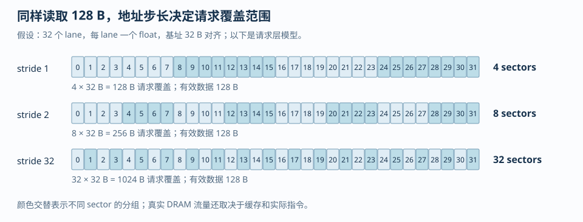
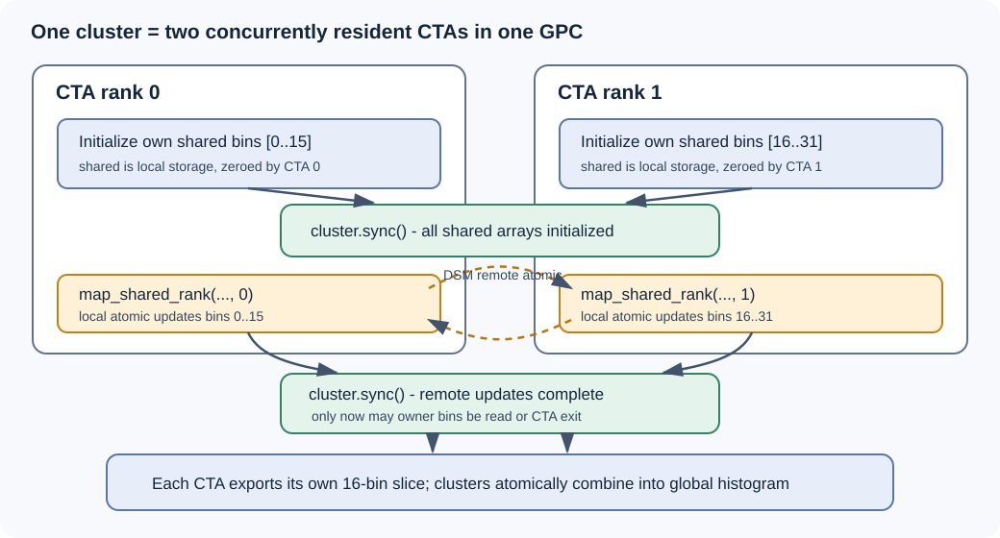

# 第 3 章：寄存器文件、地址空间与内存系统

C++ 的局部作用域描述变量在哪里可见，CUDA 地址空间描述谁能访问，编译器和硬件决定它最终如何存放。一个局部数组可能留在寄存器，也可能因动态索引或寄存器压力使用 local memory。

矩形转置把三类问题集中到一个例子里：global memory 的跨步访问、shared memory 的 bank conflict，以及尾块的协作装载。比较 naive 与带 padding 的 tiled 实现，可以逐层检查地址、同步和资源消耗。

## 1. 先把“变量在哪里”拆成五个问题

在 CUDA C++ 中，下面五个问题的答案不同。

1. 变量的**语义所有者**是谁：整个 grid、一个 block、一个 warp，还是单个 thread？
2. 变量的**逻辑地址空间**是什么：global、shared、constant、local，还是寄存器候选？
3. 编译器能否把它拆成标量、常量传播、消除或重新安排？
4. 它的值在多长的**活跃区间**内必须保留？
5. 生成的机器码最终用了多少物理寄存器、多少 local stack/frame，以及哪些 load/store？

例如：

```cpp
__global__ void one_value(const float* x, float* y) {
    int i = blockIdx.x * blockDim.x + threadIdx.x;
    float a = x[i];
    float b = a * 2.0f;
    y[i] = b + 1.0f;
}
```

`a`、`b` 的语义是每个 thread 一份，不能被另一个 thread 直接读；但这不等于它们一定各占一个物理寄存器直到 kernel 结束。若编译器把 `b` 直接融合进乘加，`a` 的活跃区间可能在计算后立刻结束。若 `a` 只被使用一次，编译器甚至可能把 load、乘法和 store 重新安排为更短的链。相反，下面的代码要求很多中间值同时存活：

```cpp
__global__ void long_live_values(const float* x, float* y, int n) {
    int i = blockIdx.x * blockDim.x + threadIdx.x;
    if (i >= n) return;

    float p0 = x[i] + 0.0f;
    float p1 = p0 * 1.1f;
    float p2 = p1 + 2.0f;
    float p3 = p2 * 1.2f;
    float p4 = p3 + 3.0f;
    y[i] = p0 + p1 + p2 + p3 + p4;
}
```

这里的 `p0` 到 `p4` 可能被编译器优化掉一部分，但从源码结构看，它们之间存在一条较长的数据依赖和一个末端汇合点，寄存器压力通常比第一段更高。工程上不能只看“声明了几个变量”，要看 `ptxas` 报告的 registers/thread、local memory，以及 SASS 中是否真的出现了 local load/store。

寄存器是线程私有的片上存储；local memory 也是线程私有的地址空间，但物理访问可能经过设备内存路径。寄存器、shared memory 和 block/warp 数量共同限制驻留量。“local”描述作用域，不代表低延迟。

## 2. 32-bit 计量：寄存器不是按源码变量数计费

> [!IMPORTANT] local 描述作用域，不描述距离
> **线程私有变量不一定放在寄存器中。** 动态索引数组、较大局部对象和寄存器溢出都可能使用 local memory；只有最后一种原因才叫 register spill。先查编译产物，再判断性能影响。

CUDA 的寄存器资源通常以 32-bit register 为计量单位。一个 `float` 或 `int` 的标量候选通常需要一个 32-bit register；`double`、64-bit pointer、`long long` 会占用多个 32-bit 单位；向量、结构体和编译器生成的临时值还可能被拆成更多标量。真正决定一个 block 能否同时驻留的是类似下面的资源账本：

$$
R_{block} \approx T_{block} \times R_{thread}
$$

它还要经过架构相关的分配粒度和每个 SM 的寄存器上限取整，因此这个式子适合做下界和趋势推导，不应拿来替代编译器报告。若 `T_block=256`、报告为 `R_thread=64`，未经分配粒度取整的直观账本是 $256\times64=16384$ 个 32-bit register。若把每线程寄存器从 64 压到 48，理论账本降为 12288，但若因此产生 local spill，实际性能可能更差。

本章新增的 register_spill_probe.cu 故意使用一个动态索引的线程私有数组。它不是“数组一定 spill”的证明，而是一个用于观察编译器选择的最小例子：

```cpp
float values[64];
int slot = (lane * 13 + step) & 63;
values[slot] = values[slot] + input;
```

当索引是编译期常量时，编译器有机会把 `values[0]`、`values[1]` 等标量化，甚至完全消除数组；当索引依赖运行时数据时，编译器需要保留“基址 + 索引”的寻址能力，往往更难把全部元素固定到独立寄存器。此时可能出现 local memory 访问，也可能因为数组很小、优化足够强而仍被寄存器化。结论必须来自 `-Xptxas=-v`、`--resource-usage` 和 PTX/SASS，而不能由数组语法直接推断。

检查命令如下。第一条生成可读的 `ptxas` 资源摘要；第二条把寄存器限制压低，用于观察 spill 的 trade-off；第三、四条分别查看 PTX 和 SASS。`-arch=sm_XX` 表示替换为实际目标设备的 Compute Capability（计算能力）版本，不应把另一台设备的寄存器数字移植为当前结论。

```powershell
nvcc -O3 -std=c++17 -lineinfo --resource-usage `
  examples/register_spill_probe.cu -o register_spill_probe.exe

nvcc -O3 -std=c++17 -lineinfo -Xptxas=-v -maxrregcount=32 `
  examples/register_spill_probe.cu -o register_spill_probe_r32.exe

nvcc -O3 -std=c++17 -ptx -arch=sm_XX `
  examples/register_spill_probe.cu -o register_spill_probe.ptx

nvcc -O3 -std=c++17 -cubin -arch=sm_XX `
  examples/register_spill_probe.cu -o register_spill_probe.cubin

cuobjdump --dump-resource-usage register_spill_probe.exe
cuobjdump --dump-ptx register_spill_probe.exe
nvdisasm --print-code --print-line-info register_spill_probe.cubin
```

“限制寄存器”不是无条件优化。CUDA Programming Guide 13.3 在 §2.3.3.3、打印页 51（PDF 页 67）说明，`--maxrregcount` 可能让更多 block 驻留，却也可能使 kernel spill 到 local memory，改变性能特征；只有在同一目标设备、同一 shape、同一数值语义下测量，才能判断增加 occupancy 是否抵消了 local traffic。

**反例：把 ptxas 的 register 数当作“每个源码变量的数量”。**

```cpp
float a = x;
float b = a + 1.0f;
float c = b * 2.0f;
```

优化编译后可能只保留一个或两个活跃值；反过来，一行表达式也可能因为 FMA 输入、地址计算、边界 predicate 和循环展开产生多个临时寄存器。应观察编译结果，不要从格式化后的源码行数倒推资源。

**带答案的追问。**

问：把 `float values[64]` 改成 `float values[8]`，是否一定能消除 spill？

答：不一定。动态索引、循环展开、其他同时活跃的 accumulator、编译目标和寄存器分配粒度都会影响结果。正确做法是对两个版本分别保存 `ptxas` 的 registers/thread 与 lmem bytes，并在 SASS 中搜索 local load/store；“数组更小”只是降低压力的假设，不是验证结论。

## 3. 活跃区间、依赖链与寄存器压力

寄存器压力的核心不是“用了多少变量”，而是同一时刻有多少值必须继续可用。下面两个写法数学上相同，但活跃区间不同：

```cpp
// 许多中间量同时存活到末尾
float a = load_a(i);
float b = load_b(i);
float c = a * b;
float d = load_d(i);
float e = c + d;
float f = load_f(i);
out[i] = e + f;
```

```cpp
// 尽快消费中间量，缩短部分活跃区间
float e = load_a(i) * load_b(i) + load_d(i);
out[i] = e + load_f(i);
```

第二段也不保证一定更快，因为编译器可能自动做同样的安排；它的教学价值在于说明 live range（活跃区间）是可优化对象。矩阵乘的 accumulator 是另一种典型：若一个 thread 同时维护 $C_{tile\_m\times tile\_n}$ 个 FP32 累加器，输出 tile 增大，寄存器需求通常随 tile 面积增长。已有 Triton MatMul 归档 solutions/triton/matmul_leetgpu.py 中 `acc = tl.zeros((BLOCK_M, BLOCK_K), dtype=tl.float32)` 是高层写法；它表达了输出累加 tile，但实际 lane 到元素的映射、寄存器分配和共享内存 staging 由 Triton 编译器决定。已有服务器脚本 solutions/triton/matmul.py 的 benchmark 注释和参数也应与 `-Xptxas=-v`、Nsight Compute 结果一起解读，不能仅凭 `BLOCK_M/BLOCK_N/BLOCK_K` 推出寄存器数。

依赖链又是另一个维度。一个长链：

```cpp
float x = a;
x = x * w0;
x = x + b0;
x = x * w1;
x = x + b1;
```

每一步都等待前一步，单线程级别的 Instruction-Level Parallelism（指令级并行，ILP）有限。若算法允许同时维护多个独立 accumulator，可以提高可调度的独立工作，但会增加寄存器压力：

```cpp
float s0 = 0.0f, s1 = 0.0f, s2 = 0.0f, s3 = 0.0f;
for (int k = lane * 4; k < K; k += 4 * warpSize) {
    if (k + 0 < K) s0 = fmaf(a[k + 0], b[k + 0], s0);
    if (k + 1 < K) s1 = fmaf(a[k + 1], b[k + 1], s1);
    if (k + 2 < K) s2 = fmaf(a[k + 2], b[k + 2], s2);
    if (k + 3 < K) s3 = fmaf(a[k + 3], b[k + 3], s3);
}
```

片段已对最后一组做逐元素边界检查，不要求 K 能被4整除。它展示的是“用更多独立累加器打断依赖链”的机制；同时，每条加载指令在lane之间的步长变成4，也可能改变访存效率。独立链增加后，registers/thread可能上升、驻留warp可能下降；是否更快仍要把指令依赖、地址映射和实际计数器一起看。

## 4. 四类地址空间和缓存：语义不同，物理路径也不同

### 4.1 Global memory

Global memory 是 grid 中所有线程可寻址的设备内存。它容量大、生命周期由分配管理决定，但延迟高；访问性能取决于地址是否合并、缓存命中、请求是否对齐，以及是否反复读取同一数据。global load 不等于每次都直达 HBM（高带宽内存，High Bandwidth Memory）：在具体架构上还可能经过 L2 和 L1/data cache。也不能因为某一次命中 L2 就把算法描述成“使用了 shared memory”。

### 4.2 Shared memory

Shared memory 是 block 作用域的片上存储。它适合让同一 block 的线程交换数据和复用 tile，但它有 32 个 bank 的访问规则，且需要正确的 block-level synchronization。CUDA Programming Guide 13.3 的转置示例（打印页 60–67，对应 PDF 页 76–83）正是先用 shared staging 修复 global 的写入跨步，再用 padding 修复 shared 的列访问冲突。

### 4.3 Constant memory

Constant memory 是设备端只读地址空间，适合小的、稳定的常量数据；同一 warp 读取同一个 constant address 时有广播语义。若 lane 们读取不同地址，访问行为和收益会改变，不能把“constant”理解为任意只读张量都更快。较大的只读权重通常仍要根据访问复用、缓存和布局选择 global/texture 等路径。

### 4.4 Local memory

Local memory 的语义是每个 thread 私有，但“local”描述可见性和地址空间，不保证片上。寄存器溢出、无法标量化的局部数组、过大的线程私有对象都可能使用它。local 访问还可能经过缓存，因此需要区分两件事：它没有 shared 的 block 共享语义，也没有寄存器的低延迟保证；它是否成为瓶颈要通过 lmem 与机器码检查。

**反例：把“变量声明在 kernel 内”解释成“它在 shared memory”。**

```cpp
__global__ void wrong_memory_model(float* out) {
    float x = 1.0f;              // 每个 thread 的寄存器候选
    __shared__ float tile[32];   // block 共享，显式 shared
    tile[threadIdx.x] = x;
    __syncthreads();
    out[threadIdx.x] = tile[(threadIdx.x + 1) & 31];
}
```

`x` 和 `tile` 的作用域都写在 kernel 内，但语义完全不同；前者不能被邻居 thread 直接读取，后者必须用 barrier 保护跨 thread 的生产—消费关系。

**带答案的追问。**

问：global memory 访问命中 L1/L2 后，能否称为“寄存器读”或“shared memory 读”？

答：不能。缓存只改变某次 global 请求的物理服务路径和延迟，变量仍属于 global address space；寄存器和 shared 是不同的编程语义、容量账本和同步规则。

## 5. Global memory 的 32B sector 手算

本节只做一个可迁移的请求计数模型。设一个 warp 有 32 个 lane，每个 lane 读取一个 4B `float`，起始地址 `base` 32B 对齐，lane `l` 的字节地址为：

$$
addr(l)=base+4\times stride\times l
$$

把地址映射到 32B sector：

$$
sector(l)=\left\lfloor\frac{addr(l)}{32}\right\rfloor
$$

真正的 sector 数是这些 sector 编号的去重数量。这个模型比“lane 连续所以一定合并”准确，因为合并关注请求覆盖了哪些 sector，而不要求源码中的 lane 顺序看起来连续。

### stride = 1

<figure class="diagram-frame">

<figcaption>图：按同一条warp加载指令计算sector覆盖。颜色表示分组，数字是lane编号，不是物理内存通道编号。</figcaption>
</figure>

地址是 `0, 4, 8, ..., 124`，覆盖 sector 0、1、2、3，共 4 个 32B sector。每个 sector 有 8 个 float，32 个 lane 正好使用 128B。若 `base` 不是 32B 对齐，可能跨到第 4 个 sector，实际请求会增加；对齐是前提，不是装饰。

### stride = 2

地址是 `0, 8, 16, ..., 248`，覆盖 sector 0 到 7，共 8 个 sector。32 个 lane 使用 128B 的元素跨度，但中间有未使用的 float，sector 请求数量翻倍。它仍可能是可接受的访问模式，也可能因后续复用而被缓存掩盖；不能只以“不是 stride 1”断言绝对慢。

### stride = 32

地址是 `0, 128, 256, ..., 3968`。每个地址落在不同的 sector，覆盖 32 个 sector；每个 sector 只使用一个 4B word，带宽利用率很低。这正是矩阵转置直接写出结果时常见的跨步模式。

### 连续 lane 不是必要条件

如果 32 个 lane 以任意置换访问同一组地址 `{0, 4, 8, ..., 124}`，去重后的 sector 集仍然是 `{0,1,2,3}`，请求仍可按 4 个 sector 合并。连续 lane 是最容易构造、也最常见的充分条件；“连续”不是合并访问的必要条件。反例是地址虽然在源码上由连续 lane 生成，却因为 base 跨过 32B 边界覆盖了额外 sector。

**完整算例。** 令 `base=64`、`stride=2`，第 0、1、2、3 个 lane 的地址是 64、72、80、88，sector 分别是 2、2、2、2；第 4 到 7 lane 地址 96、104、112、120，sector 是 3、3、3、3。继续到 lane 31，最后地址是 312，sector 是 9，所以总 sector 是 2 到 9，共 8 个。这里 lane 内部存在分组，但 sector 去重才是计数依据。

分析 naive GEMM 的线程映射时，要区分单线程跨归约迭代的地址与同一条 warp 指令的地址。对 `B[n*K+k]`，若同一 warp 的 k 连续，固定 n 的这次读取可以合并；单线程下一次迭代跳过 K 个元素，并不意味着这次 warp 请求不合并。

旧 tiled 实现的真实核心来自 `solutions/cuda/gemm/tiled_fp16.cu`，其合同是 `A[M,K] × B[K,N] => C[M,N]`，与 naive 的 `A[M,N] × B[N,K] => C[M,K]` 不同：

<!-- source-check: solutions/cuda/gemm/tiled_fp16.cu -->
~~~cpp {8-10,16-27,29-35,39-42}
constexpr int tileLen = 32;

__global__ void kernel(const half* A, const half* B, half* C,
                       int M, int N, int K, float alpha, float beta) {
    int m = blockIdx.x * tileLen + threadIdx.x;
    int n = blockIdx.y * tileLen + threadIdx.y;
    float sum = 0.0f;

    // 每个线程先搬运暂存
    __shared__ half As[tileLen][tileLen];
    __shared__ half Bs[tileLen][tileLen];

    // 遍历 K
    for (int t = 0; t < (K + tileLen - 1) / tileLen; ++t) {
        // 每个线程搬运自己负责的那块
        // A 矩阵按列步进
        int aK = t * tileLen + threadIdx.y;
        As[threadIdx.x][threadIdx.y] = (m < M && aK < K)
            ? A[m * K + aK] : __float2half_rn(0.0f);

        // B 矩阵按行步进
        int bK = t * tileLen + threadIdx.x;
        Bs[threadIdx.x][threadIdx.y] = (n < N && bK < K)
            ? B[bK * N + n] : __float2half_rn(0.0f);

        // 同步
        __syncthreads();

        // 计算
        for (int k = 0; k < tileLen; k++) {
            sum += __half2float(As[threadIdx.x][k]) *
                   __half2float(Bs[k][threadIdx.y]);
        }

        // 同步
        __syncthreads();
    }

    if (m < M && n < N) {
        C[m * N + n] = __float2half_rn(
            alpha * sum + beta * __half2float(C[m * N + n]));
    }
}
~~~

第一处 `__syncthreads()` 保证数据准备好再使用：所有线程把当前 A/B tile 写完，其他线程才能读取。第二处保证读完再覆盖：所有线程结束当前 tile 的读取和累加，下一轮才能覆写同一片 shared memory。

原文件采用 `32×32` 线程块，warp 内 `threadIdx.x` 从 0 到 31 变化，`threadIdx.y` 保持不变。这里 `threadIdx.x` 对应输出行 `m`，不是连续的输出列：固定循环轮次时，相邻 lane 读取 A 的地址相差 `K` 个 half，读取 B 的地址相差 `N` 个 half；最后写 C 时也相差 `N` 个 half。不能照搬 naive 版本中“x 对应连续列”的访问结论。Shared tiling 提供了 block 内的数据复用，但这份线程映射仍有跨步 global 访问，不能据此认定访存已经优化到位。

这里的 `As/Bs` 是 half，不能直接套用 `float tile[32][32]` 的 32-way bank 结论。这份 GEMM 使用 shared memory，是为了让一个 block 内的线程重复使用已经搬入的输入；transpose 使用 shared memory，则常常是为了改变读写排列，让 global 读和写都能合并。两者使用了同一种硬件资源，但解决的问题不同。

## 6. Shared memory 的 bank、广播和 `[32][33]`

在 32-bit bank mode 下，把 shared memory 看成 32 个 bank，每个 32-bit word 的 bank 编号为：

$$
bank(word\_index)=word\_index\bmod 32
$$

对 `float tile[32][32]`，C/C++ 行主序下：

$$
word\_index(tile[r][c])=r\times32+c
$$

### 跨列访问：`tile[lane][0]`

假设一个 32×32 block，warp 0 的 `threadIdx.y=0`，lane `l` 对应 `threadIdx.x=l`。若每个 lane 读取 `tile[l][0]`：

$$
bank(l)= (l\times32+0)\bmod32=0
$$

32 个 lane 访问同一 bank 的 32 个不同 word，这是典型 32-way bank conflict。它不是因为“读了列”这个抽象词，而是因为行跨度 32 个 word 恰好绕回同一个 bank。

若每个 lane 读取 `tile[0][l]`：

$$
bank(l)=l
$$

32 个 lane 分散到 32 个 bank，无冲突。

### 加一列：`tile[32][33]`

将声明改为 `float tile[32][33]`，跨列访问变为：

$$
bank(l)=(l\times33+0)\bmod32=l
$$

每个 lane 访问不同 bank。padding 没有改变逻辑矩阵的 32×32 数据，只改变了相邻逻辑行在物理 shared layout 中的步长。

### 广播不是 bank conflict

> [!IMPORTANT] 冲突由 lane 到地址的映射决定
> 列访问在行步长32时落到同一个bank；行步长33时分散到32个bank。**数组声明不是唯一依据，实际索引和访问宽度同样重要。**

若 warp 中所有 lane 读取**同一个 bank 中的同一个 word**，例如全部读取 `tile[0][0]`，这是同地址读广播，不是 32-way conflict。若多个 lane 访问同一 bank 但访问不同 word，例如 `tile[0][0]`、`tile[1][0]`，则是不同地址竞争同一 bank，不能用广播解释。

写访问要单独处理：多个 lane 同时向同一地址写入不是读广播，最终哪个 lane 的非原子写留下来没有定义保证。即便所有 lane 写入相同数值，也不能把它称为“广播写”。需要唯一 writer 或 atomic/更高层同步协议。

### 访问边界

bank 公式适合分析 32-bit word 访问。对于 64-bit、向量化或不同 bank width 的访问，一个请求可能覆盖多个 bank，必须按实际字节宽度拆分；不能把 `float4` 直接当成一个 32-bit word。对当前转置例程，tile 元素是 `float`，所以上面的手算可以直接使用。

**带答案的追问。**

问：`tile[32][32]` 的按行读取一定无冲突吗？

答：若 warp 0 的 lane 读取 `tile[0][lane]`，是无冲突；但如果线程映射或索引表达式改成 `tile[lane][0]`，同一个物理数组立刻变成 32-way conflict。bank 决定于“lane 到 word address 的映射”，不是数组声明单独决定。

## 7. 完整转置例程：先保证 barrier，再谈 padding

### 7.1 数学和布局

输入 `A` 为 `M×N` 的 row-major 矩阵，输出 `B` 为 `N×M`：

$$
B[c,r]=A[r,c],\quad 0\le r<M,\quad 0\le c<N
$$

输入地址是 `A[r*N+c]`，输出地址是 `B[c*M+r]`。当一个 warp 以 `c` 连续读取 A 时，global load 好；若直接让同一批线程写 B，`c` 可能成为输出的慢维，写入呈 stride `M`。shared tile 的作用是把读和写解耦：先协作读成连续 tile，再交换索引，从 shared 中取出转置元素并连续写回。

### 7.2 矩形尾 tile 的关键

最后一个 tile 可能只覆盖部分行或列。正确结构是：

1. 每个线程计算 `in_bounds`。
2. 所有线程都写 shared：有效线程写输入值，无效线程写 0。
3. 所有线程到达第一次 `__syncthreads()`。
4. 有效输出线程读取 shared 并写回；无效输出线程不写。

不能在这个需要共享 tile 的算法中写成下面这样：

```cpp
if (row >= M || col >= N) return;
tile[ty][tx] = input[row * N + col];
__syncthreads();
```

提前 return 本身并非在所有 kernel 中都错误。对这个转置算法，更直接的问题是输入与输出阶段的线程职责交换了：输入坐标越界的线程，可能仍有一个合法输出要写。例如一个3×5矩阵的首块中，`ty=3,tx=0` 没有合法输入行，却需要把 `tile[0][3]` 写到输出 `(3,0)`；按输入坐标提前退出会漏掉这个输出。让全部线程完成装载阶段、会合后再独立检查输出坐标，证明过程最清楚。归约例程还有另一种风险：缺席线程本应写入单位元，剩余线程却读到未初始化shared值。两种情形都应从数据依赖证明，而不是只背“提前退出必死锁”。

### 7.3 三条可比较的代码路径

`transpose_tiled.cu` 里有三个可比较的路径：

- `transpose_naive_kernel`：一个线程处理一个元素，读 A 连续，但写 B 跨步；它给出不使用 shared staging 的基线。
- `transpose_tiled_kernel<false>`：`float tile[32][32]`，global 访问模式得到修复，但读转置列时会暴露 bank conflict。
- `transpose_tiled_kernel<true>`：`float tile[32][33]`，同样的逻辑数据配合 padding，避免跨列访问的 32-way conflict。

无 padding 与有 padding 两个版本均用32×32线程块，模板参数只控制shared行步长，是隔离bank影响的对照。naive版本使用32×8线程块，因此与tiled的比较同时包含线程组织变化，不能把全部收益归到padding。例程同时计算 CPU 参考，检查 naive、unpadded 和 padded 三个输出的最大绝对误差，并用 CUDA event 计时；任何非 finite 结果或超过阈值的误差都会使程序返回失败。

## 8. 反复读取、stride 与缓存：把经验改写成可检验假设

“同一个地址反复读取可能命中缓存”与“应该把数据搬进 shared”并不矛盾，它们对应不同控制层：

- 缓存由硬件根据地址流、容量、替换和其他流量决定；命中率是结果。
- shared staging 是程序显式分配的 block 级复用空间；bank layout 和 barrier 由程序负责。
- 如果数据集小、复用距离短，global + cache 可能已经足够，shared staging 的同步和搬运成本反而占主导。
- 如果重复读取跨越很多 block、工作集超出缓存，shared tile 能把一个 block 内的复用固定下来，但不能替代良好的 global coalescing。

既有真实实验的历史对照说明：手写 tiled GEMM 并不保证在每个设备和 shape 上胜过 naive 版本；设备、shape、数据类型和计时条件必须随数值一起比较，不能跨不同合同推导出普遍加速结论。这是一个可复用的分析方向。对每个新实验，至少写出下面的假设链：

```text
硬件机制：跨步写覆盖更多 32B sector，或 shared 列读落到同一 bank
代码旋钮：tile 形状、padding、block 线程布局、是否 staging
预期计数：global sectors 下降，或 shared bank conflict 下降
测量：正确性 -> kernel time -> memory sectors/cache -> shared conflicts -> registers/lmem
```

**反例：只看到 shared memory 变快就归因于“shared 比 global 快”。**

如果 naive 版本写错了布局、触发更多 global sectors，而 tiled 版本同时改善了访问合并、缓存局部性和计算复用，那么单次加速不能证明其中只有 shared latency 的贡献。必须至少保留同样的输入输出布局、边界尺寸和计时范围，再比较无 padding 与有 padding 的版本。

## 9. 编译产物检查：从 CUDA 源码到 PTX 与 SASS

CUDA 源文件经过 `nvcc` 后至少要区分三层：

1. CUDA C++：带 `__global__`、地址空间声明和 launch 配置的源代码。
2. Parallel Thread Execution（并行线程执行，PTX）：面向虚拟 ISA（指令集架构）的中间表示，可读性较高，保留虚拟寄存器与地址空间信息。
3. SASS：面向具体计算能力的机器指令，真正反映目标设备上使用的 load/store、FMA、barrier 和寄存器编码。

对转置例程可使用：

```powershell
nvcc -O3 -std=c++17 -lineinfo --resource-usage `
  examples/transpose_tiled.cu -o transpose_tiled.exe

nvcc -O3 -std=c++17 -ptx -arch=sm_XX `
  examples/transpose_tiled.cu -o transpose_tiled.ptx

nvcc -O3 -std=c++17 -cubin -arch=sm_XX `
  examples/transpose_tiled.cu -o transpose_tiled.cubin

cuobjdump --dump-ptx transpose_tiled.exe > transpose_tiled.ptx.txt
cuobjdump --dump-sass transpose_tiled.exe > transpose_tiled.sass.txt
nvdisasm --print-code --print-line-info transpose_tiled.cubin
```

检查时不要只搜 `ld.global` 一种字符串：PTX 可能因优化、向量化、缓存修饰符而出现不同形式；SASS 中要关注 global/local/shared 的 load/store、barrier、地址计算和是否有明显 local traffic。`-lineinfo` 把机器码与源代码行建立可读映射，适合把某段 C++ 或 Triton 生成的操作与实际指令联系起来。Triton 不直接让用户控制所有 PTX/SASS 细节，但 solutions/triton/matmul_leetgpu.py 的 `tl.dot(..., input_precision='ieee')`、mask 和 tile 参数可以作为高层输入，再用编译缓存、`cuobjdump` 或 profiler 检查低层结果。

PTX 是可重新编译的虚拟指令表示，cubin 是与目标架构相关的二进制。保留 PTX 与只提供某一架构的 cubin，具有不同的兼容性边界。

## 10. 实践复盘：旧代码怎样成为新问题的证据

naive GEMM 的复盘重点是“同一条 warp 指令到底请求了哪些地址”：`A[M,N] × B[N,K] => C[M,K]` 中，固定归约 `n` 时若 lane 沿 `k` 展开，`B[n*K+k]` 是连续段；不要把单线程跨 n 的 stride 误判成 warp 不合并。tiled GEMM 的复盘重点则是生产—消费生命周期：当前 tile 由线程合作写入 shared memory，两个 barrier 分别保护写后读和读后覆写。Softmax 的边界线程同样不能在 block barrier 前随意退出；调试时要把错误地址、错误 mask、同步风险和合法但低效的 stride 分开验证。

这些材料是源码与历史记录的映射，不替代当前机器的测量。尤其是 solutions/triton/matmul_leetgpu.py 的平台归档和 solutions/triton/matmul.py 的服务器脚本拥有不同用途；阅读它们可以说明 tile、mask、accumulator 和精度口径如何进入工程流程，但不能把其中一个环境的数字套到另一个环境。

## 11. 统一地址、统一内存与映射内存：先问数据实际在哪里

一个指针值能被传到 kernel 中，不等于它指向的数据已经在 GPU 显存里。讨论“零拷贝”“统一内存”时，至少要分别回答：地址是否有效、谁能合法访问、物理页驻留在哪里、是否要迁移、访问前后如何同步。

### 11.1 地址统一，不等于权限与物理位置统一

UVA（Unified Virtual Addressing，统一虚拟寻址）让一个进程中的主机和设备分配处于统一虚拟地址空间，便于识别指针属性、确定复制方向。它没有承诺普通 CPU 指针可以在任意 GPU 上直接解引用，也没有把所有物理存储变成同一块显存。

Unified Memory（统一内存）则提供可由 CPU/GPU 使用的受管理内存。系统可能迁移页面，也可能依靠软硬件一致性让访问得到服务。具体行为受操作系统、驱动、GPU和互联影响，因此不能把“一个地址两边都能使用”简写成“不产生搬运”。

| 机制 | 解决什么问题 | 性能与正确性前提 |
|---|---|---|
| UVA | 在统一地址空间识别分配与复制方向 | 不能单凭地址形式推断访问权限与物理位置 |
| cudaMalloc 的设备分配 | 显式设备存储 | 主机不能因此直接读取设备数据；需要合法的数据访问方式 |
| 受管理内存 | 协调CPU/GPU可访问性与数据位置 | 可能发生迁移、远程访问或一致性维护；仍需同步 |
| 页锁定主机内存 | 让主机页不被换出，支持可预测的数据传输 | 占用主机内存；并不自动变成设备本地存储 |
| 映射主机内存 | 让GPU直接访问受支持的主机分配 | 访问可能经过主机—设备互联；需检查映射能力和同步 |

> [!IMPORTANT] 零拷贝不是零流量
> **没有显式复制调用，不等于没有数据移动。** 映射内存可能把成本放在每次远程访问上；统一内存可能把成本放在缺页、迁移和一致性维护上。

即使系统支持硬件一致性，也不能据此从 CPU 直接解引用任意 `cudaMalloc` 分配。受管理分配与 GPU-only 分配必须按各自的访问规则处理。

### 11.2 查询能力，而不是根据平台名称猜行为

下面的片段放在已经建立错误检查的主机程序中，查询当前设备的统一内存能力：

~~~cpp {3-8}
int concurrent = 0, pageable = 0, host_tables = 0;
int device = 0;
CUDA_CHECK(cudaGetDevice(&device));
CUDA_CHECK(cudaDeviceGetAttribute(
    &concurrent, cudaDevAttrConcurrentManagedAccess, device));
CUDA_CHECK(cudaDeviceGetAttribute(
    &pageable, cudaDevAttrPageableMemoryAccess, device));
CUDA_CHECK(cudaDeviceGetAttribute(
    &host_tables, cudaDevAttrPageableMemoryAccessUsesHostPageTables, device));
~~~

concurrent 用于区分手册所述的完整与受限统一内存支持；pageable 表示普通系统分配是否也受相应统一内存能力支持；host_tables 进一步帮助识别一致性机制。应按手册的组合条件解释这些属性，不能孤立地把某一个1理解成“所有内存操作都无需同步”。

在软件一致性系统中，访问可能以页为粒度触发迁移；在特定硬件一致性系统中，访问机制又有所不同。这正是 Windows 与 Linux、独立GPU与紧耦合平台不能只凭同一段源码预测性能的原因。

### 11.3 如何设计有意义的对照

设一份数组先由 CPU 初始化，然后在 GPU 上执行十轮计算。以下两个程序的数学工作量可能相同，但内存行为不同：

1. CPU 初始化一次，GPU连续完成十轮，最后CPU读取结果。
2. 每轮GPU计算后，CPU都扫描或修改数组，再交给GPU计算下一轮。

第二种安排可能不断改变页面访问位置，产生迁移或远程访问成本。若只计 kernel 时间，不把迁移算进去，可能得出一个与端到端耗时相反的结论。

合理对照应固定数组大小、初始化、迭代次数与访问模式，分别记录首次访问、稳态 kernel 和整体任务时间。比较显式复制、受管理分配与预取时，还要记录预取是否被计入时间范围。预取可以提前安排数据位置，但不能消除必需的传输，也不能替代消费者与生产者之间的同步。

如果工作集超出显存，统一内存的超额分配能力可能使程序继续工作，却也可能引入频繁迁移。此时“能运行”与“性能可接受”必须分开分析。先检查工作集与数据访问顺序，再考虑内存机制，通常比先换一个分配 API 更有效。

## 12. Thread Block Cluster、DSM 与 TMA multicast

线程块集群（Thread Block Cluster）把一组 CTA（Cooperative Thread Array，协作线程数组；即 CUDA thread block）作为一个协作域。Compute Capability 9.0 起，集群内 CTA 被共同调度在同一 GPC（Graphics Processing Cluster，图形处理集群）中，并可通过 Cooperative Groups 的 `cluster.sync()` 与分布式共享内存（Distributed Shared Memory，DSM）协作。DSM 是若干 CTA 各自 shared memory 的分布式地址视图：每块仍然分配自己的 shared 段，远端访问需显式映射；它不是更大的一块单体 shared，也不是 L2 cache。

Cluster 有两种容易混淆但机制不同的跨 CTA 数据路径：

| 路径 | 数据如何到达 | 典型用途 | 同步依据 |
|---|---|---|---|
| DSM | 执行 CTA 用 `map_shared_rank()` 取得目标 CTA 的 shared 地址，再执行 load/store/atomic | 小工作集、所有权分片、跨 CTA 聚合 | `cluster.sync()` 或正确配置的 cluster-scope barrier |
| TMA multicast | 一个 TMA tensor-copy 请求由硬件按 CTA mask 将 global tensor tile 搬到多个 CTA 的 shared 段 | GEMM 等相邻 CTA 重用同一输入 tile | 每个目标 CTA 的 shared mbarrier 都跟踪落在本地目标段的事务完成 |

DSM 与 TMA multicast 都会涉及 cluster shared 地址，但不能把 `map_shared_rank()` 的普通 DSM 访问叫作 multicast。multicast 是 TMA copy 指令/抽象的复制语义：从一份 global tile 产生多个 cluster-local shared 副本，并把完成信号送到对应 CTA 的 barrier。

### 12.1 两 CTA DSM histogram：初始化、远端原子与退出边界

下面程序将 32 个 histogram bin 分成两半，分别由 cluster rank 0、1 的 CTA 所有。每个 cluster 负责输入流的一个不重叠分片；处理某个元素时，线程依据 bin 计算所有者 rank，再把原子加法直接发往所有者的 shared 段。每个 cluster 最后把本地聚合结果原子累加到全局输出，因此多个 cluster 之间仍有一层 global atomic。

这里的 ownership 是存储位置的规则：`owner_rank = bin / 16`、`owner_offset = bin % 16`。输入线程不需要先把 bin 值送给所有者 CTA；它可以用 DSM 远端 atomic 更新该 CTA 的 shared array。

<figure class="diagram-frame">

<figcaption>图：第一次集群同步建立“所有 shared 已初始化且所有 CTA 已存在”的起点；第二次同步建立“没有远端 DSM 访问仍在途”的退出与读取边界。</figcaption>
</figure>

初始化阶段每个 CTA 只清零自己的 shared array。第一次 `cluster.sync()` 不能省略：它既让所有 CTA 到达同一阶段，也保证要被访问的远端 shared 已经初始化。随后任一线程都可以通过 rank 映射远端 shared 地址；多个输入可以命中同一 bin，故更新使用 `atomicAdd`。

第二次 `cluster.sync()` 保护的是远端 shared 的生命周期。CTA 0 不能因为自己的输入分片处理完，就先读出或退出；CTA 1 可能仍在向 CTA 0 的 bins 发 DSM atomic。普通 `__syncthreads()` 只覆盖一个 CTA，无法证明集群内其他 CTA 的访问已结束。若用生产—消费专用 barrier 替代集群同步，必须以 cluster scope 建立等价的初始化、可见性和完成关系。

核函数本体与独立 `.cu` 文件保持逐字同步：

<!-- source-check: examples/cluster_dsm_histogram.cu -->
~~~cpp
__global__ void cluster_histogram(const int* input, std::size_t n,
                                  unsigned int* histogram) {
    extern __shared__ unsigned int local_bins[];
    cg::cluster_group cluster = cg::this_cluster();
    const unsigned int block_rank = cluster.block_rank();

    // Shared memory belongs to this CTA. Each CTA initializes its own 16 bins.
    for (int i = threadIdx.x; i < kBinsPerBlock; i += blockDim.x) {
        local_bins[i] = 0;
    }

    // All cluster CTAs must exist and finish initialization before any remote
    // shared-memory address is formed or accessed.
    cluster.sync();

    const std::size_t cluster_rank = blockIdx.x / kClusterBlocks;
    const std::size_t cluster_count = gridDim.x / kClusterBlocks;
    const std::size_t first = cluster_rank * kClusterBlocks * blockDim.x +
                              block_rank * blockDim.x + threadIdx.x;
    const std::size_t stride = cluster_count * kClusterBlocks * blockDim.x;

    for (std::size_t i = first; i < n; i += stride) {
        const int bin = input[i];  // Host input is generated in [0, kBins).
        const unsigned int owner_rank = bin / kBinsPerBlock;
        const unsigned int owner_offset = bin % kBinsPerBlock;
        unsigned int* owner_bins =
            cluster.map_shared_rank(local_bins, owner_rank);
        atomicAdd(owner_bins + owner_offset, 1U);
    }

    // Do not read/retire local shared memory while a peer CTA may still update
    // it through DSM. This is a cluster-wide lifetime fence, not a CTA-local
    // __syncthreads().
    cluster.sync();

    // Every CTA exports only the bins physically owned by its own shared array.
    // Different clusters may export the same output bins, hence global atomics.
    for (int i = threadIdx.x; i < kBinsPerBlock; i += blockDim.x) {
        atomicAdd(histogram + block_rank * kBinsPerBlock + i, local_bins[i]);
    }
}
~~~

`cluster.map_shared_rank(local_bins, owner_rank)` 使用的是本 CTA shared 指针作为段内偏移的基准，再将它映射到目标 cluster rank。结果地址仍指向 shared memory，而非 global/L2。`cluster.sync()` 在所有 cluster 线程参与时建立阶段边界；不能让某个 CTA 因 `n` 尾部无数据而提前 return。尾部用循环条件处理，而不是在 barrier 前退出。

主机端以 `cudaLaunchKernelEx` 在运行时指定 `clusterDim={2,1,1}`。cluster 维度必须整除相应 grid 维度；因此 grid 中的 block 数向上取整到 2 的倍数，尾 CTA 即使没有输入也仍参与两个集群同步。动态 shared memory 的字节数是**每 CTA** 的 16 个 `unsigned int`，不是两 CTA 总量。occupancy API 先验证当前 launch 配置下至少可容纳两个 CTA 的 cluster。

<!-- source-check: examples/cluster_dsm_histogram.cu -->
~~~cpp
    const std::size_t blocks_needed = (n + kThreads - 1) / kThreads;
    const std::size_t grid_blocks =
        ((blocks_needed + kClusterBlocks - 1) / kClusterBlocks) *
        kClusterBlocks;

    cudaLaunchAttribute cluster_attribute{};
    cluster_attribute.id = cudaLaunchAttributeClusterDimension;
    cluster_attribute.val.clusterDim.x = kClusterBlocks;
    cluster_attribute.val.clusterDim.y = 1;
    cluster_attribute.val.clusterDim.z = 1;

    cudaLaunchConfig_t config{};
    config.gridDim = dim3(static_cast<unsigned int>(grid_blocks), 1, 1);
    config.blockDim = dim3(kThreads, 1, 1);
    config.dynamicSmemBytes = kBinsPerBlock * sizeof(unsigned int);
    config.attrs = &cluster_attribute;
    config.numAttrs = 1;

    int max_cluster_size = 0;
    const cudaError_t cluster_query = cudaOccupancyMaxPotentialClusterSize(
        &max_cluster_size, cluster_histogram, &config);
    if (cluster_query == cudaErrorNotSupported) {
        std::fprintf(stderr,
                     "SKIP: runtime does not support cluster occupancy query\n");
        *unsupported = true;
        return false;
    }
    if (!report_cuda(cluster_query, "cudaOccupancyMaxPotentialClusterSize",
                     __LINE__)) {
        return false;
    }
    if (max_cluster_size < kClusterBlocks) {
        std::fprintf(stderr,
                     "SKIP: device/runtime supports maximum cluster size %d; "
                     "this example requires %d\n",
                     max_cluster_size, kClusterBlocks);
        *unsupported = true;
        return false;
    }

    const cudaError_t launch_status = cudaLaunchKernelEx(
        &config, cluster_histogram, device_input.data, n,
        device_histogram.data);
    if (launch_status == cudaErrorNotSupported) {
        std::fprintf(stderr,
                     "SKIP: runtime reports thread-block cluster launch is "
                     "not supported\n");
        *unsupported = true;
        return false;
    }
    if (!report_cuda(launch_status, "cudaLaunchKernelEx", __LINE__)) {
        return false;
    }
    CUDA_TRY(cudaDeviceSynchronize());

    std::vector<unsigned int> actual(kBins);
    CUDA_TRY(cudaMemcpy(actual.data(), device_histogram.data,
                        kBins * sizeof(unsigned int),
                        cudaMemcpyDeviceToHost));
    if (actual != reference) {
        std::fprintf(stderr, "FAIL n=%zu: DSM histogram differs from CPU reference\n",
                     n);
        for (int bin = 0; bin < kBins; ++bin) {
            if (actual[bin] != reference[bin]) {
                std::fprintf(stderr, "  bin %d: GPU=%u CPU=%u\n", bin,
                             actual[bin], reference[bin]);
            }
        }
        return false;
    }
~~~

CPU ownership model 会断言每个测试索引恰好由一个 cluster/CTA 分片处理，检查每次 DSM 更新的目标 rank/offset，确认远端更新实际发生，并将分片 histogram 与 CPU `Counter` 对照。它可以发现分片重复、漏算、rank/offset 混淆，以及测试数据没有覆盖远端路径等问题；不能替代 GPU racecheck 或 Cluster 实际运行证据。

<!-- source-check: examples/cluster_dsm_ownership_check.py -->
~~~python
#!/usr/bin/env python3
"""CPU ownership model for the two-CTA DSM histogram example."""

from collections import Counter

CLUSTER_BLOCKS = 2
THREADS = 128
BINS = 32
BINS_PER_BLOCK = BINS // CLUSTER_BLOCKS


def generated_input(n):
    return [(i * 17 + (i // 7) * 3 + 1) % BINS for i in range(n)]


def emulate_cluster_ownership(values):
    n = len(values)
    blocks_needed = (n + THREADS - 1) // THREADS
    grid_blocks = ((blocks_needed + CLUSTER_BLOCKS - 1) // CLUSTER_BLOCKS) * CLUSTER_BLOCKS
    cluster_count = grid_blocks // CLUSTER_BLOCKS
    stride = cluster_count * CLUSTER_BLOCKS * THREADS

    # One private shared-memory array per CTA in each cluster.
    cluster_bins = [[0] * BINS for _ in range(cluster_count)]
    visits = [0] * n
    remote_updates = 0

    for cluster_rank in range(cluster_count):
        for block_rank in range(CLUSTER_BLOCKS):
            first = (cluster_rank * CLUSTER_BLOCKS * THREADS
                     + block_rank * THREADS)
            for lane in range(THREADS):
                for index in range(first + lane, n, stride):
                    visits[index] += 1
                    bin_id = values[index]
                    owner_rank = bin_id // BINS_PER_BLOCK
                    owner_offset = bin_id % BINS_PER_BLOCK
                    assert 0 <= owner_rank < CLUSTER_BLOCKS
                    assert 0 <= owner_offset < BINS_PER_BLOCK
                    assert owner_rank * BINS_PER_BLOCK + owner_offset == bin_id
                    if owner_rank != block_rank:
                        remote_updates += 1
                    cluster_bins[cluster_rank][bin_id] += 1

    assert visits == [1] * n, "each input element must have exactly one CTA owner"
    if n >= 127:
        assert remote_updates > 0, "test data must exercise cross-CTA DSM updates"

    actual = [sum(partial[bin_id] for partial in cluster_bins)
              for bin_id in range(BINS)]
    expected = [Counter(values)[bin_id] for bin_id in range(BINS)]
    assert actual == expected, (actual, expected)
    assert sum(actual) == n
    return grid_blocks, cluster_count, remote_updates


def main():
    # Includes a one-element minimum, CTA/cluster boundaries, and tails.
    for n in (1, 127, 128, 129, 255, 256, 257, 4099):
        blocks, clusters, remote_updates = emulate_cluster_ownership(generated_input(n))
        print(f"PASS n={n} gridBlocks={blocks} clusters={clusters} "
              f"remoteDSMUpdates={remote_updates}")


if __name__ == "__main__":
    main()
~~~

Cluster 是调度与同步域，也受资源分配约束。CUDA Programming Guide 将 8 CTA 列为 portable cluster size；更大 cluster 以及小型 GPU/MIG 可承载的上限依硬件而异，应查询 `cudaOccupancyMaxPotentialClusterSize`，不能把单个 block 的 shared/register 账本简单乘以 cluster 大小，就假定 launch 一定成功。此例只需要两个 CTA。`cudaLaunchKernelEx` 的 `clusterDim.x` 必须整除 `gridDim.x`；grid 仍按 CTA 数表示，不会变成 cluster 数。`cluster.sync()` 是 cluster 范围的 collective，所有相关 CTA 线程都必须到达同一个同步点。

主机程序在 CUDA 初始化前处理 `--help` 和参数解析。`n` 限定为 1..16,777,216，避免负数经 `strtoull` 转成巨大无符号数、整数溢出或造成不合理的 host/device 分配。没有设备、计算能力低于 9.0、cluster occupancy API 返回 `cudaErrorNotSupported`、最大可用 cluster 小于 2，或 launch 返回 `cudaErrorNotSupported` 时，程序以 77 表示“当前环境不支持，跳过”；其他 CUDA/runtime/correctness 错误返回非零失败码，不能当作 skip。

### 12.2 TMA multicast：硬件复制语义、mask 与 barrier 记账

TMA（Tensor Memory Accelerator，张量内存加速器）multicast 不是多个 CTA 各自重复发出普通 global load，也不是把源 CTA 的 shared 指针传给远端 CTA。这里发出的是带 `.multicast::cluster` qualifier 的 tensor-copy：`ctaMask` 指定同一 cluster 中哪些 CTA 接收 tile；数据会写入每个目标 CTA 中与 `dstMem` 相同的 shared 相对偏移，完成信号也会送到相同相对偏移的 mbarrier。因此，每个目标 CTA 都得到一份可由本 CTA 消费的 shared tile。

下面的 PTX 指令展示 TMA 如何将 tensor tile 从 global multicast 到 cluster shared。`tensorMap` 必须由 host 端通过 `cuTensorMapEncodeTiled` 建立；`coords` 是 tensor 坐标；`smem_dst` 是各目标 CTA 内相同偏移的 shared 目标；`tma_bar` 是各目标 CTA 内相同偏移、已初始化且已登记本次传输 byte count 的 mbarrier。这是 TMA copy engine 的 multicast，不是上一节 DSM 的 `map_shared_rank()`。

<!-- source-check: examples/tma_multicast_ptx.inc -->
~~~ptx
// PTX ISA tensor-copy multicast instruction; operands are illustrative.
cp.async.bulk.tensor.2d.shared::cluster.global.mbarrier::complete_tx::bytes.multicast::cluster
    [smem_dst], [tensor_map, {tile_x, tile_y}], [tma_bar], cta_mask;
~~~

对两 CTA 示例，`cta_mask = 0b11` 表示 cluster rank 0、1 都是目标；实际 GEMM 会根据 tile 复用关系生成不同 mask，而非固定向整个 cluster 广播。PTX mask 为 16 bit，其中 bit `r` 对应 `%cluster_ctarank == r`；不能把全 grid 的 `blockIdx.x` 当成 rank，也不能让 mask 指向未启动或不存在的 cluster rank。每个 TMA request 的 mask 都必须符合该 request 的 producer/consumer 分区。

每个目标 CTA 都要先在自己的 shared memory 中建立 mbarrier 和目标 buffer，并在 cluster barrier 之后进入 TMA mainloop。TMA 由每个 producer CTA 选出的单个线程发出，避免同一 block 的所有线程重复发送同一 request。对于每个 local mbarrier phase，该 CTA 的 elected producer 必须在发出对应 TMA request 前登记预期 transaction bytes；计数是**将写入该 CTA 本地目标 shared tile 的所有请求字节总量**，不能因为 cluster 中有多个 CTA 就任意乘倍数。TMA 完成时，multicast completion signal 会更新 mask 中每个 CTA 的本地 mbarrier；各 CTA 分别等待自己的 barrier phase，完成后才能读取 tile。复用 stage 还必须等待后续矩阵读者结束，不能只等 TMA。如果一个本地 tile 由 A、B 两个 request 填充，该 phase 的 expected bytes 必须覆盖两者；如果多个独立 producer 都向同一 barrier phase 贡献，则 arrival 数和 transaction 数必须按真实的 producer/transaction 拓扑设置，否则可能过早通过或永久等待。

下面展示 NVIDIA CUTLASS v4.6.3 Blackwell CuTe 教程中的关键控制流。每个 CTA 由单个线程初始化自己的 barrier，随后执行 cluster-wide sync，使所有本地 barrier 对集群可见。之后，各 CTA 的 elected producer 为本地 phase 登记 A、B tile 的目标字节总数，再按 mask 发出两个 TMA multicast；每个 CTA 等待自己的 barrier 后才消费 tile。`create_tma_multicast_mask` 根据 cluster layout 和 CTA-in-cluster 坐标生成 mask，避免手写 mask 与 tile 所有权脱节。

<!-- source-check: examples/cutlass_tma_multicast_core.inc -->
~~~cpp
uint16_t tma_mcast_mask_a = create_tma_multicast_mask<2>(cluster_layout_vmnk, cta_in_cluster_coord_vmnk);
uint16_t tma_mcast_mask_b = create_tma_multicast_mask<1>(cluster_layout_vmnk, cta_in_cluster_coord_vmnk);
~~~

每个 CTA 的本地 barrier 都必须初始化；每个 CTA 的 elected producer 为本地 phase 登记实际写入该 CTA shared tile 的总字节数。下面摘录展示 barrier 初始化、A/B multicast request 记账及本地完成等待。

<!-- source-check: examples/cutlass_tma_multicast_core.inc -->
~~~cpp
int num_mcast_participants = size<1>(cluster_layout_vmnk) + size<2>(cluster_layout_vmnk) - 1;
cute::initialize_barrier(shared_storage.mma_barrier, /* num_ctas */ num_mcast_participants);
cute::initialize_barrier(shared_storage.tma_barrier, /* num_threads */ 1);
~~~

<!-- source-check: examples/cutlass_tma_multicast_core.inc -->
~~~cpp
cute::set_barrier_transaction_bytes(shared_storage.tma_barrier, tma_transaction_bytes);
copy(tma_atom_A.with(shared_storage.tma_barrier, tma_mcast_mask_a), tAgA(_,k_tile), tAsA);
copy(tma_atom_B.with(shared_storage.tma_barrier, tma_mcast_mask_b), tBgB(_,k_tile), tBsB);
cute::wait_barrier(shared_storage.tma_barrier, tma_barrier_phase_bit);
~~~

TMA barrier 和 MMA barrier 解决的是两个不同的完成条件，不能用“数据已经到达 shared”推断“shared 可以复用”。TMA barrier 证明 global→shared 复制已经写完；之后 `tcgen05.mma` 仍会异步读取 A/B tile。只有 MMA 完成 barrier 到达后，保存这些 tile 的 shared stage 才能安全覆写。CUTLASS 4.6.3 示例的 `mma_barrier` arrival count 为 `size<1>(cluster_layout_vmnk) + size<2>(cluster_layout_vmnk) - 1`：它表示该 layout 中会读取本 CTA operand tile 的相关 CTA 数，当前 CTA 在两个共享方向的交集中只计一次。此公式依赖示例的 cluster layout，不是所有 cluster GEMM 的通用常数。

`umma_arrive_multicast` 把异步 MMA 的完成 arrival 通知到持有对应 shared tile 的 CTA；各 CTA 等待自己的 MMA barrier phase。只等 TMA barrier 会允许 producer 在远端 MMA 尚未读完 shared operand 时覆写该 stage。

<!-- source-check: examples/cutlass_tma_multicast_core.inc -->
~~~cpp
cutlass::arch::umma_arrive_multicast(&shared_storage.mma_barrier, mma_mcast_mask_c);
cute::wait_barrier(shared_storage.mma_barrier, mma_barrier_phase_bit);
mma_barrier_phase_bit ^= 1;
~~~

对应的 shared layout 和 descriptor 必须在每个目标 CTA 上兼容：同一 mask 覆盖的 CTA 应为 tile 分配相同的 shared 相对偏移和足够容量；`dstMem` 与 mbarrier 的相对地址必须能在所有目标 CTA 中指向预期对象。使用 tensor-map 多维 TMA 时，descriptor 本身按 64B 对齐；global base 至少按 16B 对齐、global strides 为 16B 的倍数，shared 目标至少按 128B 对齐，barrier 至少按 8B 对齐，传输大小为 16B 的倍数。使用 swizzle 时还必须满足对应的 global/shared 对齐及 inner-dimension 限制。例如 128B swizzle 的 global tile 需按 128B 对齐，shared buffer 的排列周期为 1024B，应按该周期对齐，不能沿用 no-swizzle 的假设。CUTLASS 示例通过 `alignas(128)` 的 shared operand 区域和 descriptor/layout 构造共同管理这些条件。

multicast 的预期收益是避免相邻 CTA 对同一 global tile 分别发起加载，减少重复搬运以及 L2/显存路径压力；它不保证端到端一定更快。比较性能时，需要确认 mask 中实际共享的 tile、每 CTA 的 shared footprint、cluster occupancy、barrier stall、TMA issue 开销和 L2/DRAM bytes。multicast 不会把数据永久写进 L2，也不会让多个 CTA 共用同一个 shared 实体地址。

### 12.3 官方可运行案例：CUTLASS 4.6.3 Blackwell TMA multicast GEMM

可以在具备 Blackwell SM100 支持的主机上，用固定 release 运行完整官方示例。该示例同时使用 TMA multicast 和 Blackwell `tcgen05.mma`，不是单独的 DSM 测试。CUTLASS 官方 CMake 将 `03_mma_tma_multicast_sm100.cu` 注册为 `cute_tutorial_03_mma_tma_multicast_sm100`，且只在 `CUTLASS_NVCC_ARCHS` 包含 `100a` 时创建该 target。此示例要求支持 SM100a 的 NVIDIA GPU、兼容的 CUDA Toolkit/NVCC、CMake、Git 和 CUTLASS 4.6.3；不能把在其他 GPU 上编译成功当作 kernel 已执行。

在 Linux 测试机上执行：

```bash
git clone --depth 1 --branch v4.6.3 https://github.com/NVIDIA/cutlass.git /tmp/cutlass-v4.6.3
cmake -S /tmp/cutlass-v4.6.3 -B /tmp/cutlass-v4.6.3/build \
  -DCUTLASS_NVCC_ARCHS=100a
cmake --build /tmp/cutlass-v4.6.3/build \
  --target cute_tutorial_03_mma_tma_multicast_sm100 --parallel
/tmp/cutlass-v4.6.3/build/examples/cute/tutorial/blackwell/cute_tutorial_03_mma_tma_multicast_sm100
```

完整实现包含 shared-memory A/B tile、tensor map descriptor、CTA cluster layout、A/B multicast mask、每阶段 TMA transaction bytes、TMA barrier phase、MMA 完成 barrier 和结果校验。正文中的关键代码展示 mask 与 barrier 的职责；固定版本的官方示例保留完整的 host descriptor、GEMM layout、kernel launch 和 correctness path。若 CMake 构建目录没有预期 binary，可运行 `find /tmp/cutlass-v4.6.3/build -name '*03_mma_tma_multicast_sm100*' -type f` 查询实际输出位置，不要直接执行 source tree 中的源文件。

上述命令固定官方 release 与构建目标；关键控制流已在本页展开，运行时仍需要完整的 CUTLASS checkout。

### 12.4 能力与生命周期边界

CUDA Programming Guide 13.3 将 Cluster 作为可选执行层级，并在 Distributed Shared Memory 一节明确要求：先保证 Cluster 中所有 CTA 都已存在；任一 CTA 退出前，必须完成所有可能访问它 shared memory 的远端操作。`cudaLaunchKernelEx` 的 runtime cluster dimension 必须整除对应的 grid 维度。portable cluster size 上限为 8 CTA；实际最大值会随 GPU、MIG 和资源配置变化，应查询 occupancy API。本文 DSM histogram 以 `sm_90` 为最低编译目标；TMA tensor map 与 TMA cluster multicast 也需要 Hopper 或更新架构及相应 Toolkit 支持。PTX ISA 的 multicast 指令要求 `sm_90+`，并针对特定架构家族优化；SM100 CUTLASS 示例则要求 `100a`。

相关接口可查 [CUDA Programming Model](https://docs.nvidia.com/cuda/cuda-programming-guide/01-introduction/programming-model.html)、[Cooperative Groups](https://docs.nvidia.com/cuda/cuda-programming-guide/04-special-topics/cooperative-groups.html) 和 [PTX 指令手册](https://docs.nvidia.com/cuda/parallel-thread-execution/)。

### 12.5 Cluster 的最小尺寸、偏好尺寸与 grid 计数

普通 `__cluster_dims__` 声明或 `cudaLaunchAttributeClusterDimension` 指定的是本次计算所需的 cluster 尺寸；grid 的对应维度必须能被 cluster 尺寸整除。支持的设备还可以给出 preferred cluster dimension：它必须是最小尺寸的整数倍，grid 也要能被该偏好尺寸整除。**偏好不是保证。** 一次执行可能采用最小或偏好尺寸，kernel 必须在两者下都正确，不能按 host 请求的偏好值直接访问不存在的 DSM 邻居。

例如最小 cluster 为 `2×1×1`、偏好为 `4×1×1`，逻辑 grid 有 16 个 block。无论实际按 2 个还是 4 个 block 组成一组，输出任务总数仍是 16 个 block；改变的是协作分组。使用 cluster-local rank、共享资源数量或 multicast mask 时，应以 kernel 内查询到的实际 cluster 组织为准。该 preferred 功能以 CC 10.0 及其支持条件为前提，不适用于所有能创建普通 cluster 的设备。

CUDA 13.3 手册还给出了 `__block_size__` 的特殊启动写法。以下两种声明都表达每 block 128 个线程、每 cluster 2 个 block，但三尖括号中第一个数的单位不同：

~~~cpp
__global__ __cluster_dims__(2, 1, 1) void explicit_cluster() {}
__global__ __block_size__((128, 1, 1), (2, 1, 1)) void blocks_as_clusters() {}

void launch_eight_clusters() {
    // Ordinary launch: 16 blocks / 2 blocks per cluster = 8 clusters.
    explicit_cluster<<<16, 128>>>();
    // __block_size__ with a cluster tuple: the first argument counts clusters.
    blocks_as_clusters<<<8>>>();
}
~~~

这是启动配置对照，不是性能例子。两者都组织 16 个 block、2048 个逻辑线程。带 cluster tuple 的 `__block_size__` 已在声明中固定 block/cluster 形状，不能再同时用 `__cluster_dims__` 重复指定 cluster。若该特殊三尖括号形式还需要动态 shared 大小或 stream，第二个参数必须写占位值 `1`，例如 `blocks_as_clusters<<<8, 1, bytes, stream>>>()`；不能把熟悉的 `128` 再填到第二个位置。这项语法依赖相应工具链支持，也不改变普通 CUDA 启动的计数规则。

## 13. Green Contexts：执行资源选择，不是显存分区

普通 CUDA context 通常让该 device 的工作共享整张 GPU 上可用的执行资源。Green Context 是一个较轻量的 execution context：主机端先从 device 资源中切出一组 SM 和/或 work-queue（WQ）配置，再为它创建 context 与 stream；排在这条 stream 上的 kernel 就只能使用该 context 提供的资源。kernel 数学、线程块形状和数据结构可以不变，变化主要发生在 host 的资源选择与 stream 创建路径。

这不是对显存地址空间、L2、HBM 带宽或 copy engine 的独占分区，也不能把 SM 集合的切分解释成硬 QoS。即使两个 Green Context 的 SM 集合互不重叠，其他共享资源仍可能竞争；CUDA 也明确不保证两个 context 的 kernel 一定并发执行或具有 forward-progress 保证。它能改善的是“工作被允许在哪组 SM/WQ 上运行”以及特定资源冲突下的可用性，不是给出固定完成时间。

Green Context 与 MIG 的边界也不同：MIG 是受支持 GPU 上的硬件实例化与隔离机制，Green Context 是单个 device 上由 CUDA 应用建立的执行资源视图。二者的资源边界、共享对象、管理方式和保证不能互换。Green Context 也不是 stream priority 的别名：priority 是调度提示，不抢占已经执行的 kernel；Green Context 是资源集合约束，两者作用层次不同。

版本语义要分清：Green Context 先通过 Driver API 提供；从 CUDA 13.1 起，Runtime API 以 `cudaExecutionContext_t` 把 primary context 与 Green Context 统一表示。本节使用 Runtime API 13.3 可用的接口。创建过程可以读成“查询 → 切分 → 描述 → provision → 定向提交”：

```cpp
int device = 0;
CUDA_CHECK(cudaSetDevice(device));

cudaDevResource all_sms{};
CUDA_CHECK(cudaDeviceGetDevResource(
    device, &all_sms, cudaDevResourceTypeSm));

// Request one homogeneous partition and keep the remainder separate.
unsigned int group_count = 1;
cudaDevResource selected[1]{};
cudaDevResource remainder{};
CUDA_CHECK(cudaDevSmResourceSplitByCount(
    selected, &group_count, &all_sms, &remainder, 0,
    all_sms.sm.minSmPartitionSize));
if (group_count != 1) {
    std::fprintf(stderr, "requested one SM partition, got %u\n", group_count);
    return 1;
}

cudaDevResourceDesc_t desc{};
CUDA_CHECK(cudaDevResourceGenerateDesc(&desc, selected, group_count));
cudaExecutionContext_t gc{};
CUDA_CHECK(cudaGreenCtxCreate(&gc, desc, device, 0));

cudaStream_t gc_stream{};
CUDA_CHECK(cudaExecutionCtxStreamCreate(
    &gc_stream, gc, cudaStreamDefault, 0));
kernel<<<grid, block, 0, gc_stream>>>(data);
CUDA_CHECK(cudaGetLastError());

CUDA_CHECK(cudaStreamSynchronize(gc_stream));
CUDA_CHECK(cudaStreamDestroy(gc_stream));
CUDA_CHECK(cudaExecutionCtxDestroy(gc));
```

`cudaDeviceGetDevResource` 返回的是 CUDA 已知的可切分资源，不要手工改写 `smCount` 等输出字段。`cudaDevSmResourceSplitByCount` 的 `group_count` 是输入/输出：它表示最多要多少个同尺寸 partition，调用后还可能因架构 granularity、SM co-scheduling alignment 而调整；partition 数、每组的实际 SM 数及 remainder 都必须检查。示例请求的 `minSmPartitionSize` 仅是设备报告的最小 partition，实际组大小可能更大。若要支持 Thread Block Cluster，切分条件还须与 `smCoscheduledAlignment`/cluster coscheduling 要求一致；只看 SM 数字而忽略 group 结构，可能令目标 cluster 无法 launch。

`cudaExecutionCtxStreamCreate` 中的 `cudaStreamDefault` 在 Green Context stream 上合法；Runtime 会按 Green Context 语义把它作为 non-blocking stream 处理。kernel 必须实际 launch 到这条 stream，传入其他 stream 或隐式 NULL stream 不会自动继承该 Green Context 的资源选择。

真实负载中的使用方式是把不同延迟/吞吐敏感工作明确送到不同 stream：例如长时间 GEMM 用较大的资源组，短小的控制或后处理 kernel 用较小组，减少它等待“所有 SM 都被长 kernel 占满”的机会。这里仍不能推导出短 kernel 会立即启动：block 资源、依赖、工作队列以及其他共享资源都可能限制执行。应测量 launch-to-start、尾延迟与吞吐，并对照 stream timeline；单次平均 kernel time 不能证明 QoS。

资源 oversubscription 是允许的配置之一：同一 SM resource 可以出现在多个 Green Context 的 descriptor 中，结果便不是独占切分。另有需要显式保留的官方例外条件：Volta 及更新架构使用 `CUDA_MPS_ACTIVE_THREAD_PERCENTAGE` 时，实际使用的 SM 数可能扩展到该 MPS client 可用的 SM 数；Compute Architecture 9.x 加载包含 CDP 的 module 后，Green Context kernel 还可能使用并共享额外 2 个 SM。出现这些功能时必须按相应版本的 Driver API reference 核查，不能拿“创建时请求了 N 个 SM”当作跨配置的硬上限。

初始化失败、resource split 不满足粒度/cluster 结构、stream 没有用正确的 execution context 创建，都会使“提交到了 Green Context”这一前提不成立。诊断时先查询 `cudaExecutionCtxGetDevResource`/`cudaStreamGetDevResource` 得到实际资源，再在 Nsight Systems 看工作在哪条 stream 上以及是否存在依赖；不要根据 context 名称推断调度位置。

下面的完整例程以 CUDA Runtime 13.3 为编译基线，先请求一个小于全卡的 SM partition，再逐项核对 execution context 与 stream 实际报告的 SM 数量，最后通过该 Green Context stream 做确定性向量变换并逐元素比较。它不测吞吐或延迟。

```bash
nvcc --version
nvcc -std=c++17 -O2 -arch=sm_86 roadmap/curriculum/gpu/03-registers-and-memory-system/examples/green_context_roundtrip.cu -o green_context_roundtrip
./green_context_roundtrip
```

不支持分区/Green Context 的设备或 driver 返回 77；请求不能形成非空子集也按 unsupported 跳过。其他初始化、launch、资源查询、数据或清理错误返回失败。`sm_86` 是 RTX 3090 构建目标，其他 GPU 应换成匹配的 `-arch=sm_XX`。

<details>
<summary>完整 CUDA C++ 程序：验证 Green Context 的 SM 定向</summary>

<!-- source-check: examples/green_context_roundtrip.cu -->

```cpp
#include <cuda_runtime.h>

#include <algorithm>
#include <cstdio>
#include <vector>

namespace {
bool check(cudaError_t status, const char *where) {
    if (status == cudaSuccess) return true;
    std::fprintf(stderr, "%s: %s\n", where, cudaGetErrorString(status));
    return false;
}

bool unsupported(cudaError_t status) {
    return status == cudaErrorNotSupported ||
           status == cudaErrorCallRequiresNewerDriver ||
           status == cudaErrorInsufficientDriver ||
           status == cudaErrorInitializationError ||
           status == cudaErrorInvalidResourceConfiguration;
}

__global__ void transform(const int *input, int *output, int count) {
    const int i = blockIdx.x * blockDim.x + threadIdx.x;
    if (i < count) output[i] = 3 * input[i] + 5;
}
}  // namespace

int main() {
    constexpr int count = 257;
    constexpr int threads = 128;
    const int blocks = (count + threads - 1) / threads;
    std::vector<int> host_input(count);
    std::vector<int> host_output(count, -777);
    for (int i = 0; i < count; ++i) host_input[i] = i;

    int result = 1;
    int device_count = 0;
    int device = 0;
    cudaExecutionContext_t green = nullptr;
    cudaStream_t stream = nullptr;
    int *device_input = nullptr;
    int *device_output = nullptr;

    auto cleanup_check = [&](cudaError_t cleanup_status, const char *where) {
        if (cleanup_status != cudaSuccess) {
            std::fprintf(stderr, "cleanup %s: %s\n", where,
                         cudaGetErrorString(cleanup_status));
            if (result == 0) result = 1;
        }
    };

    cudaError_t status = cudaGetDeviceCount(&device_count);
    if (status == cudaErrorNoDevice || unsupported(status) ||
        (status == cudaSuccess && device_count == 0)) {
        std::puts("SKIP: no CUDA device");
        result = 77;
        goto cleanup;
    }
    if (status != cudaSuccess) {
        if (unsupported(status)) {
            std::puts("SKIP: CUDA runtime/driver is unavailable");
            result = 77;
        } else {
            (void)check(status, "cudaGetDeviceCount");
        }
        goto cleanup;
    }
    status = cudaSetDevice(device);
    if (unsupported(status)) {
        std::puts("SKIP: CUDA runtime/driver is unavailable");
        result = 77;
        goto cleanup;
    }
    if (!check(status, "cudaSetDevice")) goto cleanup;

    {
        cudaDevResource all_sms{};
        status = cudaDeviceGetDevResource(
            device, &all_sms, cudaDevResourceTypeSm);
        if (unsupported(status)) {
            std::puts("SKIP: Green Context SM resources are unsupported");
            result = 77;
            goto cleanup;
        }
        if (!check(status, "cudaDeviceGetDevResource")) goto cleanup;
        if (all_sms.sm.smCount < 2 || all_sms.sm.minSmPartitionSize == 0) {
            std::puts("SKIP: device cannot form a non-empty SM partition");
            result = 77;
            goto cleanup;
        }

        unsigned int group_count = 1;
        cudaDevResource selected[1]{};
        cudaDevResource remainder{};
        const unsigned int min_count = std::max(
            all_sms.sm.minSmPartitionSize, all_sms.sm.smCount / 2);
        status = cudaDevSmResourceSplitByCount(
            selected, &group_count, &all_sms, &remainder, 0, min_count);
        if (unsupported(status)) {
            std::puts("SKIP: this device/driver cannot split the SM resource");
            result = 77;
            goto cleanup;
        }
        if (!check(status, "cudaDevSmResourceSplitByCount")) goto cleanup;
        if (group_count != 1 || selected[0].sm.smCount >= all_sms.sm.smCount) {
            std::puts("SKIP: requested non-overlapping SM subset is unavailable");
            result = 77;
            goto cleanup;
        }

        cudaDevResourceDesc_t descriptor{};
        status = cudaDevResourceGenerateDesc(&descriptor, selected, group_count);
        if (unsupported(status)) {
            std::puts("SKIP: Green Context descriptors are unsupported");
            result = 77;
            goto cleanup;
        }
        if (!check(status, "cudaDevResourceGenerateDesc")) goto cleanup;

        status = cudaGreenCtxCreate(&green, descriptor, device, 0);
        if (unsupported(status)) {
            std::puts("SKIP: Green Context creation is unsupported");
            result = 77;
            goto cleanup;
        }
        if (!check(status, "cudaGreenCtxCreate")) goto cleanup;

        // cudaStreamDefault is valid here and has non-blocking Green Context semantics.
        status = cudaExecutionCtxStreamCreate(
            &stream, green, cudaStreamDefault, 0);
        if (unsupported(status)) {
            std::puts("SKIP: Green Context streams are unsupported");
            result = 77;
            goto cleanup;
        }
        if (!check(status, "cudaExecutionCtxStreamCreate")) goto cleanup;

        cudaDevResource context_sms{};
        cudaDevResource stream_sms{};
        status = cudaExecutionCtxGetDevResource(
            green, &context_sms, cudaDevResourceTypeSm);
        if (unsupported(status)) {
            std::puts("SKIP: Green Context resource queries are unsupported");
            result = 77;
            goto cleanup;
        }
        if (!check(status, "cudaExecutionCtxGetDevResource")) goto cleanup;
        status = cudaStreamGetDevResource(
            stream, &stream_sms, cudaDevResourceTypeSm);
        if (unsupported(status)) {
            std::puts("SKIP: Green stream resource queries are unsupported");
            result = 77;
            goto cleanup;
        }
        if (!check(status, "cudaStreamGetDevResource")) goto cleanup;
        if (context_sms.sm.smCount != selected[0].sm.smCount ||
            stream_sms.sm.smCount != selected[0].sm.smCount) {
            std::fprintf(stderr, "FAIL: requested %u SMs, context has %u, stream has %u\n",
                         selected[0].sm.smCount, context_sms.sm.smCount,
                         stream_sms.sm.smCount);
            goto cleanup;
        }

        std::printf("Green Context resource target: %u / %u SMs\n",
                    stream_sms.sm.smCount, all_sms.sm.smCount);
    }

    if (!check(cudaMalloc(&device_input, count * sizeof(int)), "cudaMalloc input"))
        goto cleanup;
    if (!check(cudaMalloc(&device_output, count * sizeof(int)), "cudaMalloc output"))
        goto cleanup;
    if (!check(cudaMemcpyAsync(device_input, host_input.data(),
                              count * sizeof(int), cudaMemcpyHostToDevice, stream),
               "H2D input on Green Context stream")) goto cleanup;
    if (!check(cudaMemcpyAsync(device_output, host_output.data(),
                              count * sizeof(int), cudaMemcpyHostToDevice, stream),
               "initialize output sentinel on Green Context stream")) goto cleanup;

    transform<<<blocks, threads, 0, stream>>>(device_input, device_output, count);
    if (!check(cudaGetLastError(), "Green Context kernel launch")) goto cleanup;
    // Keep both host vectors alive until all same-stream H2D copies and the
    // following kernel have completed. Pageable sources are not promised to
    // transfer asynchronously, but stream order still defines the dependency.
    if (!check(cudaStreamSynchronize(stream), "Green Context stream synchronize"))
        goto cleanup;
    if (!check(cudaMemcpy(host_output.data(), device_output, count * sizeof(int),
                          cudaMemcpyDeviceToHost), "D2H")) goto cleanup;

    for (int i = 0; i < count; ++i) {
        const int expected = 3 * i + 5;
        if (host_output[i] != expected) {
            std::fprintf(stderr, "FAIL: index %d got %d expected %d\n",
                         i, host_output[i], expected);
            goto cleanup;
        }
    }
    result = 0;

cleanup:
    if (stream != nullptr) {
        cleanup_check(cudaStreamSynchronize(stream), "cudaStreamSynchronize");
        cleanup_check(cudaStreamDestroy(stream), "cudaStreamDestroy");
    }
    if (green != nullptr)
        cleanup_check(cudaExecutionCtxDestroy(green), "cudaExecutionCtxDestroy");
    if (device_output != nullptr) cleanup_check(cudaFree(device_output), "cudaFree output");
    if (device_input != nullptr) cleanup_check(cudaFree(device_input), "cudaFree input");
    if (result == 0)
        std::puts("PASS: Green Context resource query and output verified");
    return result;
}

```

</details>

## 14. Extended GPU Memory：GPU 可寻址的 NUMA 系统内存

Extended GPU Memory（EGM）让符合条件的 Grace–GPU/NVLink-C2C 系统把 CPU NUMA node 上的 pinned system memory 纳入 GPU 可访问地址空间；在多 GPU 或 fabric 系统中，还可按支持的拓扑经 NVLink/NVSwitch 访问其他 GPU 与 host memory。它扩展的是 GPU 可读写的内存资源，不会把 host-attached memory 变成某张卡本地 HBM，也不改变远近 NUMA node 的访问成本。若访问是随机而非复用型，较大容量可能换来更高的延迟或 TLB 压力。

EGM 的首要条件是硬件与系统拓扑：普通 PCIe GPU 接普通 x86 主机，并不会仅因启用了 Unified Addressing 或 `cudaMallocManaged` 就变成 EGM。应先按 CUDA Driver API 查询 device 对应的 host NUMA node；该 NUMA ID 是操作系统标识，不是 CUDA device ordinal。通过 `cgroups` 把 GPU device 隐藏可能阻断 EGM 路由；官方指南建议这种平台使用 `CUDA_VISIBLE_DEVICES` 做 CUDA device 可见性控制。

Driver VMM 路径把 NUMA host node 明确写入 allocation property。下面是地址生命周期关键调用；allocation size 和 map size 必须按查询所得 granularity 向上取整，映射后还要显式授权：

```cpp
int numa_id = -1;
CU_CHECK(cuDeviceGetAttribute(
    &numa_id, CU_DEVICE_ATTRIBUTE_HOST_NUMA_ID, device_ordinal));

CUmemAllocationProp prop{};
prop.type = CU_MEM_ALLOCATION_TYPE_PINNED;
prop.location.type = CU_MEM_LOCATION_TYPE_HOST_NUMA;
prop.location.id = numa_id;
// For multi-node fabric sharing, also request CU_MEM_HANDLE_TYPE_FABRIC.
size_t granularity = 0;
CU_CHECK(cuMemGetAllocationGranularity(
    &granularity, &prop, CU_MEM_ALLOC_GRANULARITY_MINIMUM));
const size_t map_bytes = round_up(logical_bytes, granularity);

CUmemGenericAllocationHandle backing{};
CUdeviceptr va{};
CU_CHECK(cuMemCreate(&backing, map_bytes, &prop, 0));
CU_CHECK(cuMemAddressReserve(&va, map_bytes, 0, 0, 0));
CU_CHECK(cuMemMap(va, map_bytes, 0, backing, 0));

CUmemAccessDesc rights[2]{};
rights[0].location.type = CU_MEM_LOCATION_TYPE_HOST_NUMA;
rights[0].location.id = numa_id;
rights[0].flags = CU_MEM_ACCESS_FLAGS_PROT_READWRITE;  // only if the CPU needs access
rights[1].location.type = CU_MEM_LOCATION_TYPE_DEVICE;
rights[1].location.id = device_ordinal;
rights[1].flags = CU_MEM_ACCESS_FLAGS_PROT_READWRITE;
CU_CHECK(cuMemSetAccess(va, map_bytes, rights, 2));
```

`cuMemMap` 只把 VA 连到 backing allocation；没有相应 `cuMemSetAccess` 授权，device kernel 仍不能合法读写。多个 GPU 需要分别纳入 access descriptor，或在每个进程/device 的 VA 中建立映射并对该 device 授权。清理前等待所有 GPU/CPU consumer 完成，再 unmap VA、释放 allocation handle、回收 VA reservation；进程间则还要等待其他 importer 结束。多节点 GPU fabric 另要求 `CU_MEM_HANDLE_TYPE_FABRIC`、受支持 topology 与管理员启用的 IMEX channel，不是对 POSIX/Win32 handle 换个名字就能跨节点。

Runtime stream-ordered allocator 也支持 EGM：`cudaMemPoolProps.location.type` 设为 `cudaMemLocationTypeHostNuma`、`.location.id` 设为 NUMA ID 后创建 pool；调用 `cudaMemPoolSetAccess` 为目标 GPU 加权限，再在 stream 中用 `cudaMallocFromPoolAsync(&ptr, bytes, pool, stream)` 明确从这个 pool 分配。不要把 `cudaMallocAsync` 的 stream-associated-pool 选择规则和显式 host-NUMA pool 混为一谈。Driver VMM 示例中的 `CU_MEM_LOCATION_TYPE_HOST_NUMA` descriptor 单独授权 CPU；如果 CPU 也要访问该映射，必须给对应 host NUMA location 增加 access descriptor，GPU 的 read/write 权限不会自动授予 CPU。它比每块显式 reserve/map 更适合 allocator 管理的生命周期；两种方法都要求先验证 device/pool/fabric 能力，且访问权限不是自动从 NUMA location 推导出来的。

```cpp
CUDA_CHECK(cudaSetDevice(device_ordinal));
cudaMemPoolProps egm_props{};
egm_props.allocType = cudaMemAllocationTypePinned;
egm_props.location.type = cudaMemLocationTypeHostNuma;
egm_props.location.id = numa_id;
cudaMemPool_t egm_pool{};
CUDA_CHECK(cudaMemPoolCreate(&egm_pool, &egm_props));

cudaMemAccessDesc gpu_access{};
gpu_access.location.type = cudaMemLocationTypeDevice;
gpu_access.location.id = device_ordinal;
gpu_access.flags = cudaMemAccessFlagsProtReadWrite;
CUDA_CHECK(cudaMemPoolSetAccess(egm_pool, &gpu_access, 1));
CUDA_CHECK(cudaMallocFromPoolAsync(&ptr, bytes, egm_pool, stream));
```

CUDA 13.3 文档指出 EGM 映射使用 2 MiB 页，因此很大的工作集可能增加 TLB miss。评估时把 CPU-local、GPU-local HBM、经 NVLink-C2C 的 local NUMA host memory、经 GPU fabric 的 remote memory 分开测；固定访问序列、页面/分配策略、GPU 数、互联 topology，并同时记录延迟、有效带宽和 TLB 行为。没有目标系统实测时，只能说明映射合同，不能把“可访问”写成“与 HBM 同速”。


## LeetGPU：正确性与代码归档

本章的核心例程可对应 [LeetGPU Matrix Transpose](https://leetgpu.com/challenges/matrix-transpose) 练习 global 地址、tile、barrier 和 padding；平台原始 `solve`/kernel 应单独归档。已有 solutions/triton/matmul_leetgpu.py 作为已有 MatMul 代码复盘，不要求重写该题。正确性最低限度应覆盖整除尺寸和矩形尾尺寸，并与 CPU 参考逐元素比较。

## 服务器：真实性能

Linux服务器从仓库根目录开始，先编译并检查多个边界形状，然后再运行大矩阵计时：

```bash
cd roadmap/curriculum/gpu/03-registers-and-memory-system
nvcc -O3 -std=c++17 -lineinfo --resource-usage \
  examples/transpose_tiled.cu -o /tmp/cuda-transpose
/tmp/cuda-transpose 1 1 5
/tmp/cuda-transpose 3 5 5
/tmp/cuda-transpose 32 32 5
/tmp/cuda-transpose 37 65 5
compute-sanitizer --tool memcheck --error-exitcode=1 /tmp/cuda-transpose 37 65 5
compute-sanitizer --tool racecheck --error-exitcode=1 /tmp/cuda-transpose 37 65 5
/tmp/cuda-transpose 4096 4096 100

nvcc -O3 -std=c++17 -lineinfo --resource-usage \
  examples/register_spill_probe.cu -o /tmp/cuda-register-probe
/tmp/cuda-register-probe
compute-sanitizer --tool initcheck --error-exitcode=1 /tmp/cuda-register-probe

python examples/cluster_dsm_ownership_check.py
nvcc -O3 -std=c++17 -arch=sm_90 -lineinfo --resource-usage \
  examples/cluster_dsm_histogram.cu -o /tmp/cluster-dsm-histogram
/tmp/cluster-dsm-histogram --help
/tmp/cluster-dsm-histogram 1
/tmp/cluster-dsm-histogram 127
/tmp/cluster-dsm-histogram 129
/tmp/cluster-dsm-histogram 4099
compute-sanitizer --tool memcheck --error-exitcode=1 \
  /tmp/cluster-dsm-histogram 4099
compute-sanitizer --tool racecheck --error-exitcode=1 \
  /tmp/cluster-dsm-histogram 4099
```

两种寄存器探针各有CPU参考，但数组大小与计算量不同；它们用于观察编译器的存储选择，不是一组能直接声称加速比的同工作量优化。后文或前文的PowerShell命令也以本章目录为工作目录。

服务器实验应编译 examples/transpose_tiled.cu，在同一设备、同一 `M×N`、同一数据类型、同一 warmup/iteration 规则下比较 naive、unpadded 和 padded 三条路径，记录 kernel time、有效带宽、误差、registers/thread、shared memory、local memory，以及 profiler 中的 global sectors 和 shared bank conflict；矩形尾尺寸必须与整除尺寸分开报告。

Cluster 主机程序应先检查参数：`--help` 在 CUDA device query 前直接成功；`-1`、`18446744073709551616` 和大于 16,777,216 的值应返回参数错误码 2，且不尝试分配。设备测试覆盖最小输入、CTA/cluster 边界和非整除尾块，并以 CPU histogram 作逐 bin 参考。exit 77 只表示设备或 runtime 不支持此 cluster 配置并跳过，不是正确性通过；其他 CUDA/runtime/correctness 错误均须视为失败。CUDA 程序需在目标设备由 NVCC 编译，再由支持 Cluster 的 GPU 执行；CPU ownership 检查通过不能证明 DSM GPU correctness、racecheck 或性能。

## 参考阅读

[CUDA Programming Guide 13.3](../../../../downloads/cuda-programming-guide.pdf)、[Green Contexts（CUDA Programming Guide 13.4）](https://docs.nvidia.com/cuda/cuda-programming-guide/04-special-topics/green-contexts.html)、[Extended GPU Memory（CUDA Programming Guide 13.4）](https://docs.nvidia.com/cuda/cuda-programming-guide/04-special-topics/extended-gpu-memory.html)、[Execution Context Runtime API 13.4](https://docs.nvidia.com/cuda/cuda-runtime-api/group__CUDART__EXECUTION__CONTEXT.html)。
