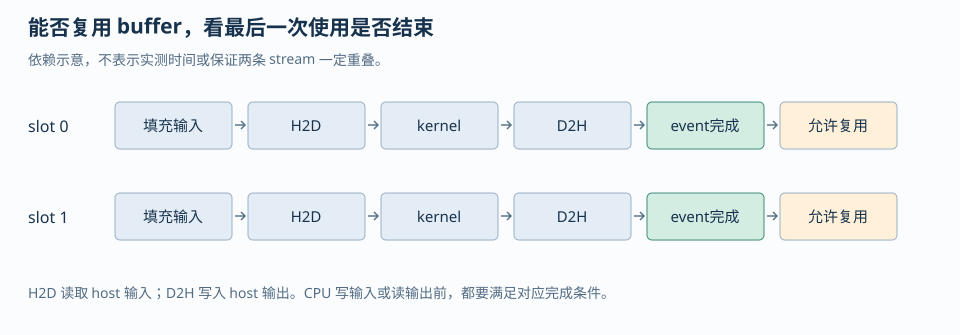
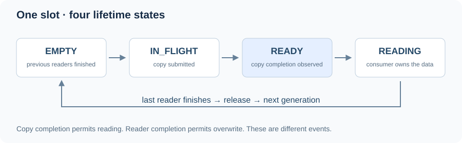
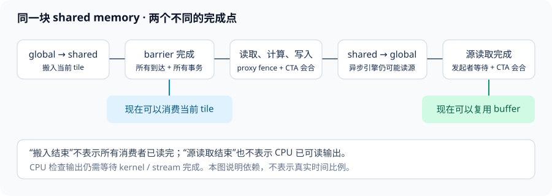
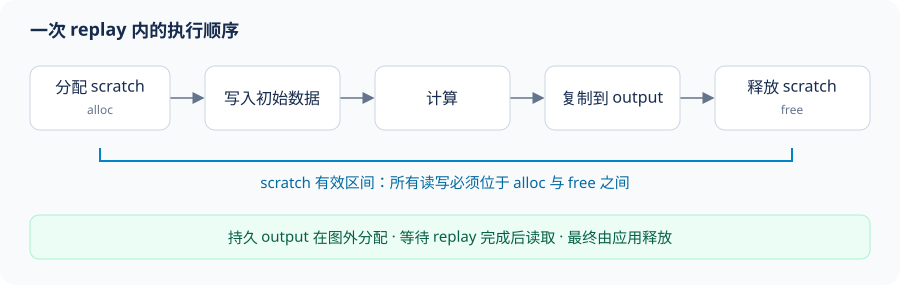

# 第四章 同步、内存可见性与异步执行

线程和异步引擎交换数据，需要明确四件事：谁必须会合，哪些写入先对谁可见，哪个更新需要原子性，以及缓冲区何时可以再次覆盖。

这些条件由不同机制保证。barrier 组织参与者，内存顺序约束读写，atomic 保护相应更新，完成事件决定资源的复用时机。

## 1. 三种同步语义要分开推导

> [!IMPORTANT] 三个问题，不能用一个“同步”代替
> **Barrier 解决参与者会合，fence 约束内存顺序，atomic 保护特定对象的并发操作。** 只有作用域、内存序和数据依赖相互匹配，协议才成立。

Barrier（屏障）是会合协议：一组约定好的线程在某个阶段都到达后，才允许继续。对完整线程块，`__syncthreads()` 同时提供线程块级会合和相应的内存可见性；对一个明确的 warp 子集，`__syncwarp(mask)` 表达的是该 mask 中线程的会合。Barrier 不负责选出唯一写者，也不把跨 kernel 的不同 grid 自动变成一个可相互等待的整体。

Fence（内存栅栏）是顺序/可见性约束：它约束发出 fence 的线程在某个 scope（作用域）内的内存操作顺序，但不等待其他线程到达某条指令。`__threadfence_block()`、`__threadfence()` 和 `__threadfence_system()` 的区别首先是可见范围，而不是“同步强度”这个模糊等级。一个消费者如果没有等待条件，仅仅看到生产者执行过 fence，仍然可能在数据尚未准备好时读取。

Atomic（原子操作）保证对一个对象的特定操作不可被同一 scope 内的并发更新拆开；它可以同时携带 memory order（内存序）和 scope。一个 release store 到 flag，再由匹配 scope 的 acquire load 观察到，才能把 flag 之前的普通数据写入发布给消费者。只把 `atomicAdd` 换成 `atomicExch` 不会自动建立所有想要的 happens-before（先行关系）；scope 不覆盖对方线程时，原子性本身也不能拯救协议。

可以用下面的四问审查任意一段并发代码：

1. 参与者集合是谁？是一个 block、一个 warp、一个 cluster、同一 device，还是 CPU 与 device？
2. 数据写入在什么时候对这个集合可见？是 barrier、release/acquire，还是 kernel/stream 的先后边界？
3. 哪个变量是协议状态，哪个变量是普通 payload？普通 payload 不应被消费者在 flag 之前读取。
4. buffer 的下一次写入发生在哪里？下一次 producer 必须先确认上一次 consumer 已完成。

### 1.1 release/acquire message passing

`examples/message_passing.cu` 用 64 个线程中的两个 warp 展示最小协议：thread 0 先写 `shared_payload`，再以 `memory_order_release` 发布 `shared_ready=1`；thread 32（第二个 warp 的 lane 0）以 `memory_order_acquire` 读取 flag，观察到 1 后才读取 payload。把生产者和消费者放在不同 warp，避免旧式同 warp 自旋把生产者 lane 一起困住；例程还明确要求具备 CUDA C++ atomics 和独立线程调度的 CC 7.0+ 目标。这个例子把 flag 放在 shared memory，并把 `cuda::thread_scope_block` 写在类型上，让 scope 与参与者集合一致。若把消费者移到另一个 block，payload 应位于两 block 都能访问的 memory，flag 应使用 `cuda::thread_scope_device`，并重新检查目标设备对相应原子类型的支持。

```cpp
cuda::atomic_ref<int, cuda::thread_scope_block> flag(shared_ready);
// producer: ordinary payload writes happen-before this release
flag.store(1, cuda::memory_order_release);

// consumer: acquire observes the release before reading payload
while (flag.load(cuda::memory_order_acquire) != 1) {
}
int result = shared_payload[0] + shared_payload[1];
```

编译和运行命令如下；命令需要 CUDA Toolkit 12.x 或更高版本中提供的 `cuda/atomic` 头文件，并要求运行时有可用 CUDA device：

```bash
cd <AIINFFRA>/roadmap/curriculum/gpu/04-synchronization-and-asynchronous-execution
nvcc -std=c++17 -O2 examples/message_passing.cu -o message_passing
./message_passing
```

预期输出的结构是 `ready=1 result=42`。`__threadfence_block()` 不能替代这段代码中的 flag 等待：即便生产者先执行了 fence，消费者也没有“何时可以读取”的条件。反例是 `payload[0]=40; __threadfence_block(); ready=1;` 配合消费者的普通 `while (ready == 0)`；这段代码同时缺少适合的原子访问、release/acquire 关系和对 scope 的声明。

### 1.2 scope、order、atomicity 的反例

下面三种改动分别破坏了不同性质，不能用同一个“加同步”回答：

```cpp
// 反例 A：fence 只约束顺序，不让消费者等待。
payload = 42;
__threadfence();
ready = 1;                 // 非原子 flag，存在 data race

// 反例 B：原子但 relaxed，不能表达 payload 的发布关系。
flag.store(1, cuda::memory_order_relaxed);

// 反例 C：scope 太窄。block 0 的 block-scope store 不能覆盖 block 1 的 load。
cuda::atomic_ref<int, cuda::thread_scope_block> flag_in_block0(flag);
cuda::atomic_ref<int, cuda::thread_scope_device> flag_in_block1(flag);
```

手册 §5.7.5 的 message-passing 例子明确把普通 `x=42` 放在 device-scope release store 前，并用同 scope 的 acquire load 保护消费者读取；§5.7.4 同时指出不满足 happens-before 的 conflicting actions 会形成 data race，结果是未定义行为。工程上应先画出参与者和 scope，再选 API，而不是先把所有操作替换成最重的 device/system fence。

## 2. block reduction：tail 不是退出条件

正确的 block reduction 必须让“逻辑上属于这个 block 的所有参与线程”遵守同一 barrier 协议。对于长度不是 block size 整数倍的输入，尾部线程没有有效元素，但这只意味着它贡献归约单位元，例如求和的 `0`、求最大值的 `-infinity`；它不意味着它可以从 kernel 中提前 return。

`examples/reduction_tail.cu` 使用 256-thread block 对 `n=100003` 的数组求和。每个线程先把有效元素或单位元写入 shared memory，之后每一轮二分归约都由所有线程执行 `__syncthreads()`，只有读写范围由 `if (tid < stride)` 缩小。线程块结果再由 host 做最后的 CPU 合并，因此代码可以把“block 内同步正确性”和“跨 block 没有隐式 barrier”分别讲清楚。

```cpp
tile[tid] = index < n ? input[index] : 0.0f;
__syncthreads();
for (int stride = blockDim.x / 2; stride > 0; stride >>= 1) {
  if (tid < stride) tile[tid] += tile[tid + stride];
  __syncthreads();
}
```

实际命令：

```bash
cd <AIINFFRA>/roadmap/curriculum/gpu/04-synchronization-and-asynchronous-execution
nvcc -std=c++17 -O2 examples/reduction_tail.cu -o reduction_tail
./reduction_tail
```

反例是把 `if (index >= n) return;` 放在第一条 `__syncthreads()` 前，或者在归约循环中让一部分线程跳过某一轮 barrier。现代 CUDA 的独立线程调度（Independent Thread Scheduling）不能把这种协议变成正确代码；warp 不再是可以依赖“恰好同时前进”的隐式 barrier。对现代 asynchronous barrier，手册 §4.9.4 的规则更细：如果参与某个同步序列的线程必须提前退出，它要显式退出该 barrier 的参与集合；剩余参与者才可以继续后续 arrive/wait。教学上应把它表述为“按协议移除逻辑参与者”，而不是笼统地说所有提前退出都必死锁。

对于 block-wide `__syncthreads()`，最稳妥的 tail 写法仍然是所有线程到达 barrier，只让 predicate 控制内存访问和算术更新。若算法确实需要可变参与集合，应改用有明确 arrival count、phase 和 drop-out 规则的 `cuda::barrier` 或 Cooperative Groups，而不是在一个全 block barrier 前随意 return。

### 2.1 CPU 参考与边界算例

上例的 CPU 参考是 `std::accumulate(host_input.begin(), host_input.end(), 0.0)`，用 double 累加已存储的 float 输入；GPU 块内仍为 float 树归约，块间结果在 host 以 double 合并。验证同时检查有限值与 `abs_error <= 1e-4 + 1e-6 * abs(reference)`，容纳不同归约顺序的舍入差异。三个有价值的边界分别是 `n=0`、`n=1` 和 `n=block_size+1`。当前例程固定使用 `n=100003` 以强制产生尾部，扩展时应保留这些小尺寸，因为单个大 shape 只能证明某一条地址路径被走过。

追问：为什么尾线程写 0 后，中间归约轮次仍要求所有线程到达 barrier，而最后一轮 `stride=1` 可以省略 barrier？答案是中间 barrier 分隔相邻 shared-memory 归约 phase，下一轮线程会读取上一轮写入的 tile；最后一轮没有下一轮 shared-memory 读取，thread 0 完成这一轮写入后即可写 block partial，其他线程不再访问该 tile，因此最终 barrier 不是数值正确性的必要条件。

## 3. warp shuffle、mask 与独立线程调度

Shuffle 在寄存器之间交换 lane 值，避免把每个中间值写入 shared memory。它不自动知道哪些 lane 的值有效，因此 mask 是算法输入的一部分。正确的前置条件是：传给 `_sync` 变体的 mask 中所有 lane 都执行该 intrinsic，并且调用者对 mask 的含义一致。本章的 19 元素教学例程让 32 个 lane 都参与并把无效元素置为 0；如果采用动态 active mask，则必须额外保证参与 lane 一致执行，并对源 lane 范围做边界处理。

`examples/warp_mask_reduce.cu` 对 19 个有效元素做一 warp reduction。这里采用最简单、最容易证明的方案：32 个 lane 都执行每一次 shuffle，无效 lane 把输入设为求和单位元 0，因此使用固定的 full mask 是正确的：

```cpp
float value = lane < active_count ? input[lane] : 0.0f;
for (int offset = 16; offset > 0; offset >>= 1) {
  value += __shfl_down_sync(0xffffffffu, value, offset);
}
```

```bash
cd <AIINFFRA>/roadmap/curriculum/gpu/04-synchronization-and-asynchronous-execution
nvcc -std=c++17 -O2 examples/warp_mask_reduce.cu -o warp_mask_reduce
./warp_mask_reduce
```

反例是写死 `__shfl_down_sync(0xffffffffu, value, offset)`，却让 inactive lane 不执行该 intrinsic；这破坏了 `_sync` intrinsic 对参与 lane 的约定。另一个反例是根据“同一个 warp 同时执行”省略 `__syncwarp(mask)`，让一个 lane 先写 shared、另一个 lane马上读 shared。独立线程调度使这种依赖偶然的执行顺序不成立。对于只通过 shuffle 交换寄存器的 reduction，正确 mask 和 `_sync` intrinsic 已经表达了必要的 warp 参与关系；对于 shared-memory producer/consumer，则还要在相应位置使用明确的 warp barrier。

追问：为什么这里不把 19-bit `active_mask` 直接传给 shuffle？答案是本例让 32 个 lane 都执行 intrinsic，但某些 shuffle offset 会把有效 lane指向 mask 外的源 lane；对这种写法，最稳妥的教学方案是 full mask 加无效值 0。若要使用 `active_mask`，必须同时保证 mask 中的所有参与 lane 都执行 intrinsic，并对 `lane + offset` 超出有效范围的源 lane做显式边界处理；不能只把 mask 从 full mask 换成 ballot 结果。

## 4. stream、event 与 host/device 异步边界

Stream（流）是有序命令队列：同一 stream 内的 kernel、copy 和 event 按入队顺序执行；不同 stream 只有在依赖、copy engine、kernel 资源和 runtime 语义允许时才可能重叠。Event（事件）是插入 stream 的完成标记，可以用于跨 stream 建立依赖，也可以用于 GPU 时间测量。一个异步 API 返回，不等于对应操作已经开始，更不等于操作已经完成。

CUDA Programming Guide §2.5.2.3 明确指出，涉及 CPU memory 的 `cudaMemcpyAsync` 只有在 host buffer 是 pinned/page-locked（页锁定）时才有机会真正异步；使用 pageable（可分页）内存时 API 仍可正确工作，但可能退化为同步行为，因而不能把“调用名带 Async”当作 overlap 证据。§2.5.6 还区分 legacy default stream 和 per-thread default stream：不显式传 stream 的 kernel 或同步 copy 会进入默认 stream，legacy default stream 会与 blocking stream 发生额外同步关系。

### 4.1 event dependency 的最小推导

假设 stream A 产生 `buffer`，stream B 消费 `buffer`，安全协议是：

```cpp
produce<<<grid, block, 0, stream_a>>>(buffer);
cudaEventRecord(produced, stream_a);
cudaStreamWaitEvent(stream_b, produced, 0);
consume<<<grid, block, 0, stream_b>>>(buffer);
```

如果删掉 `cudaStreamWaitEvent`，两 stream 可能按任意资源可用顺序运行，消费者读取的只是旧数据或半写入数据。若把两个 kernel 放在同一 stream，stream 顺序本身提供依赖，但也会放弃跨 stream 并行机会。若只在 host 侧调用 `cudaDeviceSynchronize()`，它能保护最终读取，却没有表达“B 只等 A 的第一个阶段”，因而通常会过度串行化。

`cudaEventRecord` 之后的 `cudaEventSynchronize` 是 host 等待；`cudaStreamWaitEvent` 是 device command queue 里的依赖。两者作用不同。计时也必须把 event 放在同一条可以覆盖被测工作或明确 join 依赖的 stream 中，否则可能只测到一条 stream 的局部时间。

### 4.2 批量内存拷贝：stream 顺序、源访问顺序与属性分段

当程序需要搬运很多彼此独立的小 buffer 时，逐个调用 `cudaMemcpyAsync` 会重复支付 host 侧 API/driver 提交开销。`cudaMemcpyBatchAsync` 把多个 pointer-to-pointer 拷贝作为一批提交；它表达的是“这一批在指定 stream 中的位置”，不是批内逐项顺序：批次整体排在同一 stream 前序工作之后、后序工作之前，但同批各项之间没有顺序保证。因此每个拷贝都必须能独立完成。若 B 的 source 是 A 的 destination，A 与 B 必须拆到两个有 stream/event 依赖的批次；把它们放在同一批次，不能靠数组下标暗示先后。

以 CUDA Runtime API 13.3.0 为目标时，C 接口的真实声明是：

```cpp
cudaError_t cudaMemcpyBatchAsync(
    const void **dsts, const void **srcs, const size_t *sizes,
    size_t count, cudaMemcpyAttributes *attrs, size_t *attrsIdxs,
    size_t numAttrs, cudaStream_t stream);
```

`dsts[i]`、`srcs[i]`、`sizes[i]` 共同定义第 i 项。`attrsIdxs` 不是每项各自的属性编号，而是属性分段的起点。例如 `count=5`、`attrsIdxs={0,3}` 表示 `attrs[0]` 用于拷贝 0、1、2，`attrs[1]` 用于拷贝 3、4。起点必须从 0 开始、严格递增，最后一个小于 `count`，且 `numAttrs <= count`。每项都必须落入一个有效属性段；不要把数组留在未初始化状态。

每段属性中的 `srcAccessOrder` 是对 source 生命周期和访问时序的承诺：

- `cudaMemcpySrcAccessOrderStream`：source 按 stream 顺序被访问。对于 pinned host source，API 返回后 copy 仍可能在设备/传输引擎上进行；host 不得覆盖或释放 source，直到该 stream 上的 copy 完成。示例中用 `cudaStreamSynchronize` 建立这个回收点。
- `cudaMemcpySrcAccessOrderDuringApiCall`：source 可以不按 stream 顺序读取，但对该 source 的访问必须在 API 调用返回前完成。适合调用期间仍存活的临时栈数据；它不代表整个 batch（尤其 device destination）已经完成。
- `cudaMemcpySrcAccessOrderAny`：source 可以在 API 返回后、也可以不按 stream 顺序访问。适合由 `malloc` 等 CUDA 外部方式分配、且调用期间没有其他在途访问者的 host source；调用者必须保持它不变且不释放，直到通过 stream/event 确认消费完成。它不是“生命周期任意”的许可。

下面的例程以三个 pinned H2D source 和一个调用期栈 source 示范两个连续属性段。4 个目的地址互不重叠，且没有任何一项依赖另一项。API 使用 non-blocking stream，因为该接口不接受 legacy NULL stream；示例先同步再读取结果并释放仍可能被设备读取的 pinned buffers。

<details>
<summary>完整 CUDA C++ 程序：pinned H2D 与临时 source 分段</summary>

<!-- source-check: examples/memcpy_batch_async.cu -->

```cpp
#include <cuda_runtime.h>

#include <array>
#include <cstddef>
#include <cstdio>

namespace {
constexpr std::size_t kCopies = 4;
constexpr std::size_t kPinnedCopies = 3;
constexpr std::size_t kElements = 16;
constexpr std::size_t kBytes = kElements * sizeof(int);

bool check(cudaError_t status, const char *where) {
    if (status == cudaSuccess) return true;
    std::fprintf(stderr, "%s: %s\n", where, cudaGetErrorString(status));
    return false;
}
}  // namespace

int main() {
    std::array<int *, kPinnedCopies> pinned{};
    std::array<void *, kCopies> device{};
    std::array<const void *, kCopies> srcs{};
    std::array<const void *, kCopies> dsts{};
    std::array<std::size_t, kCopies> sizes{};
    std::array<int, kElements> ephemeral{};
    cudaStream_t stream = nullptr;
    bool ok = check(cudaSetDevice(0), "cudaSetDevice");

    if (ok) ok = check(cudaStreamCreateWithFlags(
                         &stream, cudaStreamNonBlocking),
                       "cudaStreamCreateWithFlags");

    for (std::size_t i = 0; ok && i < kPinnedCopies; ++i) {
        ok = check(cudaMallocHost(reinterpret_cast<void **>(&pinned[i]), kBytes),
                   "cudaMallocHost");
        if (!ok) break;
        ok = check(cudaMalloc(&device[i], kBytes), "cudaMalloc");
        if (!ok) break;
        for (std::size_t j = 0; j < kElements; ++j)
            pinned[i][j] = static_cast<int>(100 * i + j);
        srcs[i] = pinned[i];
        dsts[i] = device[i];
        sizes[i] = kBytes;
    }

    if (ok) {
        ok = check(cudaMalloc(&device[kPinnedCopies], kBytes), "cudaMalloc");
        for (std::size_t j = 0; ok && j < kElements; ++j)
            ephemeral[j] = static_cast<int>(900 + j);
        srcs[kPinnedCopies] = ephemeral.data();
        dsts[kPinnedCopies] = device[kPinnedCopies];
        sizes[kPinnedCopies] = kBytes;
    }

    if (ok) {
        cudaMemcpyAttributes attrs[2]{};
        attrs[0].srcAccessOrder = cudaMemcpySrcAccessOrderStream;
        attrs[1].srcAccessOrder = cudaMemcpySrcAccessOrderDuringApiCall;
        std::size_t attrsIdxs[2] = {0, kPinnedCopies};

        // CUDA Runtime API 13.3.0: 8 arguments and const void** pointer arrays.
        ok = check(cudaMemcpyBatchAsync(
                       dsts.data(), srcs.data(), sizes.data(), kCopies,
                       attrs, attrsIdxs, 2, stream),
                   "cudaMemcpyBatchAsync");
    }

    if (stream != nullptr) {
        // Required before host reads device results or releases pinned sources.
        const bool syncOk = check(cudaStreamSynchronize(stream),
                                  "cudaStreamSynchronize");
        ok = ok && syncOk;
    }

    for (std::size_t i = 0; ok && i < kCopies; ++i) {
        std::array<int, kElements> actual{};
        ok = check(cudaMemcpy(actual.data(), device[i], kBytes,
                             cudaMemcpyDeviceToHost),
                   "cudaMemcpy D2H");
        for (std::size_t j = 0; ok && j < kElements; ++j) {
            const int expected = static_cast<int>(
                i < kPinnedCopies ? 100 * i + j : 900 + j);
            if (actual[j] != expected) {
                std::fprintf(stderr,
                             "mismatch at copy %zu element %zu: got %d, expected %d\n",
                             i, j, actual[j], expected);
                ok = false;
            }
        }
    }

    // Synchronization above makes these releases safe even after a failed check.
    for (void *ptr : device)
        if (ptr != nullptr) ok = check(cudaFree(ptr), "cudaFree") && ok;
    for (int *ptr : pinned)
        if (ptr != nullptr) ok = check(cudaFreeHost(ptr), "cudaFreeHost") && ok;
    if (stream != nullptr)
        ok = check(cudaStreamDestroy(stream), "cudaStreamDestroy") && ok;

    if (ok) std::puts("PASS: four independent H2D copies verified");
    return ok ? 0 : 1;
}
```

</details>

这四份数据的 CPU 期望值是 `copy 0..2: 100*i+j`、`copy 3: 900+j`，其中 `0 <= j < 16`；设备回读逐元素检查同一映射。编译和现场运行：

```bash
nvcc --version
nvcc -std=c++17 -O2 roadmap/curriculum/gpu/04-synchronization-and-asynchronous-execution/examples/memcpy_batch_async.cu -o memcpy_batch_async
./memcpy_batch_async
```

此程序明确按 CUDA Runtime API 13.3.0 官方 reference 签名编写：`dsts`、`srcs` 都是 `const void **`，总参数数为 8。CUDA 13.4 仍为 8 个参数，但指针数组的限定符已改为 `void *const *dsts` 与 `const void *const *srcs`；用其他 Toolkit 编译时，必须以安装版本的 `cuda_runtime_api.h` 与对应 Runtime API reference 为准，不要只凭 `CUDART_VERSION` 猜测旧参数布局。CUDA 12.8/12.9 的旧 Runtime API 原型带 `size_t *failIdx`；CUDA 13.0 起 NVIDIA 以 rich error reporting 改用不带该参数的新原型。因此 CUDA Programming Guide 13.3 §3.1 中仍带 `failIdx` 的示例签名已经过时，不能原样复制。旧原型的 `failIdx` 用于报告具体失败的 copy index；若错误不对应单一 copy，值为 `SIZE_MAX`，传 `nullptr` 则不记录索引。13.x 应检查调用返回码，并在必要时检查 `cudaStreamSynchronize` 的异步错误。无论版本如何，失败索引都不表示其余 batch 项已经按数组顺序完成。

三个反例足以暴露常见误用：把 `attrsIdxs={0,3}` 写成 `{0,2}` 会让第二组从第 2 项开始，和第一组重叠；把 `DuringApiCall` 栈变量移到异步函数返回后才初始化，会让 API 读取未初始化值；在 API 返回后立刻改写 `Stream`/`Any` source，会与尚未完成的传输竞争。另一个危险例子是同批先复制 header、再复制 payload，并假定 header copy 先执行；批内没有这样的顺序保证，必须改成两个 stream-ordered batch 或由 event 明确连接。

## 5. 两 stream、双 buffer、事件回收边界

<figure class="diagram-frame">

<figcaption>图：每个slot的依赖顺序。图中阶段宽度没有时间含义，是否实际重叠需要看时间线。</figcaption>
</figure>

> [!WARNING] 异步返回不等于 buffer 可以复用
> **提交操作与操作完成是不同时间点。** CPU 覆写输入、读取输出或复用同一slot，必须等待相应最后一次使用完成；事件记录的位置决定了等待能保护什么。

`examples/stream_event_pipeline.cu` 是自包含的两 stream pipeline：每个 chunk 选择 `slot = chunk % 2`，在该 slot 的 stream 上依次排入 H2D、scale kernel、D2H，并在 D2H 后记录 `completed[slot]`。当 chunk 2 要重新使用 slot 0 时，host 先等待 `completed[0]`，确认前一次 D2H 已经结束，再写入 slot 0 的 host 输入缓冲区。这个等待是双 buffer 的生命周期边界，而不是性能上的多余同步。

下面只是协议的时序示意，不是某次运行采集的 Nsight Systems 时间线，也不表示两个 copy engine 一定重叠：

```text
slot 0: H2D(0) -> scale(0) -> D2H(0) -> completed[0]
slot 1:              H2D(1) -> scale(1) -> D2H(1) -> completed[1]
slot 0:                                  wait completed[0]
                                           H2D(2) -> ...
```

编译和运行：

```bash
cd <AIINFFRA>/roadmap/curriculum/gpu/04-synchronization-and-asynchronous-execution
nvcc -std=c++17 -O2 examples/stream_event_pipeline.cu -o stream_event_pipeline
./stream_event_pipeline
./stream_event_pipeline --pageable
```

默认分配的是 pinned host buffer；`--pageable` 切换到普通 host allocation，目的是做语义和时间线对照，不是把 pageable 版本当成异步 overlap 基线。例程包含 CPU reference，并对每个 chunk 的 `3.0f` 缩放结果检查误差。工程 benchmark 还应把 warmup、event 计时、PCIe/互联状态、chunk size 和 stream 数记录在同一份实验日志中。

反例是把 `cudaEventRecord(completed[slot], stream)` 放在 D2H 之前，随后 host 看到 event 完成就复用 slot。这里必须区分两个 host 地址：H2D 从 `host_input[slot]` 读取，D2H 向 `host_output[slot]` 写入。过早改写 `host_input[slot]` 可能与仍未完成的 H2D 发生读写竞争；过早复用或校验后覆盖 `host_output[slot]` 可能与仍在进行的 D2H 写入竞争。D2H 是写 host 地址，不是读取 host 地址。例程把 event 放在 D2H 之后，并在下一次使用 slot 前等待它，同时保护两个 host slot 和 device slot。另一个反例是为了“保证正确”在每个 chunk 后执行 `cudaDeviceSynchronize()`，这样虽然把依赖变成全设备等待，但会消灭两 stream 可以获得的重叠。正确的同步应该尽量落在真正被复用的 slot 和真正的数据依赖上。

双 buffer 能否隐藏传输延迟取决于每个 stage 的时间关系：若 H2D、compute、D2H 使用相同的硬件引擎或 kernel 已占满 SM，第二条 stream 不一定并行；若 host memory pageable，copy 可能先在 host 侧完成 staging。只有 Nsight Systems 时间线或等价的 event/engine 证据能证明 overlap，不能从 API 名称或总耗时下降单独推出。

## 6. `cp.async`/LDGSTS：异步搬运不是自动重叠

CUDA 13.3 §4.11.1 将 LDGSTS（Load Global to Shared，global 到 shared 的异步加载路径）描述为 CC 8.0+ 的 element-wise global-to-shared 机制。支持的单次元素宽度是 4、8、16 字节；源和目的地址需要相应对齐，128-byte 对齐通常更利于批量访问。底层事务发起后，线程可以继续执行，但必须使用 shared-memory barrier 或 pipeline 追踪完成；异步事务完成后，若数据还要被其他线程消费，通常还需要 block-wide 的可见性/会合步骤。

高层 `cuda::memcpy_async`、Cooperative Groups `memcpy_async` 和低层 `__pipeline_memcpy_async` 都可能映射到这条路径，但生成的指令、commit/wait 批次与编译目标必须检查。使用异步 API 不保证硬件一定在当前 shape 上并发执行；手册也明确把“是否实际异步”留给硬件实现。性能假设应写成：增加一个 stage 可能覆盖 global-to-shared latency，同时增加 shared、barrier 和 register 压力；需要通过编译资源、指令和时间线验证。

### 6.1 一次拷贝完成，不等于整个 tile 可以读

低层 pipeline wait 默认等待调用线程发起的拷贝。若一个 tile 由 128 个线程共同搬入，每个线程只等自己的拷贝后就去读别人的位置，仍缺少跨线程会合。

本例故意让每个线程读取自己和相邻线程搬入的数据，迫使我们把两个条件写清：每个线程先完成自己的 wait，再由整个 block 同步，才能消费这个共享 tile。消费结束后还需一次 block 同步，才能允许任何线程覆盖旧槽位。



“wait 放在 compute 前会串行化”是一种不准确的简写。当前 tile 在读之前当然必须 ready。真正会失去重叠的是：已经有 ready 的当前 tile，却先等待未来 tile 全部到齐，才开始当前计算。等待哪个 batch，比 wait 写在代码的哪一行更重要。

### 6.2 完整环形 stage 的 kernel

下面用 1、2、3 个 stage 对照相同算法。每个 tile 有 128 个 float，输出为本 tile 中当前位置与下一位置之和；最后一个 lane 环回本 tile 的第一个位置，尾部无效位置按零处理。它是局部相邻读取例子，不是跨 tile 的全局 stencil，也不是 GEMM。

<!-- source-check: examples/cp_async_ring.cu -->
~~~cpp
template <int STAGES>
__global__ void cp_async_ring_kernel(const float* in, float* out, int count) {
    static_assert(STAGES >= 1 && STAGES <= 3, "STAGES must be in [1, 3]");
    __shared__ __align__(16) float buffer[STAGES][128];
    const int lane = threadIdx.x;
    const int total_tiles = (count + 127) / 128;
    const int initial = total_tiles < STAGES ? total_tiles : STAGES;

#if __CUDA_ARCH__ >= 800
    for (int t = 0; t < initial; ++t) {
        const int idx = t * 128 + lane;
        const bool valid = idx < count;
        const float* source = valid ? (in + idx) : in;
        __pipeline_memcpy_async(&buffer[t % STAGES][lane], source, 4, valid ? 0 : 4);
        __pipeline_commit();
    }
    for (int t = 0; t < total_tiles; ++t) {
        const int remaining = total_tiles - t;
        if (remaining < STAGES) __pipeline_wait_prior(0);
        else __pipeline_wait_prior(STAGES - 1);
        __syncthreads();

        const int idx = t * 128 + lane;
        const int next_lane = (lane + 1) % 128;
        const float self = buffer[t % STAGES][lane];
        const float next = buffer[t % STAGES][next_lane];
        if (idx < count) out[idx] = self + next;

        __syncthreads();
        const int refill = t + STAGES;
        if (refill < total_tiles) {
            const int refill_idx = refill * 128 + lane;
            const bool valid = refill_idx < count;
            const float* source = valid ? (in + refill_idx) : in;
            __pipeline_memcpy_async(&buffer[refill % STAGES][lane], source, 4, valid ? 0 : 4);
            __pipeline_commit();
        }
    }
#else
    (void)in; (void)out; (void)count;
    asm volatile("trap;");
#endif
}
~~~

每个 stage 使用 128×4=512 bytes，行首与各 float 地址满足这里 4-byte 异步拷贝的对齐要求。每个线程发起自己的拷贝；越界线程仍提交零填充操作，source 选择合法的 in 而不构造越过分配范围的指针。

先填入 min(STAGES,total_tiles) 个 batch，再开始消费。稳态保留最后 STAGES−1 个较新的 batch 在途，等待最老的可读；尾部剩余 batch 变少后用 wait_prior(0) 保守排空。这里的参数是“允许剩下多少个较新的 batch”，不是“等第几个物理槽”。

两次 syncthreads 保护不同的边：

- 第一次在各线程 wait 之后，保证 tile 的全部生产者都已就绪，再跨线程读取。
- 第二次在读取之后，保证全部消费者结束，再向同一个 slot 发起下一轮拷贝。

二者不是冗余的“双保险”。只保留其中一次，分别会留下读未完成数据或覆盖仍在读取数据的风险。尾部线程虽然不写有效输出，仍然参与两次同步，不能用 if(idx>=count) return 跳出协议。

### 6.3 batch 编号、槽位与尾部为什么容易混淆

设 STAGES=3、总共 7 个 tile。初始 batch 为 0/1/2，对应槽 0/1/2。消费 0 后提交 3 到槽 0；消费 1 后提交 4 到槽 1；消费 2 后提交 5 到槽 2；消费 3 后提交 6 到槽 0。

末尾槽中是 6/4/5，但逻辑消费顺序仍是 4/5/6。每次复用槽 0 都要经过新的完成周期，所以除了 slot=t%3，还应在推导中保留 generation=t//3。实际 API 用 batch/phase/token 表示相应顺序，不能把模运算的结果当成完整同步状态。

分支还会影响 warp 的 pipeline 序列。若 commit 在严重分歧的路径中执行，线程感知的 batch 序列可能与 warp 实际提交序列不一致，造成额外等待。这里所有线程执行同样次数的提交与等待；数据 predicate 只决定复制有效值还是零，不改变协议参与次数。需要在分歧后提交时，应按对应 API 要求先重新会合，而非默认所有 lane 自然在同一拍到达。

### 6.4 正确性程序与性能结论分开

完整程序比较 count=1、128、129、1025，以及三个 stage 配置，CPU 参考按相同 tile 内环回与尾部规则计算输出。它会打印设备名称和 Compute Capability，并拒绝把不支持的设备当成成功运行。

下面的 sm_80 只是一个编译目标示例，应替换成 Toolkit 支持且与验证设备匹配的目标；不能把编译到一个较老架构的空分支当成已执行异步路径。

~~~bash
nvcc -O3 -lineinfo -arch=sm_80 roadmap/curriculum/gpu/04-synchronization-and-asynchronous-execution/examples/cp_async_ring.cu -o cp_async_ring
./cp_async_ring
compute-sanitizer --tool memcheck ./cp_async_ring
compute-sanitizer --tool racecheck ./cp_async_ring
compute-sanitizer --tool synccheck ./cp_async_ring
~~~

这组程序没有计时，也没有证明 stage=3 更快。输出正确后，还需检查生成代码是否走 LDGSTS/cp.async；再在具有足够工作量的实验里，和同步搬运版本对齐工作量、布局、线程数及计时边界。当前小例子只有一个 CTA，主要用于理解协议，不能外推整卡吞吐。


## 7. barrier phase、early exit 与 producer-consumer

`cuda::barrier` 具有 expected arrival count、phase 和 arrival token。初始化必须在任何线程 arrive 之前完成；常见 bootstrap 是由一个线程初始化，再用一次 block sync 让所有参与者看到已初始化对象。一个 phase 中的 arrive 数达到期望值后，phase 前进；wait 使用当前或紧邻前一 phase 的 token。手册 §4.9.6 还允许 transaction count 追踪异步内存操作的完成。

因此 producer-consumer 协议不是“生产者写完后随便 signal”：需要一个 `filled` 状态表示 consumer 可以读，需要一个 `empty` 状态表示 producer 可以复用。双 buffer 为每个 slot 维护独立 phase 或 event；多个 stage 只是把状态机扩展为更多 slot，并把同步元数据和 shared 预算一起扩大。

现代 CUDA 的提前退出要精确描述。对于固定参与的 block barrier，参与者必须继续遵守每一轮 barrier；对于可变参与的 asynchronous barrier，参与者提前退出前必须按 API 规则显式 drop out，剩余参与者的 expected count 才与新集合一致。不能写成“所有提前 return 必然死锁”，也不能写成“只要同一 warp 就安全”；正确性来自参与集合和 phase 计数，而不是偶然调度。

### 7.1 phase 完成需要等哪些计数

普通 arrive/wait 关注参与线程是否到齐；追踪异步事务的 barrier 还需要对应的 transaction count 归零。以一个由 A 和 B 两块输入组成的 stage 为例，若共预期传输 X bytes，却只完成其中一块，不能因发起线程已经 arrive 就认为整个 stage ready。

token 必须对应正在等待的 phase。槽位复用后，旧 phase 的完成不代表新 phase 完成；只盯同一地址上的一个“ready bit”，可能把上一轮信号误当成本轮信号。等待、消费和释放都应带着正确的轮次推导。

参与者提前退出还要区分机制。可变参与的 barrier/pipeline 有自己的 drop/quit 协议；它们不是对任意 return 的自动修复。最容易检查的尾部实现仍是让无效数据使用单位元，而所有协议参与者按同一轮数到达同步点。

## 8. TMA、tensor map、swizzle 与 cluster/DSM

TMA（Tensor Memory Accelerator，张量内存加速器）是 CC 9.0+ 的多维 bulk asynchronous copy 路径。对于多维 global/shared tile，host 侧通常创建 tensor map，描述 shape、stride、box、swizzle 和 memory layout，再把它作为 `__grid_constant__` kernel 参数传入。global-to-shared 的完成通常由 shared-memory barrier 观察；shared-to-global 或 shared-to-distributed-shared-memory（DSM，分布式 shared memory）的完成机制和发起线程约束不同。

TMA 的核心收益是把重复的多维地址计算和搬运组织交给专门机制，核心代价是 descriptor、alignment、barrier phase、stage 生命周期和架构边界。§4.11.2 给出的版本边界是 CC 9.0+；§4.11.2.2 的多维接口通过 `cuTensorMapEncodeTiled` 创建 tensor map。swizzle 不是任意“把矩阵转一下”：它是为了让 shared-memory 访问布局和 bank/传输粒度匹配，具体 128B、64B、32B 模式有 inner dimension、repeat、shared/global alignment 条件，不能脱离 tensor map 与目标 CC 猜测收益。

Thread Block Cluster（线程块集群）把一组 CTA 作为更高层的调度与同步单位；DSM 允许 cluster 内 block 访问分布在各 block 的 shared memory。它不是任意 grid-wide barrier，也不能跨 cluster 随意读 shared memory。§4.11.2 的 TMA 表列出了 global 到 `shared::cluster` 的路径，§4.11.3 的 STAS 还展示了 register 到 cluster DSM 的小数据搬运；这些路径都依赖 CC 9.0+ 和对应编译/runtime 支持。编译时核对目标架构，运行时检查生成指令、数据依赖和实际重叠。

### 8.1 TMA 的两个方向，完成含义不同

对 global→shared 的 bulk copy，消费者关注“目的 tile 是否已经可读”。对 shared→global 的 bulk copy，生产者想复用 shared 时，首先关注“TMA 是否已经读完源 tile”。后者不等于其他设备或 host 已经观察到最终 global 写入。

| 阶段 | 必须建立的关系 | 常见误用 |
|---|---|---|
| 初始化 barrier | 初始化对所有参与者可见 | 其他线程先 arrive、后才看到 init |
| global→shared | 预期事务完成，再允许消费 | 只等线程 arrive，不追踪传输完成 |
| 计算后写 shared | generic 写入对 async proxy 可见 | 把普通 block barrier 当成全部 proxy 协议 |
| shared→global | 等源 shared 读取完成，再允许覆盖 | 提交后立即把源槽位写成下一 tile |
| kernel 外消费 global | 建立正确的 kernel/stream/event 依赖 | 把 source-read completion 当成 host 可读 |

generic proxy 可以理解为普通线程读写所处的内存访问语义域，async proxy 表示异步搬运路径。它们之间有专门的顺序要求；“线程已经 syncthreads”与“异步引擎看到了这些写入”不是可以任意互换的说法。应使用手册给出的 proxy fence 与完成机制，而不是猜一条更强的全局同步就能替代所有约束。

本地手册的 shared→global 示例先对普通 shared 写入执行相应 async proxy fence、完成 block 会合，再由发起线程提交 bulk copy 和 bulk group，等待该组读完 shared。这个 read-completion 边界用于复用源缓冲，外部结果消费仍按 kernel/stream 的同步合同处理。

### 8.2 tensor map 和 swizzle 不能与矩阵加载各自设计

二维 row-major 矩阵的地址包含 base、shape、元素大小和行 stride。tensor map 将这些信息与 box、swizzle 等描述一起交给硬件；它不是只保存一根指针。

若 TMA 用一种 swizzle 把 tile 写入 shared，而 consumer 仍按普通 row-major 解释同一地址，就可能读错数据。即便数学下标相同，物理 shared 坐标也可能不同。可先用坐标标识作为输入值，验证 producer 写入到 consumer 读出的完整映射，再做 bank 和吞吐实验。

增加 swizzle 不能保证所有加载都无 bank conflict。要检查实际指令一次访问的 lane 集合、元素大小、地址和布局要求，不能沿用 FP32 标量访问的 bank 手算直接推断 FP16 矩阵加载。

### 8.3 矩阵计算也可能尚未读完 shared

同步 WMMA 教学例子先把输入载入 fragment，再做矩阵乘。采用异步矩阵指令时，矩阵操作本身可能在发起线程继续执行后仍读取 shared。这就产生了两个不同的就绪条件：copy 完成让 consumer 能开始，矩阵读取完成才让 producer 能覆写。

TMA 的完成信号不能替代矩阵指令的完成协议。warpgroup 参与、异步 MMA 的 commit/wait、寄存器与 shared 生命周期必须按具体指令族核对；不能将同步 mma_sync 后的代码顺序原样移植过去。不同代际的新矩阵接口还可能引入不同存储对象，因此课程中的通用槽位状态机只负责说明依赖，不能替代目标接口的逐条合同。

### 8.4 与 FA1/FA2 的 Q tile 和 CTA 映射

FlashAttention（FA）实现中，CTA/program 对 Q tile、K/V tile 的映射是实现选择与算法组织的结合，不能简化成“FA1 按一行、FA2 按块”。FA1 与 FA2 都以 Q/K/V 分块和 online softmax 减少片外访存；FA2 进一步把单个 head 的多个 Q tile 分给不同 thread block，改变 block 内 warp 分工并减少 non-matmul 工作。一个 program 可以固定负责 `Q_i`，然后扫描多个 `K_j,V_j`；具体 CTA 组织还要结合 batch/head、causal mask、warp specialization、pipeline 和目标架构决定。

因此阅读 CUDA/Triton 代码时应逐项核对：`pid` 到底索引 batch/head/Q tile 的哪一维，`Q_i` 是多少行，`K_j,V_j` 是多少列，score tile 是否写入 shared，online state `m,l,U` 由哪些线程持有，barrier 保护的是哪一块 buffer。只看到“一个 program 处理一个 Q tile”，还不能推出 block 内的 warp 分工和物理缓冲区布局。

### 8.5 从一次 TMA 搬入，到安全地复用同一块 shared

用一个完整的小程序把前面的协议连起来：把 1024 个 int 从 global 搬到 shared，所有线程分别给其中的元素加一，再用 bulk copy 写入另一块 global 数组。随后用同一个 shared buffer 处理下一 tile。输入输出不重叠；一个 CTA 有 128 个线程，每个线程处理八个元素。

这不是追求吞吐的实现，而是把两种完成机制放在一段可检查的代码中。第一次等待回答“数据是否已经搬入”；第二次等待回答“异步引擎是否已经读完 shared”。漏掉第二次等待，下一 tile 就可能覆盖尚未被写回引擎读出的内容。



barrier 的到达计数和事务计数要分别计算。假设当前阶段有 128 个线程需要到达，搬入量为 4096 字节。硬件必须观察到全部线程到达，同时搬运事务完成，才可以完成这一阶段。如果线程先到齐，仍要等数据；如果数据先完成，仍要等参与者。

这里调用绑定 barrier 的 cuda::memcpy_async，它会自动登记本次异步搬运，**不要再为同一份数据额外登记一次 4096 字节**。更底层的 memcpy_async_tx 或 PTX bulk 接口需要程序显式安排事务计数，这两种接口的责任不能混用。重复登记可能让 barrier 等待永远不会到来的事务，漏登记则破坏“等待完成即数据可读”的依据。

下面是程序的核心 kernel。leader 在 warp 0 内选举，只有它发起搬运；其他线程仍要参加 barrier 和计算。搬运的发起者数量为一，不表示 barrier 的参与者数量也为一。

<!-- source-check: examples/tma_roundtrip.cu -->
~~~cpp
#include <cuda_runtime.h>
#include <cuda/barrier>
#include <cuda/ptx>
#include <cstdio>
#include <cstdlib>
#include <cstring>
#include <utility>
#include <vector>

namespace ptx = cuda::ptx;
using barrier_t = cuda::barrier<cuda::thread_scope_block>;
constexpr int Tile = 1024;
constexpr int Threads = 128;

#define CHECK(call) do { \
    cudaError_t error = (call); \
    if (error != cudaSuccess) { \
        std::fprintf(stderr, "%s:%d %s: %s\n", __FILE__, __LINE__, \
                     #call, cudaGetErrorString(error)); \
        std::exit(1); \
    } \
} while (0)

__global__ void tma_roundtrip(const int* input, int* output, int tiles) {
#if defined(__CUDA_ARCH__) && __CUDA_ARCH__ >= 900
    __shared__ alignas(16) int buffer[Tile];
#pragma nv_diag_suppress static_var_with_dynamic_init
    __shared__ barrier_t full;
    if (threadIdx.x == 0) init(&full, blockDim.x);
    __syncthreads();

    // All lanes participate in the shuffle; only warp 0 performs election.
    const unsigned warp = __shfl_sync(0xffffffffu, threadIdx.x / 32, 0);
    const bool leader = warp == 0 && ptx::elect_sync(0xffffffffu);
    for (int t = 0; t < tiles; ++t) {
        const int offset = t * Tile;
        if (leader) {
            // This overload accounts for the transfer automatically.
            cuda::memcpy_async(buffer, input + offset,
                               cuda::aligned_size_t<16>(sizeof(buffer)), full);
        }
        auto token = full.arrive();
        full.wait(std::move(token));

        for (int i = threadIdx.x; i < Tile; i += blockDim.x) {
            buffer[i] += 1;
        }
        // Every writer publishes its own generic-proxy shared writes.
        ptx::fence_proxy_async(ptx::space_shared);
        __syncthreads();

        if (leader) {
            ptx::cp_async_bulk(ptx::space_global, ptx::space_shared,
                               output + offset, buffer, sizeof(buffer));
            ptx::cp_async_bulk_commit_group();
            ptx::cp_async_bulk_wait_group_read(ptx::n32_t<0>{});
        }
        // Publish the issuing thread's source-read completion to the whole CTA.
        // Only after this point may the next iteration overwrite buffer.
        __syncthreads();
    }
#else
    // Never silently substitute an empty kernel for the unsupported device path.
    asm volatile("trap;");
#endif
}
~~~

逐段看复用边界：

1. init 后的 CTA 会合，使所有线程在使用 full 前看到初始化结果。full 是每轮复用的 barrier，不是在循环里反复重新初始化的对象。
2. memcpy_async 之后，所有线程 arrive 并持 token 等待对应阶段。读取 shared 必须放在等待之后。
3. 每个写线程执行 proxy fence，再进行 CTA 会合。前者发布本线程的普通 shared 写入，后者把所有写者的完成关系传递给发起输出搬运的 leader；仅由 leader 执行 fence 不足以替其他线程发布写入。
4. leader 提交 shared→global bulk copy，并用 bulk group 的 read wait 等它读完 shared。这里不是普通 cp.async 的 wait_group，也不是前面 full barrier 的等待。
5. 最后的 CTA 会合把 leader 的等待结果通知其他线程。下一轮才允许写同一 buffer。CPU 读取最终输出，仍在 stream 同步之后。

最后一步不只保护下一次 TMA 写入，还防止其他线程过早进入下一轮的 shared 读写。只让 leader 等待、其余线程继续覆盖，是常见的“加了 wait 仍然错误”。

### 8.6 对齐和尾块：本例显式补齐，不依赖隐式填零

一维 bulk copy 的源地址与目标 shared 地址满足 16 字节对齐，传输大小也是 16 的倍数。1024 个 int 对应 4096 字节，下一 tile 的偏移仍保持对齐；cudaMalloc 的基址配合显式 shared 对齐满足这里的合同。aligned_size_t 是对真实条件的声明，不会修正错误地址或替应用分配 padding。

实际长度为 1025 时，本例分配两个完整 tile，即 2048 个 int。前 1025 个是有效输入，余下 1023 个由 host 填入 -71。kernel 对整个 2048 元素执行加一，所以 padding 区的预期输出是 -70，而不是保持不动或自动为零。输出末尾再多分配 16 个 guard 元素，填入 -999；这些元素位于全部 tile 之外，必须保持不变。

<!-- source-check: examples/tma_roundtrip.cu -->
~~~cpp
        const int tiles = (n + Tile - 1) / Tile;
        const int padded = tiles * Tile;
        const int guard = 16;
        std::vector<int> input(padded, -71);
        std::vector<int> output(padded + guard, -999);
        for (int i = 0; i < n; ++i) input[i] = (i % 257) - 128;
        int *device_in = nullptr, *device_out = nullptr;
        CHECK(cudaMalloc(reinterpret_cast<void**>(&device_in), padded * sizeof(int)));
        CHECK(cudaMalloc(reinterpret_cast<void**>(&device_out), output.size() * sizeof(int)));
        // Synchronous copies are outside the experiment; pageable host vectors are fine.
        CHECK(cudaMemcpy(device_in, input.data(), padded * sizeof(int), cudaMemcpyHostToDevice));
        CHECK(cudaMemcpy(device_out, output.data(), output.size() * sizeof(int), cudaMemcpyHostToDevice));
        tma_roundtrip<<<1, Threads, 0, stream>>>(device_in, device_out, tiles);
        CHECK(cudaGetLastError());
        CHECK(cudaStreamSynchronize(stream));
        CHECK(cudaMemcpy(output.data(), device_out, output.size() * sizeof(int), cudaMemcpyDeviceToHost));
        bool case_ok = true;
        for (int i = 0; i < padded + guard; ++i) {
            const int expected = i < padded ? input[i] + 1 : -999;
            if (output[i] != expected) {
                std::fprintf(stderr, "FAIL n=%d i=%d got=%d expected=%d\n",
                             n, i, output[i], expected);
                case_ok = false;
                break;
            }
        }
~~~

这样有三种独立检查：有效结果应为 input+1，padding 应为 -70，guard 应为 -999。最后一种检查可以发现写出了分配给 tile 的范围；前两种还能发现读错 tile、跳过计算、重复加一等问题。长度 3077 会复用 shared buffer 四次，覆盖的不只是单次拷贝。

不要把这个 padding 方案写成 TMA 的普遍规则。二维 tensor-map copy 的越界处理另有接口合同；矩阵算法是否允许补零、需要怎样补零，也取决于计算。这里有意采用完整合法的一维传输，先隔离生命周期问题。

### 8.7 从协议正确到重叠执行

上述单 buffer 程序每轮先等搬入，再计算，再等源读取完成，因此没有声称把相邻 tile 的搬运与计算重叠。要形成重叠，需要至少让下一 tile 有另一处可写的存储，并让 producer 可以在 consumer 计算时继续推进。

增加第二个 buffer 不是全部改动。每个槽位都需要分别表达“当前数据已就绪”和“上一位读者已结束”。若把 shared→global 搬运替换为异步矩阵指令，源 buffer 的最后一个读者就变成矩阵单元，释放条件也要换成对应矩阵指令的完成协议；不能继续沿用 bulk copy 的等待指令。

线程块集群（Thread Block Cluster）还会扩大读者集合：本 CTA 的 shared 若被同一 cluster 内其他 CTA 通过 DSM 读取，必须等这些远端读者完成后再复用或退出。DSM 是 Distributed Shared Memory，分布式共享内存；本地 syncthreads 只覆盖本 CTA，不能证明远端读者结束。由此可以看出，增加 cluster、增加 stage 与增加计算异步程度，都需要一起重新核对存储生命周期。

### 8.8 二维 tensor map：形状、行跨度与 tile 坐标

一维 bulk copy 只需连续地址和字节数。二维矩阵的一块数据通常跨越多行，行尾还有不属于当前 tile 的元素或 padding，因此不能直接用一次连续拷贝描述。Tensor map 把矩阵的逻辑大小、物理行跨度、tile 形状和布局方式交给硬件，发起一次加载时再指定 tile 的起点。

先固定一个容易检查的对象：int32 行主序矩阵 X，逻辑 shape 为 rows×cols，每个 tile 为 8 行、32 列。不启用 interleave 或 swizzle。物理每行预留 pitch 个元素，地址为：

$$
\operatorname{addr}(r,c)=\operatorname{base}+4(r\cdot\operatorname{pitch}+c).
$$

这里 base 按字节计，4 是一个 int32 的字节数。若在 C++ 中对 int 指针做加法，则只写 input+r*pitch+c，不能再乘一次 4。

Tensor map 的维度按变化最快的一维在前排列。因此行主序的列维在前，不是直接照抄常见的 shape=(rows,cols)：

| 描述项 | 本例传入值 | 单位和含义 |
|---|---|---|
| globalDim | {cols, rows} | 元素数，描述逻辑矩阵 |
| globalStrides | {pitch × 4} | 字节数，跨到下一行 |
| boxDim | {32, 8} | 元素数，描述一次加载的 tile |
| elementStrides | {1, 1} | 采样步长，不是 globalStrides 的另一种写法 |
| tensorCoords | {bx × 32, by × 8} | 元素坐标，不是 tile 编号，也不是字节偏移 |

例如 rows=9、cols=33 时，取 pitch=36，行跨度为 144 字节，满足本例的 16 字节对齐要求。grid 为 2×2。右下 tile 的起点是列 32、行 8，也就是坐标 {32,8}，其中只有局部位置 [0][0] 有效，其余位置都在逻辑矩阵外。

这也说明，输入分配了 rows*pitch 个元素，不代表矩阵有 pitch 列。把 globalDim[0] 填成 36，TMA 就会把物理 padding 当成有效输入；把 globalStrides 填成 36，又会把跨行距离从正确的 144 字节改成错误的数值。前者可能产生错误结果，后者还可能直接被编码接口拒绝。

### 8.9 完整二维加载例子：把 shared tile 导出检查

程序先在 host 建立描述符，再按 const __grid_constant__ 参数传给 kernel。输入保持存活到 kernel 执行完成；描述符不是输入数据的副本，也不拥有输入分配。本例使用直接链接 CUDA Driver 的方式调用 cuTensorMapEncodeTiled，主机内存分配和 kernel launch 仍用 Runtime API。

下面的第一段包含头文件、错误检查、描述符创建和 kernel。每个 CTA 加载一个 tile，等待完成后，用普通 global store 导出全部 256 个元素，包括越界补零的位置。输出是用于检查布局的 tile 数组，不是一次矩阵转置或 GEMM。

<!-- source-check: examples/tma_tensor_map.cu -->
~~~cpp
#include <cuda.h>
#include <cuda_runtime.h>
#include <cuda/barrier>
#include <cuda/ptx>
#include <cstdint>
#include <cstdio>
#include <cstdlib>
#include <cstring>
#include <utility>
#include <vector>

constexpr int TileRows = 8, TileCols = 32;
namespace ptx = cuda::ptx;
using Barrier = cuda::barrier<cuda::thread_scope_block>;

void runtime_check(cudaError_t code) {
    if (code != cudaSuccess) {
        std::fprintf(stderr, "runtime: %s\n", cudaGetErrorString(code));
        std::exit(1);
    }
}
void driver_check(CUresult code) {
    if (code != CUDA_SUCCESS) {
        const char* message = nullptr;
        cuGetErrorString(code, &message);
        std::fprintf(stderr, "driver: %s\n", message ? message : "unknown error");
        std::exit(1);
    }
}

CUtensorMap make_map(int* input, int rows, int cols, int pitch_elements) {
    alignas(64) CUtensorMap map{};
    const uint64_t dimensions[2] = {uint64_t(cols), uint64_t(rows)};
    const uint64_t strides[1] = {uint64_t(pitch_elements) * sizeof(int)};
    const uint32_t box[2] = {TileCols, TileRows};
    const uint32_t element_strides[2] = {1, 1};
    driver_check(cuTensorMapEncodeTiled(
        &map, CU_TENSOR_MAP_DATA_TYPE_INT32, 2, input,
        dimensions, strides, box, element_strides,
        CU_TENSOR_MAP_INTERLEAVE_NONE, CU_TENSOR_MAP_SWIZZLE_NONE,
        CU_TENSOR_MAP_L2_PROMOTION_NONE, CU_TENSOR_MAP_FLOAT_OOB_FILL_NONE));
    return map;
}

__global__ void gather_tiles(const __grid_constant__ CUtensorMap map, int* tiles) {
#if defined(__CUDA_ARCH__) && __CUDA_ARCH__ >= 900
    __shared__ alignas(128) int tile[TileRows][TileCols];
#pragma nv_diag_suppress static_var_with_dynamic_init
    __shared__ Barrier ready;
    if (threadIdx.x == 0) init(&ready, blockDim.x);
    __syncthreads();
    const unsigned warp = __shfl_sync(0xffffffffu, threadIdx.x / 32, 0);
    const bool leader = warp == 0 && ptx::elect_sync(0xffffffffu);
    Barrier::arrival_token token;
    if (leader) {
        const int32_t coordinates[2] = {
            int32_t(blockIdx.x * TileCols), int32_t(blockIdx.y * TileRows)};
        ptx::cp_async_bulk_tensor(ptx::space_shared, ptx::space_global,
                                 &tile, &map, coordinates,
                                 cuda::device::barrier_native_handle(ready));
        token = cuda::device::barrier_arrive_tx(ready, 1, sizeof(tile));
    } else {
        token = ready.arrive();
    }
    ready.wait(std::move(token));
    // Export every shared element, including zero-filled OOB positions.
    const size_t tile_id = size_t(blockIdx.y) * gridDim.x + blockIdx.x;
    for (int i = threadIdx.x; i < TileRows * TileCols; i += blockDim.x) {
        tiles[tile_id * TileRows * TileCols + i] = tile[i / TileCols][i % TileCols];
    }
#else
    asm volatile("trap;");
#endif
}
~~~

注意这里使用的是底层 cp_async_bulk_tensor，所以 leader 必须显式登记事务。它通过 barrier_arrive_tx 同时完成自己的那一次 arrive，并登记整个 tile 的字节数；其他线程只做普通 arrive。**Leader 不再额外调用一次 ready.arrive，否则同一线程会被计数两次。**

部分 tile 虽然只有一个有效元素，shared 目的地仍是完整的 8×32 int32 tile，事务字节按整个 tile 计算。逻辑越界位置由此次加载补零，不能只登记有效的四个字节。本例 shared 对齐为 128 字节，不能照搬一维 bulk copy 示例的 16 字节 shared 对齐。

等待后，普通线程读取 tile 并写入各自独占的输出区域；这里没有 shared→global 的异步 bulk store，所以不需要它的 bulk-group read wait。不同的输出路径有不同的完成责任，不应机械复制上一段程序的所有等待。

### 8.10 怎样证明 padding 没有混进矩阵

每个真实元素赋值为 1000*r+c+1，使行、列错误容易识别；物理行 padding 填 -77。输出数组先填 -999，并在所有 tile 之后额外保留 16 个 guard 元素。检查的是三件不同的事：有效位置正确、逻辑越界位置为零、输出 guard 未被覆盖。

<!-- source-check: examples/tma_tensor_map.cu -->
~~~cpp
bool run_case(int rows, int cols) {
    const int pitch = ((cols + 3) / 4) * 4;
    const int grid_x = (cols + TileCols - 1) / TileCols;
    const int grid_y = (rows + TileRows - 1) / TileRows;
    const size_t tile_elements = size_t(grid_x) * grid_y * TileRows * TileCols;
    std::vector<int> input(size_t(rows) * pitch, -77);
    std::vector<int> result(tile_elements + 16, -999);
    for (int r = 0; r < rows; ++r)
        for (int c = 0; c < cols; ++c) input[size_t(r) * pitch + c] = 1000 * r + c + 1;
    int *device_input = nullptr, *device_tiles = nullptr;
    runtime_check(cudaMalloc(reinterpret_cast<void**>(&device_input), input.size() * sizeof(int)));
    runtime_check(cudaMalloc(reinterpret_cast<void**>(&device_tiles), result.size() * sizeof(int)));
    runtime_check(cudaMemcpy(device_input, input.data(), input.size() * sizeof(int), cudaMemcpyHostToDevice));
    runtime_check(cudaMemcpy(device_tiles, result.data(), result.size() * sizeof(int), cudaMemcpyHostToDevice));
    const CUtensorMap map = make_map(device_input, rows, cols, pitch);
    gather_tiles<<<dim3(grid_x, grid_y), 128>>>(map, device_tiles);
    runtime_check(cudaGetLastError());
    runtime_check(cudaDeviceSynchronize());
    runtime_check(cudaMemcpy(result.data(), device_tiles, result.size() * sizeof(int), cudaMemcpyDeviceToHost));
    bool ok = true;
    for (int by = 0; by < grid_y; ++by) {
        for (int bx = 0; bx < grid_x; ++bx) {
            for (int y = 0; y < TileRows; ++y) {
                for (int x = 0; x < TileCols; ++x) {
                    const int r = by * TileRows + y, c = bx * TileCols + x;
                    const int expected = r < rows && c < cols ? 1000 * r + c + 1 : 0;
                    const size_t index = (size_t(by) * grid_x + bx) * TileRows * TileCols + y * TileCols + x;
                    if (result[index] != expected) {
                        std::fprintf(stderr, "FAIL %dx%d tile=(%d,%d) local=(%d,%d) got=%d expected=%d\n",
                                     rows, cols, by, bx, y, x, result[index], expected);
                        ok = false;
                    }
                }
            }
        }
    }
    for (size_t i = tile_elements; i < result.size(); ++i) {
        if (result[i] != -999) { std::fprintf(stderr, "FAIL output guard\n"); ok = false; }
    }
    runtime_check(cudaFree(device_tiles));
    runtime_check(cudaFree(device_input));
    std::printf("%dx%d pitch=%d grid=%dx%d: %s\n", rows, cols, pitch, grid_x, grid_y, ok ? "PASS" : "FAIL");
    return ok;
}
~~~

例如右下 tile 若读出了 -77，说明逻辑宽度、坐标或边界处理有误；如果仍是 -999，说明该位置没有被写到；若读到了下一行的标识值，应先检查维度顺序和行跨度。这些异常值帮助定位错误，不代替 memcheck 对实际越界访问的检查。

程序入口查询能力并覆盖 1×1、8×32、9×33、17×65。长度为一的维度也是测试对象；零维矩阵则应由 host 单独处理，本例不创建零大小描述符。完整入口如下：

<!-- source-check: examples/tma_tensor_map.cu -->
~~~cpp
int main(int argc, char** argv) {
    if (argc == 2 && std::strcmp(argv[1], "--help") == 0) {
        std::puts("Usage: tma_tensor_map [--help]\n"
                  "CUDA 13.3 headers; supported CC9.0+ target; link CUDA driver (-lcuda).\n"
                  "Checks 2-D tensor-map coordinates, pitched rows, logical OOB zero fill and guards.");
        return 0;
    }
    if (argc != 1) return 2;
    int count = 0;
    const auto status = cudaGetDeviceCount(&count);
    if (status == cudaErrorNoDevice || (status == cudaSuccess && count == 0)) {
        std::puts("SKIP: no CUDA device"); return 77;
    }
    runtime_check(status);
    runtime_check(cudaSetDevice(0));
    driver_check(cuInit(0));
    cudaDeviceProp prop{};
    runtime_check(cudaGetDeviceProperties(&prop, 0));
    if (prop.major < 9) { std::puts("SKIP: tensor TMA needs supported CC9.0+"); return 77; }
    std::printf("GPU=%s CC=%d.%d tile=%dx%d\n", prop.name, prop.major, prop.minor, TileRows, TileCols);
    bool ok = true;
    for (auto shape : {std::pair<int,int>{1,1}, {8,32}, {9,33}, {17,65}})
        ok = run_case(shape.first, shape.second) && ok;
    return ok ? 0 : 1;
}
~~~

### 8.11 从这个例子接到 GEMM，还需要改变什么

对 A[M,N]、B[N,K]，分别创建两个描述符。A 的最快维是 N，B 的最快维是 K；不能把 A 的 descriptor 用到 B 上，只换一个指针。若采用本章约定的输出 tile BM×BK、归约块 BN，第 t 轮的 A 起点为 {t*BN,bm*BM}，B 起点为 {bk*BK,t*BN}，它们的 box 分别为 {BN,BM} 和 {BK,BN}。

这里假设 A/B 都是行主序、连续内维，各自的行 stride 符合接口约束。转置 view、非连续切片以及更复杂布局不能只修改逻辑 shape；必须重新核对描述符能否表达该物理访问，或先转换布局。

本例关闭 swizzle，因此 shared 可以按 tile[row][col] 解读。若开启 swizzle，TMA 写入的位置和矩阵指令读取的位置必须对应。不能只把枚举从 NONE 改成某个 swizzle 模式，却保留原来的 shared 索引。正确的验证顺序是先用坐标标识值检查 producer→consumer 的实际数据，再核对 bank 行为与矩阵加载指令。

因此，二维 tensor map 补上的是规则矩阵搬运，不是完整高性能 GEMM。后续还要组合多槽位、矩阵 fragment/descriptor、计算完成通知和 epilogue；单 tile 搬运正确，也不能推出这些组合已经正确或一定更快。

## 9. Stream-ordered allocation：内存生命周期也是依赖图

kernel 的读写可以排进 stream，分配和释放同样可以。cudaMallocAsync 与 cudaFreeAsync 接收 stream 参数，表示分配何时可用、释放何时发生，而不是“主机函数返回时设备已经完成操作”。

对一块缓冲区 p，必须满足：

$$
\operatorname{alloc}(p)\prec
\operatorname{all\ uses}(p)\prec
\operatorname{free}(p).
$$

其中 all uses 包括 kernel、异步复制以及其他 stream 的访问。主机先调用哪个函数，只说明提交顺序；跨 stream 的执行关系仍需 event 等机制建立。

### 9.1 一份缓冲区，三条 stream

考虑三种责任：producer 分配并写入数据；consumer 修改数据并拷回 host；reclaimer 等待全部访问结束后释放。依赖如下：

| stream | 排队的操作 | 依赖由谁建立 |
|---|---|---|
| producer | alloc、produce、record ready | 同 stream 保序 |
| consumer | wait ready、consume、D2H、record done | ready 保证数据可读 |
| reclaimer | wait done、free | done 保证最后一次复制已经结束 |
| CPU | 等待 reclaimer 完成后检查 host | 该等待传递地覆盖前两条 stream |

ready 放在 produce 后，而不只是 alloc 后，是因为 consumer 还需要生产的数据。done 放在 D2H 后，而不只是 consume 后，是因为异步复制也使用 device 缓冲区。如果还有另一个消费者，需要一起收集它的完成事件，不能只等其中一个。

下面是完整的教学程序。三个 stream 都显式使用 non-blocking 属性，不依赖 legacy default stream 的隐式同步；输出使用 pinned host memory，避免把 pageable memory 的隐藏行为当作正确性来源。

<!-- source-check: examples/stream_ordered_lifetime.cu -->
~~~cpp
#include <cuda_runtime.h>
#include <cstdio>
#include <cstdlib>

#define CUDA_CHECK(call) do { \
    cudaError_t status = (call); \
    if (status != cudaSuccess) { \
        std::fprintf(stderr, "%s: %s\n", #call, cudaGetErrorString(status)); \
        std::exit(1); \
    } \
} while (0)

__global__ void produce(int* values, int n) {
    int i = blockIdx.x * blockDim.x + threadIdx.x;
    if (i < n) values[i] = 2 * i;
}

__global__ void consume(int* values, int n) {
    int i = blockIdx.x * blockDim.x + threadIdx.x;
    if (i < n) values[i] += 1;
}

int main() {
    int count = 0;
    cudaError_t init = cudaGetDeviceCount(&count);
    if (init != cudaSuccess || count == 0) {
        std::printf("SKIP: no usable CUDA device (%s)\n", cudaGetErrorString(init));
        return 0;
    }
    CUDA_CHECK(cudaSetDevice(0));
    int supported = 0;
    CUDA_CHECK(cudaDeviceGetAttribute(&supported, cudaDevAttrMemoryPoolsSupported, 0));
    if (!supported) {
        std::puts("SKIP: stream-ordered memory pools are unsupported");
        return 0;
    }
    constexpr int n = 1025;
    constexpr size_t bytes = n * sizeof(int);
    cudaStream_t producer, consumer, reclaimer;
    cudaEvent_t ready, done;
    CUDA_CHECK(cudaStreamCreateWithFlags(&producer, cudaStreamNonBlocking));
    CUDA_CHECK(cudaStreamCreateWithFlags(&consumer, cudaStreamNonBlocking));
    CUDA_CHECK(cudaStreamCreateWithFlags(&reclaimer, cudaStreamNonBlocking));
    CUDA_CHECK(cudaEventCreateWithFlags(&ready, cudaEventDisableTiming));
    CUDA_CHECK(cudaEventCreateWithFlags(&done, cudaEventDisableTiming));
    int* host = nullptr;
    int* device = nullptr;
    CUDA_CHECK(cudaMallocHost(reinterpret_cast<void**>(&host), bytes));

    CUDA_CHECK(cudaMallocAsync(reinterpret_cast<void**>(&device), bytes, producer));
    produce<<<(n + 255) / 256, 256, 0, producer>>>(device, n);
    CUDA_CHECK(cudaGetLastError());
    CUDA_CHECK(cudaEventRecord(ready, producer));

    CUDA_CHECK(cudaStreamWaitEvent(consumer, ready, 0));
    consume<<<(n + 255) / 256, 256, 0, consumer>>>(device, n);
    CUDA_CHECK(cudaGetLastError());
    CUDA_CHECK(cudaMemcpyAsync(host, device, bytes, cudaMemcpyDeviceToHost, consumer));
    CUDA_CHECK(cudaEventRecord(done, consumer));

    CUDA_CHECK(cudaStreamWaitEvent(reclaimer, done, 0));
    CUDA_CHECK(cudaFreeAsync(device, reclaimer));
    CUDA_CHECK(cudaStreamSynchronize(reclaimer));
    // This synchronization transitively covers produce, consume and the D2H copy.
    for (int i = 0; i < n; ++i) {
        if (host[i] != 2 * i + 1) {
            std::fprintf(stderr, "FAIL: index=%d actual=%d expected=%d\n",
                         i, host[i], 2 * i + 1);
            return 1;
        }
    }
    CUDA_CHECK(cudaFreeHost(host));
    CUDA_CHECK(cudaEventDestroy(done));
    CUDA_CHECK(cudaEventDestroy(ready));
    CUDA_CHECK(cudaStreamDestroy(reclaimer));
    CUDA_CHECK(cudaStreamDestroy(consumer));
    CUDA_CHECK(cudaStreamDestroy(producer));
    std::puts("PASS: cross-stream allocation, data dependency, copy and reclamation");
    return 0;
}

~~~

程序使用 1025 个元素，既覆盖完整 block，也覆盖尾 block。正确输出为 2i+1；检查在 reclaimer 同步之后进行。该同步通过 wait done、wait ready 形成传递依赖，所以没有必要再插入一次全设备同步来证明数据就绪。

在有 CUDA Toolkit 和受支持设备的环境中，从仓库根目录编译运行：

~~~bash
nvcc -O2 -std=c++17 roadmap/curriculum/gpu/04-synchronization-and-asynchronous-execution/examples/stream_ordered_lifetime.cu -o stream_ordered_lifetime
./stream_ordered_lifetime
~~~

这个程序检查生命周期，不提供性能结论。SKIP 只说明设备或 memory-pool 能力不可用，不能算作正确性通过。计时应另区分冷启动、首次扩池和稳定复用，避免把初始化时间混进 kernel 时间。

### 9.2 换成 cudaFree，并不会自动补全依赖

对 cudaMallocAsync 得到的分配，直接用 cudaFree 释放时，程序必须自行保证所有访问已经完成。不能沿用“cudaFree 总会替我等所有 kernel”的假设。

同样，在主机已经调用 cudaFreeAsync 后，不应再对这根指针调用 cudaPointerGetAttributes 来猜测它是否仍然有效。对象生命周期由排队的操作和依赖定义，不是由指针数值看起来还在决定。

一种常见误修复是删掉跨 stream 的 event，再靠反复 sleep 等待。运行时调度改变后它仍可能失败。正确方法是证明 alloc→use→free 的每条边，而不是挑一个“足够久”的延迟。

### 9.3 Used、reserved 和 release threshold 不是同一个量

内存池可保留已释放的物理内存，为后续请求复用：

| 量 | 表示什么 | 不能怎样理解 |
|---|---|---|
| UsedMemCurrent | 当前分配中尚不可复用的容量 | 不等于所有 pool 占用 |
| ReservedMemCurrent | pool 当前持有的物理内存容量 | 比 used 大不自动证明泄漏 |
| ReleaseThreshold | 同步点尝试向系统归还内存时的保留阈值 | 不是分配硬上限，也不预先分配这许多字节 |
| MemHigh 属性 | 历史高水位 | 不等于此刻活跃容量 |

若热循环每次同步后都缩池，下次分配可能重新向系统申请。提高保留阈值可能减少分配开销，也可能占用其他工作需要的容量。显存紧张时，可以在确认相关访问结束后用 cudaMemPoolTrimTo 尝试收缩；仍活跃的分配不会因为期望 trim 就被强行释放。

分析服务 OOM 时，应同时看 pool reserved、used、活跃 KV、workspace 和其他分配来源。不能把 CUDA pool 的统计直接当作 PyTorch 或其他 allocator 的完整统计，除非确认它们实际使用同一条分配路径。

### 9.4 复用策略也会影响性能时间线

同一 stream 的释放后再分配容易建立复用顺序；跨 stream 可利用显式 event 依赖。允许 opportunistic reuse 时，分配模式还受另一 stream 实际执行到哪里影响；允许 internal dependencies 时，allocator 可能为了复用而插入等待。

因此，内存占用下降与并行度下降可能同时发生。需要在时间线上检查新出现的等待边，不能看到“Async”就推断永不阻塞、永不串行。把所有自动复用关闭也不是普遍优化，它可能增加容量和系统分配压力。

多 GPU 下，pool allocation 的 peer 访问由 cudaMemPoolSetAccess 等 pool API 管理，不能只调用 cudaDeviceEnablePeerAccess 就假定生效。设置前还要检查设备间 peer 能力。这个权限问题和 stream 生命周期问题独立：有权访问不表示已经分配完成，也不表示数据生产者已经完成。


## 10. CUDA Graph：重放、动态长度与内存生命周期

假设一次计算依次执行几十个短 kernel。CPU 为每个 kernel 准备参数、调用 runtime、提交任务；GPU 做完一个短任务后，可能等待下一批提交。即使单个 kernel 已优化得很好，整段计算仍可能受提交开销限制。

CUDA Graph 将一组操作及其依赖先描述出来，实例化后用一次 graph launch 提交。它优化的是重复执行这组工作时的调度与提交路径。**Graph 不自动把多个 kernel 融成一个 kernel，也不自动消除中间 tensor 的 global-memory 读写。** 想减少这些读写，仍要考虑算子融合；想加快单个 GEMM，仍要优化计算与数据复用。

### 10.1 定义图、实例化、执行，是三个时刻

`cudaGraph_t` 是操作描述：有哪些节点，节点之间有哪些依赖，kernel 的参数是什么。`cudaGraphExec_t` 是实例化得到的可执行图。`cudaGraphLaunch` 才把可执行图送入 stream。三者不是同一个对象或同一次动作。

显式 Graph API 逐个添加节点并保存 node handle，适合自行管理的小图。Stream capture 则将已有的异步 stream 代码记录为图，适合由库调用组成的较大工作流。Capture 期间，捕获的 GPU 操作是在构图，不是在正常排队执行；CPU 的普通 C++ 语句仍然执行。

~~~cpp
// d_x/d_tmp/d_y 已分配；stream 为显式创建的 non-blocking stream。
cudaGraph_t graph = nullptr;
CUDA_CHECK(cudaStreamBeginCapture(stream, cudaStreamCaptureModeGlobal));
affine<<<blocks, 256, 0, stream>>>(d_x, d_tmp, n, alpha);
relu<<<blocks, 256, 0, stream>>>(d_tmp, d_y, n);
CUDA_CHECK(cudaStreamEndCapture(stream, &graph));

cudaGraphExec_t exec = nullptr;
CUDA_CHECK(cudaGraphInstantiateWithFlags(&exec, graph, 0));
CUDA_CHECK(cudaGraphLaunch(exec, stream));
CUDA_CHECK(cudaStreamSynchronize(stream));
~~~

如果两次 launch 之间只改了 `alpha = 3.0f`，不会自动改变图中已经保存的 kernel 参数。相反，若保留 `d_x` 的地址，通过正确的 stream 顺序向其写入一批新数据，下一次 replay 会读取新数据。区分“参数中的地址”和“地址所指的内容”，是理解 graph replay 的关键。

### 10.2 参数是按值保存的，设备数据不是快照

下面的三层对象各有自己的生命周期：

| 对象 | Graph 保存什么 | 下一轮改变它需要什么 |
|---|---|---|
| `int n`、`float alpha` | 添加或更新节点时的参数值 | 更新对应 exec node，或重建/更新整图 |
| `float* d_x` | 这个设备指针的值 | 指针换地址时更新节点；旧地址用完才能释放 |
| `d_x[0:n]` | 不把数组内容复制进图定义 | 正常写入数据，并排在 replay 读取之前 |

显式 kernel node 的参数数组保存“参数值在 host 上的位置”。因此传指针参数时放 `&d_x`，传整数参数时放 `&n`，不是把 `d_x` 当作 host 参数存储来读取：

~~~cpp
void* arguments[] = {&d_x, &d_tmp, &n, &alpha};
cudaKernelNodeParams params{};
params.func = reinterpret_cast<void*>(affine);
params.gridDim = dim3((n + 255) / 256);
params.blockDim = dim3(256);
params.sharedMemBytes = 0;
params.kernelParams = arguments;

cudaGraphNode_t affine_node = nullptr;
CUDA_CHECK(cudaGraphAddKernelNode(&affine_node, graph, nullptr, 0, &params));
~~~

CUDA 在添加/更新调用中取得参数值；它不会在每次 launch 时重新去这个 host 数组读取参数。另一方面，参数指向的 device allocation 必须在实际执行期间保持有效。Host 参数数组用完，与 device buffer 可以释放，是两件事。

输入和输出复用也要遵守异步生命周期。使用 pinned host input 时，H2D 尚未完成前不要改写该输入；D2H 尚未完成前不要读取 host output。Graph launch 返回只说明已提交，不代表这些访问完成。

### 10.3 动态长度不一定需要重建图

计算 `y[i]=max(alpha*x[i]+bias,0)`，设备缓冲区预留 1025 个元素，实际长度依次是 1、257、1025。始终是 affine→ReLU 两个节点，改变的只是 n、alpha、bias 和 grid，这属于参数变化，而不是拓扑变化。

当 `n=257` 时，两个 kernel 都应启动两个 256-thread block，并分别检查 `i<n`。只更新 affine 而不更新 ReLU，后者仍可能处理旧长度；只更新 n 而保留不足的 grid，则可能漏算。输出缓存大小足够，不代表执行形状已正确更新。

本节程序在每轮把整个输出预填成哨兵值，计算后同时检查前 n 个结果和 n 之后的区域。有效结果正确、尾区未改写，分别检查了数值和边界。每轮改变输入，即使 device 地址固定，也能验证 replay 不是重复输出旧数据。

<!-- source-check: examples/graph_replay.cu -->
~~~cpp
#include <cuda_runtime.h>

#include <cmath>
#include <cstdio>
#include <cstdlib>
#include <string>

namespace {

constexpr int kCapacity = 1025;
constexpr int kThreads = 256;
constexpr float kTailSentinel = -12345.25f;

bool check_cuda(cudaError_t status, const char* expression) {
  if (status == cudaSuccess) {
    return true;
  }
  std::fprintf(stderr, "CUDA error in %s: %s\n", expression,
               cudaGetErrorString(status));
  return false;
}

__global__ void affine_kernel(const float* input, float* output, int n,
                              float alpha, float bias) {
  const int index = blockIdx.x * blockDim.x + threadIdx.x;
  if (index < n) {
    output[index] = alpha * input[index] + bias;
  }
}

__global__ void relu_kernel(float* values, int n) {
  const int index = blockIdx.x * blockDim.x + threadIdx.x;
  if (index < n && values[index] < 0.0f) {
    values[index] = 0.0f;
  }
}

void print_help(const char* program) {
  std::printf("Usage: %s [--help]\n"
              "Build one affine->ReLU CUDA graph and replay it for n=1,257,1025.\n"
              "Host-to-device and device-to-host copies remain outside the graph.\n",
              program);
}

}  // namespace

int main(int argc, char** argv) {
  if (argc > 1) {
    if (argc == 2 && std::string(argv[1]) == "--help") {
      print_help(argv[0]);
      return EXIT_SUCCESS;
    }
    std::fprintf(stderr, "unknown argument\n");
    return EXIT_FAILURE;
  }

  int device_count = 0;
  cudaError_t status = cudaGetDeviceCount(&device_count);
  if (status == cudaErrorNoDevice || (status == cudaSuccess && device_count == 0)) {
    std::puts("SKIP: no usable CUDA device");
    return 77;
  }
  if (status != cudaSuccess) {
    std::fprintf(stderr, "cudaGetDeviceCount: %s\n", cudaGetErrorString(status));
    return EXIT_FAILURE;
  }

  int rc = EXIT_FAILURE;
  cudaStream_t stream = nullptr;
  cudaGraph_t graph = nullptr;
  cudaGraphExec_t exec = nullptr;
  cudaGraphNode_t affine_node = nullptr;
  cudaGraphNode_t relu_node = nullptr;
  float* host_input = nullptr;
  float* host_output = nullptr;
  float* device_input = nullptr;
  float* device_values = nullptr;
  int n = 1;
  float alpha = 1.0f;
  float bias = -0.25f;
  dim3 block(kThreads);
  dim3 grid(1);
  void* affine_args[5] = {&device_input, &device_values, &n, &alpha, &bias};
  void* relu_args[2] = {&device_values, &n};
  cudaKernelNodeParams affine_params{};
  cudaKernelNodeParams relu_params{};

#define CUDA_TRY(call) \
  do { \
    if (!check_cuda((call), #call)) { \
      goto cleanup; \
    } \
  } while (false)

  CUDA_TRY(cudaSetDevice(0));
  CUDA_TRY(cudaStreamCreateWithFlags(&stream, cudaStreamNonBlocking));
  CUDA_TRY(cudaMallocHost(reinterpret_cast<void**>(&host_input),
                          kCapacity * sizeof(float)));
  CUDA_TRY(cudaMallocHost(reinterpret_cast<void**>(&host_output),
                          kCapacity * sizeof(float)));
  CUDA_TRY(cudaMalloc(reinterpret_cast<void**>(&device_input),
                      kCapacity * sizeof(float)));
  CUDA_TRY(cudaMalloc(reinterpret_cast<void**>(&device_values),
                      kCapacity * sizeof(float)));

  affine_params.func = reinterpret_cast<void*>(affine_kernel);
  affine_params.gridDim = grid;
  affine_params.blockDim = block;
  affine_params.sharedMemBytes = 0;
  affine_params.kernelParams = affine_args;
  affine_params.extra = nullptr;

  relu_params.func = reinterpret_cast<void*>(relu_kernel);
  relu_params.gridDim = grid;
  relu_params.blockDim = block;
  relu_params.sharedMemBytes = 0;
  relu_params.kernelParams = relu_args;
  relu_params.extra = nullptr;

  CUDA_TRY(cudaGraphCreate(&graph, 0));
  // Keep the node handles: replay-time updates target these exact nodes.
  CUDA_TRY(cudaGraphAddKernelNode(&affine_node, graph, nullptr, 0,
                                  &affine_params));
  CUDA_TRY(cudaGraphAddKernelNode(&relu_node, graph, &affine_node, 1,
                                  &relu_params));
  CUDA_TRY(cudaGraphInstantiate(&exec, graph, nullptr, nullptr, 0));

  {
    const int sizes[] = {1, 257, kCapacity};
    for (int case_index = 0; case_index < 3; ++case_index) {
      // The previous D2H must finish before reusing the same pinned host arrays.
      CUDA_TRY(cudaStreamSynchronize(stream));

      n = sizes[case_index];
      alpha = 0.75f + static_cast<float>(case_index);
      bias = case_index == 1 ? -2.0f : 0.5f * static_cast<float>(case_index);
      for (int i = 0; i < n; ++i) {
        host_input[i] = static_cast<float>((i % 11) - 5) * 0.5f +
                        static_cast<float>(case_index);
      }
      for (int i = 0; i < kCapacity; ++i) {
        host_output[i] = kTailSentinel;
      }

      grid = dim3((n + kThreads - 1) / kThreads);
      affine_params.gridDim = grid;
      relu_params.gridDim = grid;
      // Changing a CPU scalar alone does not mutate an instantiated graph.
      // SetParams is required; both calls also carry the new grid and n.
      CUDA_TRY(cudaGraphExecKernelNodeSetParams(exec, affine_node,
                                                &affine_params));
      CUDA_TRY(cudaGraphExecKernelNodeSetParams(exec, relu_node, &relu_params));

      CUDA_TRY(cudaMemcpyAsync(device_input, host_input,
                               n * sizeof(float), cudaMemcpyHostToDevice,
                               stream));
      CUDA_TRY(cudaMemcpyAsync(device_values, host_output,
                               kCapacity * sizeof(float),
                               cudaMemcpyHostToDevice, stream));
      CUDA_TRY(cudaGraphLaunch(exec, stream));
      CUDA_TRY(cudaMemcpyAsync(host_output, device_values,
                               kCapacity * sizeof(float),
                               cudaMemcpyDeviceToHost, stream));
      CUDA_TRY(cudaStreamSynchronize(stream));

      for (int i = 0; i < n; ++i) {
        const float input = host_input[i];
        const float affine = alpha * input + bias;
        const float expected = affine > 0.0f ? affine : 0.0f;
        if (!std::isfinite(host_output[i]) ||
            std::fabs(host_output[i] - expected) > 1.0e-6f) {
          std::fprintf(stderr,
                       "FAIL: case=%d index=%d actual=%g expected=%g\n",
                       case_index, i, host_output[i], expected);
          goto cleanup;
        }
      }
      for (int i = n; i < kCapacity; ++i) {
        if (host_output[i] != kTailSentinel) {
          std::fprintf(stderr,
                       "FAIL: case=%d tail index=%d was overwritten (%g)\n",
                       case_index, i, host_output[i]);
          goto cleanup;
        }
      }
    }
  }

  rc = EXIT_SUCCESS;
  std::puts("PASS: explicit affine/ReLU graph nodes updated and replayed for 3 sizes");

cleanup:
  bool cleanup_ok = true;
  // The stream is synchronized before releasing buffers that may be referenced by it.
  if (stream != nullptr) {
    cleanup_ok = check_cuda(cudaStreamSynchronize(stream),
                            "cudaStreamSynchronize(cleanup)") && cleanup_ok;
  }
  if (exec != nullptr) {
    cleanup_ok = check_cuda(cudaGraphExecDestroy(exec),
                            "cudaGraphExecDestroy(cleanup)") && cleanup_ok;
  }
  if (graph != nullptr) {
    cleanup_ok = check_cuda(cudaGraphDestroy(graph),
                            "cudaGraphDestroy(cleanup)") && cleanup_ok;
  }
  if (device_values != nullptr) {
    cleanup_ok = check_cuda(cudaFree(device_values),
                            "cudaFree(device_values)") && cleanup_ok;
  }
  if (device_input != nullptr) {
    cleanup_ok = check_cuda(cudaFree(device_input),
                            "cudaFree(device_input)") && cleanup_ok;
  }
  if (host_output != nullptr) {
    cleanup_ok = check_cuda(cudaFreeHost(host_output),
                            "cudaFreeHost(host_output)") && cleanup_ok;
  }
  if (host_input != nullptr) {
    cleanup_ok = check_cuda(cudaFreeHost(host_input),
                            "cudaFreeHost(host_input)") && cleanup_ok;
  }
  if (stream != nullptr) {
    cleanup_ok = check_cuda(cudaStreamDestroy(stream),
                            "cudaStreamDestroy(cleanup)") && cleanup_ok;
  }
  if (!cleanup_ok) {
    rc = EXIT_FAILURE;
  }

#undef CUDA_TRY
  return rc;
}
~~~

此处 H2D、输出初始化和 D2H 放在图外，两个计算节点在图内，所有操作在同一 stream 上排序。这样能单独观察 node 参数更新，也避免把 memcpy node 的额外更新限制混进第一个例子。对图内的 memcpy，改变长度或地址必须按该 API 的维度、内存类型、设备/context 等限制另行检查。

`cudaGraphExecKernelNodeSetParams` 修改可执行图；`cudaGraphKernelNodeSetParams` 修改图定义。只改后者，不会自动修改已经实例化的 exec。单节点更新还需要原图中的对应 node handle，所以例程保留原图，直到不再需要更新。

### 10.4 什么时候更新，什么时候重新实例化

如果改动少且持有 node handle，直接更新节点最清楚。如果重新 capture 得到一个参数已变化、拓扑相同的图，可尝试 `cudaGraphExecUpdate`。后者需要匹配节点类型、依赖以及构图/捕获顺序，不只是“看起来都是两个 kernel”。

CUDA 12+ Runtime API 的结果结构写法如下，假定 `updated_graph` 已成功创建，`stream` 是此例唯一执行 stream：

~~~cpp
CUDA_CHECK(cudaStreamSynchronize(stream));
cudaGraphExecUpdateResultInfo info{};
cudaError_t status = cudaGraphExecUpdate(exec, updated_graph, &info);
if (status == cudaErrorGraphExecUpdateFailure) {
    // 参数/结构不满足更新合同：为新图建立新的可执行对象。
    std::fprintf(stderr, "graph update rejected: result=%d\n", int(info.result));
    CUDA_CHECK(cudaGraphExecDestroy(exec));
    exec = nullptr;
    CUDA_CHECK(cudaGraphInstantiateWithFlags(&exec, updated_graph, 0));
} else {
    // 驱动、上下文等其他错误不应被吞掉，不能统统当成更新不兼容。
    CUDA_CHECK(status);
}
~~~

这里先同步是为了让最小示例的资源更换边界简单明确，不是说每次 exec 参数更新都要求等待 GPU。参数更新只影响之后提交的 launch，不修改已经排队或正在运行的 launch；应用仍要为它们使用的缓冲区保留足够长的生命周期。多个 host 线程访问同一 graph 对象也要自行串行化，graph API 不提供任意并发修改的线程安全保证。

增加一个 kernel、改变节点类型或依赖拓扑时，通常应重新实例化，或直接选择已缓存的另一张图。如果数据相关分支需要图内决策，还可以研究 conditional node：设备端写条件，IF/WHILE/SWITCH 根据条件执行事先定义的 body graph。这不是在 replay 时任意运行 Python `if`，body 仍受支持节点与更新合同限制。

### 10.5 Shape 分桶：少建图和少做无效计算之间的取舍

服务中经常把请求数或 token 数归到若干 bucket。例如准备容量为 128、256、512 的图，实际有 193 个 token 就选 256 桶。选择函数与数学无关，只负责找到最小的可容纳容量：

~~~python
def choose_bucket(size, buckets=(128, 256, 512)):
    if size < 0:
        raise ValueError("size must be non-negative")
    if size == 0:
        return None
    for capacity in buckets:
        if size <= capacity:
            return capacity
    return None  # 更大请求走普通执行路径，或显式建立更大容量的图。
~~~

193/256 约为 75.4%，只表示逻辑有效元素占容量的比例，不等于 GPU 利用率。实际开销取决于尾部 mask、kernel 是否仍做整块矩阵乘、额外的 packing，以及 active sequence 的元数据读取。更密的 bucket 能减少 padding，也会增加实例化、缓存和维护成本。

固定 bucket 的常用办法是将实际长度、slot mapping 等元数据放在固定地址的 device buffer 中，每轮只更新内容。Kernel 从该 buffer 读取真实长度。这样可保持 launch 参数不变，但每个使用者都必须正确读取并应用它；不能因为某一个 kernel 有 mask，就假定后续归约、KV 更新和 sampling 都安全。

Graph 缓存键也不能只用 batch size。dtype、布局、attention backend、workspace、设备、模型权重版本等若影响执行路径或地址合同，都可能使旧图不能复用。改变 KV 页表的内容与改变页表 buffer 的地址，同样需要分开判断。

### 10.6 图内分配：固定地址不等于数据永久存在

前面的例子把 device buffer 长期分配在图外。另一种方式是在 capture 中使用 `cudaMallocAsync` 和 `cudaFreeAsync`，将分配、使用和释放作为图节点。这样，临时存储的生命周期由 GPU 执行到哪个节点决定：



分配节点建立时，CUDA 就提供该节点的虚拟地址，后面的 kernel 可把它写进参数。但这时还不能据此在 host 或图外启动一次访问，假设 allocation 已经在 GPU 时间线上生效。实际分配生命周期从执行到 alloc 节点开始，到对应 free 操作结束。

每次 replay 都重新经历这段生命周期。相同指针值不会让上次的数据跨 free 保留；下一轮必须重新初始化将要读取的内容。例程把中间结果复制到图外的持久输出，再释放 scratch，因此完成后检查的是持久输出，不是已释放的 scratch。

下面摘出完整例程中的 kernel，以及从 capture 到逐次检查的连续代码。host 预先分配 device_output 和 pinned host_output，scratch 只由图管理；CUDA_TRY 失败时进入统一清理路径，若 capture 尚未结束则先结束它。

<!-- source-check: examples/graph_memory.cu -->
~~~cpp
__global__ void fill_transform(int* values, int n) {
  const int index = blockIdx.x * blockDim.x + threadIdx.x;
  if (index < n) {
    values[index] = 3 * index + 7;
  }
}
~~~

<!-- source-check: examples/graph_memory.cu -->
~~~cpp
  CUDA_TRY(cudaStreamBeginCapture(stream, cudaStreamCaptureModeGlobal));
  capturing = true;
  // This allocation and its matching free become graph nodes.  The pointer is
  // only used by captured operations; it is never dereferenced after capture.
  CUDA_TRY(cudaMallocAsync(reinterpret_cast<void**>(&graph_scratch),
                           kElements * sizeof(int), stream));
  fill_transform<<<(kElements + kThreads - 1) / kThreads, kThreads, 0, stream>>>(
      graph_scratch, kElements);
  CUDA_TRY(cudaMemcpyAsync(device_output, graph_scratch,
                           kElements * sizeof(int), cudaMemcpyDeviceToDevice,
                           stream));
  CUDA_TRY(cudaFreeAsync(graph_scratch, stream));
  status = cudaStreamEndCapture(stream, &graph);
  capturing = false;
  if (!check_cuda(status, "cudaStreamEndCapture")) {
    goto cleanup;
  }
  CUDA_TRY(cudaGetLastError());

  // A graph replay may keep a fixed virtual address for scratch, but that does
  // not promise its old contents.  Its lifetime ends at the captured free.
  graph_scratch = nullptr;
  CUDA_TRY(cudaGraphInstantiate(&exec, graph, nullptr, nullptr, 0));

  for (int replay = 0; replay < 2; ++replay) {
    CUDA_TRY(cudaMemsetAsync(device_output, 0xA5,
                             kElements * sizeof(int), stream));
    CUDA_TRY(cudaGraphLaunch(exec, stream));
    CUDA_TRY(cudaMemcpyAsync(host_output, device_output,
                             kElements * sizeof(int),
                             cudaMemcpyDeviceToHost, stream));
    CUDA_TRY(cudaStreamSynchronize(stream));

    // Only the persistent output is inspected.  Scratch was freed by the graph.
    for (int i = 0; i < kElements; ++i) {
      const int expected = 3 * i + 7;
      if (host_output[i] != expected) {
        std::fprintf(stderr,
                     "FAIL: replay=%d index=%d actual=%d expected=%d\n",
                     replay, i, host_output[i], expected);
        goto cleanup;
      }
    }
  }
~~~

如果不在图内释放，graph allocation 可以在图外继续使用，但访问必须排在分配之后，最终释放必须排在全部消费者之后。跨 stream 时仍需 event 依赖。消费者自己在 kernel 中轮询一个 flag，不足以替代 allocator 所需的操作完成顺序。

`cudaGraphInstantiateFlagAutoFreeOnLaunch` 可以在下一次 launch 时释放上次留下的 graph allocation，但不会替应用等待所有外部消费者，也不会在最后一次使用后替应用自动收尾。尤其要注意：销毁 graph 对象并不自动释放仍存活的 graph allocation。

如果所需 scratch 超过原容量，不能把 allocation node 当成普通 kernel 的 n 参数原地改大。应选择容量足够的图、重新构建相应图，或将 workspace 移到图外管理。对节点级 allocation/free 参数更新，不应假定普通 exec-node 更新 API 支持它。

### 10.7 Capture 的依赖必须闭合

Capture 区间里不要调用 stream/device synchronize 来“等刚才的计算”。刚才记录的是图结构，不是一次普通执行。同步接口、默认 stream 的隐式依赖、库内部不支持 capture 的操作，都可能让 capture 无效；失败后仍应结束 capture 并处理错误，而不是用一个空 graph 继续实例化。

跨 stream 捕获时，event 可以把第二条 stream 纳入同一张图。结束 capture 前，还要把支路汇回开始 capture 的 origin stream：主路 record ready，支路 wait ready 后工作，支路 record done，主路 wait done，最后在主路 EndCapture。只做 fork 不做 join，无法得到完整闭合的捕获。

首次使用库的初始化、JIT 编译、workspace 选择与 capture 也要区分。通常先用相同配置完成必要预热，再进入 capture。不要把不受支持的 host 操作藏在 capture 内，并期待 Graph 自动把它变成设备节点。

### 10.8 Graph 加速应该怎样测

把总时间分成三类：构图/实例化与首次上传、稳定 replay、每轮输入准备与输出消费。前两项不能混成一个“Graph 耗时”。GPU event 记录的是设备时间线上的区间，host wall time 才能体现 CPU 提交与同步路径；两种口径都应写清是否包含拷贝、更新和等待。

设普通路径稳定每轮为 T_e，Graph 路径每轮为 T_g，额外的一次性建立成本为 C，忽略其他变化时，需要重复次数 R 满足：

$$
C+RT_g<RT_e
\quad\Longrightarrow\quad
R>\frac{C}{T_e-T_g},\qquad T_e>T_g.
$$

这是摊销关系，不是性能预测。如果每轮还要重新 capture 或实例化，相应成本不能留在 C 里只算一次。不同 shape 访问同一个 bucket 的次数较少时，一张更快的 replay 图也未必在总体上划算。

公平对照应让普通路径异步提交同样的一串 kernel，最后统一等待，而不是普通路径每个 kernel 都 synchronize、Graph 路径却只等一次。预热、输入、精度和计时范围相同后，用 Nsight Systems 检查 CPU launch 间隙是否缩短、GPU 工作是否连续；用 Nsight Compute 分析单个 kernel 时，要留意 profiler replay 对原执行时间线的影响。

对很大的计算密集 GEMM，减少提交开销可能只带来很小收益；对 Decode 中大量短任务，提交路径可能更重要。但 KV 带宽、batch、CPU 调度和 kernel 融合也会改变占比，不能单凭“Decode”这个名字预设加速比例。

### 10.9 Child graph：复用结构，不等于设备端动态发起

Child graph node 将一段已经构造好的图作为父图中的一个节点。它解决的是结构组合：父图可以把“子图完成”作为后续节点的依赖。它不需要由 GPU 代码调用 graph launch，也不是 CUDA Dynamic Parallelism。

下面用三个独立模式区分 child、conditional 和 device launch。共同计算只有对一个 int 加上指定值，避免数据规模掩盖执行顺序。辅助函数如下，错误会返回失败而不是继续使用无效 handle：

<!-- source-check: examples/graph_advanced.cu -->
~~~cpp
#include <cuda_runtime.h>
#include <cstdio>
#include <cstring>
#include <stdexcept>
#include <string>

struct CudaFailure : std::runtime_error {
    cudaError_t code;
    CudaFailure(cudaError_t c, const char* call)
        : std::runtime_error(std::string(call) + ": " + cudaGetErrorString(c)), code(c) {}
};
void checked(cudaError_t status, const char* call) {
    if (status != cudaSuccess) throw CudaFailure(status, call);
}
#define CHECK(call) checked((call), #call)

__global__ void add_value(int* output, int value) {
    if (threadIdx.x == 0 && blockIdx.x == 0) *output += value;
}
__global__ void launch_device_graph(cudaGraphExec_t child, int* status) {
    if (threadIdx.x == 0 && blockIdx.x == 0)
        *status = int(cudaGraphLaunch(child, cudaStreamGraphFireAndForget));
}

cudaGraphNode_t add_kernel(cudaGraph_t graph, cudaGraphNode_t dependency,
                           int* output, int value) {
    void* args[] = {&output, &value};
    cudaKernelNodeParams params{};
    params.func = reinterpret_cast<void*>(add_value);
    params.gridDim = dim3(1); params.blockDim = dim3(1);
    params.kernelParams = args;
    cudaGraphNode_t node{};
    CHECK(cudaGraphAddKernelNode(&node, graph, dependency ? &dependency : nullptr,
                                 dependency ? 1 : 0, &params));
    return node;
}

void verify(int* output, int expected, cudaStream_t stream, const char* label) {
    CHECK(cudaStreamSynchronize(stream));
    int actual = -1;
    CHECK(cudaMemcpy(&actual, output, sizeof(int), cudaMemcpyDeviceToHost));
    if (actual != expected) throw std::runtime_error(std::string(label) + " value mismatch");
    std::printf("PASS %s: %d\n", label, actual);
}
~~~

Child 模式将“加七”放在子图中，然后在父图中加入依赖这个子图节点的“加二”。初始值为零，所以结果应为九。普通 child node 嵌入的是源子图的副本；销毁构图时的源 child 对象，不会删除已经嵌入父图的节点。该例不包含图内分配节点，不应将这种复制行为推广到具有特殊 ownership 规则的所有图。

<!-- source-check: examples/graph_advanced.cu -->
~~~cpp
void run_child(int* output, cudaStream_t stream) {
    cudaGraph_t child{}, parent{};
    cudaGraphExec_t exec{};
    CHECK(cudaGraphCreate(&child, 0)); CHECK(cudaGraphCreate(&parent, 0));
    add_kernel(child, nullptr, output, 7);
    cudaGraphNode_t embedded{};
    CHECK(cudaGraphAddChildGraphNode(&embedded, parent, nullptr, 0, child));
    // The child node owns an embedded copy; the source graph may now be destroyed.
    CHECK(cudaGraphDestroy(child));
    add_kernel(parent, embedded, output, 2);
    CHECK(cudaGraphInstantiateWithFlags(&exec, parent, 0));
    CHECK(cudaMemsetAsync(output, 0, sizeof(int), stream));
    CHECK(cudaGraphLaunch(exec, stream));
    verify(output, 9, stream, "child then dependent kernel");
    CHECK(cudaGraphExecDestroy(exec)); CHECK(cudaGraphDestroy(parent));
}
~~~

共享设备指针不表示自动共享执行顺序。若把“加二”节点的依赖删掉，两个节点就可能竞争同一个输出；图能被实例化也不代表应用的数据依赖已经正确描述。

### 10.10 Conditional node：条件可变，图的结构仍需事先确定

Conditional node 根据设备端的条件值选择是否执行 body graph。本例创建默认条件为零和一的两张图，各重放两次：每次先将输出清零，再执行图。默认零不执行“加七”，结果为零；默认一执行，结果为七。

cudaGraphCondAssignDefault 表示每次 graph execution 都重新给 handle 赋默认条件。若不设这个标志，也没有上游 kernel 调用 cudaGraphSetConditional，不能假定条件会沿用上一次的值。需要数据相关控制时，应由上游设备计算设置条件，并通过图依赖确保条件节点在它之后执行。

<!-- source-check: examples/graph_advanced.cu -->
~~~cpp
void run_conditional(int* output, cudaStream_t stream) {
    for (unsigned condition : {0u, 1u}) {
        cudaGraph_t graph{}; cudaGraphExec_t exec{};
        CHECK(cudaGraphCreate(&graph, 0));
        cudaGraphConditionalHandle handle{};
        CHECK(cudaGraphConditionalHandleCreate(&handle, graph, condition, cudaGraphCondAssignDefault));
        cudaGraphNodeParams params{};
        params.type = cudaGraphNodeTypeConditional;
        params.conditional.handle = handle;
        params.conditional.type = cudaGraphCondTypeIf;
        params.conditional.size = 1;
        cudaGraphNode_t node{};
        CHECK(cudaGraphAddNode(&node, graph, nullptr, nullptr, 0, &params));
        add_kernel(params.conditional.phGraph_out[0], nullptr, output, 7);
        CHECK(cudaGraphInstantiateWithFlags(&exec, graph, 0));
        for (int replay = 0; replay < 2; ++replay) {
            CHECK(cudaMemsetAsync(output, 0, sizeof(int), stream));
            CHECK(cudaGraphLaunch(exec, stream));
            verify(output, condition ? 7 : 0, stream, "conditional default reset per replay");
        }
        CHECK(cudaGraphExecDestroy(exec)); CHECK(cudaGraphDestroy(graph));
    }
}
~~~

Body graph 不是任意 host 代码：不能把普通 Python 分支、CPU 文件读写或不受支持的节点直接放进去。IF、WHILE、SWITCH 也不意味着拓扑在运行中任意变化，可能执行的 body 仍提前构造。WHILE 的终止条件由程序保证，API 不会替应用修复一个永远不结束的循环。

本例把 conditional 与 device launch 分成不同模式，因为 conditional body 对节点类型和设备端发起有额外限制。不要看到两者都能“在 GPU 上做决定”，就假定可以任意嵌套。

### 10.11 Device graph launch：先上传，从另一张图中发起

设备端发起需要三步准备：host 构造 child graph，使用 DeviceLaunch 标志实例化，再上传设备端执行所需的资源。发起调用的 kernel 还必须运行在另一张图中；普通三尖括号直接启动这个 kernel 不是本例的合法替代。

设备端不能随意选一条普通 CUDA stream。本例使用 cudaStreamGraphFireAndForget，并且只让一个线程调用，避免多个线程同时发起同一个 device graph。发起函数返回只说明提交结果，不能紧接着在该线程里读取 child 的输出。

<!-- source-check: examples/graph_advanced.cu -->
~~~cpp
void run_device(int* output, cudaStream_t stream) {
    cudaGraph_t child{}, parent{};
    cudaGraphExec_t child_exec{}, parent_exec{};
    int* device_status = nullptr;
    CHECK(cudaMalloc(&device_status, sizeof(int)));
    CHECK(cudaGraphCreate(&child, 0));
    add_kernel(child, nullptr, output, 7);
    CHECK(cudaGraphInstantiateWithFlags(&child_exec, child, cudaGraphInstantiateFlagDeviceLaunch));
    CHECK(cudaGraphUpload(child_exec, stream));
    CHECK(cudaStreamSynchronize(stream));

    // Device launch must originate inside another graph, not an ordinary launch.
    CHECK(cudaGraphCreate(&parent, 0));
    void* args[] = {&child_exec, &device_status};
    cudaKernelNodeParams params{};
    params.func = reinterpret_cast<void*>(launch_device_graph);
    params.gridDim = dim3(1); params.blockDim = dim3(1);
    params.kernelParams = args;
    cudaGraphNode_t node{};
    CHECK(cudaGraphAddKernelNode(&node, parent, nullptr, 0, &params));
    CHECK(cudaGraphInstantiateWithFlags(&parent_exec, parent, 0));
    CHECK(cudaMemsetAsync(output, 0, sizeof(int), stream));
    CHECK(cudaMemsetAsync(device_status, 0xff, sizeof(int), stream));
    CHECK(cudaGraphLaunch(parent_exec, stream));
    // Parent stream completion includes its fire-and-forget child environment.
    CHECK(cudaStreamSynchronize(stream));
    int launch_status = -1;
    CHECK(cudaMemcpy(&launch_status, device_status, sizeof(int), cudaMemcpyDeviceToHost));
    if (launch_status != int(cudaSuccess))
        throw CudaFailure(cudaError_t(launch_status), "device cudaGraphLaunch");
    verify(output, 7, stream, "device fire-and-forget child");
    CHECK(cudaGraphExecDestroy(parent_exec)); CHECK(cudaGraphDestroy(parent));
    CHECK(cudaGraphExecDestroy(child_exec)); CHECK(cudaGraphDestroy(child));
    CHECK(cudaFree(device_status));
}
~~~

Host 等待父图所属 stream 完成后才检查。这里的完成覆盖父图产生的 fire-and-forget child 执行环境，不是依靠一次随意延时猜测 child 已结束。若父图内部还有读取 child 结果的工作，不能只给它接一条依赖“发起 kernel”的普通边；需要符合设备图执行环境的 tail-launch 等顺序机制。

更新 device graph 也不能与设备端 replay 随意并发。Host 更新后还要重新上传；相同 device graph 的重叠设备端 launch、以及 host/device 同时发起同一 graph，均受接口限制。图结构、资源生命周期和执行环境要一起检查。

<details>
<summary>展开三个模式的完整命令行入口</summary>

<!-- source-check: examples/graph_advanced.cu -->
~~~cpp
int main(int argc, char** argv) {
    const std::string mode = argc == 2 ? argv[1] : "all";
    if (mode == "--help") {
        std::puts("Usage: graph_advanced [all|child|conditional|device]\n"
                  "CUDA13.3 headers, compile example for sm_80 with -rdc=true.\n"
                  "Each mode validates an integer result; no performance claim.");
        return 0;
    }
    if (argc > 2 || (mode != "all" && mode != "child" && mode != "conditional" && mode != "device")) return 2;
    try {
        int count = 0;
        const auto status = cudaGetDeviceCount(&count);
        if (status == cudaErrorNoDevice || (status == cudaSuccess && count == 0)) {
            std::puts("SKIP: no CUDA device"); return 77;
        }
        CHECK(status); CHECK(cudaSetDevice(0));
        cudaDeviceProp prop{}; CHECK(cudaGetDeviceProperties(&prop, 0));
        if (prop.major < 8 || !prop.unifiedAddressing) {
            std::puts("SKIP: this build targets CC8.0+ and requires UVA"); return 77;
        }
        std::printf("GPU=%s CC=%d.%d\n", prop.name, prop.major, prop.minor);
        int* output = nullptr; cudaStream_t stream{};
        CHECK(cudaMalloc(&output, sizeof(int)));
        CHECK(cudaStreamCreateWithFlags(&stream, cudaStreamNonBlocking));
        if (mode == "all" || mode == "child") run_child(output, stream);
        if (mode == "all" || mode == "conditional") run_conditional(output, stream);
        if (mode == "all" || mode == "device") run_device(output, stream);
        CHECK(cudaStreamDestroy(stream)); CHECK(cudaFree(output));
    } catch (const CudaFailure& e) {
        std::fprintf(stderr, "%s\n", e.what());
        return e.code == cudaErrorNotSupported ? 77 : 1;
    } catch (const std::exception& e) {
        std::fprintf(stderr, "%s\n", e.what()); return 1;
    }
    return 0;
}
~~~

</details>

### 10.12 Dynamic Parallelism：device runtime 发起 child grid

CUDA Dynamic Parallelism（CDP）允许正在 GPU 上运行的 parent kernel 通过 CUDA Device Runtime 用 `child<<<grid, block, shared, stream>>>(...)` 创建一个新的 child grid。它适合设备侧才能决定工作规模的递归/不规则任务：决定 launch 的数据留在 GPU，避免先把决策结果拷回 host 再逐层 launch。CDP 的执行对象是运行时新发起的 kernel grid；`cudaGraphAddChildGraphNode` 是 host 已构建图中的结构化子图，device graph launch 则是在 device 上 replay 一张 host 预先 instantiate/upload 的图，三者并不等价。

版本与编译条件：CUDA 12.0 起默认是 CDP2；CC 9.0 及更新设备只支持 CDP2。CDP1 是较旧目标上的 legacy 路径，当前文档标记为计划移除。以下最小例程明确面向 CUDA 13.3 + `sm_90`，需要 separate compilation（`-rdc=true`）及支持 device-side kernel launch 的 GPU；在无该设备的主机上，最多只能检查 host 侧源码，不能得到 GPU 通过结论。

Parent-child grid 的完成关系是嵌套的：child 由 parent 发起，parent grid 不会在其创建的 child grids 尚未完成时被视为完成。launch 对发起它的 device thread 是异步的；这不代表 child 与 parent 一定并发。child 全局内存访问只在定义的 launch/completion 边界上与 parent 建立可依赖的视图；不要把 parent 与 child 的 global store 当作任意时刻立即可见。Shared memory 属于 CTA，local memory 属于 thread；不能把它们的地址传给 child grid 后使用。

<details>
<summary>完整 CUDA C++ 程序：parent 发起 child grid 并验证全局内存结果</summary>

<!-- source-check: examples/dynamic_parallelism.cu -->

```cpp
#include <cuda_runtime.h>

#include <cstdio>
#include <vector>

__global__ void child_grid(int *output, int count) {
    const int i = blockIdx.x * blockDim.x + threadIdx.x;
    if (i < count) output[i] = 7 * i + 1;
}

__global__ void parent_grid(int *output, int count, int child_blocks,
                            int *child_launch_status) {
    if (blockIdx.x == 0 && threadIdx.x == 0) {
        child_grid<<<child_blocks, 128>>>(output, count);
        // Preserve the device-runtime launch result for the host.
        *child_launch_status = static_cast<int>(cudaGetLastError());
    }
}

int main() {
    constexpr int count = 257;
    constexpr int threads = 128;
    const int child_blocks = (count + threads - 1) / threads;
    int *device_output = nullptr;
    int *device_launch_status = nullptr;
    std::vector<int> host_output(count, -777);  // sentinel catches missing child work
    constexpr int kStatusSentinel = -1;
    int host_child_launch_status = kStatusSentinel;

    cudaError_t status = cudaSetDevice(0);
    if (status == cudaSuccess)
        status = cudaMalloc(&device_output, count * sizeof(int));
    if (status == cudaSuccess)
        status = cudaMalloc(&device_launch_status, sizeof(int));
    if (status == cudaSuccess)
        status = cudaMemcpy(device_output, host_output.data(),
                            count * sizeof(int), cudaMemcpyHostToDevice);
    if (status == cudaSuccess)
        status = cudaMemcpy(device_launch_status, &kStatusSentinel,
                            sizeof(int), cudaMemcpyHostToDevice);
    if (status == cudaSuccess) {
        parent_grid<<<1, 1>>>(device_output, count, child_blocks,
                              device_launch_status);
        status = cudaGetLastError();
    }
    // Parent completion includes its nested children. Read the separate device
    // launch status even if child execution reports another asynchronous error.
    if (status == cudaSuccess) {
        const cudaError_t execution_status = cudaDeviceSynchronize();
        const cudaError_t read_status = cudaMemcpy(
            &host_child_launch_status, device_launch_status, sizeof(int),
            cudaMemcpyDeviceToHost);
        if (read_status != cudaSuccess) status = read_status;
        else if (host_child_launch_status == kStatusSentinel)
            status = cudaErrorUnknown;
        else if (host_child_launch_status != static_cast<int>(cudaSuccess))
            status = static_cast<cudaError_t>(host_child_launch_status);
        else
            status = execution_status;
    }
    if (status == cudaSuccess)
        status = cudaMemcpy(host_output.data(), device_output,
                            count * sizeof(int), cudaMemcpyDeviceToHost);

    if (status == cudaSuccess) {
        for (int i = 0; i < count; ++i) {
            if (host_output[i] != 7 * i + 1) {
                std::fprintf(stderr, "mismatch at %d\n", i);
                status = cudaErrorUnknown;
                break;
            }
        }
    }
    if (device_output != nullptr) {
        const cudaError_t free_status = cudaFree(device_output);
        if (status == cudaSuccess) status = free_status;
    }
    if (device_launch_status != nullptr) {
        const cudaError_t free_status = cudaFree(device_launch_status);
        if (status == cudaSuccess) status = free_status;
    }
    if (status != cudaSuccess) {
        if (host_child_launch_status != kStatusSentinel &&
            host_child_launch_status != static_cast<int>(cudaSuccess))
            std::fprintf(stderr, "child launch failed: %s\n",
                         cudaGetErrorString(
                             static_cast<cudaError_t>(host_child_launch_status)));
        std::fprintf(stderr, "CUDA/verification error: %s\n",
                     cudaGetErrorString(status));
        return 1;
    }
    std::puts("PASS: parent-child grid output verified");
    return 0;
}
```

</details>

编译和现场运行：

```bash
nvcc --version
nvcc -std=c++17 -O2 -arch=sm_90 -rdc=true \
  roadmap/curriculum/gpu/04-synchronization-and-asynchronous-execution/examples/dynamic_parallelism.cu \
  -o dynamic_parallelism
./dynamic_parallelism
```

设备侧 launch 错误写入独立的 global status 字，由 host 在 parent/child 完成后读回；输出和 status 都以 sentinel 初始化，避免 launch 未发生时误读未定义数据。host 还要分别检查 parent 的 host launch 状态、device 侧 child launch 状态和 `cudaDeviceSynchronize` 的异步执行错误。每个 thread 都无条件发 child、把一两个元素也拆成独立 grid，常会把动态调度成本放大到主计算之上。动态 parallelism 还消耗 device runtime 的 launch tracking 资源；先用 CPU 参考验证递归/分工语义，再在目标 GPU 比较扁平化 kernel、分层批量 child launch 与 host launch 的端到端成本。

最常见的错误边界是：child 读取 parent CTA 的 shared/local 指针；parent/child 各自用一个 flag 忙等，假设调度器一定并发驻留双方；以为 device graph 中的 kernel 能再用 CDP 动态 launch。对最后一种情况，CUDA 当前 Device Graph 约束禁止 graph kernel 使用 CDP。已知的分支/循环结构优先评估 conditional node/device graph；真正的数据相关嵌套 grid 才评估 CDP。

## 11. CUDA VMM：虚拟地址、物理分配、映射与权限

普通 `cudaMalloc` 把若干底层步骤收在一个调用中。CUDA Virtual Memory Management（VMM）则把“占一段虚拟地址”“创建物理 backing allocation”“把 backing 映射到 VA”“授权哪些 device 访问”分开，使 allocator 能在保留稳定 VA 的同时按需替换或拼接物理块。VMM 不是把 `cudaMalloc` 换成另一种分配器；它把原来由 runtime/driver 隐藏的地址与存储关系交给程序维护。

一个可访问的 VMM 区域需要依次完成：按设备属性取得粒度；按粒度向上取整；`cuMemAddressReserve` 保留 VA；`cuMemCreate` 创建 pinned physical allocation object；`cuMemMap` 建立 VA 到 allocation 的映射；最后 `cuMemSetAccess` 设置设备访问权限。**`cuMemMap` 成功不代表地址已获读写权限**；未授权就由 kernel 或设备操作访问会失败。下例选当前 GPU 为 location，只给该 GPU 读写权限，再用 `cuMemsetD32` 和 `cuMemcpyDtoH` 检查 mapped range。

<!-- source-check: examples/vmm_roundtrip.cu -->
```cpp
    property.type = CU_MEM_ALLOCATION_TYPE_PINNED;
    property.location.type = CU_MEM_LOCATION_TYPE_DEVICE;
    property.location.id = device;
    CU_CHECK(cuMemGetAllocationGranularity(&granularity, &property,
                                          CU_MEM_ALLOC_GRANULARITY_MINIMUM));
    allocation_bytes = ((kLogicalBytes + granularity - 1) / granularity) * granularity;

    // VA reservation, physical allocation, mapping, and access permission are
    // separate operations.  A mapped range is not usable until access is set.
    CU_CHECK(cuMemAddressReserve(&address, allocation_bytes, 0, 0, 0));
    CU_CHECK(cuMemCreate(&allocation, allocation_bytes, &property, 0));
    CU_CHECK(cuMemMap(address, allocation_bytes, 0, allocation, 0));
    mapped = true;
    access.location = property.location;
    access.flags = CU_MEM_ACCESS_FLAGS_PROT_READWRITE;
    CU_CHECK(cuMemSetAccess(address, allocation_bytes, &access, 1));

    // Exercise the mapped device range through a Driver API device operation.
    CU_CHECK(cuMemsetD32(address, 0xA5A5A5A5u, kElements));
    CU_CHECK(cuCtxSynchronize());
    CU_CHECK(cuMemcpyDtoH(host.data(), address, kLogicalBytes));
```

allocation size 和 map/unmap offset 必须满足 VMM allocation granularity；逻辑长度不是粒度整数倍时，地址空间和物理 backing 都要按粒度取整，但 kernel/消费者仍只能按逻辑长度访问。清理顺序与建立相反：先确保没有 in-flight consumer，再 `cuMemUnmap`，`cuMemRelease` physical allocation handle，最后 `cuMemAddressFree` 释放完整且已 unmap 的 reservation。不能在映射仍存在时释放 VA，也不能因为 `cuMemRelease` 成功就假定 VA 已退回。异常清理必须按“是否成功 reserve/create/map”分别判断，部分构建的对象只清理已创建的阶段。

```bash
nvcc -std=c++17 -O2 roadmap/curriculum/gpu/04-synchronization-and-asynchronous-execution/examples/vmm_roundtrip.cu -lcuda -o vmm_roundtrip
./vmm_roundtrip --help
./vmm_roundtrip
```

示例查询 `CU_DEVICE_ATTRIBUTE_VIRTUAL_MEMORY_MANAGEMENT_SUPPORTED`，设备不支持时以 77 跳过。它验证本设备上的 reserve/create/map/access 与读写生命周期；不验证跨设备、跨进程导入、fabric 或 allocator 性能。具体 API 还要求 UVA 与支持的 CUDA Driver/Toolkit。

### 11.1 多 GPU VMM：共享 backing、独立 VA 与逐设备授权

VMM 把三个容易混为一谈的对象分开：`CUmemGenericAllocationHandle` 标识物理 backing；`cuMemAddressReserve` 在当前进程/VA 中保留一段地址；`cuMemMap` 将 backing 的一段 offset 映射到该 VA。映射不自带权限。一个 shareable backing 可以通过多次 `cuMemMap` 映射成不同虚拟地址（virtual aliases/proxies），也可以在其他 GPU 或进程各自的 VA 中再映射；每一段映射都必须单独设置 `cuMemSetAccess`。

在同一进程的双 GPU 情况，先查询两卡 VMM 与 peer 可达能力。下面示意一份在 GPU 0 创建的 allocation 被映射成两个 alias，再授权 GPU 0 和 GPU 1；真实代码还要按每卡 VMM allocation granularity 校验 `bytes`，并处理所有 API 返回值：

```cpp
int vmm0 = 0, vmm1 = 0, peer01 = 0;
CU_CHECK(cuDeviceGetAttribute(
    &vmm0, CU_DEVICE_ATTRIBUTE_VIRTUAL_MEMORY_MANAGEMENT_SUPPORTED, device0));
CU_CHECK(cuDeviceGetAttribute(
    &vmm1, CU_DEVICE_ATTRIBUTE_VIRTUAL_MEMORY_MANAGEMENT_SUPPORTED, device1));
CU_CHECK(cuDeviceCanAccessPeer(&peer01, device1, device0));
if (!vmm0 || !vmm1 || !peer01) return 77;

CUmemGenericAllocationHandle backing{};
CUmemAllocationProp prop{};
prop.type = CU_MEM_ALLOCATION_TYPE_PINNED;
prop.location.type = CU_MEM_LOCATION_TYPE_DEVICE;
prop.location.id = device0;
// For same-node process IPC use a supported OS handle type when exporting.
size_t granularity = 0;
CU_CHECK(cuMemGetAllocationGranularity(
    &granularity, &prop, CU_MEM_ALLOC_GRANULARITY_MINIMUM));
const size_t bytes = round_up(logical_bytes, granularity);
CU_CHECK(cuMemCreate(&backing, bytes, &prop, 0));

CUdeviceptr alias0{}, alias1{};
CU_CHECK(cuMemAddressReserve(&alias0, bytes, 0, 0, 0));
CU_CHECK(cuMemAddressReserve(&alias1, bytes, 0, 0, 0));
CU_CHECK(cuMemMap(alias0, bytes, 0, backing, 0));
CU_CHECK(cuMemMap(alias1, bytes, 0, backing, 0));

CUmemAccessDesc rights[2]{};
rights[0].location = {CU_MEM_LOCATION_TYPE_DEVICE, device0};
rights[1].location = {CU_MEM_LOCATION_TYPE_DEVICE, device1};
rights[0].flags = CU_MEM_ACCESS_FLAGS_PROT_READWRITE;
rights[1].flags = CU_MEM_ACCESS_FLAGS_PROT_READWRITE;
CU_CHECK(cuMemSetAccess(alias0, bytes, rights, 2));
CU_CHECK(cuMemSetAccess(alias1, bytes, rights, 2));
```

这里的两张表并不意味着“GPU 0 写完，GPU 1 立刻就能在任意并发 kernel 中读到”。CUDA 将 aliases 视为同一 allocation 的多个 proxy；经一个 proxy 的写入，在执行该写入的 device operation 完成前，与其他 proxy 的访问不一致。特别是同一个 kernel/grid 一边写 `alias0`、一边从 `alias1` 读，不能把 alias 当成同一条可即时一致的地址；这是未定义的访问模式。可靠协议是先在生产 GPU 的 operation 写完，再用跨设备支持的 event/stream dependency 或进程间 semaphore 建立完成顺序，之后启动消费者 GPU 的 operation 读另一个 alias。无先后关系的两个 GPU kernel 同时读写同一 backing 仍然是数据竞争。

不同进程不能直接使用发送来的 `CUdeviceptr` 数值。生产者需要按平台选择 POSIX FD/Win32 或 fabric shareable handle，调用 `cuMemExportToShareableHandle`；消费者调用 `cuMemImportFromShareableHandle` 得到自己的 allocation handle，重新 reserve 自己的 VA、map，再对所需 device 调 `cuMemSetAccess`。跨进程/节点的正确状态顺序是：

```text
producer: create backing -> export shareable handle -> send OS handle
consumer: import handle -> reserve local VA -> map -> set device access
consumer: signal ready after producer's allocation/data operation is complete
consumer: read/write through its local VA -> signal last-use completion
producer/consumer: wait for all users -> unmap each VA -> release imported/exported handle refs -> free reservations
```

CUDA 12.4 起 Driver API 提供 `CU_MEM_HANDLE_TYPE_FABRIC`，但仅在受支持的 GPU fabric/platform 可用；多节点导出还要求 IMEX 服务/通道已由系统配置。POSIX FD/Win32 handles 与 fabric handles 的能力边界不同，不要假设同节点的普通 OS handle 能跨节点。VMM 的 fabric 映射是 address-centric：kernel 通过普通地址 load/store 访问已映射 peer allocation；它不是 collective，不自动 reduce，也不是跨节点消息完成通知。大规模通信若更适合 put/get/reduction，应评估 NCCL/NVSHMEM 或 Compute Fabric Transport，而不是手工把每个远端地址都映射成 pointer。

## 12. CUDA IPC：跨进程共享的不是一条 host 指针

CUDA IPC memory handle 把一个可共享的 device allocation 交给另一个进程导入。生产者用 `cudaIpcGetMemHandle` 导出 handle，经 pipe、Unix socket 或共享内存等普通 OS IPC 通道传递；消费者在自己的进程中先选择相同 device，再 `cudaIpcOpenMemHandle` 获得本进程可用的 device pointer。这个 pointer 只在导入进程和导入生命周期内有效，不能序列化成数值后当作另一进程的同地址指针使用。

下面程序采用 fork 后立即 exec 同一个可执行文件的父/子结构：fork 之前没有任何 CUDA 调用，子进程不沿用 fork 时的地址空间或 CUDA 状态；exec 后它作为新进程选择 device 0、导入 handle、同步复制并检查数据。生产者在发送 handle 前已完成 HtoD；消费者 DtoH 完成后先 `cudaIpcCloseMemHandle`，再向父进程发送 close-ack。父进程收到 ack 并 `waitpid` 确认消费者退出后才 `cudaFree`。这条顺序定义了 allocation 生命周期，而不是“句柄发出去后生产者随时可以 free”。发生异常、没有收到 ack 时，父进程也先关闭 pipe 并 wait 子进程，确认 importer 不再存活，再释放 allocation。

<!-- source-check: examples/ipc_memory_lifecycle.cu -->
```cpp
    CUDA_CHECK(cudaSetDevice(0));
    void* imported = nullptr;
    if (!cuda_ok(cudaIpcOpenMemHandle(&imported, message.handle,
                                     cudaIpcMemLazyEnablePeerAccess),
                 "cudaIpcOpenMemHandle", __LINE__)) {
        (void)transfer_all(write_fd, &ack, sizeof(ack), true);
        ::close(write_fd);
        return EXIT_FAILURE;
    }

    std::vector<float> host(message.elements);
    const cudaError_t copy_status = cudaMemcpy(
        host.data(), imported, message.elements * sizeof(float),
        cudaMemcpyDeviceToHost);
    bool values_ok = copy_status == cudaSuccess;
```

```cpp
    // The synchronous D2H copy is complete here.  Close the imported mapping
    // before acknowledging; the producer waits for this message before free.
    const cudaError_t close_status = cudaIpcCloseMemHandle(imported);
    if (!cuda_ok(close_status, "cudaIpcCloseMemHandle", __LINE__)) values_ok = false;
    ack.status = values_ok ? 0 : 1;
    const bool sent = transfer_all(write_fd, &ack, sizeof(ack), true);
```

IPC producer 的对应顺序是“数据准备完成 → 导出并发送 handle → 等 close-ack/consumer 退出 → 释放 producer allocation”：

<!-- source-check: examples/ipc_memory_lifecycle.cu -->
```cpp
    if (!cuda_ok(cudaMemcpy(device_buffer, host.data(), kBytes,
                            cudaMemcpyHostToDevice),
                 "cudaMemcpy(host to device)", __LINE__)) goto parent_cleanup;

    message.elements = kElements;
    if (!cuda_ok(cudaIpcGetMemHandle(&message.handle, device_buffer),
                 "cudaIpcGetMemHandle", __LINE__)) goto parent_cleanup;
    if (!transfer_all(producer_to_consumer[1], &message, sizeof(message), true)) {
        std::perror("send IPC handle");
        goto parent_cleanup;
    }
```

```cpp
    // Close-ack is the normal lifetime boundary; waitpid also makes every
    // error path safe before freeing the producer allocation.
    if (allocated) {
        const cudaError_t free_status = cudaFree(device_buffer);
        if (!cuda_ok(free_status, "cudaFree after consumer exit", __LINE__)) {
            exit_code = EXIT_FAILURE;
        }
    }
```

Legacy `cudaIpc*` memory sharing is Linux-only，不支持 `cudaMallocManaged`；producer/consumer 应由兼容的 driver/runtime 构建并运行。对 `cudaMalloc` 子分配块导出时，handle 可能暴露底层较大的共享块；示例按 2 MiB 对齐的分配尺寸演示并解释这一安全边界。IPC handle 只解决“能导入同一 allocation”，不自动解决多轮生产—消费同步、覆盖时机、进程崩溃恢复或访问互斥。反复复用的生产者/消费者需要另建每轮 event/semaphore/sequence 协议，并保持 producer allocation 存活直到所有 importer 都关闭。

```bash
# Linux，须以 ./ 路径运行，使 exec 能重新启动同一个文件
nvcc -std=c++17 -O2 roadmap/curriculum/gpu/04-synchronization-and-asynchronous-execution/examples/ipc_memory_lifecycle.cu -o ipc_memory_lifecycle
./ipc_memory_lifecycle --help
./ipc_memory_lifecycle
```

### 12.1 Stream-ordered memory-pool IPC：共享 pool 与单个 allocation

`cudaMemPoolExportToShareableHandle`/`cudaMemPoolImportFromShareableHandle` 共享的是一个 IPC-capable memory pool；`cudaMemPoolExportPointer`/`cudaMemPoolImportPointer` 再把该 pool 中某一份 allocation 分享给对端。它与前面的 legacy `cudaIpcGetMemHandle`/`cudaIpcOpenMemHandle` 是两条不同的 API/lifetime 路径：不要把 `cudaMallocAsync` pool 中的 allocation 误当作 legacy IPC handle，也不要用 legacy IPC 章节替代 memory-pool IPC。

CUDA 13.3/13.4 Runtime API 的 pool IPC 顺序如下。生产进程创建 pool 时必须设置非 `cudaMemHandleTypeNone` 的 handle type；以 Linux 同机进程为例，选择 POSIX FD。OS handle 应通过 Unix-domain socket 的 `SCM_RIGHTS` 等真正传递文件描述符的机制交付，不能只把整数 fd 值写进消息。`cudaMemPoolPtrExportData` 不是 CUDA pointer，也不是 OS handle，可随普通 IPC 消息传递。

```cpp
// Producer: create an IPC-capable pool and share the pool object.
cudaMemPoolProps props{};
props.allocType = cudaMemAllocationTypePinned;
props.handleTypes = cudaMemHandleTypePosixFileDescriptor;
props.location.type = cudaMemLocationTypeDevice;
props.location.id = producer_device;
cudaMemPool_t producer_pool{};
CUDA_CHECK(cudaMemPoolCreate(&producer_pool, &props));

int pool_fd = -1;
CUDA_CHECK(cudaMemPoolExportToShareableHandle(
    &pool_fd, producer_pool, cudaMemHandleTypePosixFileDescriptor, 0));

void *producer_ptr = nullptr;
CUDA_CHECK(cudaMallocFromPoolAsync(
    &producer_ptr, bytes, producer_pool, producer_stream));
produce<<<grid, block, 0, producer_stream>>>(producer_ptr);
CUDA_CHECK(cudaGetLastError());
cudaMemPoolPtrExportData allocation_info{};
CUDA_CHECK(cudaMemPoolExportPointer(&allocation_info, producer_ptr));
// Before sending READY, establish that allocation and producer writes completed.
CUDA_CHECK(cudaStreamSynchronize(producer_stream));
send_pool_fd_and_metadata(pool_fd, allocation_info);
send_ready_message();
```

```cpp
// Importer: import the pool first, then the allocation metadata.
cudaMemPool_t imported_pool{};
CUDA_CHECK(cudaMemPoolImportFromShareableHandle(
    &imported_pool, received_pool_handle,
    cudaMemHandleTypePosixFileDescriptor, 0));
void *imported_ptr = nullptr;
CUDA_CHECK(cudaMemPoolImportPointer(
    &imported_ptr, imported_pool, &allocation_info));
wait_ready_message();  // no device access before producer allocation/data completion
consume<<<grid, block, 0, consumer_stream>>>(imported_ptr);
CUDA_CHECK(cudaGetLastError());
CUDA_CHECK(cudaStreamSynchronize(consumer_stream));
CUDA_CHECK(cudaFreeAsync(imported_ptr, consumer_stream));
CUDA_CHECK(cudaStreamSynchronize(consumer_stream));
send_importer_free_ack();
```

生产者必须等到每个 importer 都已停止访问并释放其 imported pointer，才能释放 producer allocation。最易审核的流程是 consumer 在 free 完成后发 ACK；producer 收到所有 ACK 后才 `cudaFreeAsync(producer_ptr, producer_stream)` 并同步该 stream。`cudaMemPoolDestroy` 在还有 outstanding allocation/free 时会返回并延迟释放相关资源，但这不代替 consumer/producer 之间的生命周期协议。imported pool 只用于 import allocation，不支持在对端新建 allocation，也不能用 `cudaDeviceSetMemPool` 将 imported pool 设为当前 pool。

Pool IPC 解决“地址与 allocation 由对端映射使用”，并不建立 producer kernel 与 consumer kernel 的执行先后。上例用 stream synchronize 后的 host READY 消息做最简单的正确性门槛；生产系统可换成受支持的进程间 event/external semaphore 协议，但必须有单独的 ready/last-use 依赖。多 GPU 同进程的 pool access 还要在 allocation 前检查 `cudaDeviceCanAccessPeer`，并通过 `cudaMemPoolSetAccess` 授权；pool 默认只有驻留 device 可访问，设置 access 影响该 pool 的 allocations，且不跟随 `cudaDeviceEnablePeerAccess` 自动开放。失败反例包括：用 `cudaMemHandleTypeNone` 创建后尝试导出、未导入 pool 就导入 pointer、未等 allocation/data ready 就读取、producer 未收到所有 importer free ACK 就释放，以及把 imported pool 当成 allocator 再分配。

CUDA 12.x 较早的 legacy `cudaIpc*` memory sharing 是 Linux-only，且不支持 `cudaMallocManaged`；以上 pool 方案通过 OS shareable handle 支持相应平台声明的 handle 类型，但平台、进程权限、driver/runtime 兼容性仍须现场查询。它不会让任意 GPU topology 自动具备 peer read/write 能力。

## 13. Programmatic Dependent Launch：提前发射不等于结果可见

PDL（Programmatic Dependent Launch）让同一 stream 中的 secondary kernel 有机会在 primary kernel 完全退出前开始执行。它针对的是“secondary 有一段独立 preamble 可提前做，随后才读取 primary 的结果”，例如先准备与输入无关的元数据或清零独立输出。primary 的每个 CTA 在适当位置调用 `cudaTriggerProgrammaticLaunchCompletion()`，表示后继工作可以被考虑提前调度；这一步本身不是全 grid 结果发布，不代表 primary 已经完成，更不代表写入已可见。

secondary 通过 `cudaLaunchKernelEx` 与 `cudaLaunchAttributeProgrammaticStreamSerialization` 声明可程序化解除 stream serialization。它可以先做不读取 primary 输出的 preamble，但在读取依赖数据前必须调用 `cudaGridDependencySynchronize()`（或采用等效且正确的依赖检查）。下面每个 primary CTA 都到达 trigger；secondary 所有线程都在读取前经过 dependency synchronization。kernel 的函数正确性不依赖两个 grid 必须同时驻留或发生 overlap；重叠是运行时在目标资源可用时提供的机会，不是性能或进度保证。若算法用 spin wait 假设另一个 kernel 必须并发驻留，可能在资源受限时死锁，不能这样构造正确性。

<!-- source-check: examples/pdl_and_memory_domains.cu -->
```cpp
__global__ void primary_kernel(int* produced, int* independent, int n) {
    const int i = blockIdx.x * blockDim.x + threadIdx.x;
    if (i < n) produced[i] = 2 * i + 5;
    __syncthreads();

    // Every thread in every CTA reaches this point.  The trigger permits the
    // dependent grid to begin; it does not publish produced[] to that grid.
    cudaTriggerProgrammaticLaunchCompletion();

    if (i < n) independent[i] = i + 7;
}

__global__ void secondary_kernel(const int* produced,
                                 const int* independent,
                                 int* output, int n) {
    const int i = blockIdx.x * blockDim.x + threadIdx.x;
    volatile int* preamble_output = output;
    if (i < n) preamble_output[i] = i + 13;

    // Every secondary thread waits before reading data written by primary.
    cudaGridDependencySynchronize();

    if (i < n) {
        output[i] = preamble_output[i] + produced[i] + independent[i];
    }
}
```

```cpp
    cudaLaunchAttribute pdl_attribute{};
    pdl_attribute.id = cudaLaunchAttributeProgrammaticStreamSerialization;
    pdl_attribute.val.programmaticStreamSerializationAllowed = 1;
    cudaLaunchConfig_t secondary_config{};
    secondary_config.gridDim = dim3(blocks, 1, 1);
    secondary_config.blockDim = dim3(threads, 1, 1);
    secondary_config.dynamicSmemBytes = 0;
    secondary_config.stream = stream;
    secondary_config.attrs = &pdl_attribute;
    secondary_config.numAttrs = 1;

    primary_kernel<<<blocks, threads, 0, stream>>>(produced, independent, n);
    CUDA_CHECK(cudaGetLastError());
    CUDA_CHECK(cudaLaunchKernelEx(&secondary_config, secondary_kernel,
                                  produced, independent, output, n));
    CUDA_CHECK(cudaGetLastError());
```

PDL overlap 需要 compute capability 9.0+；不支持的设备应跳过 PDL 路径或使用普通同 stream kernel 顺序，不能静默地把示例变成依赖未定义并发的 spin protocol。示例用 volatile 保留 preamble 写/读，便于观察依赖边界，但它只检查同步与数值正确性，**不证明两个 kernel 实际重叠**；trigger 表示允许提前发射，不构成并发保证。

## 14. Memory Synchronization Domains：隔离 fence 流量时改变了什么

Memory synchronization domains（内存同步域）给 kernel launch 标记 fence/写入所属域，以便减少无关流量互相扩大 fence 范围的成本。CUDA 12.0 与 CC 9.0（Hopper）开始提供多个物理域；旧设备查询通常只有一个域。逻辑 domain `Default`/`Remote` 与物理域编号分离：kernel 可以选择语义域，较高层再用 mapping 把逻辑域映射到设备的物理域。下例先查询 `cudaDevAttrMemSyncDomainCount`，仅在有至少两个域时把 kernel 标记为 remote，并把 default/remote 分别映射到物理域 0/1。

<!-- source-check: examples/pdl_and_memory_domains.cu -->
```cpp
    int domain_count = 0;
    CUDA_CHECK(cudaDeviceGetAttribute(&domain_count,
                                     cudaDevAttrMemSyncDomainCount, device));
    std::printf("memory synchronization domains reported: %d\n", domain_count);
    if (domain_count > 1) {
        cudaLaunchAttribute domain_attributes[2]{};
        domain_attributes[0].id = cudaLaunchAttributeMemSyncDomain;
        domain_attributes[0].val.memSyncDomain = cudaLaunchMemSyncDomainRemote;
        domain_attributes[1].id = cudaLaunchAttributeMemSyncDomainMap;
        domain_attributes[1].val.memSyncDomainMap.default_ = 0;
        domain_attributes[1].val.memSyncDomainMap.remote = 1;

        cudaLaunchConfig_t domain_config{};
        domain_config.gridDim = dim3(blocks, 1, 1);
        domain_config.blockDim = dim3(threads, 1, 1);
        domain_config.stream = stream;
        domain_config.attrs = domain_attributes;
        domain_config.numAttrs = 2;
        CUDA_CHECK(cudaLaunchKernelEx(&domain_config, mark_domain, output, n));
```

域选择**不是**权限声明，也不改变 kernel 能访问哪些地址；它改变的是内存操作参与 fence/order 的域。**同一 GPU 上跨不同域建立先行关系时，必须使用 system-scope fencing/synchronization；device-scope fence 不足以把另一域的写纳入累积可见性。**代码审查时先画清 producer/consumer 所属域，再检查 release/acquire scope、barrier/fence 与通信操作，不要只看到 Remote 就推断可跨进程或跨 GPU 访问。域数、逻辑映射、NCCL/NVSHMEM 等库的 launch 属性要一起核对；是否减少 fence interference 是性能假设，需用系统时间线和目标设备测量验证。

PDL 与 memory-domain 程序要求 CUDA Toolkit 12.0+；用支持 PDL overlap 的架构目标编译，再在设备上查询 CC 和 domain count：

```bash
nvcc -std=c++17 -O2 -arch=sm_90 roadmap/curriculum/gpu/04-synchronization-and-asynchronous-execution/examples/pdl_and_memory_domains.cu -o pdl_and_memory_domains
./pdl_and_memory_domains
```

## Cluster Launch Control：异步取消与工作精确覆盖

把 `N` 个独立 tile 按每 CTA 处理 `B` 个元素拆开时，固定工作量的 grid 通常有 `G=ceil(N/B)` 个 CTA。常规 grid-stride loop 固定较小的 `G`，让 CTA `b` 依次处理 `b, b+G, b+2G,...`；这样减少 CTA 数并摊薄每 CTA 的 prologue/setup 开销。代价是动态负载不均可能让少数长 CTA 拖住尾部；固定 CTA 数没有一波波待调度的 tile block，调度器能利用的 CTA 完成边界也更少，因此不能把它理解成 block 级抢占保证。Blackwell 的 Cluster Launch Control（CLC）提供第三种选择：保留按 tile 数确定的 grid，并允许一个已运行 CTA 异步请求取消一个尚未开始的 CTA；若取消成功，scheduler 返回被取消 CTA 的 block index，当前 CTA 接手那个 tile。它结合固定工作量的负载平衡与固定 CTA 数的 prologue/提交开销收益。CLC 是 scheduler work-stealing 接口，不是 DSM：没有跨 CTA shared memory、没有远程 shared load，也不自动传递用户数据。

三种 grid 组织方式的关系可以用下表判断：

| 组织方式 | 每 CTA 工作 | 优势 | 代价或限制 |
|---|---|---|---|
| Fixed work per CTA | 一个 tile；grid 大小随问题规模增加 | 可用多波次平衡负载；CTA 结束后 scheduler 可继续安排其他工作 | CTA 数和 prologue/setup 数随 tile 数增加 |
| Fixed CTA count / grid-stride | CTA 数固定；每 CTA 循环处理多个 tile | prologue 可摊薄、CTA dispatch 开销较低 | tile 成本不均时尾部负载不均；不提供相同的 block 级调度机会 |
| CLC work stealing | 初始 tile 仍按 CTA 划分；运行中的 CTA 可接手被取消的未启动 tile | 降低尾部负载不均，同时保留 fixed-work 的 block 供给 | 只取消未启动 CTA；request/barrier/proxy 协议有架构与语义约束 |

CLC 在 Blackwell（CC 10.0+）引入；接口通过 libcu++ `cuda::ptx` 暴露。本节示意按 CUDA 13.3 工具链、`sm_100`+ 编译的 block 版 request/wait/decode 协议，不是可直接单独编译的 kernel（`process_tile`、完整 launch/边界逻辑由具体问题定义）。编译目标与 PTX/API 版本必须同时支持 CLC，不能在旧 GPU 上把编译或 CPU 模拟说成设备验证。

一个 CTA 的协议由下表中的状态迁移组成：

| 状态 | CTA 动作 | 下一步条件 |
|---|---|---|
| 初始化 | thread 0 初始化 shared mbarrier，arrival count 为 1 | 所有线程越过初始化同步后开始工作 |
| 当前 tile | 处理 `bx` 对应的数据 | tile 独立计算可以与取消请求同时进行 |
| 取消请求 | 单线程发 async `try_cancel`，登记 `uint4` transaction bytes | barrier phase 完成后解码 |
| 成功 | 读取取消 CTA 的 index，处理该 tile，并用 proxy fence 管理 shared result | result 槽位安全复用后返回当前 tile 状态 |
| 失败 | 不解码 index，结束当前 CTA 的 steal loop | 其他未启动 CTA 仍由 scheduler 正常安排 |

核心 API 次序如下。先由一个线程请求，再登记 `uint4` 结果的 transaction bytes；当前 CTA 可以在等待 cancel 完成期间做当前 tile 的独立计算。等 barrier 完成后必须先检查 success，只有成功才可解码 index：

```cpp
#include <cooperative_groups.h>
#include <cuda/ptx>

namespace cg = cooperative_groups;
namespace ptx = cuda::ptx;

__shared__ uint4 cancel_result;
__shared__ uint64_t cancel_barrier;
int phase = 0;

if (cg::thread_block::thread_rank() == 0)
    ptx::mbarrier_init(&cancel_barrier, 1);
__syncthreads();

int bx = blockIdx.x;
while (true) {
    __syncthreads();  // result slot must be reusable before next request
    if (cg::thread_block::thread_rank() == 0) {
        ptx::fence_proxy_async_generic_sync_restrict(
            ptx::sem_acquire, ptx::space_cluster, ptx::scope_cluster);
        cg::invoke_one(cg::coalesced_threads(), [&] {
            ptx::clusterlaunchcontrol_try_cancel(&cancel_result,
                                                 &cancel_barrier);
        });
        ptx::mbarrier_arrive_expect_tx(
            ptx::sem_relaxed, ptx::scope_cta, ptx::space_shared,
            &cancel_barrier, sizeof(uint4));
    }

    process_tile(bx);  // independent of the still-pending cancellation result

    while (!ptx::mbarrier_try_wait_parity(
        ptx::sem_acquire, ptx::scope_cta, &cancel_barrier, phase)) {}
    phase ^= 1;

    const bool success =
        ptx::clusterlaunchcontrol_query_cancel_is_canceled(cancel_result);
    if (!success) break;
    bx = ptx::clusterlaunchcontrol_query_cancel_get_first_ctaid_x<int>(
        cancel_result);
    ptx::fence_proxy_async_generic_sync_restrict(
        ptx::sem_release, ptx::space_shared, ptx::scope_cluster);
}
```

`blockIdx.x` 是 grid 中原始 CTA index；每个已运行 CTA 先完成自己的 tile，成功取消才再处理返回的未启动 index。尾部 CTA 因而可以帮忙处理还没启动的 tile，但取消失败并不是 kernel 错误：可能已经没有可取消 index，也可能调度器需要安置更高 priority 的工作。失败后正确路径是不再请求、不读取结果 index、结束本 CTA 的 steal loop，让 scheduler 继续启动仍待运行的正常 CTA。下面三种逻辑错误有明确的语言/硬件后果：

- 查询失败后仍调用 `clusterlaunchcontrol_query_cancel_get_first_ctaid_x`，该读取是 undefined behavior。
- 某 CTA 已观察到一次 cancel 失败，随后再次提交 cancel request，同样是 undefined behavior。成功并继续循环则不同；但 result/barrier 必须按 phase 安全复用。
- 多个线程各自发 cancel 却共享一个 result buffer/barrier，会同时取消多个 CTA 并产生写冲突；默认单请求线程更容易证明。

Cluster 版不是把 block 版代码简单换成 `__cluster_dims__`。需要先确保 cluster 中所有 CTA 都已存在（例如 `cg::cluster_group::sync()`）；请求由单个 cluster thread 发起，cluster CTAs 会收到 multicast result，各 CTA 还须按自己的 local block index 调整被取消的 global index，barrier scope 改为 cluster。即使已有 Cluster/DSM 代码，CLC 也只重排“谁负责哪个尚未启动的 tile”，不会让被取消 CTA 的 shared memory 继续存活；它与 DSM 的 data sharing/exit lifetime 完全不同。

验证重点是每个 tile 恰好完成一次，而不是检查某次是否发生了 steal。后附 CPU 协议检查枚举 CTA 启动次序和成功取消选择，用 exact-cover 性质验证取消 CTA 不会丢失其 work index、stealer 不会重复处理；它不模拟 Blackwell scheduler、PTX instruction 或 GPU timing。

也可以在无 CUDA runtime 的 CPU 环境运行下列协议检查。它用抽象状态而不是仿真硬件，覆盖 copy 属性 exact-cover、CLC 小规模取消调度的 tile 恰好一次、失败取消不解码 index、binary/timeline semaphore 的不同提交/完成规则、pool importer 的释放所有权、VMM alias 权限和 parent-child 生命周期；它不声称覆盖 NvSciSync 的平台属性语义。

```bash
python -B -X utf8 roadmap/curriculum/gpu/04-synchronization-and-asynchronous-execution/examples/cuda_runtime_protocol_checks.py
```

<details>
<summary>完整 CPU 协议检查程序</summary>

```python
"""CPU-only protocol checks; these do not emulate CUDA hardware or timing."""

from itertools import permutations
import unittest


def attribute_owner(attrs_idxs, count):
    if count <= 0 or not attrs_idxs or attrs_idxs[0] != 0:
        raise ValueError("attribute segments must start at copy 0")
    if len(attrs_idxs) > count:
        raise ValueError("more attribute segments than copies")
    if any(a >= b for a, b in zip(attrs_idxs, attrs_idxs[1:])):
        raise ValueError("segment starts must be strictly increasing")
    if attrs_idxs[-1] >= count:
        raise ValueError("last segment must start before count")
    owners = []
    for i, start in enumerate(attrs_idxs):
        stop = attrs_idxs[i + 1] if i + 1 < len(attrs_idxs) else count
        owners.extend([i] * (stop - start))
    assert len(owners) == count
    return owners


def clc_exact_cover(order, steal_after_ctas):
    """Abstract CLC: each CTA does its own tile, then may steal one pending tile."""
    pending = set(order)
    processed = []
    cancelled = set()
    for cta in order:
        if cta not in pending:  # another CTA stole this not-yet-started block
            continue
        pending.remove(cta)
        processed.append(cta)
        if cta in steal_after_ctas and pending:
            stolen = min(pending)  # any unstarted index returned by a success
            pending.remove(stolen)
            cancelled.add(stolen)
            processed.append(stolen)
    return processed, cancelled, pending


class TimelineSemaphoreLifecycle:
    def __init__(self):
        self.issued = set()
        self.completed = set()
        self.waits = []
        self.completed_waits = []
        self.destroyed = False

    def signal(self, value):
        if self.destroyed or (self.issued and value <= max(self.issued)):
            raise ValueError("timeline signal values must increase")
        self.issued.add(value)

    def wait(self, value):
        if self.destroyed or value < 0:
            raise ValueError("invalid timeline wait")
        # Timeline waits may be enqueued before their future signal is issued.
        self.waits.append(value)

    def complete_signal(self, value):
        if value not in self.issued:
            raise ValueError("cannot complete an unissued signal")
        self.completed.add(value)

    def complete_wait(self, value):
        if value not in self.waits or not any(s >= value for s in self.completed):
            raise ValueError("timeline wait has not reached its target value")
        self.completed_waits.append(value)

    def destroy(self):
        if self.issued != self.completed or len(self.completed_waits) != len(self.waits):
            raise ValueError("cannot destroy with in-flight signal/wait")
        self.destroyed = True


class BinarySemaphoreLifecycle:
    def __init__(self):
        self.signaled = False
        self.destroyed = False

    def signal(self):
        if self.destroyed or self.signaled:
            raise ValueError("binary semaphore must be consumed before re-signal")
        self.signaled = True

    def wait(self):
        if self.destroyed or not self.signaled:
            raise ValueError("binary wait requires an earlier signal")
        self.signaled = False

    def destroy(self):
        if self.signaled:
            raise ValueError("cannot destroy a signaled binary semaphore")
        self.destroyed = True


class PoolAllocationLifetime:
    def __init__(self, importers):
        self.importers = set(importers)
        self.freed_importers = set()
        self.exporter_freed = False
        self.ready = False

    def access(self, importer):
        if not self.ready or importer not in self.importers:
            raise ValueError("allocation is not ready or not imported")

    def free_import(self, importer):
        if importer not in self.importers or self.exporter_freed:
            raise ValueError("invalid imported-allocation free")
        self.freed_importers.add(importer)

    def free_export(self):
        if self.freed_importers != self.importers:
            raise ValueError("exporter must wait for every importer free")
        self.exporter_freed = True


class ProtocolTests(unittest.TestCase):
    def test_memcpy_attrs_are_an_exact_partition(self):
        self.assertEqual(attribute_owner([0, 3], 5), [0, 0, 0, 1, 1])
        self.assertEqual(attribute_owner([0], 4), [0, 0, 0, 0])
        for starts, count in (([1], 4), ([0, 0], 4), ([0, 4], 4), ([0, 1], 1)):
            with self.assertRaises(ValueError):
                attribute_owner(starts, count)

    def test_clc_has_exactly_once_work_for_all_small_schedules(self):
        count = 5
        for order in permutations(range(count)):
            for mask in range(1 << count):
                stealers = {i for i in range(count) if mask & (1 << i)}
                processed, cancelled, pending = clc_exact_cover(order, stealers)
                self.assertFalse(pending)
                self.assertEqual(len(processed), len(set(processed)))
                self.assertEqual(sorted(processed), list(range(count)))
                self.assertTrue(cancelled.issubset(set(range(count))))

    def test_failed_cancel_has_no_index_and_terminates_that_worker_loop(self):
        success, returned_index = False, None
        decoded_index = returned_index if success else None
        self.assertIsNone(decoded_index)

    def test_timeline_wait_may_be_enqueued_before_future_signal(self):
        semaphore = TimelineSemaphoreLifecycle()
        semaphore.wait(10)
        with self.assertRaises(ValueError):
            semaphore.destroy()
        semaphore.signal(10)       # future Vulkan signal reaches wait target
        semaphore.complete_signal(10)
        semaphore.complete_wait(10)
        semaphore.signal(11)       # CUDA signals after its stream work
        semaphore.wait(11)         # Vulkan can queue this wait for a future value
        semaphore.complete_signal(11)
        semaphore.complete_wait(11)
        semaphore.destroy()
        self.assertTrue(semaphore.destroyed)

    def test_binary_semaphore_requires_signal_before_wait(self):
        semaphore = BinarySemaphoreLifecycle()
        with self.assertRaises(ValueError):
            semaphore.wait()
        semaphore.signal()
        semaphore.wait()
        semaphore.destroy()
        self.assertTrue(semaphore.destroyed)

    def test_pool_exporter_waits_for_all_imported_allocations_to_free(self):
        allocation = PoolAllocationLifetime({"consumer-a", "consumer-b"})
        with self.assertRaises(ValueError):
            allocation.access("consumer-a")
        allocation.ready = True
        allocation.access("consumer-a")
        allocation.free_import("consumer-a")
        with self.assertRaises(ValueError):
            allocation.free_export()
        allocation.free_import("consumer-b")
        allocation.free_export()
        self.assertTrue(allocation.exporter_freed)

    def test_alias_requires_permission_and_operation_completion(self):
        backing = bytearray([0])
        aliases = {"gpu0": backing, "gpu1": backing}
        rights = {"gpu0": {"gpu0"}, "gpu1": set()}
        with self.assertRaises(PermissionError):
            if "gpu1" not in rights["gpu1"]:
                raise PermissionError("cuMemSetAccess was not granted")
        rights["gpu1"].add("gpu1")
        aliases["gpu0"][0] = 7
        write_operation_complete = True  # stream/event dependency in this model
        self.assertTrue(write_operation_complete)
        self.assertEqual(aliases["gpu1"][0], 7)

    def test_parent_cannot_be_reclaimed_before_nested_child_finishes(self):
        parent_complete = False
        child_complete = False
        if child_complete:
            parent_complete = True
        self.assertFalse(parent_complete)
        child_complete = True
        if child_complete:
            parent_complete = True
        self.assertTrue(parent_complete)


if __name__ == "__main__":
    unittest.main(verbosity=2)

```

</details>

检查会枚举 5 个 tile 的所有 120 种 CTA 启动次序和 32 种 steal-request 子集，共 3,840 个抽象 schedule；它证明该模型中 work index 无遗漏、无重复。它不是 CLC PTX、Blackwell 调度、GPU 内存一致性或性能的替代验证。

下例把 CLC 落到一个有确定参考结果的向量变换：每个元素有 `visits[i]` 所有权计数，期望输出为 `3*(i % 113)+1`；kernel 结束后同时要求所有元素 visits 恰为 1、所有输出匹配。它面向 CUDA Toolkit 13.3 与 Blackwell CC 10.0+，没有性能断言；即使本次运行 steal count 为零，仍验证了失败请求/正常调度的精确覆盖。

```bash
nvcc --version
nvcc -std=c++17 -O2 -arch=sm_100 roadmap/curriculum/gpu/04-synchronization-and-asynchronous-execution/examples/cluster_launch_control_exact_cover.cu -o cluster_launch_control_exact_cover
./cluster_launch_control_exact_cover
```

没有 CUDA device、CC 低于 10.0、driver 不支持 CLC 或缺少目标 kernel image 时返回 77；其他运行错误或精确覆盖失败返回非零。完整程序在 host 分配/初始化所有数组，等待 kernel 和 child work 完成后执行逐元素计数/数值断言，再释放资源。

<details>
<summary>完整 CUDA C++ 程序：CLC vector transform exact-cover</summary>

<!-- source-check: examples/cluster_launch_control_exact_cover.cu -->

```cpp
#include <cuda_runtime.h>

#include <cooperative_groups.h>
#include <cuda/ptx>

#include <cstdio>
#include <vector>

namespace cg = cooperative_groups;
namespace ptx = cuda::ptx;

namespace {
constexpr int kCount = 1'000'003;
constexpr int kThreads = 256;
constexpr int kBlocks = (kCount + kThreads - 1) / kThreads;
constexpr int kOutputSentinel = -777;

bool check(cudaError_t status, const char *where) {
    if (status == cudaSuccess) return true;
    std::fprintf(stderr, "%s: %s\n", where, cudaGetErrorString(status));
    return false;
}

bool unsupported(cudaError_t status) {
    return status == cudaErrorNotSupported ||
           status == cudaErrorCallRequiresNewerDriver ||
           status == cudaErrorInsufficientDriver ||
           status == cudaErrorInitializationError ||
           status == cudaErrorNoKernelImageForDevice;
}

__device__ void process_tile(int bx, const int *input, int *output,
                             int *visits, int count, int *steal_count) {
    const int i = bx * blockDim.x + threadIdx.x;
    if (i < count) {
        atomicAdd(&visits[i], 1);
        output[i] = 3 * input[i] + 1;
    }
    if (threadIdx.x == 0 && bx != blockIdx.x)
        atomicAdd(steal_count, 1);
}

__global__ void clc_vector_transform(const int *input, int *output,
                                    int *visits, int count,
                                    int *steal_count) {
    __shared__ uint4 cancel_result;
    __shared__ uint64_t cancel_barrier;
    int phase = 0;

    if (cg::thread_block::thread_rank() == 0)
        ptx::mbarrier_init(&cancel_barrier, 1);
    __syncthreads();

    int bx = blockIdx.x;
    while (true) {
        __syncthreads();
        if (cg::thread_block::thread_rank() == 0) {
            ptx::fence_proxy_async_generic_sync_restrict(
                ptx::sem_acquire, ptx::space_cluster, ptx::scope_cluster);
            cg::invoke_one(cg::coalesced_threads(), [&] {
                ptx::clusterlaunchcontrol_try_cancel(
                    &cancel_result, &cancel_barrier);
            });
            ptx::mbarrier_arrive_expect_tx(
                ptx::sem_relaxed, ptx::scope_cta, ptx::space_shared,
                &cancel_barrier, sizeof(uint4));
        }

        // Useful tile work proceeds while the asynchronous cancellation is pending.
        process_tile(bx, input, output, visits, count, steal_count);

        while (!ptx::mbarrier_try_wait_parity(
            ptx::sem_acquire, ptx::scope_cta, &cancel_barrier, phase)) {}
        phase ^= 1;

        const bool success =
            ptx::clusterlaunchcontrol_query_cancel_is_canceled(cancel_result);
        if (!success) break;  // Never decode an index after a failed request.

        bx = ptx::clusterlaunchcontrol_query_cancel_get_first_ctaid_x<int>(
            cancel_result);
        ptx::fence_proxy_async_generic_sync_restrict(
            ptx::sem_release, ptx::space_shared, ptx::scope_cluster);
    }
}
}  // namespace

int main() {
    int device_count = 0;
    int device = 0;
    int *device_input = nullptr;
    int *device_output = nullptr;
    int *device_visits = nullptr;
    int *device_steal_count = nullptr;
    std::vector<int> input(kCount);
    std::vector<int> output(kCount, kOutputSentinel);
    std::vector<int> visits(kCount, 0);
    int steal_count = 0;
    int result = 1;
    auto cleanup_check = [&](cudaError_t cleanup_status, const char *where) {
        if (cleanup_status != cudaSuccess) {
            std::fprintf(stderr, "cleanup %s: %s\n", where,
                         cudaGetErrorString(cleanup_status));
            if (result == 0) result = 1;
        }
    };

    cudaError_t status = cudaGetDeviceCount(&device_count);
    if (status == cudaErrorNoDevice || unsupported(status) ||
        (status == cudaSuccess && device_count == 0)) {
        std::puts("SKIP: no CUDA device");
        return 77;
    }
    if (status != cudaSuccess) {
        if (unsupported(status)) {
            std::puts("SKIP: CUDA runtime/driver is unavailable");
            return 77;
        }
        (void)check(status, "cudaGetDeviceCount");
        return 1;
    }
    status = cudaSetDevice(device);
    if (unsupported(status)) {
        std::puts("SKIP: CUDA runtime/driver is unavailable");
        return 77;
    }
    if (!check(status, "cudaSetDevice")) return 1;

    cudaDeviceProp properties{};
    status = cudaGetDeviceProperties(&properties, device);
    if (unsupported(status)) {
        std::puts("SKIP: device properties are unavailable");
        return 77;
    }
    if (!check(status, "cudaGetDeviceProperties")) return 1;
    if (properties.major < 10) {
        std::puts("SKIP: Cluster Launch Control requires CC 10.0+");
        return 77;
    }

    for (int i = 0; i < kCount; ++i) input[i] = i % 113;
    do {
        if (!check(cudaMalloc(&device_input, kCount * sizeof(int)), "cudaMalloc input"))
            break;
        if (!check(cudaMalloc(&device_output, kCount * sizeof(int)), "cudaMalloc output"))
            break;
        if (!check(cudaMalloc(&device_visits, kCount * sizeof(int)), "cudaMalloc visits"))
            break;
        if (!check(cudaMalloc(&device_steal_count, sizeof(int)), "cudaMalloc steal_count"))
            break;

        if (!check(cudaMemcpy(device_input, input.data(), kCount * sizeof(int),
                              cudaMemcpyHostToDevice), "H2D input")) break;
        if (!check(cudaMemcpy(device_output, output.data(), kCount * sizeof(int),
                              cudaMemcpyHostToDevice), "initialize output sentinel")) break;
        if (!check(cudaMemcpy(device_visits, visits.data(), kCount * sizeof(int),
                              cudaMemcpyHostToDevice), "initialize visit counts")) break;
        if (!check(cudaMemcpy(device_steal_count, &steal_count, sizeof(int),
                              cudaMemcpyHostToDevice), "initialize steal count")) break;

        clc_vector_transform<<<kBlocks, kThreads>>>(
            device_input, device_output, device_visits, kCount,
            device_steal_count);
        status = cudaGetLastError();
        if (unsupported(status)) {
            std::puts("SKIP: runtime/driver does not support this CLC image");
            result = 77;
            break;
        }
        if (!check(status, "CLC kernel launch")) break;
        status = cudaDeviceSynchronize();
        if (unsupported(status)) {
            std::puts("SKIP: runtime/driver does not support CLC execution");
            result = 77;
            break;
        }
        if (!check(status, "cudaDeviceSynchronize")) break;

        if (!check(cudaMemcpy(output.data(), device_output, kCount * sizeof(int),
                              cudaMemcpyDeviceToHost), "D2H output")) break;
        if (!check(cudaMemcpy(visits.data(), device_visits, kCount * sizeof(int),
                              cudaMemcpyDeviceToHost), "D2H visit counts")) break;
        if (!check(cudaMemcpy(&steal_count, device_steal_count, sizeof(int),
                              cudaMemcpyDeviceToHost), "D2H steal count")) break;

        for (int i = 0; i < kCount; ++i) {
            if (visits[i] != 1 || output[i] != 3 * input[i] + 1) {
                std::fprintf(stderr,
                             "FAIL: index %d visits=%d output=%d expected=%d\n",
                             i, visits[i], output[i], 3 * input[i] + 1);
                goto cleanup;
            }
        }
        result = 0;
    } while (false);

cleanup:
    if (device_steal_count != nullptr)
        cleanup_check(cudaFree(device_steal_count), "cudaFree steal_count");
    if (device_visits != nullptr) cleanup_check(cudaFree(device_visits), "cudaFree visits");
    if (device_output != nullptr) cleanup_check(cudaFree(device_output), "cudaFree output");
    if (device_input != nullptr) cleanup_check(cudaFree(device_input), "cudaFree input");
    if (result == 0)
        std::printf("PASS: all %d elements processed once; CLC steals=%d\n",
                    kCount, steal_count);
    return result;
}

```

</details>

## CUDA 外部资源互操作：graphics memory 与 semaphore 生命周期

跨 CUDA 与 graphics API（例如 Vulkan）的互操作包含两个独立合同：memory handle 让 CUDA 得到映射到同一物理资源的 device pointer/array；semaphore 才负责 graphics queue 与 CUDA stream 的访问顺序。共享同一 allocation 不等于双方可以同时读写，也不隐式产生 stream dependency。平台端先创建并导出 Vulkan external-memory 与 external-semaphore 对象，再按导出 handle type、分配大小和所选 GPU 导入；Vulkan 与 CUDA 必须对应同一物理 GPU UUID，不能仅假设两边 ordinal 相同。

CUDA 侧 memory 导入的结构如下（handle type、offset、size、dedicated 标志必须和 Vulkan export/allocation 一致）：

```cpp
cudaExternalMemoryHandleDesc memory_desc{};
memory_desc.type = cudaExternalMemoryHandleTypeOpaqueFd;
memory_desc.handle.fd = exported_memory_fd;
memory_desc.size = exported_allocation_bytes;
memory_desc.flags = dedicated_allocation ? cudaExternalMemoryDedicated : 0;
cudaExternalMemory_t cuda_memory{};
CUDA_CHECK(cudaImportExternalMemory(&cuda_memory, &memory_desc));

cudaExternalMemoryBufferDesc buffer_desc{};
buffer_desc.offset = buffer_offset;
buffer_desc.size = logical_buffer_bytes;
buffer_desc.flags = 0;
void *cuda_pointer = nullptr;
CUDA_CHECK(cudaExternalMemoryGetMappedBuffer(
    &cuda_pointer, cuda_memory, &buffer_desc));
```

`cudaExternalMemoryBufferDesc::flags` 必须为 0，offset/size 还要满足 Vulkan allocation 对齐与范围。Linux Opaque-FD memory import 成功后，FD 所有权转给 CUDA；此后不能再操作或关闭这个 FD。Win32 shared NT handle 不转移所有权，应用需按系统 API 关闭。若导入的 handle type 要求 dedicated flag，必须和 exporter 创建该 allocation 时的 dedicated 合同匹配。

以 Vulkan timeline semaphore 的一轮交接为例，timeline value 由双方按约定单调递增。graphics 提交资源写入并 signal value `v`；CUDA 将 wait 入队后，再在同一 stream launch consumer/kernel；kernel 完成后 CUDA signal value `v+1`；graphics queue wait `v+1` 后才读取 CUDA 输出或复用资源。这里先 signal 再 wait 是容易检查的交接顺序，不是 timeline wait 的 API 提交限制：

```cpp
cudaExternalSemaphoreHandleDesc semaphore_desc{};
semaphore_desc.type = cudaExternalSemaphoreHandleTypeTimelineSemaphoreFd;
semaphore_desc.handle.fd = exported_timeline_fd;
cudaExternalSemaphore_t cuda_timeline{};
CUDA_CHECK(cudaImportExternalSemaphore(&cuda_timeline, &semaphore_desc));
// Successful TimelineSemaphoreFd import transfers this FD to CUDA.

cudaExternalSemaphoreWaitParams wait_params{};
wait_params.params.fence.value = v;  // Vulkan 已提交 signal(v)
CUDA_CHECK(cudaWaitExternalSemaphoresAsync(
    &cuda_timeline, &wait_params, 1, stream));
consume<<<grid, block, 0, stream>>>(cuda_pointer);
CUDA_CHECK(cudaGetLastError());

cudaExternalSemaphoreSignalParams signal_params{};
signal_params.params.fence.value = v + 1;
CUDA_CHECK(cudaSignalExternalSemaphoresAsync(
    &cuda_timeline, &signal_params, 1, stream));
// Vulkan submits a queue wait for value v+1 before using the CUDA result.
```

二值和 timeline semaphore 的提交规则不同。对 binary semaphore，signal 必须先提交，再提交与它配对的 wait；一次 signal 对应一次 wait，wait 消费后 semaphore 回到 unsignaled。对 timeline semaphore，wait(value) 等待计数达到或超过 value，因此可先把未来 value 的 wait 入队，再由 Vulkan/CUDA 后续提交 signal；但该 signal 必须最终可达，且 stream/queue 依赖不能形成“signal 等待被自己挡住的后续工作”的循环。所有 value 必须按双方协议单调增长，避免两个在途轮次复用同一 value。API 返回只说明 wait/signal 已入队；资源何时可由另一侧安全使用，取决于 semaphore 的实际 value 与 queue/stream dependency。

NvSciSync 不按 binary FD 或 Vulkan timeline 的规则简化处理：CUDA-import 的 NvSciSyncObj 要有与 device 匹配的 attribute list，并明确包含需要的 wait/signal 能力；对 `NvSciBuf` 的 memory synchronization 默认由 semaphore wait/signal 承担，只有在证明无需跨驱动 coherence 时才可用 skip-sync flag。带 deterministic fence 的 NvSciSync 还允许在 signal 前排入 wait，但需要按它自己的 fence/value 合同管理，不能套用普通 binary 规则。

几条互操作路径的差异集中在设备匹配、handle ownership 和同步对象：

| API 路径 | CUDA/外部设备匹配 | memory handle 与所有权 | 同步/一致性合同 |
|---|---|---|---|
| Vulkan external memory | 比较 `VkPhysicalDeviceIDProperties::deviceUUID` 与 CUDA device UUID；不可只比 ordinal | Linux Opaque FD import 成功后 FD 所有权转给 CUDA；Win32 shared handle 留给应用释放。memory type、dedicated allocation、allocation size、buffer offset/size 必须与 Vulkan export 对齐；buffer descriptor flags 为 0 | Vulkan pipeline barrier + external semaphore 建立跨 API dependency。Binary 必须先提交 signal 再提交 wait；timeline 可预先排 future-value wait，但必须保证 signal 可达；CPU mapping 还须 `vkFlushMappedMemoryRanges`/`vkInvalidateMappedMemoryRanges` 与正确的 Vulkan barrier |
| Direct3D 12 | 用 adapter LUID 匹配 CUDA device LUID | shared heap 与 committed resource 的导入路径不同；D3D12 resource handle 要设 `cudaExternalMemoryDedicated`，NT handle ownership 不转给 CUDA，应用需 `CloseHandle` | 用 D3D12 fence value 与 CUDA imported semaphore 配对；resource state transition/queue fence 仍由 D3D12 管理，import memory 本身不形成队列依赖 |
| NvSciBuf + NvSciSync | 通过 NvSci 属性协商确定 device 与对象兼容性 | buffer 是 NvSciBuf object，不是 POSIX FD/普通 Vulkan handle；遵守 NvSci object/reference lifetime | `cudaDeviceGetNvSciSyncAttributes` 生成 wait/signal 属性，NvSciSync fence 交接；wait/signal 默认对导入 NvSciBuf 执行跨驱动 memory sync。skip-sync 仅在无需 coherence 时使用；deterministic fence 有单独的 pre-enqueue wait 条件 |
| OpenGL `cudaGraphics*` | 通过当前 GL context 与 `cudaGLGetDevices` 确认互操作 device | 资源先 register；map 后每轮重新取 mapped pointer；unmap 后还给 GL，最终 unregister | 以 graphics-resource map/unmap 做 ownership handoff；未 unmap 不得让 GL 同时使用，上一轮 device pointer 不能假定下一轮仍有效 |

释放顺序是协议的一部分：先让最后一个 Vulkan/CUDA consumer 完成，并确保不会再向该 semaphore 提交 wait/signal；CUDA mapped buffer pointer 用 `cudaFree` 解除映射，然后再 `cudaDestroyExternalMemory`；所有 outstanding semaphore 操作完成后才 `cudaDestroyExternalSemaphore`。CUDA 销毁 external memory object 不会替你 free 已映射的 device pointer/array；销毁后继续访问映射属于错误。Linux Opaque-FD 与 TimelineSemaphore-FD import 成功后 FD 所有权转给 CUDA，不能再 close/use；Win32 shared handle 不转移所有权，应用负责释放。不要对不同 handle type 使用同一套 close 规则。

OpenGL 的 `cudaGraphics*` 注册接口采用另一种 map/unmap 交接模型：资源通常先 `cudaGraphicsGLRegisterBuffer` 注册一次；每一轮 `cudaGraphicsMapResources` 后，通过 `cudaGraphicsResourceGetMappedPointer` 取本轮 pointer，再 enqueue CUDA kernel；kernel 被排入同一 stream 后 `cudaGraphicsUnmapResources` 交还 graphics，未 unmap 时不能让 GL 同时使用该对象。每次 map 后重新查询 mapped pointer，不把上一次映射的 pointer 缓存到下一轮；最终先完成队列上的 CUDA/GL 使用，再 unregister/destroy。Vulkan/D3D external-memory 的 handle import 不应和 GL 的注册式 API 混写成同一生命周期。

实战失败检查：Vulkan allocation offset/size 和 CUDA mapping 不匹配、CUDA 选错物理 device、binary semaphore wait 先于对应 signal、timeline wait 的目标 value 永远无法达到、CUDA 未 signal 至 graphics 所需 value 就让 graphics 读取、仍有 in-flight operation 时销毁 semaphore、unmap 后继续使用旧 pointer，都是独立错误。Vulkan external memory/semaphore 集成必须满足 exporter/importer 对应的 handle type、queue family、allocation/offset/alignment、timeline/binary 与 dedicated-allocation 合同；以下 Runtime API 协议片段不是完整 Vulkan 应用。

## LeetGPU：正确性与代码归档

归约中的线程协作可结合 [LeetGPU Softmax 题目](https://leetgpu.com/challenges/softmax) 练习，平台提交版单独保存。Stream、Graph 和分配生命周期不是该题的验收范围：本章的独立 CUDA 程序检查这些协议，不要求把它们包装成 Softmax 的平台答案。

## 服务器：真实性能

三个高级 Graph 模式使用 CUDA 13.3 头文件，以下以 sm_80 构建为例，启用设备链接以支持设备端 runtime 调用。每个模式都检查确定的整数结果，不输出虚构的加速比：

~~~bash
nvcc -O2 -std=c++17 -rdc=true -arch=sm_80 examples/graph_advanced.cu -o graph_advanced
./graph_advanced --help
./graph_advanced child
./graph_advanced conditional
./graph_advanced device
compute-sanitizer --tool memcheck --error-exitcode=1 ./graph_advanced all
~~~

这组命令在本章目录运行。程序输出各模式检查结果，能力不支持返回 77，其余错误返回失败；没有实机结果前，不能把代码存在视为通过。编译目标是这个例子的选择，不是在声称所有 Graph 功能都以 CC8.0 为统一最低要求。

二维 tensor map 示例在仓库根目录运行。Linux 编译命令显式链接 Driver API；CUDA Toolkit 头文件与驱动还需支持对应接口：

~~~bash
nvcc -O2 -std=c++17 -lineinfo -arch=sm_90 roadmap/curriculum/gpu/04-synchronization-and-asynchronous-execution/examples/tma_tensor_map.cu -lcuda -o tma_tensor_map
./tma_tensor_map --help
./tma_tensor_map
compute-sanitizer --tool memcheck --error-exitcode=1 ./tma_tensor_map
cuobjdump --dump-sass ./tma_tensor_map
python roadmap/curriculum/gpu/04-synchronization-and-asynchronous-execution/examples/tensor_map_checks.py
~~~

sm_90 是此例的编译目标示例，更换目标时核对实际支持的指令。CPU 程序只检查坐标、覆盖范围和逻辑补零，不执行 tensor-map 编码，也不模拟 GPU 并发；不能以它通过替代 CUDA 程序的结果。CUDA 程序会检查所有导出的 tile 与 guard，没有设备时返回 77，其他错误按失败处理。这个地址检查程序不提供吞吐数据。

TMA roundtrip 使用 CUDA Toolkit 13.3 的头文件，编译目标以支持 bulk TMA 的架构为准。以下 sm_90 是此例的指令目标示例，不代表课程绑定某块 GPU：

~~~bash
nvcc -O2 -std=c++17 -lineinfo -arch=sm_90 roadmap/curriculum/gpu/04-synchronization-and-asynchronous-execution/examples/tma_roundtrip.cu -o tma_roundtrip
./tma_roundtrip --help
./tma_roundtrip
compute-sanitizer --tool memcheck --error-exitcode=1 ./tma_roundtrip
compute-sanitizer --tool racecheck --error-exitcode=1 ./tma_roundtrip
cuobjdump --dump-sass ./tma_roundtrip
~~~

程序覆盖长度 1、1023、1024、1025、3077，并打印设备、编译运行环境相关版本和配置。低于目标能力的设备返回 77；驱动或执行错误返回失败。普通整数输入避免浮点容差干扰生命周期检查。还应核对编译产物中的 bulk copy 路径；没有错误报告不等于已证明性能重叠。此例未设置计时循环，后续性能对照要另行排除分配、host padding 和结果检查。

Graph 两份例程使用 CUDA Toolkit 12+ 的 Runtime API；内存节点例程还查询设备的 memory-pool 能力。从仓库根目录执行：

~~~bash
nvcc -O2 -std=c++17 -lineinfo roadmap/curriculum/gpu/04-synchronization-and-asynchronous-execution/examples/graph_replay.cu -o graph_replay
nvcc -O2 -std=c++17 -lineinfo roadmap/curriculum/gpu/04-synchronization-and-asynchronous-execution/examples/graph_memory.cu -o graph_memory
./graph_replay
./graph_memory
compute-sanitizer --tool memcheck --error-exitcode=1 ./graph_replay
compute-sanitizer --tool memcheck --error-exitcode=1 ./graph_memory
nsys profile --trace=cuda,osrt -o graph-replay ./graph_replay
~~~

`graph_replay` 检查三种长度、参数更新和完整尾区；`graph_memory` 检查两次分配—写入—复制—释放。退出码 77 表示能力缺失而跳过，其他非零退出码需要排错。例程中的逐轮同步用于正确性检查；它们还不是排除初始化与验证开销后的稳定 replay benchmark。观察图节点和内存错误之后，再按本章的计时口径增加热循环对照。

在具备 CUDA Toolkit、目标 GPU、驱动和可用 runtime 后，先用 `reduction_tail.cu`、`warp_mask_reduce.cu` 和 `stream_event_pipeline.cu` 做小规模正确性检查，再用 `nsys profile` 验证两 stream 的 copy/compute 时间线；用 `--pageable` 与 pinned 版本对照时必须同时记录 host allocation、chunk size、stream 数和传输方向。`cp.async`、TMA、cluster/DSM 只在目标 CC 支持且编译产物确认相应路径后再测，不能用 CPU 或单纯编译结果代替硬件吞吐结论。

## 15. 综合练习（带答案）

### 练习一：tail reduction

问题：用 256-thread block 处理 257 个元素时需要两个 block。为什么让第二个 block 的 `threadIdx.x == 0` 处理元素 256，而让同一 block 的 `threadIdx.x == 1..255` 写入 shared 的 0，比让这些尾线程直接 return 更容易证明正确？

答案：不存在 `threadIdx.x == 256`；第二个 block 的 lane 0 的全局 index 才是 256，lane 1..255 是尾部无效线程。让无效线程写归约单位元，使 shared 数组的全部输入都有定义，并让各轮归约按同一参与集合执行。CUDA 的 __syncthreads 等待尚未退出的线程，不能把任何提前 return 都说成必然死锁；但本例若在写零之前退出，后续归约仍可能读取未初始化的 shared 元素。安全性需要分别证明数据初始化、每轮读写和同步，不能只检查是否卡住。归约最后一次 `stride == 1` 写完后如果没有后续 shared-memory 读取，则最终 barrier 可以省略；需要 barrier 的是相邻归约 phase 之间的共享数据依赖。

### 练习二：fence 与 flag

问题：生产者执行 `payload=42; __threadfence(); flag=1`，消费者循环读取 `flag` 后再读 payload，为什么仍不是完整的 message passing？

答案：`flag` 的普通读写可能形成 data race，且 fence 没有提供消费者等待条件和 release/acquire 的 synchronizes-with 关系。应把 flag 作为与消费者 scope 匹配的 atomic，并使用 release store/acquire load；payload 的普通写入由 release 之前的顺序进入发布关系。

### 练习三：shuffle mask

问题：只有前 19 个 lane 有效时，本例为什么仍然可以把后续 `__shfl_down_sync` 的 mask 固定为 `0xffffffffu`？

答案：因为本例不是让 19 个 lane 组成 shuffle 参与集合，而是让 32 个 lane 都执行 intrinsic，并把 lane 19..31 的输入设为求和单位元 0。full mask 的参与条件因此满足，所有可能被读取的源 lane都有定义值。若改用 19-bit active mask，必须保证 mask 中的所有 lane 一致执行，并对 `lane + offset >= 19` 的源 lane显式处理；不能只替换 mask 而保留原循环。

### 练习四：双 buffer

问题：两 stream 轮流使用两个 host/device slot。chunk 2 入队前为什么必须等待 slot 0 的 completed event？

答案：chunk 0 使用 slot 0 的 H2D、kernel 和 D2H 仍可能未完成。chunk 2 如果直接覆写 host 输入或复用 device slot，会与上一轮 D2H/计算发生读写重叠。等待 D2H 之后记录的 completed event，正好把复用边界放在最后一个消费者完成之后；每个 chunk 都调用 device synchronize 则过度扩大等待范围。

### 练习五：TMA 版本边界

问题：看到 CUDA 代码中有 tensor map，能否在任意 NVIDIA GPU 上运行并声称 TMA overlap？

答案：不能。CUDA 13.3 手册 §4.11.2 的多维 TMA 路径以 CC 9.0+ 为边界，还要求 tensor map 的 shape/stride/alignment/swizzle 和 barrier completion 协议正确。非目标设备可能无法编译或只能走其他实现；目标设备上也必须用指令、资源和时间线确认是否实际重叠。

[上一章](../03-registers-and-memory-system/README.md) · [返回第一篇目录](../README.md) · [下一章](../05-performance-analysis-and-optimization/README.md)

<span id="chapter-4-section-26" aria-hidden="true"></span>

## 参考阅读

[CUDA Programming Guide 13.3](../../../../downloads/cuda-programming-guide.pdf)、[Cluster Launch Control](https://docs.nvidia.com/cuda/cuda-programming-guide/04-special-topics/cluster-launch-control.html)、[CUDA Dynamic Parallelism](https://docs.nvidia.com/cuda/cuda-programming-guide/04-special-topics/dynamic-parallelism.html)、[CUDA Interoperability](https://docs.nvidia.com/cuda/cuda-programming-guide/04-special-topics/graphics-interop.html)、[CUDA VMM and virtual aliases](https://docs.nvidia.com/cuda/cuda-programming-guide/04-special-topics/virtual-memory-management.html)。API contract: [CUDA Runtime API 13.3.0 memory management](https://docs.nvidia.com/cuda/archive/13.3.0/cuda-runtime-api/group__CUDART__MEMORY.html)、[CUDA Runtime API 13.4 memory management](https://docs.nvidia.com/cuda/cuda-runtime-api/group__CUDART__MEMORY.html)、[CUDA Runtime API 13.4 memory pools](https://docs.nvidia.com/cuda/cuda-runtime-api/group__CUDART__MEMORY__POOLS.html)、[CUDA Runtime API 13.3.1 external-resource interop](https://docs.nvidia.com/cuda/archive/13.3.1/cuda-runtime-api/group__CUDART__EXTRES__INTEROP.html)、[CUDA Driver API 13.4 VMM](https://docs.nvidia.com/cuda/cuda-driver-api/group__CUDA__VA.html)。
