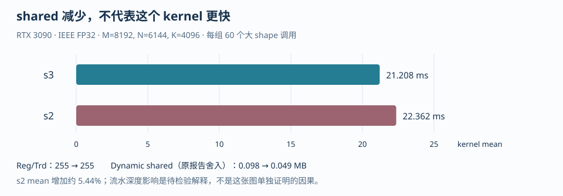

# 第五章 资源预算、Roofline 与性能分析

kernel 时间受计算、访存、寄存器、shared memory 和调度共同影响。优化实验需要固定数值语义与计时范围，再比较改动前后的工作量和资源需求。

手算给出上界与假设，编译器报告给出资源分配，Nsight Systems/Compute 显示时间线和计数器。将它们与 PTX、SASS 对照，才能解释一次加速或退化。

## 1. Occupancy 是约束结果，不是 issue 利用率

Occupancy（占用率）定义为一个 Streaming Multiprocessor（SM，流式多处理器）上活跃 warp 数与硬件最大 warp 数的比值：

$$
\mathrm{Occupancy}=\frac{\mathrm{Active\ Warps\ per\ SM}}{\mathrm{Maximum\ Warps\ per\ SM}}.
$$

它回答“有多少 warp 可以驻留”，不回答“每个周期发射了多少条指令”。Issue utilization（指令发射利用率）还取决于 eligible warp 数、依赖链、内存延迟、barrier、执行管线和指令混合。一个 25% occupancy 的 kernel 可能已经用满某条执行管线；一个 100% occupancy 的 kernel 也可能所有 warp 都在等待 global memory。

设每个 block 有 $T_b$ 个线程、$W_b=\lceil T_b/32\rceil$ 个 warp、每线程使用 $R_t$ 个逻辑 32-bit registers、每 block 使用 $S_b$ 字节 shared memory，则简化的驻留上限是：

$$
B_{\mathrm{resident}}=\min\left(
\left\lfloor\frac{T_{SM}}{T_b}\right\rfloor,
\left\lfloor\frac{W_{SM}}{W_b}\right\rfloor,
\left\lfloor\frac{R_{SM}}{T_bR_t}\right\rfloor,
\left\lfloor\frac{S_{SM}}{S_b}\right\rfloor,
B_{SM}
\right).
$$

其中 $R_{SM}$ 的单位是 32-bit register 个数，不能把它误写成字节；$S_{SM}$ 的单位是字节。这个公式故意忽略了寄存器和 shared 的实际分配粒度、每线程/每 block 的额外限制、编译器临时值和架构特定规则，因此是乐观的预估上界：真实可驻留 block 数可能更低。它用于预估约束和找主导资源，真实值要以 `ptxas -v`、编译器 metadata、CUDA Occupancy API 或 Nsight Compute 为准。

### 1.1 完整手算：给定 SM 假设

> [!IMPORTANT] occupancy 是资源结果，不是优化目标
> **37.5%的occupancy不表示计算单元只用了37.5%。** 资源公式先解释驻留上限；性能要继续看指令依赖、访存、同步与实际耗时。

下面固定一组课堂假设：每 SM 有 65,536 个 32-bit registers、96 KiB shared memory、2,048 threads、64 warps、最多 32 blocks；每 block 有 256 threads，因此有 8 warps。分别考察 `64 registers/thread + 32 KiB shared/block` 和 `96 registers/thread + 48 KiB shared/block`。

第一种配置逐约束计算：

$$
\begin{aligned}
B_T &= \lfloor 2048/256\rfloor=8,\\
B_W &= \lfloor 64/8\rfloor=8,\\
B_R &= \left\lfloor 65536/(256\times64)\right\rfloor=4,\\
B_S &= \lfloor 98304/32768\rfloor=3,\\
B_B &= 32.
\end{aligned}
$$

所以 $B_{resident}=\min(8,8,4,3,32)=3$，活跃 warp 数是 $3\times8=24$，占用率是 $24/64=37.5\%$。

第二种配置逐约束计算：

$$
\begin{aligned}
B_T &= 8,\\
B_W &= 8,\\
B_R &= \left\lfloor 65536/(256\times96)\right\rfloor=2,\\
B_S &= \lfloor 98304/49152\rfloor=2,\\
B_B &= 32.
\end{aligned}
$$

所以 $B_{resident}=\min(8,8,2,2,32)=2$，活跃 warp 数是 $2\times8=16$，占用率是 $16/64=25\%$。这里寄存器和 shared 同时成为最小约束，但不能据此判断两者哪个更值得优化；要分别降低寄存器或 shared，再看另一个约束是否接管。

可运行的算术复核在 `examples/occupancy_budget.py`：

```bash
cd <AIINFFRA>/roadmap/curriculum/gpu/05-performance-analysis-and-optimization
python examples/occupancy_budget.py
```

脚本打印的是逻辑手算，不是设备查询。编译器可能按 warp、register allocation unit 或 shared allocation unit 向上取整，因此 `65536/(256*96)=2` 只证明逻辑上最多两 block，不能证明实际编译产物一定正好使用两 block。对于寄存器从 64 到 65 的小变化，逻辑公式可能仍给出相同整数，但分配粒度会造成实际驻留阶梯变化；这正是要保存 `ptxas`/Nsight 证据的原因。

### 1.2 反例：把 occupancy 当成性能目标

假设一个 256-thread GEMM block 通过缩小 accumulator tile 从 96 降到 64 registers/thread，使手算 occupancy 从 25% 变成 37.5%。如果缩小 tile 同时降低 A/B 复用，global load 增多，或者增加边界与指针指令，kernel 可能变慢。反过来，一个更大 tile 可能因寄存器限制只有两 block/SM，却显著减少 global traffic 并提高计算吞吐。

正确的优化问题应写成：

```text
硬件机制：寄存器/ shared / warp 上限共同限制驻留
代码旋钮：BLOCK_M、BLOCK_N、BLOCK_K、num_warps、num_stages
预期指标：registers/thread、shared/block、resident blocks、eligible warps、stall
结论依据：同一 shape、同一精度、同一 warmup/计时协议下的耗时与计数器
```

追问：为什么 `active warps / maximum warps` 不是 issue utilization？答案是 occupancy 只描述驻留容量，未说明这些 warp 是否 ready、是否命中执行管线、是否在等待内存或 barrier；issue utilization 必须从调度器和执行管线相关计数器读取，不能由 occupancy 百分比代数推出。

## 2. Roofline：先算算法上界，再检查真实流量

Arithmetic Intensity（AI，算术强度）定义为运算量与数据流量的比值：

$$
AI=\frac{\mathrm{FLOPs}}{\mathrm{Bytes}}.
$$

给定显存有效带宽 $BW$ 和计算峰值 $P_{peak}$，简化 Roofline 上界是：

$$
P_{attainable}\le\min(P_{peak},AI\times BW).
$$

这里的 bytes 必须注明口径。算法最小 bytes 假定每个输入/输出只从该层存储读写一次；真实 kernel 可能因未合并访问、cache miss、重读、write-allocate、padding 或中间结果而产生更多 traffic。Nsight Compute 的 DRAM/L2 bytes 和 requested/actual throughput 才能把算法下界替换为观测流量。

### 2.1 Vector Add 完整数值算例

对 `C[i]=A[i]+B[i]`，每个元素有 1 次加法，FP32 最小流量是读取两个 4-byte 值并写回一个 4-byte 值，共 12 bytes：

$$
AI_{vector}=\frac{1}{12}=0.083333\ \mathrm{FLOP/byte}.
$$

若某目标设备和当前运行条件下测得有效 DRAM 带宽是 $BW=840$ GB/s，按这个最小流量假设得到的带宽上界是：

$$
0.083333\times840=70\ \mathrm{GFLOP/s}.
$$

70 GFLOP/s 是这个带宽与最小流量假设下的 FLOP/s 上界；对于 Vector Add，带宽指标更直接，因为每个元素只有一次加法。换成有效带宽，理想值就是接近 840 GB/s。若实际只达到 700 GB/s，应检查合并访问、grid 是否足够大、launch/计时是否包含在内、数据是否被 cache 重用，而不是先增加无关算术。

本章脚本把带宽和峰值作为参数，不内置某个 GPU 的规格：

```bash
cd <AIINFFRA>/roadmap/curriculum/gpu/05-performance-analysis-and-optimization
python examples/roofline_cases.py --bandwidth-gbps 840 --peak-tflops 20
```

### 2.2 GEMM 完整数值算例

对 row-major $A_{M\times N}B_{N\times K}=C_{M\times K}$，取仓库 MatMul 使用的 $M=8192,N=6144,K=4096$：

$$
\mathrm{FLOPs}=2MNK=412,316,860,416.
$$

如果 A、B、C 都按 FP32 存储，并采用每个矩阵只读/写一次的算法下界：

$$
\mathrm{Bytes}_{FP32}=4(MN+NK+MK)=436,207,616,
$$

因此：

$$
AI_{FP32}=945.230769\ \mathrm{FLOP/byte}.
$$

若 storage dtype 为 FP16，三块矩阵的算法下界是 218,103,808 bytes，AI 数值上升为 1,890.461538 FLOP/byte；这只改变存储流量，不自动说明累加精度、Tensor Core 指令或误差契约相同。GEMM 的高 AI 来自 tile 复用：一个 A tile 被多个输出列复用，一个 B tile 被多个输出行复用；若 profiler 的实际 bytes 远高于上述下界，Roofline 点应按实际流量另算。

```bash
cd <AIINFFRA>/roadmap/curriculum/gpu/05-performance-analysis-and-optimization
python examples/roofline_cases.py --bandwidth-gbps 840 --peak-tflops 20
```

反例是用理论 DRAM 带宽乘 AI 后，把结果直接当作 kernel 应达到的速度。Roofline 是上界和瓶颈分类工具，不包含 launch、地址计算、同步、指令依赖、低 occupancy、bank conflict、频率变化和实际 cache 层级；点低于 roof 只说明还有原因待找，不说明原因一定是 DRAM。

## 3. 数值精度必须分账：IEEE FP32 与 TF32

IEEE FP32 是严格的 32-bit binary32 输入/运算语义；TF32（TensorFloat-32）通常保持 FP32 存储和 FP32 accumulator，但在 Tensor Core 矩阵乘输入路径上使用更短的有效 mantissa。它们不是一张成绩表里的两个实现细节，而是两个数值契约：速度、指令路径和误差都可能不同。

仓库 `solutions/triton/matmul.py` 的严格 FP32 对照同时设置：

```python
torch.backends.cuda.matmul.allow_tf32 = False
tl.dot(tile_a, tile_b, input_precision="ieee")
```

因此 MatMul 的 IEEE 表应独立记录 `shape=(8192,6144,4096)`、输入/输出 dtype、allow_tf32、Triton config 和误差阈值。TF32 对照要单独报告 `max_abs_error`、`max_rel_error`，并以同样 warmup/repeat 协议计时；不能把 TF32 的速度提升写成 tile 优化收益，也不能把 PyTorch 默认配置猜成严格 IEEE。

反例是只比较 `torch.mm` 与 Triton 的 ms，却没有锁定 `allow_tf32`，或把 FP16/BF16/Tensor Core 结果塞进 IEEE FP32 表。这样的表即使数字漂亮，也无法回答“相同数值语义下哪个实现更快”。

## 4. benchmark 正确性、暖身和 event 时序

正确的 benchmark 先用不规则 shape 做 correctness，再暖身，让首次编译、lazy loading、allocator 和 cache 状态不污染稳态。仓库 `solutions/triton/matmul.py` 的 `_time_ms` 提供了可复用时序：先执行 10 次 warmup，device synchronize；然后在同一 CUDA stream 上 record start event，重复执行 50 次，record end event，等待 end 完成，再用 `elapsed_time` 除以 repeats。这个协议测的是 GPU event 覆盖的 queued work，不是 Python 发起调用的 wall time。

```python
for _ in range(warmup):
    fn()
torch.cuda.synchronize()
start.record()
for _ in range(repeats):
    fn()
end.record()
end.synchronize()
elapsed_ms = start.elapsed_time(end) / repeats
```

反例包括：只调用 `time.perf_counter()` 而没有在开始/结束处同步，导致 host 只测到 launch；把 correctness 运行混在计时 repeats 中；不同配置使用不同 warmup；每次 repeat 后 `cudaDeviceSynchronize()` 破坏流水；或只测一个可整除 shape。最低 correctness 集合应包含 `(1,1,1)`、整除 shape、`(65,33,67)` 一类非整除 shape，以及真实性能 shape，并检查有限值与误差阈值。

在仓库根目录运行 MatMul：

```bash
python solutions/triton/matmul.py --config k256-128x32x256-w8-s3
```

### 不同 stream 仍串行：先区分依赖、资源和提交队列

两条 stream 没有显式 event 依赖，不等于它们必然并发。默认 NULL stream 的隐式同步、分配等操作、尚未完成的输入传输、单个 kernel 占满的寄存器/shared 资源，都可能使第二条 stream 的工作等待。先用时间线找出等待发生在 host 提交、设备排队还是 kernel 内部，再决定改哪一层；换一个 stream 名字不会解除数据依赖。

还要区分软件 stream 与底层工作队列。多个 stream 可能共享提交资源，形成原算法不要求的串行关系。`CUDA_DEVICE_MAX_CONNECTIONS` 会影响可用连接配置，但它不是 SM 数量、warp 数量或同时运行 kernel 数的保证。只有排除了真实数据依赖与资源瓶颈，且时间线指向提交资源竞争时，才值得对照其设置；参数范围与作用应按实际工具链/驱动版本核对。改变变量后必须重新启动实验进程，并保留未开启 profiler 的对照结果。

Stream priority 解决的是另一个问题：优先选择尚未开始的工作，而不是提高已经在执行的指令吞吐。下面是创建高优先级 non-blocking stream 的配置片段；参数值由设备查询得到，不硬编码某个负数：

~~~cpp
int least_priority = 0, greatest_priority = 0;
CUDA_CHECK(cudaDeviceGetStreamPriorityRange(&least_priority, &greatest_priority));
cudaStream_t latency_stream{};
CUDA_CHECK(cudaStreamCreateWithPriority(
    &latency_stream, cudaStreamNonBlocking, greatest_priority));
// Submit the latency-sensitive work and its real data dependencies here.
CUDA_CHECK(cudaStreamSynchronize(latency_stream));
CUDA_CHECK(cudaStreamDestroy(latency_stream));
~~~

较小数值表示较高优先级。这个提示不会把正在执行的低优先级 block 立即赶走，也不替代 producer/consumer 之间的 event；资源可用时，调度器才有机会优先发射高优先级工作。若长 kernel 的一个 block 持续很久，降低平均 kernel 时间与改善短请求尾延迟可能需要不同改动。Green Context 的资源选择、stream priority 的调度提示和 Graph 的提交开销优化，应分别建立假设，不能统称为“开更多 stream”。

## 5. MatMul 案例：从配置表到性能证据

下面使用已保存的 Triton MatMul 实现与服务器测量。表中分别列出形状、精度、配置和计时条件；设备型号相同，不代表测量条件相同。

`solutions/triton/matmul.py` 使用 `A[M,N] @ B[N,K] = C[M,K]` 的行主序布局：`BLOCK_M` 切输出行 M，`BLOCK_K` 切输出列 K，`BLOCK_N` 切归约维 N。这个命名与很多把 N 当输出列的 GEMM 伪代码不同，读 sweep 表时必须以源码指针公式和 `grid=(cdiv(M,BLOCK_M), cdiv(K,BLOCK_K))` 为准。

第一批是固定 `M=8192,N=6144,K=4096`、IEEE FP32、`tl.dot(input_precision="ieee")` 且 PyTorch `allow_tf32=False` 的候选 sweep：

| 配置 | 结果 | 解释边界 |
|---|---:|---|
| `64x32x64,w4,s3` | 24.924 ms / 16,542.7 GFLOPS | 候选 baseline |
| `128x32x64,w4,s3` | 22.298 ms / 18,491.3 GFLOPS | 只说明该候选在同 shape/精度下更快 |
| `128x32x128,w4,s3` | 28.354 ms / 14,541.8 GFLOPS | 增大 K tile 在该候选上退化，原因需 profiler 支持 |
| `128x64x128,w4,s3` | 编译失败；shared 需要 131,072 B，大于 101,376 B 上限 | 资源约束证据，不是 pointer/mask bug |
| `128x32x256,w8,s3` | 22.033 ms / 18,713.5 GFLOPS | 当前候选集最快，不代表全局最优 |

同一复盘后续保存的 best 是 20.830 ms / 19,794.1 GFLOPS / `torch.mm` 的 80.3%；它仍应按同一 benchmark shape、IEEE FP32 和对应脚本批次单独引用，不能与第一批 22.033 ms 合并成一条未经条件的“提升曲线”。

### 5.1 P0-lite：Nsight Systems 能证明什么，不能证明什么

流水深度对比固定 `128x32x256,w8`，只改变 `num_stages`。统计先从 Nsight Systems trace 排除 correctness launches，再保留 60 次目标大形状调用：

| 配置 | Triton mean / median | Reg/Trd | Dynamic shared | 同次 CUTLASS mean |
|---|---:|---:|---:|---:|
| `s3` | 21.208 / 21.163 ms | 255 | 0.098 MB | 16.716 ms |
| `s2` | 22.362 / 22.317 ms | 255 | 0.049 MB | 16.682 ms |

可确认的事实是：在这批次、这组 shape/精度/配置和计时口径下，s2 比 s3 慢 5.44%，动态 shared 减半而 Reg/Trd 仍为 255；AutoDL 当时没有可用 NCU hardware counters，因此没有 achieved occupancy、stall reason 或 issue utilization 的直接证据。合理的解释假设是更浅的 pipeline 可能损失 latency hiding，而 shared 减少没有解除寄存器约束；这仍是待用 counter/邻域实验检验的假设，不能写成“已由 counter 证明流水损失”。Nsight Systems 的时间线和 launch metadata 不能替代 Nsight Compute 的硬件计数器。

### 5.2 逐行读原始 trace：先确认测的是什么

从 [s3 原始文本记录](../../../../notes/triton/logs/2026-08-29-matmul-k256-s3-nsys.txt) 抽取两条同名 kernel 的记录，只保留本节需要的字段：

| 记录 | Duration（ns） | Grid | Block | Reg/Trd | DymSMem（MB） |
|---|---:|---|---|---:|---:|
| 小形状调用 | 10,561 | 1×1×1 | 256×1×1 | 246 | 0.049 |
| 一次目标大形状调用 | 19,016,006 | 64×16×1 | 256×1×1 | 255 | 0.098 |

两行名称都显示为 matrix_multiplication_kernel，但不是同一个输入规模。先把 Duration 除以一百万，得到 0.010561 ms 与 19.016006 ms；后一个数是单次观测，不是60次的均值。若先按名称汇总，再直接读取平均值，小形状正确性检查也会进入结果。

Grid 的64×16与源码相互印证：输出是8192×4096，每块输出128×256，因此行方向64块、列方向16块。Block的256线程对应8个warp。Reg/Trd表示编译后的每线程寄存器使用情况，不是程序中声明了255个变量；DymSMem是动态共享内存字段，不是整个GPU显存占用。

应当按以下顺序阅读这份报告：

1. 用kernel名称、Grid和Block辨认目标调用，并核对源码配置及输入形状。
2. 排除四次小规模正确性调用，再对60个目标样本计算均值、中位数和离散程度。
3. 对照Reg/Trd、共享内存与前面手算的驻留约束，提出可以检验的解释。
4. 需要解释stall或实际occupancy时，再使用硬件计数器；不从时间线字段推导不存在的测量值。

> [!TIP] 同名 kernel 不是同一份测量样本
> **先筛工作负载，再做统计。** 这份记录中，汇总64次调用与筛出60次目标调用，会得到不同的平均值；它们不能混在同一张优化对比表里。

### 5.3 正确性检查也需要明确合同

对浮点输出，常用判据是：

$$
|y-y_{\mathrm{ref}}|\le \mathrm{atol}+\mathrm{rtol}\,|y_{\mathrm{ref}}|.
$$

绝对阈值控制参考值接近零时的误差；相对阈值随参考值大小缩放。只看最大相对误差，可能把非常小的参考值放大成吓人的比率；只看平均误差，又可能掩盖少数位置的明显错误。应同时记录最大绝对误差、超阈值元素数量和非有限值。

参考实现的计算精度也要声明。CPU double归约、GPU FP32树归约和允许TF32输入的矩阵乘，不是同一种舍入路径。可以使用高精度参考评价误差，但不能把它的时间当成相同数值合同下的性能基线。定位误差时，先检查地址、mask与输入精度，再评估归约顺序；放宽阈值不能替代诊断。

工具分别回答不同问题：

| 工具 | 主要用途 | 不能单独证明 |
|---|---|---|
| memcheck | 非法或未对齐访问等内存错误 | 数学结果正确 |
| initcheck | 未初始化设备全局内存读取 | 所有同步都正确 |
| racecheck | 支持范围内的共享内存访问冲突 | 不存在任意类型的全局内存数据竞争 |
| synccheck | 同步原语使用错误 | 算子性能达到上界 |

对第四章归约例程，可以在同一编译输出上补充：

~~~bash
compute-sanitizer --tool initcheck --error-exitcode=1 ./reduction_tail
compute-sanitizer --tool synccheck --error-exitcode=1 ./reduction_tail
~~~

检查工具改变执行开销，测试其耗时没有优化比较意义。正确性输出与正常运行的benchmark应分开保存。


## 6. 优化假设、改动、指标证据

<figure class="diagram-frame">

<figcaption>图：MatMul 的 s3/s2 流水深度对比，各包含 60 次目标形状调用；来源为本节链接的流水深度分析及原始 trace。</figcaption>
</figure>

> [!TIP] 从自己的实验中保留的认识
> s2 的 shared 减少，而寄存器没有减少，耗时增加。**“资源占用下降”不能单独构成优化成功的结论。** 观测支持哪些事实、哪些原因仍是假设，必须分开写。

每一次优化都保持三列记录，并让证据能反驳假设：

| 优化假设 | 改动 | 指标证据 |
|---|---|---|
| 输出 tile 太小，地址/launch 之外的复用不足 | `BLOCK_M:64→128`，同一 `N/K,w/s` | 24.924→22.298 ms；再看 global load、eligible warps、registers |
| K tile 可能增加 A/B 复用 | `BLOCK_K:64→128` | 22.298→28.354 ms；只能记录退化，原因需看资源/traffic/stall |
| 更大的归约 tile 可能减少 N 维循环并增加单次 buffer 工作量 | `BLOCK_N:32→64`（本代码中 N 是归约维；输出列维是 `BLOCK_K`） | 编译失败：131,072 B > 101,376 B；资源边界已足以否决该配置 |
| 更大 K tile 配合更多 warps 可能覆盖依赖 | `128x32x256,w8,s3` | 22.033 ms；需要同次 registers/shared/roofline 对照 |
| 减少 stage 可释放 shared 并提高驻留 | `s3→s2` | shared 0.098→0.049 MB，但 Reg/Trd 都 255，mean 21.208→22.362 ms；原因仍是假设 |
| 简单二维排布造成 L2 重读 | grouped program ordering | 看 L2 hit、DRAM bytes、实际耗时；没有计数器不下结论 |
| IEEE FP32 已受 CUDA Core 限制，允许误差可换 Tensor Core | 单独 TF32 配置 | 另表记录速度、max abs/relative error、MMA 指令；不与 IEEE 表合并 |
| 低寄存器 tile 能提高 occupancy | 缩小 accumulator/tile | 预期 registers/thread 与 resident blocks 变化；同时检查 spill 和实际耗时 |

表中的“预期”不是结果。只有在同一 shape、同一精度、同一 warmup/repeat 和同一设备条件下采集到对应指标，才能把某行从假设推进为解释。

## 7. 从源码到 PTX、SASS 与 profiler

四层文件回答四个不同问题：源码说明算法和 tile；`ptxas -v` 说明寄存器、local、shared 等编译资源；PTX 说明虚拟指令选择和 memory space；SASS 才是目标 GPU 实际执行的指令编码。Triton 的 Python source 还多一层 JIT：配置参数改变会触发不同编译产物，不能只看 Python 代码推断真实寄存器数。

```bash
cd <AIINFFRA>/roadmap/curriculum/gpu/05-performance-analysis-and-optimization
nvcc -std=c++17 -O3 -lineinfo -Xptxas=-v -arch=sm_XX \
  ../04-synchronization-and-asynchronous-execution/examples/reduction_tail.cu \
  -o reduction_tail
cuobjdump --dump-ptx reduction_tail
cuobjdump --dump-sass reduction_tail
```

把 `sm_XX` 替换为目标 Compute Capability（计算能力）对应的编译目标；不要把某一产品的 `sm_XX` 猜成所有设备都通用。若需要更细的 SASS 反汇编，在生成 cubin 后使用：

```bash
cd <AIINFFRA>/roadmap/curriculum/gpu/05-performance-analysis-and-optimization
nvcc -std=c++17 -O3 -lineinfo -arch=sm_XX -cubin \
  ../04-synchronization-and-asynchronous-execution/examples/reduction_tail.cu \
  -o reduction_tail.cubin
nvdisasm reduction_tail.cubin
```

实际 profiling 命令：

```bash
cd <AIINFFRA>/roadmap/curriculum/gpu/05-performance-analysis-and-optimization
nsys profile --trace=cuda,nvtx,osrt --stats=true \
  --output=matmul_k256_nsys \
  python ../../../../solutions/triton/matmul.py \
  --config k256-128x32x256-w8-s3

cd <AIINFFRA>/roadmap/curriculum/gpu/05-performance-analysis-and-optimization
ncu --set roofline --target-processes all \
  --export=matmul_k256_ncu \
  python ../../../../solutions/triton/matmul.py \
  --config k256-128x32x256-w8-s3
```

Nsight Systems 适合回答 host enqueue、stream、kernel、H2D/D2H 和空洞是否按预期排列；Nsight Compute 适合回答单 kernel 的 achieved occupancy、registers、shared、DRAM/L2、warp stall、roofline 和 MMA/FP32 pipe。两者都不能仅凭一个 counter 证明算法原因；要把“硬件机制 → 代码旋钮 → 预期 counter → 实测耗时”闭环。

计时应遵循 event record、同步完成、读取 elapsed time 的顺序。系统时间线和 kernel 硬件指标分别用 Nsight Systems、Nsight Compute 分析。

CUDA Sanitizer 用于先排除内存错误和同步错误，再解释性能：

```bash
cd <AIINFFRA>/roadmap/curriculum/gpu/05-performance-analysis-and-optimization
nvcc -std=c++17 -O2 \
  ../04-synchronization-and-asynchronous-execution/examples/reduction_tail.cu \
  -o reduction_tail
compute-sanitizer --tool memcheck --error-exitcode=1 ./reduction_tail
compute-sanitizer --tool racecheck --error-exitcode=1 ./reduction_tail
```

`CUDA_LAUNCH_BLOCKING=1` 可用于把异步 launch 错误定位到更接近的调用点，但会改变时间线，不能用该环境变量的耗时作为性能结论。安全的只读工具采集脚本是 `examples/collect_cuda_tools.sh`：

```bash
cd <AIINFFRA>/roadmap/curriculum/gpu/05-performance-analysis-and-optimization
bash examples/collect_cuda_tools.sh
```

## LeetGPU：正确性与代码归档

本章性能分析以前置的 Triton MatMul 代码为算例，不新增一个未经题面确认的平台题目。已有平台入口是 [LeetGPU Matrix Multiplication](https://leetgpu.com/challenges/matrix-multiplication)，原始平台 kernel 归档在 `solutions/triton/matmul_leetgpu.py`；服务器适配与参数入口在 `solutions/triton/matmul.py`。阅读本章时应把平台原始 kernel、服务器 wrapper、精度设置和 shape 分开引用。

## 服务器：真实性能

具备 CUDA Toolkit、目标 GPU、驱动、Triton/PyTorch 和 profiler 权限后，先按不规则 shape 做 correctness 与 warmup，再按 `--config` 逐个运行 MatMul，最后执行 Nsight Systems、Nsight Compute 和 Sanitizer 命令。任何新的时间、GFLOPS、occupancy 或 counter 都必须附带 GPU/CC、shape、dtype、精度开关、配置、warmup/repeat、软件版本和采集权限；本章给出的 RTX 3090 数字只属于上面注明的历史批次，不延伸为其他 GPU 或其他精度的结果。

## 从 kernel 时间走到请求时间

请求时延与 kernel 时间的起止点不同。下面从时间戳计算指标，再分析单算子收益怎样传递到完整请求。

### TTFT、TPOT 与端到端时延的边界

设同一测量端观察到请求到达时间 a，以及 N 个输出 token 的时间 t_0,…,t_(N-1)。Time To First Token（TTFT，首 token 时延）和 Time Per Output Token（TPOT，首 token 之后的平均 token 间隔）为

$$
\mathrm{TTFT}=t_0-a,\qquad
\mathrm{TPOT}=\frac{t_{N-1}-t_0}{N-1}\quad(N>1).
$$

在同一端、同一条请求、以最后一个 token 为结束点的定义下，

$$
T_{\mathrm{end}}=t_{N-1}-a
=\mathrm{TTFT}+(N-1)\mathrm{TPOT}.
$$

只有一个输出 token 时没有间隔，TPOT 不定义，不能填 0 后参与多请求平均。若结束点是整个 HTTP 响应完成，还可能有 token 之后的协议或传输时间，不能与上式混用。

例如 a=0 ms，输出时间为 [120,160,220] ms。TTFT 为 120 ms，两次间隔为 40 与 60 ms，TPOT 为 50 ms，最后 token 的端到端时延为 220 ms。这里的 TTFT 可能包含排队、tokenization、cache 查询、传输、Prefill、首 token 选择和返回路径；它不等于某个 Prefill kernel 的 CUDA Event 时间。客户端时间戳与服务端时间戳也不能未经时钟校准直接相减。

下面是配套检查实际使用的实现：

<!-- source-check: examples/cpu_metrics_case.py -->
~~~python
def request_metrics(arrival_ms, token_times_ms):
    times = list(token_times_ms)
    if not times or not all(math.isfinite(x) for x in [arrival_ms, *times]):
        raise ValueError("at least one token and finite timestamps required")
    if times[0] < arrival_ms or any(a > b for a, b in zip(times, times[1:])):
        raise ValueError("timestamps must be chronological")
    ttft = times[0] - arrival_ms
    e2e = times[-1] - arrival_ms
    tpot = (times[-1] - times[0]) / (len(times) - 1) if len(times) > 1 else None
    return ttft, tpot, e2e
~~~

逐请求恒等式不能直接搬到分位数上。假设一半请求 TTFT=100、后续 Decode=1，另一半 TTFT=1、Decode=100：每条请求总时间都是 101，但两个分项各自的 P95 都是 100，相加变成 200。正确方法是先计算每条请求的总时延，再取分位数。

### 单算子快两倍，模型为什么只快一点

在没有重叠、其他阶段不变的串行模型中，设某算子占原总时间比例 f，局部加速 s 倍。原总时间归一化为 1，新时间为

$$
T_{\mathrm{new}}=(1-f)+\frac f s,\qquad
\mathrm{Speedup}_{\mathrm{end}}=\frac{1}{(1-f)+f/s}.
$$

例如原来 100 ms 中有 20 ms 属于这个算子，算子从 20 ms 降到 10 ms，总时间是 90 ms，整体仅快 1.111 倍。把 kernel 提升比例直接写成模型吞吐提升，会忽略其余 80 ms。

并发执行时还要看关键路径。两条 stream 的 kernel 时间可能重叠；缩短非关键路径上的 kernel，端到端时间可能完全不变。反过来，融合可能改变 launch 间隙、存储竞争或同步位置，此时“其他阶段不变”的假设失效，应重新测量时间线。不能把 profiler 的所有 kernel duration 简单相加后当作请求时延。

### MFU 与带宽利用率要服务于瓶颈判断

Model FLOPs Utilization（MFU，模型浮点运算利用率）需要先给模型有用 FLOPs 的定义 F_model，再以同一窗口时间 Δt 和对应计算精度的设备总峰值 P_peak 定义：

$$
\mathrm{MFU}=\frac{F_{\mathrm{model}}}{\Delta t\,P_{\mathrm{peak}}}.
$$

MoE 的理论工作量按实际参与的专家路径计算；重算、padding 和额外索引计算是否计入，要在口径中明确。分母不能拿 FP4 稀疏峰值去评价 IEEE FP32 kernel，也不能只用一张卡的峰值评价多卡 FLOPs。模型有用计算的 MFU 与实际执行指令的硬件利用率不是同一个量。

Decode 的小矩阵与 KV 扫描可能使 MFU 很低，但请求时延仍接近其带宽或 launch 下界。此时应检查有效 bytes、DRAM/L2 流量、kernel 数和空闲间隙，而不是为了提高 MFU 盲目增加 batch。Prefill 也不保证总是 compute-bound：短输入、小 batch、稀疏索引和长序列 Attention 会改变瓶颈。

把这些判断落实到已有的 Nsight 流程：先在 Systems 中确定排队、launch、拷贝与 kernel 的关键路径，再用 Compute 分析热点 kernel 的计算管线和存储事务，最后回到未开启 profiler 的请求测试核对 TTFT、TPOT 与吞吐。SLO（Service Level Objective，服务等级目标）约束下的有效并发需要压测；显存预算只能估计容量边界。

从仓库根目录运行时间戳、P95 反例与 Amdahl 检查：

~~~bash
python roadmap/curriculum/gpu/05-performance-analysis-and-optimization/examples/cpu_metrics_case.py
~~~

## 8. 综合练习（带答案）

### 练习一：资源约束

问题：在本章假设下，256 threads/block、64 registers/thread、32 KiB shared/block 的 resident block 数和 occupancy 是多少？改为 96 registers/thread、48 KiB shared/block 呢？

答案：第一组约束分别是 threads=8、warps=8、registers=4、shared=3、block=32，最小值 3；活跃 warp=24，占用率 $24/64=37.5\%$。第二组是 threads=8、warps=8、registers=2、shared=2、block=32，最小值 2；活跃 warp=16，占用率 $16/64=25\%$。这两个百分比不是 issue utilization。

### 练习二：Vector Add Roofline

问题：FP32 Vector Add 每元素 1 FLOP、12 bytes，若有效带宽 840 GB/s，算法 memory roof 是多少 GFLOP/s？

答案：AI=$1/12$ FLOP/byte，memory roof=$840/12=70$ GFLOP/s。更自然的报告是有效带宽 840 GB/s 附近，而不是把 70 GFLOP/s 当成计算能力。

### 练习三：GEMM AI

问题：对 $8192\times6144$ 乘 $6144\times4096$ 的 FP32 storage GEMM，FLOPs、最小 bytes 和 AI 是多少？

答案：FLOPs=$2MNK=412,316,860,416$；最小 bytes=$4(MN+NK+MK)=436,207,616$；AI=$945.230769$ FLOP/byte。实际 traffic 若包含重复 global load，应使用 profiler 观测值重算第二个 Roofline 点。

### 练习四：精度公平性

问题：为什么不能把严格 IEEE FP32 Triton 结果与 TF32 PyTorch 结果放在同一张“tile 优化”表？

答案：两者的数值契约和矩阵乘指令路径不同；TF32 可能使用 Tensor Core 并带来不同误差。必须分别锁定 `allow_tf32`/`input_precision`，分别报告时间和 `max_abs_error`、`max_rel_error`。

### 练习五：P0-lite 边界

问题：s2 比 s3 慢、shared 减半、Reg/Trd 都是 255，可以直接说“s2 因流水损失变慢”吗？

答案：不能。数据支持“这批次 s2 慢 5.44%、shared 减半、寄存器没有降低”；流水 latency hiding 是合理假设，但因为 NCU counters 不可用，尚无 stall/occupancy/issue 的直接证据。需要相同环境的 NCU 或更窄的邻域实验来检验。

### 练习六：工具选择

问题：想知道两个 stream 是否真的 overlap，想知道单 kernel 为什么慢，想知道是否越界，分别先用什么工具？

答案：stream/host/copy/kernel 时间线先用 Nsight Systems；单 kernel 的 roofline、stall、register/shared、occupancy 用 Nsight Compute；越界、race 和同步错误先用 CUDA Sanitizer。工具输出要和源码配置、编译目标、warmup 与 shape 一起解释。

<span id="chapter-5-section-27" aria-hidden="true"></span>

## 参考阅读

[CUDA Programming Guide 13.3](../../../../downloads/cuda-programming-guide.pdf) · [大模型推理实践](../../../../downloads/大模型推理实践.pdf)。
