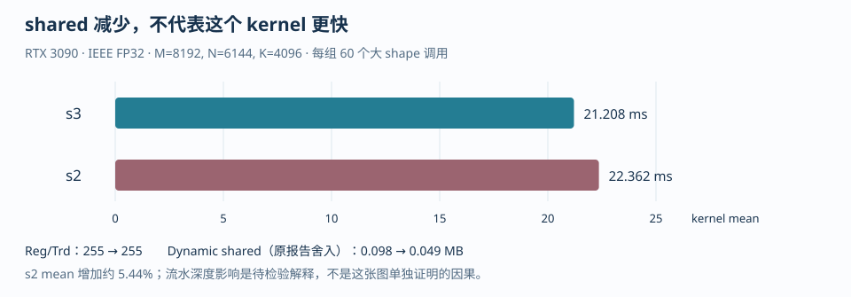

# 第五章 GPU kernel 的计时与性能分析

## 1. 计时范围与 CUDA Event

先决定测 kernel 本身，还是测包含主机调度、数据复制和同步的完整调用。`fn` 是每次执行一次待测算子的无参函数；`warmup` 次数用于让首次编译、模块加载等初始化离开稳态计时，`repeats` 次数用于重复执行。CUDA Event（CUDA 事件）记录设备时间线上的起止位置，因此不包含 Python 调用本身的全部主机耗时。

```python
warmup = 10
repeats = 50
fn = lambda: kernel(x, y)  # 一次待测算子调用；输入和输出已准备好

for _ in range(warmup):
    fn()
torch.cuda.synchronize()  # 等待预热工作结束
start = torch.cuda.Event(enable_timing=True)
end = torch.cuda.Event(enable_timing=True)
start.record()
for _ in range(repeats):
    fn()
end.record()
end.synchronize()
elapsed_ms = start.elapsed_time(end) / repeats
```

该方法测量同一 stream 中起止事件之间排入的 GPU 工作。若要测主机发起开销或整条服务请求，应另用 host wall time，并说明是否包含准备、排队与等待。计时前先用不规则 shape 检查正确性，性能样本不混入 correctness 调用。

同一批实验应使用相同输入、数值设置、预热次数、重复次数和等待范围。完成计时后，再结合编译器资源报告、Roofline 与 profiler 判断瓶颈。

### 1.1 基线与测试形状

基线应完成相同的计算，具有相同的输入输出精度、布局和误差要求。Copy 可以与设备内复制对照；GEMM 可以与相同精度设置的 `torch.mm` 或 cuBLAS 对照；Attention 则要固定 mask、head 数和实际选择的后端。若一个接口已经包含布局转换、输出分配或额外融合，另一个没有，应分别测量 kernel 与完整调用。

测试形状应覆盖不同的计算特点。GEMM 至少包含较大矩阵、小输出行数、长归约维度和不能整除 tile 的形状；归约至少覆盖短行、长行及不同行数；Attention 同时改变序列长度、batch 和 Query/KV head 数。各形状先通过正确性检查，才能进入性能表。一个 shape 上最快的配置，可能在其他 shape 上退化或耗尽片上资源。

### 1.2 重复测量与跨形状回归

一次测量包含多次 kernel 调用，可降低计时粒度的影响；多轮独立测量则用于观察波动。对同一 shape，可在预热后交替测量基线 A 和候选 B，保存每轮结果，而不是仅保留最短一次。温度、频率、其他进程、缓存和首次编译都可能影响比较，应记录运行条件，并把编译时间与稳态时间分开。

每个 shape 报告中位数和四分位范围，既保留典型耗时，也展示波动。若收益与波动相近，应增加测量并检查环境，不能仅凭一次更小的数字认定加速。四分位范围描述样本分布，不是加速比的置信区间。

设第 j 个 shape 的基线与候选中位数分别为 $t_{A,j}$、$t_{B,j}$，其加速比为

$$
s_j=\frac{t_{A,j}}{t_{B,j}}.
$$

跨 shape 汇总时，可以列出各项加速比及其几何平均，同时保留最差回归：

$$
s_{\mathrm{geo}}=\exp\left(\frac1J\sum_{j=1}^{J}\log s_j\right).
$$

几何平均给每个 shape 相同权重，不表示生产请求的总体加速。若实际请求频率差异较大，还需按真实负载重放并测量端到端时间。不同 shape 的毫秒数也不应直接平均后当作通用算子指标。

下面的函数只汇总传入的实测毫秒数，不产生性能样本：

```python
import math
import statistics


def summarize_ms(samples):
    values = [float(x) for x in samples]
    if len(values) < 5 or any(not math.isfinite(x) or x <= 0 for x in values):
        raise ValueError("at least five positive finite measurements required")
    q1, _, q3 = statistics.quantiles(values, n=4, method="inclusive")
    return {"median_ms": statistics.median(values), "q1_ms": q1, "q3_ms": q3}


def compare_shapes(baseline, candidate):
    if not baseline or baseline.keys() != candidate.keys():
        raise ValueError("both implementations must use the same nonempty shape set")
    reports = {}
    for shape in baseline:
        a, b = summarize_ms(baseline[shape]), summarize_ms(candidate[shape])
        reports[shape] = {"baseline": a, "candidate": b,
                          "speedup": a["median_ms"] / b["median_ms"]}
    ratios = [row["speedup"] for row in reports.values()]
    return reports, {"geomean_speedup": math.exp(statistics.mean(map(math.log, ratios))),
                     "worst_speedup": min(ratios)}
```

| shape / 精度 / 布局 | 正确性 | 基线中位数 / 四分位范围 | 候选中位数 / 四分位范围 | 加速比 | 寄存器、共享内存与实际瓶颈 |
|---|---|---|---|---|---|
| 大矩阵或长行 | — | — | — | — | — |
| 小矩阵或短行 | — | — | — | — | — |
| 非整除边界 | — | — | — | — | — |
| 模型实际出现的形状 | — | — | — | — | — |

最终报告应保留失败配置和退化形状。继续优化的理由应来自实际瓶颈；资源调整没有改善目标工作负载，或收益不足以抵消额外复杂度时，可以保留更简单的实现。

## 2. Occupancy 与资源驻留上限

Occupancy（占用率）定义为一个 Streaming Multiprocessor（SM，流式多处理器）上活跃 warp 数与硬件最大 warp 数的比值：

$$
\mathrm{Occupancy}=\frac{\mathrm{Active\ Warps\ per\ SM}}{\mathrm{Maximum\ Warps\ per\ SM}}.
$$

它回答“有多少 warp 可以驻留”，不回答“每个周期发射了多少条指令”。Issue utilization（指令发射利用率）还取决于 eligible warp 数、依赖链、内存延迟、barrier、执行管线和指令混合。一个 25% occupancy 的 kernel 可能已经用满某条执行管线；一个 100% occupancy 的 kernel 也可能所有 warp 都在等待 global memory。

设每个 block 有 $T_b$ 个线程、$W_b=\lceil T_b/32\rceil$ 个 warp、每线程使用 $R_t$ 个 32-bit registers、每 block 使用 $S_b$ 字节 shared memory。一个 SM 的上限分别记为 $T_{SM}$（线程数）、$W_{SM}$（warp 数）、$R_{SM}$（32-bit register 数）、$S_{SM}$（shared memory 字节数）和 $B_{SM}$（resident block 数）。忽略资源分配粒度时，驻留 block 上限可估为：

$$
B_T=\left\lfloor\frac{T_{SM}}{T_b}\right\rfloor,\quad
B_W=\left\lfloor\frac{W_{SM}}{W_b}\right\rfloor,\quad
B_R=\left\lfloor\frac{R_{SM}}{T_bR_t}\right\rfloor,\quad
B_S=\begin{cases}
\left\lfloor S_{SM}/S_b\right\rfloor,&S_b>0,\\
\infty,&S_b=0,
\end{cases}
\qquad
B_{\mathrm{resident}}=\min(B_T,B_W,B_R,B_S,B_{SM}).
$$

其中 $B_T$、$B_W$、$B_R$、$B_S$ 分别表示线程、warp、寄存器和 shared memory 给出的上限。若 $S_b=0$，shared memory 不限制 block 数，该项取无穷大以避免除零。

其中 $R_{SM}$ 的单位是 32-bit register 个数，不能把它误写成字节；$S_{SM}$ 的单位是字节。这个公式故意忽略了寄存器和 shared 的实际分配粒度、每线程/每 block 的额外限制、编译器临时值和架构特定规则，因此是乐观的预估上界：真实可驻留 block 数可能更低。它用于预估约束和找主导资源，真实值要以 `ptxas -v`、编译器 metadata、CUDA Occupancy API 或 Nsight Compute 为准。

### 2.1 Occupancy 资源上限手算

> [!IMPORTANT] occupancy 是资源结果，不是优化目标
> **37.5%的occupancy不表示计算单元只用了37.5%。** 资源公式先解释驻留上限；性能要继续看指令依赖、访存、同步与实际耗时。

下面固定一组课堂假设：每 SM 有 65,536 个 32-bit registers、96 KiB shared memory、2,048 threads、64 warps、最多 32 blocks；每 block 有 256 threads，因此有 8 warps。分别考察 `64 registers/thread + 32 KiB shared/block` 和 `96 registers/thread + 48 KiB shared/block`。

第一种配置逐约束计算：

$$
\begin{aligned}
B_T &= \lfloor 2048/256\rfloor=8,\\
B_W &= \lfloor 64/8\rfloor=8,\\
B_R &= \left\lfloor 65536/(256\times64)\right\rfloor=4,\\
B_S &= \lfloor 98304/32768\rfloor=3,\\
B_B &= 32.
\end{aligned}
$$

所以 $B_{resident}=\min(8,8,4,3,32)=3$，活跃 warp 数是 $3\times8=24$，占用率是 $24/64=37.5\%$。

第二种配置逐约束计算：

$$
\begin{aligned}
B_T &= 8,\\
B_W &= 8,\\
B_R &= \left\lfloor 65536/(256\times96)\right\rfloor=2,\\
B_S &= \lfloor 98304/49152\rfloor=2,\\
B_B &= 32.
\end{aligned}
$$

所以 $B_{resident}=\min(8,8,2,2,32)=2$，活跃 warp 数是 $2\times8=16$，占用率是 $16/64=25\%$。这里寄存器和 shared 同时成为最小约束，但不能据此判断两者哪个更值得优化；要分别降低寄存器或 shared，再看另一个约束是否接管。

可运行的算术复核在 `examples/occupancy_budget.py`：

```bash
cd <AIINFFRA>/roadmap/curriculum/gpu/05-performance-analysis-and-optimization
python examples/occupancy_budget.py
```

脚本打印的是逻辑手算，不是设备查询。编译器可能按 warp、register allocation unit 或 shared allocation unit 向上取整，因此 `65536/(256*96)=2` 只证明逻辑上最多两 block，不能证明实际编译产物一定正好使用两 block。对于寄存器从 64 到 65 的小变化，逻辑公式可能仍给出相同整数，但分配粒度会造成实际驻留阶梯变化；这正是要保存 `ptxas`/Nsight 证据的原因。

### 2.2 Occupancy 与 kernel 时间

假设一个 256-thread GEMM block 通过缩小 accumulator tile 从 96 降到 64 registers/thread，使手算 occupancy 从 25% 变成 37.5%。如果缩小 tile 同时降低 A/B 复用，global load 增多，或者增加边界与指针指令，kernel 可能变慢。反过来，一个更大 tile 可能因寄存器限制只有两 block/SM，却显著减少 global traffic 并提高计算吞吐。

正确的优化问题应写成：

```text
硬件机制：寄存器/ shared / warp 上限共同限制驻留
待比较参数：BLOCK_M、BLOCK_N、BLOCK_K、num_warps、num_stages
预期指标：registers/thread、shared/block、resident blocks、eligible warps、stall
结论依据：同一 shape、同一精度、同一 warmup/计时协议下的耗时与计数器
```

因此，`active warps / maximum warps` 只表示驻留容量。它不说明 warp 当前是否可发射，也不说明执行管线是否忙碌；issue utilization 要从调度器和执行管线计数器读取，不能由 occupancy 百分比计算得出。

[Triton 官方 fused-softmax 教程](https://triton-lang.org/main/getting-started/tutorials/02-fused-softmax.html)先读取编译后的寄存器数与共享内存用量，再估算可并发的 program 数。tile 与 warp 参数是编译输入，实际资源用量由编译器决定。因此，调整 tile 后需要重新读取编译结果。对于不使用共享内存的 kernel，驻留估算应跳过共享内存约束，避免除以零；最后再通过目标设备的性能工具或占用率查询接口核实。

## 3. Roofline：计算强度与数据流量

Arithmetic Intensity（AI，算术强度）定义为运算量与数据流量的比值：

$$
AI=\frac{\mathrm{FLOPs}}{\mathrm{Bytes}}.
$$

给定显存有效带宽 $BW$ 和计算峰值 $P_{peak}$，简化 Roofline 上界是：

$$
P_{attainable}\le\min(P_{peak},AI\times BW).
$$

这里的 bytes 必须注明口径。算法最小 bytes 假定每个输入/输出只从该层存储读写一次；真实 kernel 可能因未合并访问、cache miss、重读、write-allocate、padding 或中间结果而产生更多 traffic。只有结合 Nsight Compute 的 DRAM/L2 bytes 与 requested/actual throughput，才能用观测流量替换算法下界。

### 3.1 Vector Add 数值算例

对 `C[i]=A[i]+B[i]`，每个元素有 1 次加法，FP32 最小流量是读取两个 4-byte 值并写回一个 4-byte 值，共 12 bytes：

$$
AI_{vector}=\frac{1}{12}=0.083333\ \mathrm{FLOP/byte}.
$$

若某目标设备和当前运行条件下测得有效 DRAM 带宽是 $BW=840$ GB/s，按这个最小流量假设得到的带宽上界是：

$$
0.083333\times840=70\ \mathrm{GFLOP/s}.
$$

70 GFLOP/s 是这个带宽与最小流量假设下的 FLOP/s 上界；对于 Vector Add，带宽指标更直接，因为每个元素只有一次加法。换成有效带宽，理想值就是接近 840 GB/s。若实际只达到 700 GB/s，应检查合并访问、grid 是否足够大、launch/计时是否包含在内、数据是否被 cache 重用，而不是先增加无关算术。

本章脚本把带宽和峰值作为参数，不内置某个 GPU 的规格：

```bash
cd <AIINFFRA>/roadmap/curriculum/gpu/05-performance-analysis-and-optimization
python examples/roofline_cases.py --bandwidth-gbps 840 --peak-tflops 20
```

### 3.2 GEMM 数值算例

对 row-major $A_{M\times N}B_{N\times K}=C_{M\times K}$，取仓库 MatMul 使用的 $M=8192,N=6144,K=4096$：

$$
\mathrm{FLOPs}=2MNK=412,316,860,416.
$$

如果 A、B、C 都按 FP32 存储，并采用每个矩阵只读/写一次的算法下界：

$$
\mathrm{Bytes}_{FP32}=4(MN+NK+MK)=436,207,616,
$$

因此：

$$
AI_{FP32}=945.230769\ \mathrm{FLOP/byte}.
$$

若 storage dtype 为 FP16，三块矩阵的算法下界是 218,103,808 bytes，AI 数值上升为 1,890.461538 FLOP/byte；这只改变存储流量，不自动说明累加精度、Tensor Core 指令路径或结果误差相同。GEMM 的高 AI 来自 tile 复用：一个 A tile 被多个输出列复用，一个 B tile 被多个输出行复用；若 profiler 的实际 bytes 远高于上述下界，Roofline 点应按实际流量另算。

```bash
cd <AIINFFRA>/roadmap/curriculum/gpu/05-performance-analysis-and-optimization
python examples/roofline_cases.py --bandwidth-gbps 840 --peak-tflops 20
```

Roofline 的带宽上界不是 kernel 的预期实测值。它没有包含 launch、地址计算、同步、指令依赖、occupancy、bank conflict、频率变化和 cache 层级等因素；测得性能低于该上界时，还需通过计数器和时间线定位限制来源。

## 4. 浮点精度与结果差异

IEEE FP32 使用 binary32 输入与结果格式，但计算仍按浮点规则舍入。编译器可能将乘加融合为 FMA，树形归约也可能改变求和次序，因此结果不保证逐位等于未融合或按另一顺序计算的参考值。TF32（TensorFloat-32）通常保留 FP32 存储与累加器，在 Tensor Core 矩阵乘输入路径使用较短的有效尾数；它和 FP32 路径的指令与误差表现不同，应分别测量。

仓库 `solutions/triton/matmul.py` 的严格 FP32 对照同时设置：

```python
torch.backends.cuda.matmul.allow_tf32 = False
tl.dot(tile_a, tile_b, input_precision="ieee")
```

因此 MatMul 的 IEEE 表应独立记录 `shape=(8192,6144,4096)`、输入/输出 dtype、allow_tf32、Triton config 和误差阈值。TF32 对照要单独报告 `max_abs_error`、`max_rel_error`，并以同样 warmup/repeat 协议计时；不能把 TF32 的速度提升写成 tile 优化收益，也不能把 PyTorch 默认配置猜成严格 IEEE。

比较 `torch.mm` 与 Triton 时，应锁定 `allow_tf32`，并将 FP16/BF16/Tensor Core 的结果与 FP32 路径分开记录；否则耗时差异同时包含精度和指令路径变化。

### 正确性检查与计时样本

仓库 MatMul 脚本的基准使用 10 次 warmup、device synchronize、同一 stream 上 50 次 CUDA Event 计时，再以 elapsed time 除以重复次数。先对 `(1,1,1)`、整除形状、`(65,33,67)` 等非整除形状和目标性能形状做 correctness；误差与非有限值检查通过后，再运行计时循环。

若只用 `time.perf_counter()` 且未在设备工作前后同步，主机计时可能只反映 launch；若把 correctness 调用放入计时循环、对每次 repeat 都做全设备同步，或各配置使用不同 warmup，比较结果也会失真。测试集应覆盖 `(1,1,1)`、整除尺寸、`(65,33,67)` 一类非整除尺寸和性能尺寸，并检查有限值与误差阈值。

在仓库根目录运行 MatMul：

```bash
python solutions/triton/matmul.py --config k256-128x32x256-w8-s3
```

### 不同 stream 仍串行：区分依赖、资源和提交队列

两条 stream 没有显式 event 依赖，不等于它们必然并发。默认 NULL stream 的隐式同步、分配等操作、尚未完成的输入传输、单个 kernel 占满的寄存器/shared 资源，都可能使第二条 stream 的工作等待。先用时间线找出等待发生在 host 提交、设备排队还是 kernel 内部，再决定改哪一层；换一个 stream 名字不会解除数据依赖。

还要区分软件 stream 与底层工作队列。多个 stream 可能共享提交资源，形成原算法不要求的串行关系。`CUDA_DEVICE_MAX_CONNECTIONS` 会影响可用连接配置，但它不是 SM 数量、warp 数量或同时运行 kernel 数的保证。只有排除了真实数据依赖与资源瓶颈，且时间线指向提交资源竞争时，才值得对照其设置；参数范围与作用应按实际工具链/驱动版本核对。改变变量后必须重新启动实验进程，并保留未开启 profiler 的对照结果。

Stream priority 解决的是另一个问题：优先选择尚未开始的工作，而不是提高已经在执行的指令吞吐。下面是创建高优先级 non-blocking stream 的配置片段；参数值由设备查询得到，不硬编码某个负数：

~~~cpp
int least_priority = 0, greatest_priority = 0;
CUDA_CHECK(cudaDeviceGetStreamPriorityRange(&least_priority, &greatest_priority));
cudaStream_t latency_stream{};
CUDA_CHECK(cudaStreamCreateWithPriority(
    &latency_stream, cudaStreamNonBlocking, greatest_priority));
// Submit the latency-sensitive work and its real data dependencies here.
CUDA_CHECK(cudaStreamSynchronize(latency_stream));
CUDA_CHECK(cudaStreamDestroy(latency_stream));
~~~

较小数值表示较高优先级。这个提示不会把正在执行的低优先级 block 立即赶走，也不替代 producer/consumer 之间的 event；资源可用时，调度器才有机会优先发射高优先级工作。若长 kernel 的一个 block 持续很久，降低平均 kernel 时间与改善短请求尾延迟可能需要不同改动。Green Context 的资源选择、stream priority 的调度提示和 Graph 的提交开销优化，应分别建立假设，不能统称为“开更多 stream”。

## 5. MatMul 案例：从配置表到性能证据

下面使用已保存的 Triton MatMul 实现与服务器测量。表中分别列出形状、精度、配置和计时条件；设备型号相同，不代表测量条件相同。

`solutions/triton/matmul.py` 使用 `A[M,N] @ B[N,K] = C[M,K]` 的行主序布局。`BLOCK_M` 切输出行 M，`BLOCK_K` 切输出列 K，`BLOCK_N` 切归约维 N；这个命名与很多把 N 当输出列的 GEMM 伪代码不同。因此读 sweep 表时，应以源码指针公式和 `grid=(cdiv(M,BLOCK_M), cdiv(K,BLOCK_K))` 为准。

第一批是固定 `M=8192,N=6144,K=4096`、IEEE FP32、`tl.dot(input_precision="ieee")` 且 PyTorch `allow_tf32=False` 的候选 sweep：

| 配置 | 结果 | 解释边界 |
|---|---:|---|
| `64x32x64,w4,s3` | 24.924 ms / 16,542.7 GFLOPS | 候选 baseline |
| `128x32x64,w4,s3` | 22.298 ms / 18,491.3 GFLOPS | 只说明该候选在同 shape/精度下更快 |
| `128x32x128,w4,s3` | 28.354 ms / 14,541.8 GFLOPS | 增大 K tile 在该候选上退化，原因需 profiler 支持 |
| `128x64x128,w4,s3` | 编译失败；shared 需要 131,072 B，大于 101,376 B 上限 | 资源约束证据，不是 pointer/mask bug |
| `128x32x256,w8,s3` | 22.033 ms / 18,713.5 GFLOPS | 当前候选集最快，不代表全局最优 |

同一复盘后续保存的 best 是 20.830 ms / 19,794.1 GFLOPS / `torch.mm` 的 80.3%；它仍应按同一 benchmark shape、IEEE FP32 和对应脚本批次单独引用，不能与第一批 22.033 ms 合并成一条未经条件的“提升曲线”。

### 5.1 P0-lite：Nsight Systems 能证明什么，不能证明什么

流水深度对比固定 `128x32x256,w8`，只改变 `num_stages`。统计先从 Nsight Systems trace 排除 correctness launches，再保留 60 次目标大形状调用：

| 配置 | Triton mean / median | Reg/Trd | Dynamic shared | 同次 CUTLASS mean |
|---|---:|---:|---:|---:|
| `s3` | 21.208 / 21.163 ms | 255 | 0.098 MB | 16.716 ms |
| `s2` | 22.362 / 22.317 ms | 255 | 0.049 MB | 16.682 ms |

可确认的事实是：在这批次、这组 shape/精度/配置和计时口径下，s2 比 s3 慢 5.44%，动态 shared 减半而 Reg/Trd 仍为 255；AutoDL 当时没有可用 NCU hardware counters，因此没有 achieved occupancy、stall reason 或 issue utilization 的直接证据。合理的解释假设是更浅的 pipeline 可能损失 latency hiding，而 shared 减少没有解除寄存器约束；这仍是待用 counter/邻域实验检验的假设，不能写成“已由 counter 证明流水损失”。Nsight Systems 的时间线和 launch metadata 不能替代 Nsight Compute 的硬件计数器。

若在服务器重跑该对照，固定输入形状、IEEE FP32、warmup/repeat 与进程状态，只改 `num_stages`。历史数据保留在上表；此处填写新的实测批次，不预填成绩：

| 配置 | GPU / CC | correctness | mean / median ms | GFLOP/s | registers/thread / shared |
|---|---|---|---|---|---|
| `k256-128x32x256-w8-s3` | — | — | — | — | — |
| `k256-128x32x256-w8-s2` | — | — | — | — | — |

### 5.2 逐行读原始 trace：先确认测的是什么

从 Nsight Systems trace 中选出两条同名 kernel 记录，只保留本节需要的字段：

| 记录 | Duration（ns） | Grid | Block | Reg/Trd | DymSMem（MB） |
|---|---:|---|---|---:|---:|
| 小形状调用 | 10,561 | 1×1×1 | 256×1×1 | 246 | 0.049 |
| 一次目标大形状调用 | 19,016,006 | 64×16×1 | 256×1×1 | 255 | 0.098 |

两行名称都显示为 matrix_multiplication_kernel，但不是同一个输入规模。先把 Duration 除以一百万，得到 0.010561 ms 与 19.016006 ms；后一个数是单次观测，不是60次的均值。若先按名称汇总，再直接读取平均值，小形状正确性检查也会进入结果。

Grid 的64×16与源码相互印证：输出是8192×4096，每块输出128×256，因此行方向64块、列方向16块。Block的256线程对应8个warp。Reg/Trd表示编译后的每线程寄存器使用情况，不是程序中声明了255个变量；DymSMem是动态共享内存字段，不是整个GPU显存占用。

应当按以下顺序阅读这份报告：

1. 用kernel名称、Grid和Block辨认目标调用，并核对源码配置及输入形状。
2. 排除四次小规模正确性调用，再对60个目标样本计算均值、中位数和离散程度。
3. 对照Reg/Trd、共享内存与前面手算的驻留约束，提出可以检验的解释。
4. 需要解释stall或实际occupancy时，再使用硬件计数器；不从时间线字段推导不存在的测量值。

> [!TIP] 同名 kernel 不是同一份测量样本
> **先筛工作负载，再做统计。** 这份记录中，汇总64次调用与筛出60次目标调用，会得到不同的平均值；它们不能混在同一张优化对比表里。

### 5.3 正确性检查与误差阈值

对浮点输出，常用判据是：

$$
|y-y_{\mathrm{ref}}|\le \mathrm{atol}+\mathrm{rtol}\,|y_{\mathrm{ref}}|.
$$

绝对阈值控制参考值接近零时的误差；相对阈值随参考值大小缩放。只看最大相对误差，可能把非常小的参考值放大成吓人的比率；只看平均误差，又可能掩盖少数位置的明显错误。应同时记录最大绝对误差、超阈值元素数量和非有限值。

参考实现的计算精度也要注明。CPU double 归约、GPU FP32 树归约和允许 TF32 输入的矩阵乘使用不同舍入路径。高精度参考可用于评价误差，但其运行时间不能作为相同精度设置的性能基线。排查误差时，先检查地址、mask 与输入精度，再检查归约顺序；不能只靠放宽阈值处理结果差异。

工具分别回答不同问题：

| 工具 | 主要用途 | 不能单独证明 |
|---|---|---|
| memcheck | 非法或未对齐访问等内存错误 | 数学结果正确 |
| initcheck | 未初始化设备全局内存读取 | 所有同步都正确 |
| racecheck | 支持范围内的共享内存访问冲突 | 不存在任意类型的全局内存数据竞争 |
| synccheck | 同步原语使用错误 | 算子性能达到上界 |

对第四章归约例程，可以在同一编译输出上补充：

~~~bash
compute-sanitizer --tool initcheck --error-exitcode=1 ./reduction_tail
compute-sanitizer --tool synccheck --error-exitcode=1 ./reduction_tail
~~~

检查工具改变执行开销，测试其耗时没有优化比较意义。正确性输出与正常运行的benchmark应分开保存。

### 5.4 在同一 MatMul 算例上复测

本章复用 [LeetGPU Matrix Multiplication](https://leetgpu.com/challenges/matrix-multiplication) 的既有题面和已归档平台代码，不新增算子。服务器适配与配置入口在 `solutions/triton/matmul.py`。运行前检查不规则 shape 的正确性，再用固定的 `M=8192,N=6144,K=4096`、FP32、`allow_tf32=False` 对照配置；该脚本的基准循环使用第 1 节所述 warmup 与 CUDA Event 口径。

| 配置 | GPU / CC | correctness / max error | mean kernel ms | GFLOP/s | NCU counters |
|---|---|---|---|---|---|
| `k256-128x32x256-w8-s3` | — | — | — | — | — |
| 相同配置、另一次独立运行 | — | — | — | — | — |

新记录须注明 GPU、计算能力、shape、dtype、精度开关、配置、warmup/repeat 和软件版本。已有 20.830 ms、s3/s2 与 sweep 数字仍分别属于原测量条件，不能替换成新表中的空栏或混成一条曲线。


## 6. 优化假设、改动、指标证据

<figure class="diagram-frame">

<figcaption>图：MatMul 的 s3/s2 流水深度对比，各包含 60 次目标形状调用；数字对应正文所述同一批次。</figcaption>
</figure>

> [!TIP] 从自己的实验中保留的认识
> s2 的 shared 减少，而寄存器没有减少，耗时增加。**“资源占用下降”不能单独构成优化成功的结论。** 观测支持哪些事实、哪些原因仍是假设，必须分开写。

每一次优化都保持三列记录，并让证据能反驳假设：

| 优化假设 | 改动 | 指标证据 |
|---|---|---|
| 输出 tile 太小，地址/launch 之外的复用不足 | `BLOCK_M:64→128`，同一 `N/K,w/s` | 24.924→22.298 ms；再看 global load、eligible warps、registers |
| K tile 可能增加 A/B 复用 | `BLOCK_K:64→128` | 22.298→28.354 ms；只能记录退化，原因需看资源/traffic/stall |
| 更大的归约 tile 可能减少 N 维循环并增加单次 buffer 工作量 | `BLOCK_N:32→64`（本代码中 N 是归约维；输出列维是 `BLOCK_K`） | 编译失败：131,072 B > 101,376 B；资源边界已足以否决该配置 |
| 更大 K tile 配合更多 warps 可能覆盖依赖 | `128x32x256,w8,s3` | 22.033 ms；需要同次 registers/shared/roofline 对照 |
| 减少 stage 可释放 shared 并提高驻留 | `s3→s2` | shared 0.098→0.049 MB，但 Reg/Trd 都 255，mean 21.208→22.362 ms；原因仍是假设 |
| 简单二维排布造成 L2 重读 | grouped program ordering | 看 L2 hit、DRAM bytes、实际耗时；没有计数器不下结论 |
| IEEE FP32 已受 CUDA Core 限制，允许误差可换 Tensor Core | 单独 TF32 配置 | 另表记录速度、max abs/relative error、MMA 指令；不与 IEEE 表合并 |
| 低寄存器 tile 能提高 occupancy | 缩小 accumulator/tile | 预期 registers/thread 与 resident blocks 变化；同时检查 spill 和实际耗时 |

表中的“预期”不是结果。只有在同一 shape、同一精度、同一 warmup/repeat 和同一设备条件下采集到对应指标，才能把某行从假设推进为解释。

## 7. 从源码到 PTX、SASS 与 profiler

四层文件回答四个不同问题：源码说明算法和 tile；`ptxas -v` 说明寄存器、local、shared 等编译资源；PTX 说明虚拟指令选择和 memory space；SASS 才是目标 GPU 实际执行的指令编码。Triton 的 Python source 还多一层 JIT：配置参数改变会触发不同编译产物，不能只看 Python 代码推断真实寄存器数。

```bash
cd <AIINFFRA>/roadmap/curriculum/gpu/05-performance-analysis-and-optimization
nvcc -std=c++17 -O3 -lineinfo -Xptxas=-v -arch=sm_XX \
  ../04-synchronization-and-asynchronous-execution/examples/reduction_tail.cu \
  -o reduction_tail
cuobjdump --dump-ptx reduction_tail
cuobjdump --dump-sass reduction_tail
```

把 `sm_XX` 替换为目标 Compute Capability（计算能力）对应的编译目标；不要把某一产品的 `sm_XX` 猜成所有设备都通用。若需要更细的 SASS 反汇编，在生成 cubin 后使用：

```bash
cd <AIINFFRA>/roadmap/curriculum/gpu/05-performance-analysis-and-optimization
nvcc -std=c++17 -O3 -lineinfo -arch=sm_XX -cubin \
  ../04-synchronization-and-asynchronous-execution/examples/reduction_tail.cu \
  -o reduction_tail.cubin
nvdisasm reduction_tail.cubin
```

实际 profiling 命令：

```bash
cd <AIINFFRA>/roadmap/curriculum/gpu/05-performance-analysis-and-optimization
nsys profile --trace=cuda,nvtx,osrt --stats=true \
  --output=matmul_k256_nsys \
  python ../../../../solutions/triton/matmul.py \
  --config k256-128x32x256-w8-s3

cd <AIINFFRA>/roadmap/curriculum/gpu/05-performance-analysis-and-optimization
ncu --set roofline --target-processes all \
  --export=matmul_k256_ncu \
  python ../../../../solutions/triton/matmul.py \
  --config k256-128x32x256-w8-s3
```

Nsight Systems 用于查看 host 提交、stream、kernel、H2D/D2H 与空闲区间的时间顺序；Nsight Compute 用于检查单个 kernel 的 occupancy、寄存器与 shared 用量、DRAM/L2 流量、warp stall、Roofline 和 MMA/FP32 管线。单一计数器不足以确定原因，应同时记录源码改动、相关计数器变化和未开启 profiler 时的 kernel 时间。

`nvidia-smi` 用于查看当前设备、驱动及运行状态；其中显示的 CUDA 版本表示驱动支持的最高 CUDA 版本，不等于本机已安装的 Toolkit 版本。`nvcc --version` 可查看 Toolkit 编译器版本；`-arch=sm_XX` 指定编译目标。目标设备信息与编译目标应分别记录，编译成功也不表示该 kernel 已在 GPU 上运行。

[GPU MODE 第一讲](https://github.com/gpu-mode/lectures/tree/main/lecture_001)从完整 PyTorch 调用入手，用性能分析工具确认实际执行的 kernel。下面按这一方法编写独立实验：预先分配输入，分别调用三种逐元素平方写法；先检查结果并预热，再以 CUDA Event 计时，随后收集 CPU/CUDA 时间线。计时在 profiler 关闭时进行，避免将采集开销计入算子时间。

```python
import torch
from torch.profiler import ProfilerActivity, profile, record_function

x = torch.randn(1 << 20, device="cuda", dtype=torch.float32)
operations = {
    "torch.square": lambda: torch.square(x),
    "x * x": lambda: x * x,
    "x ** 2": lambda: x ** 2,
}
reference = x * x
for fn in operations.values():
    torch.testing.assert_close(fn(), reference)

for name, fn in operations.items():
    for _ in range(5):
        fn()
    torch.cuda.synchronize()
    start = torch.cuda.Event(enable_timing=True)
    end = torch.cuda.Event(enable_timing=True)
    start.record()
    for _ in range(100):
        fn()
    end.record()
    end.synchronize()
    print(f"{name}: {start.elapsed_time(end) / 100:.6f} ms")

with profile(activities=[ProfilerActivity.CPU, ProfilerActivity.CUDA],
             record_shapes=True) as prof:
    for name, fn in operations.items():
        with record_function(name):
            for _ in range(10):
                fn()
    torch.cuda.synchronize()
print(prof.key_averages().table(sort_by="cuda_time_total", row_limit=20))
prof.export_chrome_trace("square-trace.json")
```

这三种写法在数学上相同，但不能只凭 Python 源码断定 kernel 数量或实现相同。汇总表用于比较框架算子的调用次数和累计时间；在导出的 `square-trace.json` 中，沿各个 `record_function` 标记查看对应 GPU 轨道，才能记录实际 kernel 名称与次数。每种表达式被采集了 10 次，统计时应区分总次数与单次调用的 kernel 数。CUDA Event 结果来自未开启 profiler 的计时循环。

| 表达式 | profiler 中的实际 kernel 名称 / 次数 | CUDA Event mean ms | GPU / CC |
|---|---|---|---|
| `torch.square(x)` | — | — | — |
| `x * x` | — | — | — |
| `x ** 2` | — | — | — |

计时应遵循 event record、同步完成、读取 elapsed time 的顺序。系统时间线和 kernel 硬件指标分别用 Nsight Systems、Nsight Compute 分析。

CUDA Sanitizer 用于先排除内存错误和同步错误，再解释性能：

```bash
cd <AIINFFRA>/roadmap/curriculum/gpu/05-performance-analysis-and-optimization
nvcc -std=c++17 -O2 \
  ../04-synchronization-and-asynchronous-execution/examples/reduction_tail.cu \
  -o reduction_tail
compute-sanitizer --tool memcheck --error-exitcode=1 ./reduction_tail
compute-sanitizer --tool racecheck --error-exitcode=1 ./reduction_tail
```

`CUDA_LAUNCH_BLOCKING=1` 可用于把异步 launch 错误定位到更接近的调用点，但会改变时间线，不能用该环境变量的耗时作为性能结论。安全的只读工具采集脚本是 `examples/collect_cuda_tools.sh`：

```bash
cd <AIINFFRA>/roadmap/curriculum/gpu/05-performance-analysis-and-optimization
bash examples/collect_cuda_tools.sh
```

kernel 时间与服务请求时延的测量范围不同。以下拓展说明如何把算子测量放回模型请求时间线，并介绍常见推理指标。

<details>
<summary>拓展：从 kernel 时间走到 LLM 请求时延</summary>

## 请求时延与 kernel 时间的边界

请求时延与 kernel 时间的起止点不同。下面从时间戳计算指标，再分析单算子收益怎样传递到完整请求。

### TTFT、TPOT 与端到端时延的边界

设同一测量端观察到请求到达时间 a，以及 N 个输出 token 的时间 t_0,…,t_(N-1)。Time To First Token（TTFT，首 token 时延）和 Time Per Output Token（TPOT，首 token 之后的平均 token 间隔）为

$$
\mathrm{TTFT}=t_0-a,\qquad
\mathrm{TPOT}=\frac{t_{N-1}-t_0}{N-1}\quad(N>1).
$$

在同一端、同一条请求、以最后一个 token 为结束点的定义下，

$$
T_{\mathrm{end}}=t_{N-1}-a
=\mathrm{TTFT}+(N-1)\mathrm{TPOT}.
$$

只有一个输出 token 时没有间隔，TPOT 不定义，不能填 0 后参与多请求平均。若结束点是整个 HTTP 响应完成，还可能有 token 之后的协议或传输时间，不能与上式混用。

例如 a=0 ms，输出时间为 [120,160,220] ms。TTFT 为 120 ms，两次间隔为 40 与 60 ms，TPOT 为 50 ms，最后 token 的端到端时延为 220 ms。这里的 TTFT 可能包含排队、tokenization、cache 查询、传输、Prefill、首 token 选择和返回路径；它不等于某个 Prefill kernel 的 CUDA Event 时间。客户端时间戳与服务端时间戳也不能未经时钟校准直接相减。

下面是配套检查实际使用的实现：

<!-- source-check: examples/cpu_metrics_case.py -->
~~~python
def request_metrics(arrival_ms, token_times_ms):
    times = list(token_times_ms)
    if not times or not all(math.isfinite(x) for x in [arrival_ms, *times]):
        raise ValueError("at least one token and finite timestamps required")
    if times[0] < arrival_ms or any(a > b for a, b in zip(times, times[1:])):
        raise ValueError("timestamps must be chronological")
    ttft = times[0] - arrival_ms
    e2e = times[-1] - arrival_ms
    tpot = (times[-1] - times[0]) / (len(times) - 1) if len(times) > 1 else None
    return ttft, tpot, e2e
~~~

逐请求恒等式不能直接搬到分位数上。假设一半请求 TTFT=100、后续 Decode=1，另一半 TTFT=1、Decode=100：每条请求总时间都是 101，但两个分项各自的 P95 都是 100，相加变成 200。正确方法是先计算每条请求的总时延，再取分位数。

### 单算子快两倍，模型为什么只快一点

在没有重叠、其他阶段不变的串行模型中，设某算子占原总时间比例 f，局部加速 s 倍。原总时间归一化为 1，新时间为

$$
T_{\mathrm{new}}=(1-f)+\frac f s,\qquad
\mathrm{Speedup}_{\mathrm{end}}=\frac{1}{(1-f)+f/s}.
$$

例如原来 100 ms 中有 20 ms 属于这个算子，算子从 20 ms 降到 10 ms，总时间是 90 ms，整体仅快 1.111 倍。把 kernel 提升比例直接写成模型吞吐提升，会忽略其余 80 ms。

并发执行时还要看关键路径。两条 stream 的 kernel 时间可能重叠；缩短非关键路径上的 kernel，端到端时间可能完全不变。反过来，融合可能改变 launch 间隙、存储竞争或同步位置，此时“其他阶段不变”的假设失效，应重新测量时间线。不能把 profiler 的所有 kernel duration 简单相加后当作请求时延。

### MFU 与带宽利用率要服务于瓶颈判断

Model FLOPs Utilization（MFU，模型浮点运算利用率）需要先给模型有用 FLOPs 的定义 F_model，再以同一窗口时间 Δt 和对应计算精度的设备总峰值 P_peak 定义：

$$
\mathrm{MFU}=\frac{F_{\mathrm{model}}}{\Delta t\,P_{\mathrm{peak}}}.
$$

MoE 的理论工作量按实际参与的专家路径计算；重算、padding 和额外索引计算是否计入，要在口径中明确。分母不能拿 FP4 稀疏峰值去评价 IEEE FP32 kernel，也不能只用一张卡的峰值评价多卡 FLOPs。模型有用计算的 MFU 与实际执行指令的硬件利用率不是同一个量。

Decode 的小矩阵与 KV 扫描可能使 MFU 很低，但请求时延仍接近其带宽或 launch 下界。此时应检查有效 bytes、DRAM/L2 流量、kernel 数和空闲间隙，而不是为了提高 MFU 盲目增加 batch。Prefill 也不保证总是 compute-bound：短输入、小 batch、稀疏索引和长序列 Attention 会改变瓶颈。

把这些判断落实到已有的 Nsight 流程：先在 Systems 中确定排队、launch、拷贝与 kernel 的关键路径，再用 Compute 分析热点 kernel 的计算管线和存储事务，最后回到未开启 profiler 的请求测试核对 TTFT、TPOT 与吞吐。SLO（Service Level Objective，服务等级目标）约束下的有效并发需要压测；显存预算只能估计容量边界。

从仓库根目录运行时间戳、P95 边界示例与 Amdahl 检查：

~~~bash
python roadmap/curriculum/gpu/05-performance-analysis-and-optimization/examples/cpu_metrics_case.py
~~~

</details>

<span id="chapter-5-section-27" aria-hidden="true"></span>

## 参考阅读

[CUDA Programming Guide 13.3](../../../../downloads/cuda-programming-guide.pdf) · [大模型推理实践](../../../../downloads/大模型推理实践.pdf)。
