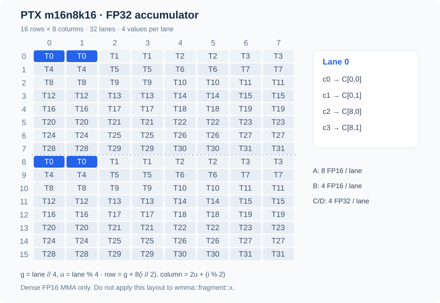
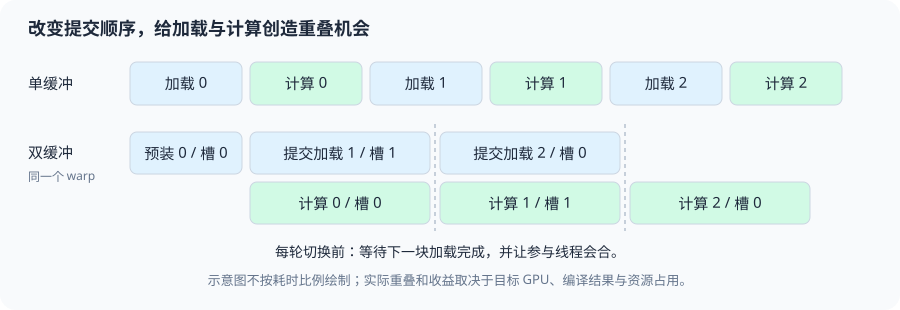

# 第三章 GEMM：从分块实现到性能优化

矩阵乘法的分块同时影响输入复用、累加器大小和 GPU 驻留资源。较大的输出 tile 让输入参与更多乘加，也需要保留更多部分结果。

从一个线程计算一个输出开始，再引入 shared tile、寄存器微块和矩阵指令，可以逐步看清地址、同步和资源需求怎样变化。已有 MatMul 配置扫描提供了相应的加速、退化与资源超限案例。

## 1. 先固定符号：输出坐标和归约坐标各有自己的名字

本章使用以下维度约定，后面的 CUDA 与 Triton 代码均按这套符号解释：

$$
A[M,N] \times B[N,K] = C[M,K].
$$

`M` 是输出行数，`K` 是输出列数，`N` 是归约长度。一个输出元素写成

$$
C_{m,k}=\sum_{n=0}^{N-1} A_{m,n}B_{n,k},
\qquad 0\le m<M,\ 0\le k<K.
$$

这里的 `N` 只在本章这套符号中表示归约轴。官方 Triton 教程以及许多线性代数资料常写成

$$
A[M,K] \times B[K,N] = C[M,N],
$$

此时 `N` 是输出列，`K` 才是归约轴。两套写法表达同一个矩阵乘法，但 `N` 与 `K` 不能在地址公式里交叉使用。对照关系是：本章用户命名的 `N` ↔ 官方惯例的 `K`；本章用户命名的 `K` ↔ 官方惯例的 `N`。

如果接口带缩放和旧输出，完整语义是

$$
C \leftarrow \alpha AB+\beta C_{old}.
$$

当 `beta=0` 时，数学上不需要 `C_old`，实现也不应为了计算结果去读它。这个细节与 NaN（Not a Number，非数）有关：若 `C_old` 里已有 NaN，直接执行 `0 * C_old` 仍可能产生 NaN；“beta 为零”应当成为 epilogue（尾部写回阶段）的分支语义，而不是依赖浮点乘法把旧值消掉。若 `beta` 非零，则必须声明旧 C 的读取、布局和别名条件。

### 1.1 一个地址例子消除维度歧义

令 `M=3, N=2, K=5`，所有矩阵都是 row-major（行主序），元素偏移从0开始。计算 `C[1,2]` 时，归约索引只有 `n=0,1`：

$$
\begin{aligned}
A[1,0]&\to 1\times2+0=2, & A[1,1]&\to 1\times2+1=3,\\
B[0,2]&\to 0\times5+2=2, & B[1,2]&\to 1\times5+2=7,\\
C[1,2]&\to 1\times5+2=7.
\end{aligned}
$$

因此这个输出元素的地址序列是 `m=1,k=2 → A:2,3 / B:2,7 / C:7`。换成官方惯例的 `A[M,K]B[K,N]=C[M,N]`，同一个物理例子会写成 `M=3,K=2,N=5`，计算 `C[1,2]` 时归约索引叫 `k=0,1`，地址仍然是 A 的 `[2,3]`、B 的 `[2,7]`、C 的 `7`。这正是符号映射的用途：坐标名字改变，物理地址和乘法语义不改变。

### 1.2 非整除形状：grid 和三种 mask

仍用本章命名，若 `M=65,N=33,K=67`，输出 tile 取 `BM=64,BK=64`，归约 tile 取 `BN=32`，二维 program grid 是

$$
grid=\left(\left\lceil\frac{M}{BM}\right\rceil,
\left\lceil\frac{K}{BK}\right\rceil\right)=(2,2),
$$

归约循环次数为 $\lceil N/BN\rceil=2$。最后一个 program 的有效输出行只有 `m=64`，有效输出列只有 `k=64,65,66`；最后一轮归约只包含 `n=32`。因此至少要分别表达：

- `A` load mask：`m < M && n < N`；
- `B` load mask：`n < N && k < K`；
- `C` store mask：`m < M && k < K`。

不能用输出 mask 代替 load mask，也不能把 `other=0` 只放在 A 而忘记 B。越界的 A/B 元素以零参与乘法，输出 tile 内有效位置仍得到完整的 N 项和；越界的 C 位置则绝不能写。CPU 账本检查脚本 cpu_gemm_checks.py 对这组形状枚举了 grid、归约轮次和有效坐标，且只依赖 Python 标准库。

## 2. 从原始实现读出：一个 CUDA thread 与一个 Triton program 各自负责什么

### 2.1 naive CUDA：每个线程拥有一个 C 元素

CUDA 代码中的 `thread` 是线程，`block` 是线程块；本节的 naive kernel 让每个线程计算一个输出元素。下面是用户原始文件 solutions/cuda/gemm/naive_float.cu 中的 kernel 摘录，保留原来的 `blockIdx.x→K`、`blockIdx.y→M` 映射。

<!-- source-check: solutions/cuda/gemm/naive_float.cu -->
~~~cpp
__global__ void matrix_multiplication_kernel(const float* A, const float* B, float* C,
                                             int M, int N, int K) {
    int k = blockDim.x * blockIdx.x + threadIdx.x;  // K 维度索引
    int m = blockDim.y * blockIdx.y + threadIdx.y;  // M 维度索引
    int idx = m * K + k;

    if ((k < K) && (m < M)) {
        float sum = 0;
        for (int n = 0; n < N; n++) {
            sum += A[m * N + n] * B[n * K + k];
        }
        C[idx] = sum;
    }
}
~~~

`idx=m*K+k` 是 C 的 row-major 偏移；A 的一行长度是 `N`，B 的一行长度是 `K`。线程先检查输出坐标，再沿归约轴 `n` 读取 A 的一行和 B 的一列。对一个 warp（线程束，通常由32个线程组成），相邻 lane 若映射到相邻 `k`，读取 B 的地址连续；但同一时刻读取 A 的位置可能相同，因为这些 lane 在计算同一 `m` 的不同 `k`。这不等于每个 lane 都向 DRAM 单独取一份数据：请求合并、缓存命中与真正的硬件事务是三个层次，必须结合地址和 profiler（性能分析器）观察。

每个线程的 `sum` 是寄存器中的标量累加器，循环结束才写 C。中间和没有写回 device DRAM（设备端动态随机存取存储器；具体设备可能是 HBM 或 GDDR）或 global memory 地址空间；如果每个 n 都写一次 partial sum，再由另一个 kernel 合并，流量和同步都会改变。地址空间是编程模型概念，物理存储是设备实现：RTX 3090 使用 GDDR6X，不能把 global memory 与 HBM 当作同义词。naive 版本的主要问题是同一输出 tile 中的线程反复请求相同的 A 行元素和相邻 B 列元素，硬件 cache 可能帮忙，但程序没有显式保证 block 内复用。

### 2.2 Triton：一个 program 代表一个输出 tile

Triton 的 `program` 是逻辑执行单元，不等于一个 CUDA thread。下面直接摘录用户服务器文件 solutions/triton/matmul.py 的核心 kernel。这里的用户命名仍是 `A[M,N]B[N,K]=C[M,K]`，所以 `BLOCK_M` 和 `BLOCK_K` 描述输出 tile，`BLOCK_N` 描述归约 tile。

<!-- source-check: solutions/triton/matmul.py -->
~~~python
@triton.jit
def matrix_multiplication_kernel(
    a,
    b,
    c,
    M,
    N,
    K,
    BLOCK_M: tl.constexpr = 64,
    BLOCK_N: tl.constexpr = 32,
    BLOCK_K: tl.constexpr = 64,
):
    pid_m = tl.program_id(0)
    pid_k = tl.program_id(1)

    offset_m = pid_m * BLOCK_M + tl.arange(0, BLOCK_M)
    offset_k = pid_k * BLOCK_K + tl.arange(0, BLOCK_K)

    ptr_c = c + offset_m[:, None] * K + offset_k[None, :]
    mask_c = (
        (offset_m[:, None] < M)
        & (offset_k[None, :] < K)
    )

    acc = tl.zeros((BLOCK_M, BLOCK_K), dtype=tl.float32)

    # A[M, N] @ B[N, K] = C[M, K]，N 是归约维度。
    for n in range(0, N, BLOCK_N):
        offset_n = n + tl.arange(0, BLOCK_N)

        ptr_a = a + offset_m[:, None] * N + offset_n[None, :]
        ptr_b = b + offset_n[:, None] * K + offset_k[None, :]

        mask_a = (
            (offset_m[:, None] < M)
            & (offset_n[None, :] < N)
        )
        mask_b = (
            (offset_n[:, None] < N)
            & (offset_k[None, :] < K)
        )

        tile_a = tl.load(ptr_a, mask=mask_a, other=0.0)
        tile_b = tl.load(ptr_b, mask=mask_b, other=0.0)
        acc += tl.dot(tile_a, tile_b, input_precision="ieee")

    tl.store(ptr_c, acc, mask=mask_c)
~~~

`offset_m` 的 shape 是 `[BLOCK_M]`，`offset_k` 的 shape 是 `[BLOCK_K]`；加上 `[:,None]` 和 `[None,:]` 后，`ptr_c`、`acc` 都是 `[BLOCK_M,BLOCK_K]`。`offset_n` 是 `[BLOCK_N]`，所以 `ptr_a` 为 `[BLOCK_M,BLOCK_N]`、`ptr_b` 为 `[BLOCK_N,BLOCK_K]`。这三个 shape 直接对应矩阵乘法的内积：

$$
[BM,BN]\times[BN,BK]\to[BM,BK].
$$

`grid=(cdiv(M,BLOCK_M),cdiv(K,BLOCK_K))` 只在输出 M/K 两个轴上展开；N 通过每个 program 内的循环消化。`tl.dot` 的结果累加在 FP32（32-bit floating point，32位浮点）`acc` 中，但 `input_precision='ieee'` 的含义仍需结合输入 dtype 和后端路径理解：accumulator 为 FP32 不等于乘法一定是 IEEE FP32，也不等于 Tensor Core（张量核心）路径与 SIMT（Single Instruction, Multiple Threads，单指令多线程）FMA（Fused Multiply-Add，融合乘加）路径相同。精度实验必须把 IEEE FP32、TF32、FP16 和 BF16 分开记录。

## 3. 分块层级：从复用动机走到线程、warp 和 CTA

### 3.1 naive、shared tile 与寄存器 tile

设一个 CTA（Cooperative Thread Array，协作线程阵列，即 CUDA 线程块）计算 `BM×BK` 的 C tile。最外层先由 `blockIdx` 或 Triton `program_id` 选择 tile；然后沿归约轴每次处理 `BN` 个元素：

$$
A_{tile}[BM,BN],\quad B_{tile}[BN,BK]
\longrightarrow Acc[BM,BK].
$$

naive 方案把 `Acc` 拆成一个线程一个标量；shared-memory tiling（共享内存分块）把 A/B 的当前归约 tile 先放入 CTA 共享存储，让多个线程重复消费；更进一步，每个线程可以维护多个输出元素，把 `Acc` 变成每线程的寄存器 tile。层级关系可以这样读：

1. global memory 地址空间：保存完整 A、B、C，实际可能落在设备 DRAM（HBM 或 GDDR，取决于 GPU）；
2. CTA shared memory：保存当前或相邻归约 tile，CTA 内线程共同可见，需要 barrier；
3. warp：一组线程共同推进指令，适合 warp-level matrix operation；
4. registers：每线程私有，适合保存部分和，但 tile 增大会快速增加寄存器需求。

每一层都对应真实成本。shared 减少了同一 CTA 对 global 的重复读取，却加入了搬运、地址转换、同步和 shared 资源占用。相对本章的 naive 版本，寄存器 tile 的优势不是“减少 C 的中间写回”：naive 已经让每个线程把 `sum` 保存在寄存器里，并且只写 C 一次。多输出/线程主要复用已经加载的 A/B 值，同时提供多条独立 accumulator 链来增加 ILP（Instruction-Level Parallelism，指令级并行）；代价是更多 accumulator、更多寄存器活跃值，可能降低 resident CTA 数量，甚至触发 spill（寄存器溢出）到 local memory。不能只看到“片上”二字就假定更快。

### 3.2 旧 tiled_fp16.cu 的坐标确实不同

用户原始文件 solutions/cuda/gemm/tiled_fp16.cu 采用另一套维度惯例：`A[M,K]B[K,N]=C[M,N]`，`K` 是归约轴、`N` 是输出列；并且 `blockIdx.x` 映射 M，`blockIdx.y` 映射 N，`threadIdx.x` 映射 m，`threadIdx.y` 映射 n。这份代码的数学命名不能直接套到 Triton 的 `BLOCK_N`/`BLOCK_K` 解释上。

下面保留其中装载、两次同步和计算的原始代码，用于逐行核对，不修改旧实现：

<!-- source-check: solutions/cuda/gemm/tiled_fp16.cu -->
~~~cpp
    // 遍历 K
    for (int t = 0; t < (K + tileLen - 1) / tileLen; ++t) {
        // 每个线程搬运自己负责的那块
        // A 矩阵按列步进
        int aK = t * tileLen + threadIdx.y;
        As[threadIdx.x][threadIdx.y] = (m < M && aK < K)
            ? A[m * K + aK] : __float2half_rn(0.0f);

        // B 矩阵按行步进
        int bK = t * tileLen + threadIdx.x;
        Bs[threadIdx.x][threadIdx.y] = (n < N && bK < K)
            ? B[bK * N + n] : __float2half_rn(0.0f);

        // 同步
        __syncthreads();

        // 计算
        for (int k = 0; k < tileLen; k++) {
            sum += __half2float(As[threadIdx.x][k]) *
                   __half2float(Bs[k][threadIdx.y]);
        }

        // 同步
        __syncthreads();
    }
~~~

这里 `tileLen=32`，`blockDim(32,32)` 启动1024个线程；`x→m,y→n` 的映射使一个线程块覆盖输出的 M/N tile，而共享数组用 `[x][y]` 写入 A、B。对固定 `t`，同一 warp 内通常是 `x` 变化、`y` 不变：A 装载地址的相邻 lane 字节步长是 `2*K_old`，B 装载地址的相邻 lane 字节步长是 `2*N_old`；最终 C 写回在相邻 lane 间沿 `m` 方向变化，字节步长是 `2*N_old`。这里的 `K_old`、`N_old` 指这份旧实现的 leading dimension，不要替换成 Triton 主符号里的 `BLOCK_K`、`BLOCK_N`。读代码时要先接受它的坐标合同，再谈“同一线程读取一列”或“相邻线程读取一行”。线程映射决定的是每个 lane 的具体地址；矩阵数学中的行列方向不能单独替代这个映射。

### 3.3 为什么需要两次 barrier

第一次 `__syncthreads()` 保证 CTA 中的线程已经完成当前 A/B tile 的写入，计算线程才可以读取完整 shared tile。第二次保证所有线程已经读完当前 tile，下一轮线程才能覆盖 `As`、`Bs`，否则快线程可能改写慢线程仍需使用的数据。`__syncthreads()` 同时提供 block 内的执行等待与内存排序语义；它不是“让某一线程等另一线程”的局部锁。

在这个协作装载实现中，没有有效 C 输出的线程仍可能负责有效的 shared 输入，不能仅依据输出 mask 提前退出。安全的尾块处理是为无效输入写零，保留协作线程到同步点，最后只对有效输出写回。CUDA 的 __syncthreads 等待尚未退出的线程，因此不能把所有提前 return 都称为必然死锁；要分别检查存活线程的同步控制流，以及退出线程是否留下未初始化或缺失的数据。

shared tile 的 padding 也要谨慎解释。对 `float tile[32][32]`，按列读取时的 bank 映射可能让多个 lane 落在同一 bank；把第二维改为33通常会改变映射。但 `half`（16-bit floating point，半精度浮点）每元素2字节，bank 的服务粒度、访问宽度和编译生成的向量访问会影响冲突表现，不能把 float32 的 bank 公式无条件套到 half。要分别写出 byte address、访问宽度和目标架构的 shared 访问规则，再以 profiler 或计数器核对。

### 3.4 “相邻线程访问连续”必须按同一条 warp 指令判断

判断 global coalescing（合并访问）时，先固定一条指令和一个 warp，写出 lane 到 byte address 的函数。若 lane `l` 访问 `base + 4*(q+l)`，且首地址相对32B边界对齐，32个 lane 覆盖连续128B，恰好落在四个32B segment；若首地址错开，连续128B可能跨过五个32B segment。若 lane `l` 访问 `base + 4*(q+stride*l)`，则 stride 增大后可能需要更多 segment。这里讨论的是同一条指令的 lane 集合，不是孤立观察“某个线程在读 B 的一列”。

shared staging 的复用则是另一个问题：同一 CTA 的多个输出元素是否消费同一个 A/B tile，能否在 tile 生命周期内重复利用。即使 global 请求已经由 L2 cache 命中，仍可能值得或不值得显式搬到 shared；需要把 cache 工作集、shared 搬运、barrier 和输出 tile 的计算量放在一起比较。

### 3.5 寄存器微块：一次读入，更新多个输出

本章仍使用 A[M,N]×B[N,K]，N 是归约轴。为避免与常见文献的 K 归约记号混淆，下面把一次归约 tile 的长度记为 R，输出 tile 记为 $B_M\times B_K$。

若一个线程只负责一个输出，每次归约需要一个 A 值和一个 B 值，只做一次 FMA。若它负责 $T_M\times T_K$ 个输出，则同一个归约位置 n 上，可以先取 $T_M$ 个 A 和 $T_K$ 个 B，再计算一次外积：

$$
C_{i,j}^{\mathrm{reg}}\mathrel{+}=
a_i^{\mathrm{reg}}b_j^{\mathrm{reg}},
\qquad 0\leq i<T_M,\quad0\leq j<T_K.
$$

它用 $T_M+T_K$ 个输入值更新 $T_MT_K$ 个累加器。忽略累加器读写与最终输出，仅对这一层输入算术强度计数：

$$
I_{\mathrm{shared\to reg}}=
\frac{2T_MT_K}{s(T_M+T_K)}.
$$

s 是每个输入元素的字节数。FP32 的 1×1 微块是 0.25 FLOP/B，4×4 微块是 1 FLOP/B。这里的 B 是 shared 到寄存器的逻辑输入字节，不是 DRAM 实测字节；不能把它直接放到整卡 HBM Roofline 上。

下面用普通列表展开外积，只为看清“取值”和“复用”的位置：

<!-- source-check: examples/mma_layout_checks.py -->
~~~python
def register_tile_gemm(a, b, thread_rows=2, thread_cols=3):
    """A list-based outer-product microtile model; not a CUDA register layout."""
    m, n, k = len(a), len(b), len(b[0])
    if thread_rows <= 0 or thread_cols <= 0:
        raise ValueError("positive microtile dimensions required")
    if any(len(row) != n for row in a) or any(len(row) != k for row in b):
        raise ValueError("A[M,N] and B[N,K] required")
    c = [[0.0 for _ in range(k)] for _ in range(m)]
    for row0 in range(0, m, thread_rows):
        for col0 in range(0, k, thread_cols):
            acc = [[0.0] * thread_cols for _ in range(thread_rows)]
            for reduction in range(n):
                ar = [a[row0 + i][reduction] if row0 + i < m else 0.0
                      for i in range(thread_rows)]
                br = [b[reduction][col0 + j] if col0 + j < k else 0.0
                      for j in range(thread_cols)]
                for i in range(thread_rows):
                    for j in range(thread_cols):
                        acc[i][j] += ar[i] * br[j]
            for i in range(thread_rows):
                for j in range(thread_cols):
                    if row0 + i < m and col0 + j < k:
                        c[row0 + i][col0 + j] = acc[i][j]
    return c
~~~

同一个 ar[i] 在内层 j 循环中复用，br[j] 在 i 循环中复用。这回答了“同一行是不是被每个线程重复读”：寄存器微块减少一个线程内部重复读取，shared tile 减少 CTA 内不同线程反复从 global 取数，L2 还可能缓解不同 CTA 的重复读取。它们分别作用于不同层次，不能由某一层的复用推出所有层都只读一次。

代价是 $T_MT_K$ 个累加器跨越整个归约循环存活，另有 A/B 暂存、地址和循环状态。微块越大，复用越好，但寄存器压力也越大。若被迫 spill 到 local memory，新增读写可能抵消复用收益。

### 3.6 CTA tile、warp tile 与指令 tile 怎样接起来

CTA（Cooperative Thread Array，CUDA 线程块）先拥有一个输出区域，再把区域分给 warp。设 CTA 输出为 128×128，warp 输出为 64×32，则需要：

$$
n_{\mathrm{warp}}=
\frac{128}{64}\frac{128}{32}=8.
$$

第 w 个 warp 的二维编号为 (⌊w/4⌋, w mod 4)。这是可以由程序选择的输出所有权；不是假定某个 WMMA fragment 内部的 lane 布局。

| warp | 输出行区间 | 输出列区间 |
|---:|---|---|
| 0 | 0..63 | 0..31 |
| 1 | 0..63 | 32..63 |
| 3 | 0..63 | 96..127 |
| 4 | 64..127 | 0..31 |
| 7 | 64..127 | 96..127 |

在全部输出都长期保存在 FP32 accumulator 的设计中，平均每 lane 持有 64×32/32=64 个结果。这是逻辑计数，不是编译器最终的 registers/thread；还有操作数、地址、predicate 和可能的重排临时值。若每个 warp 负责的区域不变，不能靠“加几个空闲 warp”自动分摊这些寄存器，必须改变输出所有权。

再以指令 tile 16×8、归约深度 16 为例，覆盖一个 64×32 warp tile 需要 4×4 个输出微块。若当前 R=32，还要走两个指令归约片段，共 32 次 warp 级 MMA。8 个 warp 总工作量为：

$$
8\times32\times(2\times16\times8\times16)
=2\times128\times128\times32.
$$

左右两边一致，是检查拆分是否漏算或重复计算的办法。一次 warp 级 MMA 不是一个 lane 的 FMA，也不承诺占一个时钟周期；不能把这个操作数计数直接当成 SASS 指令条数或延迟。

### 3.7 从逻辑矩阵坐标推导 128-byte shared swizzle

推导 swizzle 前先把“元素”固定到搬运粒度。本例把 shared tile 切成 16-byte chunk，`x` 是一行内的 chunk 列，`y` 是 chunk 行。一个 chunk 可装 8 个连续 half；CUDA 的 `int4` 若用于 16-byte 示意，指的是含四个 32-bit 分量的向量类型，不是 INT4 量化。swizzle 只重排 chunk 的位置，不重排 chunk 内的字节或 half 顺序。8×8 个 chunk 正好覆盖 1024B。

给定 128B 对齐的 shared 基址 `smem_ptr`，令 `offset=(smem_ptr/128)%8`。映射是

$$
x'=x\oplus((y+offset)\bmod 8),\qquad
addr=smem\_ptr + 16(8y+x').
$$

若基址 1024B 对齐，`offset=0`，即 `x'=x xor y`。例如 `base` 是 1024B 的倍数、`(x,y)=(3,5)`，则 `x'=3 xor 5=6`，chunk 地址为 `base+16(5×8+6)=base+736`；八个 half 位于 `base+736+2i`，`i=0…7`。若基址只保证 128B 对齐且 `offset=1`，同一点得到 `x'=3 xor 6=5`，地址为 `base+720`。`x'` 是 chunk 列而非 byte offset；忘记基址相位会在非 1024B 对齐时选错 XOR pattern。

这是 exact-cover 映射：固定任意 `y` 后，`(y+offset)%8` 是常量，而 `x→x xor constant` 是 0…7 上的置换；八行覆盖八个 `y`，所以 64 个逻辑 chunk 映到 64 个互不相同的物理 chunk。这个证明只说明没有地址重叠，不保证 consumer 指令没有 bank conflict。TMA descriptor、CuTe shared layout 与 WGMMA 的 shared descriptor 必须描述相同的物理布局；只在 producer 端手工 XOR 地址、让 consumer 仍按未 swizzle 的 row-major 解释，会读错数据。

下面以 32 个 bank、每 bank 4B 为地址模型。令 32 个 lane 访问 4 个 chunk 列×8 个 chunk 行，每 lane 读取 chunk 内相同的一个 32-bit word。无 swizzle 时每行跨度 `8×16=128B=32` 个 bank word，bank 相位不变：4 个 bank 各接收 8 lane。XOR 后这一组访问铺到 8 个 chunk 列：8 个 bank 各接收 4 lane。这个 8-way→4-way 只对这里明示的 lane 坐标、32-bit 访问和 8×8 tile 成立，不是所有 half load、向量指令、TMA 或 WGMMA 的通用结论；真实访问还受编译后指令分解、broadcast 与服务宽度影响，最终要看 SASS/NCU。

<!-- source-check: examples/cpu_hopper_swizzle_checks.py -->
```python
def swizzled_chunk_x(x, y, smem_base):
    """Map logical chunk (x,y) to physical x for a 128-byte swizzle.

    smem_base must be 128-byte aligned. The 1024-byte-aligned case has bias
    zero; an arbitrary 128-byte-aligned base selects one of eight XOR phases.
    """
    if type(x) is not int or not 0 <= x < SIDE:
        raise ValueError("x must be an integer in [0,7]")
    if type(y) is not int or not 0 <= y < SIDE:
        raise ValueError("y must be an integer in [0,7]")
    if type(smem_base) is not int or smem_base < 0 or smem_base % 128:
        raise ValueError("shared base must be a non-negative 128-byte multiple")
    offset = (smem_base // 128) % SIDE
    return x ^ ((y + offset) % SIDE)
```

<!-- source-check: examples/cpu_hopper_swizzle_checks.py -->
```python
def warp_bank_histogram(smem_base, word_in_chunk=0, swizzle=True):
    """Count banks for 32 lanes reading one 32-bit word from 32 chunks.

    Lane l maps to x=l//8, y=l%8. This is four chunk columns across eight
    rows, a concrete gather pattern that exposes the stride-versus-XOR effect.
    """
    if type(word_in_chunk) is not int or not 0 <= word_in_chunk < 4:
        raise ValueError("word_in_chunk must be in [0,3]")
    banks = []
    for lane in range(32):
        x, y = divmod(lane, SIDE)
        address = chunk_byte_address(smem_base, x, y, swizzle)
        address += word_in_chunk * WORD_BYTES
        banks.append((address // BANK_BYTES) % BANK_COUNT)
    return Counter(banks)
```

在仓库根目录运行 CPU 模型：

```powershell
python roadmap/curriculum/operators/03-gemm/examples/cpu_hopper_swizzle_checks.py
```

该 CPU 检查证明逻辑覆盖、base phase、chunk 内 half 顺序和上述 lane→address 函数的 bank 直方图；不模拟真实 bank arbiter，不执行 CUDA，也不能替代 TMA/WGMMA descriptor 检查或 GPU counter。

## 4. 算术强度与资源账本：每个符号都要标出统计范围

对一个输出 tile `BM×BK`、归约 tile `BN`，本轮乘加的 FLOPs（Floating-point Operations，浮点运算次数）是

$$
FLOPs_{tile}=2BM\times BN\times BK.
$$

乘法和加法各算一次。若只估计当前归约 tile 的理想输入 staging，元素大小为 `s` bytes，则输入字节数为

$$
Bytes_{in}=s\times BN\times(BM+BK).
$$

这里没有计入 C 的输出写入、`beta C_old` 的读取、padding 无效元素和 cache line/sector 的额外传输。相应的输入复用算术强度是

$$
AI_{reuse}=\frac{2BM\times BK}{s\times(BM+BK)}.
$$

分子使用的是整个输出 tile 在一个归约步中完成的 FLOPs，分母使用 A/B tile 各读一次的理想输入字节。`BN` 在分子分母中约掉，所以**在这个定义下增大归约 tile 不改变输入复用 AI**；它会改变归约循环次数、每次同步和流水线调度，而不是凭空制造更高的这个指标。

若有 `N` 个归约元素，归约迭代次数是 $\lceil N/BN\rceil$。增大输出列 tile `BK` 也不会减少归约迭代次数；它扩大的是一次输出 tile 的宽度、accumulator 数量和每个 program 的输出工作。把 `BK` 的变化解释成“归约次数变少”是维度混淆。只有改变 `BN` 才可能减少归约循环轮数，且仍要检查 shared、寄存器和同步成本。

逻辑上的 FP32 accumulator 总量可以写成

$$
Bytes_{acc,logical}=4BM\times BK.
$$

它只是“如果按4 bytes计数，每个输出部分和需要多少逻辑存储”的账本，不能直接当成实际寄存器字节数。编译器可能把元素拆到不同寄存器、采用向量寄存器分配、重排中间值，真实分配还受线程映射、指令选择和分配粒度影响。类似地，若流水线有 `S` 份同时驻留的完整输入 tile 缓冲，

$$
Bytes_{shared,estimate}=S\times s\times BN\times(BM+BK)
$$

只是 staging 估计，不能把 `S` 无条件写成 `num_stages`，也不能冒充编译器报告的精确动态 shared bytes。`num_stages=3` 是流水线配置，不直接证明有3份完整 A/B 输入 tile 同时驻留；编译器的流水化、复用、布局和后端实现共同决定实际 buffer 数。以 `BM=128,BN=32,BK=256,s=4` 为例，一份 A/B 输入 tile 是 `49,152B`；机械套 `S=3` 会得到 `147,456B`，超过该 RTX 3090 配置报告的 `101,376B` block 资源限制，但 s3 实际可以运行，Nsys 只显示约 `0.098 MB` dynamic shared metadata。这个现象说明该日志中的有效驻留缓冲约相当于两份/一份的实现量级，不能泛化到所有 kernel 或版本。padding、对齐、布局转换和临时缓冲也可能改变实际值。`acc` 的逻辑 `131,072B` 是输出部分和账本，不能加进 shared 估算，也不能当作实测寄存器分配。

grid 的输出规模为

$$
grid=\left\lceil\frac{M}{BM}\right\rceil
\times\left\lceil\frac{K}{BK}\right\rceil.
$$

wave quantization 可以先用一个不依赖具体 GPU 的整数例子理解：假设并行容量是8个等时 CTA，有17个 output tile，理想调度需要3个波次，前两波各8个，末波只有1个；按槽位计算的末波填充率是 $17/(3\times8)=17/24$，约70.83%。这只是调度容量的极简算例，不表示硬件存在一个全局 wave barrier；不同 CTA 可以按硬件调度器的可用资源陆续发射，末波的空槽只是并行度没有完全填满。

tile 变大通常减少 program 数量，却可能造成 wave quantization（波次量化）：最后一波只剩少数 CTA，SM（Streaming Multiprocessor，流式多处理器）利用率下降。小 `M` 或小 `K` 时，grid 本来就可能不足以填满 GPU；大 tile 还会增加尾部浪费。输出 tile 越大，寄存器和 shared 资源越多，occupancy（驻留占用率）可能下降。资源账本要把“单 tile 工作量”“每 block 资源”“全 grid 并行度”分开。

同一个 GEMM 还可以按不同统计范围得到不同 AI。对 `M=8192,N=6144,K=4096`、FP32、`alpha=1,beta=0`，总 FLOPs 为 `412316860416`。若把完整 A、B 各从 DRAM 读一次，再把 C 写一次，理想字节数是 `436207616B`，得到

$$
AI_{whole,ideal}=\frac{412316860416}{436207616}=945.230769\ \mathrm{FLOP/B}.
$$

若只按 `BM=128,BN=32,BK=256` 的二维 grid、192轮归约计算每个 CTA 每轮都重新从 global memory 读 A/B，不计 cache 命中，则输入总量为 `9663676416B`，加上 C 输出 `134217728B` 得 `9797894144B`，于是

$$
AI_{grid,uncached}=\frac{412316860416}{9797894144}=42.08219\ \mathrm{FLOP/B}.
$$

而单个归约轮的 input-only tile 复用 AI 是 `42.666667 FLOP/B`。三者的统计边界不同，并不矛盾：第一项假设完整输入只取一次，第二项把 CTA/归约轮的重复 global load 展开，第三项只观察一个 tile 的 A/B 输入而不计 C。真实 DRAM/L2 流量必须由 counter 测量，不能直接把任一理论 AI 当作实测 Roofline（屋顶线性能模型）坐标；这个分层对照也正好回答“不同 CTA 重复读是否浪费”——它量化了最坏的重复读取上界，却没有假装 cache 实际命中为零。

CPU 脚本对 `BM=64,BN=32,BK=64,s=4` 算出当前 tile 的输入字节为16384、理想输入 AI 为16 FLOP/B；这不是 GPU 测得的带宽，也不包含 C/旧 C。它的作用是防止推导时把输出列 tile、归约 tile 和元素大小混在一起。

## 5. SIMT FMA、Tensor Core 和 WMMA：指令语义先于峰值数字

SIMT（Single Instruction, Multiple Threads，单指令多线程）路径通常以线程为粒度执行标量或向量 FMA；Tensor Core 是 GPU 中面向矩阵乘加的专用计算单元。WMMA（Warp Matrix Multiply-Accumulate，线程束矩阵乘加）是 CUDA C++ 暴露的 warp-level 矩阵接口，MMA（Matrix Multiply-Accumulate，矩阵乘加）也常用来泛指对应的矩阵指令族。PTX（Parallel Thread Execution，并行线程执行）是 CUDA 编译链中的虚拟指令表示，SASS 是目标 GPU 的实际机器指令表示；看到 API 名称不能直接推断最终指令路径。

### 5.1 `tl.dot` 的 acc 类型不等于乘法输入路径

本章 Triton kernel 明确写了 `tl.zeros(..., dtype=tl.float32)` 和 `input_precision="ieee"`。前者说明中间 accumulator 的逻辑类型，后者要求 Triton 按 IEEE 输入精度语义选择对应路径；它不能被简化成“所有乘法都使用全精 FP32 Tensor Core”。`tl.dot` API 当前列出 `tf32`、`tf32x3` 和 `ieee` 等输入精度选项；对 FP32 输入选择 TF32 路径时，输入可能被截断到 TF32 的有效精度，且 API 说明不能支持“必然 round-to-nearest（四舍五入到最近值）”这样的强表述。服务器版本保留 `ieee`，因此 IEEE FP32 结果和 TF32 实验必须分表。

TF32（TensorFloat-32，张量浮点32）与 FP32 accumulator 是两个维度：TF32描述输入乘法的有效精度，FP32描述累加状态。FP16（16-bit floating point，半精度浮点）和 BF16（Brain Floating Point 16，脑浮点16）也有自己的输入位宽、指数/尾数布局和累加选择。以下四类实验不能放在一张“优化后更快”的表里互相作分母：

一个只用于 CPU 数值模型的反例可以把两件事分开。令 `A=[1.0001,1]`、`B=[1,-1]^T`，FP32 保存后的第一个数实际为 `1.000100016593933`，因此 IEEE FP32 点积约为 `0.000100016593933`。若先把输入降成约10位 fraction 的 TF32 值，第一个数可变成 `1.0`，再用 FP32 accumulator 计算，结果为 `0`。这个例子无论具体硬件选择就近舍入还是截断，都只用于说明：输入信息一旦在乘法前丢失，FP32 accumulator 不能恢复它；它不是 GPU measurement，也不替代目标设备上的误差报告。

| 实验标签 | 输入乘法语义 | 常见累加语义 | 可以回答的问题 |
|---|---|---|---|
| IEEE FP32 | 保留 IEEE FP32 输入要求 | FP32 | 严格 FP32 baseline 的时间与吞吐 |
| TF32 | FP32 输入进入 TF32 近似路径 | FP32 | 允许输入精度变化后，矩阵路径的收益与误差 |
| FP16 | FP16 输入 | FP32 或 FP16，需写明 | 半精度输入的带宽/矩阵指令行为 |
| BF16 | BF16 输入 | 通常 FP32，需写明 | 更大指数范围下的低精度计算取舍 |

FLOPs 仍可按 `2MNK` 统计，但性能分母必须与该实验的精度和硬件路径对应。IEEE FP32 的结果不能拿稠密 FP16 Tensor Core 峰值或稀疏 Tensor Core 峰值作分母；稀疏路径还会改变有效运算定义。吞吐表应同时给出 dtype、输入精度、累加精度和误差阈值。

### 5.2 WMMA 的 warp 参与条件与 fragment 不透明性

CUDA Programming Guide 13.3 §5.4.11 的关键限制比“调用一次 `mma_sync`”更重要：一个 WMMA 操作要求整个 warp 参与；fragment 内部元素如何分配到 lane 是 opaque（不透明的），不能假定某个 lane 持有哪几个矩阵元素，也不能把自己观察到的一种编译结果当作 ABI 合同。`load_matrix_sync` 和 `store_matrix_sync` 接收 mptr、leading dimension 与 layout 参数，这些参数要由整个 warp 一致提供；`mma_sync` 接收匹配的 fragment，fragment 类型/形状和 warp 控制流也必须一致。条件判断不能让部分 lane 绕过这些操作。

概念性的 API 片段如下，它只展示前提和调用关系，不构成新 kernel 或未经验证的性能实现：

~~~cpp
// 仅示意：完整 warp 必须一致到达这些操作，fragment 元素映射不能手算假定。
wmma::fragment<wmma::matrix_a, 16, 16, 16, half, wmma::row_major> a_frag;
wmma::fragment<wmma::matrix_b, 16, 16, 16, half, wmma::row_major> b_frag;
wmma::fragment<wmma::accumulator, 16, 16, 16, float> acc_frag;
wmma::fill_fragment(acc_frag, 0.0f);
// a_ptr/b_ptr 是当前矩阵 tile 的起始指针，不代表任意 stride slice。
wmma::load_matrix_sync(a_frag, a_ptr, lda);
wmma::load_matrix_sync(b_frag, b_ptr, ldb);
wmma::mma_sync(acc_frag, a_frag, b_frag, acc_frag);
wmma::store_matrix_sync(c_ptr, acc_frag, ldc, wmma::mem_row_major);
~~~

WMMA 的 load/store 条件包括 mptr 需要256-bit、即32B对齐；对 half，leading dimension 是8的倍数，对 float 是4的倍数，它们都对应16B的 stride 条件。mptr、ldm、layout 参数由整个 warp 一致提供。以为“地址对齐了就能随便选择 ldm”会把合法性条件漏掉。

TF32 的 WMMA 也不能从 half 片段直接类推。TF32 接口要求对 FP32 输入显式使用 `__float_to_tf32`，其 WMMA 形状是 `16×16×8`；这与 half 输入常见的 `16×16×16` 形状不是同一个接口组合。fragment 跨不同编译架构传递也不安全，这一 ABI 边界意味着：需要跨函数或跨编译单元传递时，应重新设计数据接口，不能依赖 fragment 内部布局。

### 5.3 矩阵指令何时值得引入

至少要先确认四件事：输入 dtype 与目标 MMA 形状匹配；矩阵指针和 leading dimension 满足对齐/倍数要求；一个 warp 的控制流和参数一致；输出 accumulator 的精度和 epilogue 误差符合接口。还要确认 tile 的 M/N/K 能够被这些微型矩阵块合理覆盖，尾部是否使用额外路径或 padding。下面先明确一条 PTX 指令的布局，再用小规模 WMMA 实现验证完整 warp、padding 和写回；性能优化以正确的形状和数值合同为起点。

### 5.4 明确到一条 PTX MMA，才能讨论 lane 布局

CUDA WMMA 的 fragment 内部存储不透明；PTX 的具体 MMA 指令则有自己的操作数布局合同。下面只研究 dense FP16 输入、FP32 accumulator 的 m16n8k16，不把它推广到其他形状、稀疏类型或 CUDA fragment.x。

这里的指令名沿用局部 m/n/k：输出为 16×8，归约深度为 16。它的局部 n 对应本章输出列方向，局部 k 对应本章归约 N 的一小段，不是变量名恰好相同就能直接替换。

一个 lane 持有 A 的 8 个 half、B 的 4 个 half 和 C/D 的 4 个 float。输入 half 两两打包，分别对应 4 个和 2 个 32-bit 操作数寄存器；这仍不包含整个 kernel 的其他寄存器。

令 g=⌊lane/4⌋、u=lane mod 4。第 i 个 accumulator（i=0..3）的坐标为：

$$
r=g+8\lfloor i/2\rfloor,\qquad
c=2u+(i\bmod2).
$$



图中的 lane 0 拥有 (0,0)、(0,1)、(8,0)、(8,1)，不是一条连续的 4 元素行。下面把 A/B/C 的坐标都展开，随附测试枚举 32 个 lane，检查三个矩阵的每个元素恰好被覆盖一次：

<!-- source-check: examples/mma_layout_checks.py -->
~~~python
def mma16816_f16_coords(lane):
    if not isinstance(lane, int) or not 0 <= lane < 32:
        raise ValueError("lane must be an integer in [0,31]")
    group, member = divmod(lane, 4)
    a = [(group + 8 * ((i // 2) % 2),
          2 * member + i % 2 + 8 * (i // 4)) for i in range(8)]
    b = [(2 * member + i % 2 + 8 * (i // 2), group) for i in range(4)]
    c = [(group + 8 * (i // 2), 2 * member + i % 2) for i in range(4)]
    return {"A": a, "B": b, "C": c}
~~~

这个坐标函数描述指令输入输出，不是在猜 CUDA WMMA 的 ABI。真实 kernel 还需要通过正确的 shared layout、矩阵加载或寄存器重排把数据送到这些操作数中。global 合并访问、shared bank 行为和最终寄存器布局是三次不同的映射，单独让其中一次连续并不能保证全链路高效。指令合同依据 [NVIDIA PTX ISA 的矩阵片段说明](https://docs.nvidia.com/cuda/parallel-thread-execution/index.html#warp-level-matrix-fragment-mma-16816-float)。

### 5.5 一个能够处理尾块的 WMMA kernel

WMMA load 本身不接受逐元素 mask。对任意 M/N/K，不能把不完整的 global 尾块直接交给一次完整矩阵加载。下面先由整个 warp 合作填充规则的 shared tile，越界输入写零，WMMA 只读这个合法 tile，最后再按输出边界写回。

接口仍是 FP16 A[M,N]×B[N,K]→FP32 C[M,K]，不包含 beta、bias 或 activation。每个 CTA 恰好一个完整 warp，负责一个 16×16 输出块：

<!-- source-check: examples/wmma_padded.cu -->
~~~cpp
__global__ void wmma_padded_kernel(const half* A, const half* B, float* C,
                                   int M, int N, int K) {
#if __CUDA_ARCH__ >= 700
    __shared__ __align__(32) half As[256];
    __shared__ __align__(32) half Bs[256];
    __shared__ __align__(32) float Cs[256];
    const int lane = threadIdx.x;
    const int tile_m = blockIdx.y * 16;
    const int tile_k = blockIdx.x * 16;
    wmma::fragment<wmma::accumulator, 16, 16, 16, float> acc;
    wmma::fill_fragment(acc, 0.0f);

    for (int n0 = 0; n0 < N; n0 += 16) {
        // Every lane participates in both loads; out-of-range axes are zero-filled.
        for (int x = lane; x < 256; x += 32) {
            const int r = x / 16;
            const int c = x % 16;
            const int a_m = tile_m + r;
            const int a_n = n0 + c;
            const int b_n = n0 + r;
            const int b_k = tile_k + c;
            As[x] = (a_m < M && a_n < N) ? A[a_m * N + a_n] : __float2half(0.0f);
            Bs[x] = (b_n < N && b_k < K) ? B[b_n * K + b_k] : __float2half(0.0f);
        }
        __syncwarp();
        wmma::fragment<wmma::matrix_a, 16, 16, 16, half, wmma::row_major> a_frag;
        wmma::fragment<wmma::matrix_b, 16, 16, 16, half, wmma::row_major> b_frag;
        wmma::load_matrix_sync(a_frag, As, 16);
        wmma::load_matrix_sync(b_frag, Bs, 16);
        wmma::mma_sync(acc, a_frag, b_frag, acc);
        __syncwarp();
    }

    wmma::store_matrix_sync(Cs, acc, 16, wmma::mem_row_major);
    __syncwarp();
    for (int x = lane; x < 256; x += 32) {
        const int r = x / 16;
        const int c = x % 16;
        const int out_m = tile_m + r;
        const int out_k = tile_k + c;
        if (out_m < M && out_k < K) C[out_m * K + out_k] = Cs[x];
    }
#endif
}
~~~

先看填充循环：256 个元素分给 32 个 lane，每个 lane 写 8 个位置。A 的 mask 检查 M 与归约 N，B 的 mask 检查归约 N 与输出 K。无效元素写零，但无效输出位置对应的线程仍参与所有 WMMA 操作，不能提前 return。

32-byte 对齐的 As/Bs 是 WMMA 输入地址；half 的 ldm=16 对应 32-byte 行距。Cs 是 float，ldm=16 也满足接口要求。C 的 global 行距可以不是 WMMA 接口要求的倍数，因为 store_matrix_sync 写的是规则 Cs，再由普通标量写回任意尾块。

为何这里能用 syncwarp？因为 host 只启动 32 个线程，所有 shared 生产者和消费者都在这个 warp 内。把启动线程数改成 256，并不会自动变成“八个 warp 的高性能 GEMM”：原来同一块 shared 和输出区域会被多个 warp 重复操作，必须先重新设计 warp 所有权与同步范围。

host 校验使用已经转换为 half 的同一份 A/B，再转为 double 做参考累加。这样比较的是矩阵计算误差，而不是把 FP16 输入舍入误差混进结果。完整程序包含 1×1×1、16×16×16、17×19×21 和 33×65×7 四组 M/N/K，打印设备身份并检查非有限结果。

### 5.6 从正确性示例到高性能 kernel，还隔着什么

这个例子为了暴露边界，使用一个 warp、一个输出小块和同步填充。它没有跨 warp 复用、异步 global-to-shared 流水线或优化 epilogue，因此不能期待它接近库 GEMM，更不能拿它与已有 IEEE FP32 记录直接比速度。

下一步每次只改一个层次：扩大 CTA 复用区域；分配 warp 输出块；选择匹配的 shared 与指令布局；引入异步搬运；最后优化写回。扩大 CTA 后，正确性首先取决于所有权和同步，再去看 shared、寄存器、指令及吞吐。

对 WMMA accumulator 做所有元素相同的线性缩放可以遍历 fragment.x；但需要输出行列坐标的 bias、mask 或列缩放，不能把 fragment.x 的数组下标直接解释成矩阵坐标。这里通过 Cs 写回，正是把不透明寄存器表示转换回明确的二维坐标。

## 6. 流水线、异步搬运与跨 CTA 拆分

### 6.1 stage 数量首先是一笔存储预算

一个 stage 保存一次归约迭代的 A/B tile。输出 $B_M\times B_K$、归约 tile 为 R、两个输入都为 s 字节时，S 个 stage 的数据区为：

$$
M_{\mathrm{stage}}=S\,R(B_M+B_K)s.
$$

例如 $B_M=B_K=128$、R=32、FP16 输入，单 stage 是 16384 bytes，三 stage 为 49152 bytes，四 stage 为 65536 bytes。barrier、padding、swizzle 布局和 epilogue staging 还可能增加实际分配。这组 FP16 账本不能用于反推已有 IEEE FP32 Triton kernel 的动态 shared metadata。

累加器并不随每个归约 stage 各存一份；它跨归约循环保留输出 partial sum。但流水化可能延长 A/B fragment、地址和中间值的活跃区间。因此“stage 多一份”不等于“寄存器也固定多同样一份”。

Triton 的 num_stages 是编译调度配置，不是直接指定某个硬件功能。到底用了普通 load/store、cp.async 还是 TMA，要由目标架构和生成代码确认。

### 6.2 环形缓冲区：空闲和就绪必须分别证明

对第 t 个归约 tile，S 个槽位循环复用：

$$
\operatorname{slot}(t)=t\bmod S,\qquad
\operatorname{generation}(t)=\lfloor t/S\rfloor.
$$

slot=0 在第 0 轮和第 S 轮指向同一片 shared 地址，但不是同一份数据。generation 区分同一地址上的不同使用轮次。异步拷贝完成表示新数据可读；最后一个消费者完成才表示旧数据可覆盖。

| 状态 | 已经知道什么 | 下一步允许什么 |
|---|---|---|
| EMPTY | 上一轮读者全部完成 | 生产者取得槽位 |
| IN_FLIGHT | 已提交拷贝 | 等待完成，不得读取 |
| READY | 对应拷贝已完成且满足可见性条件 | 消费者读取 |
| READING | 仍有读者使用 | 不能发起覆写 |
| 回到 EMPTY | 最后读者释放 | 下一 generation 可复用 |

以 7 个归约 tile、3 个槽位为例，先提交 0、1、2；消费 0 后才向槽 0 提交 3；消费 1 后才向槽 1 提交 4。最后即使槽中分别留下 6、4、5，也必须按归约顺序消费 4、5、6，不能按物理槽号结束循环。

<!-- source-check: examples/tile_pipeline_model.py -->
~~~python
def pipeline_protocol(tiles: int, stages: int):
    """离散地模拟环形 slot：EMPTY -> IN_FLIGHT -> READY -> READING -> EMPTY。"""
    if not isinstance(tiles, int) or tiles < 0:
        raise ValueError("tiles must be a non-negative integer")
    if not isinstance(stages, int) or stages <= 0:
        raise ValueError("stages must be a positive integer")

    events = []
    slots = [None] * stages

    def consume(slot):
        tile, generation = slots[slot]
        events.extend(
            (
                (tile, slot, generation, "copydone"),
                (tile, slot, generation, "read"),
                (tile, slot, generation, "release"),
            )
        )
        slots[slot] = None

    initial = min(stages, tiles)
    for tile in range(initial):
        slot = tile % stages
        generation = tile // stages
        events.append((tile, slot, generation, "prefill"))
        slots[slot] = (tile, generation)

    for tile in range(tiles):
        slot = tile % stages
        consume(slot)
        next_tile = tile + stages
        if next_tile < tiles:
            generation = next_tile // stages
            events.append((next_tile, slot, generation, "prefill"))
            slots[slot] = (next_tile, generation)

    validate_trace(events, stages)
    return events
~~~

这是只检查事件关系的 CPU 模型。copydone 在它生成的 trace 中表示观察到了完成，不模拟硬件何时完成；验证器允许不同槽的拷贝先后完成不同，但要求消费仍按 tile 顺序，并拒绝未完成读取、未释放覆盖、重复 tile 和错误 generation。

只写 t%S 很容易把生命周期问题掩盖掉：索引数值合法，不意味着当前槽位已经空闲。尾部不足 S 个 tile 时，同样要排空真实提交过的工作，不能等待一个从未发出的 batch。

### 6.3 延迟隐藏为什么不是 stage 越多越好

设一个未来 tile 从提交到可用需要 $L_{\mathrm{copy}}$，当前 tile 的有效计算时间为 $T_{\mathrm{compute}}$。粗略地，预取提前量能覆盖的时间约为 $(S-1)T_{\mathrm{compute}}$。若它明显小于 $L_{\mathrm{copy}}$，当前迭代就可能等数据。

这只是调度假设。带宽不足时，增加 stage 不会创造新的带宽；取数吞吐低于消费吞吐时，等待仍会持续。stage 增加还可能把每 SM resident CTA 从两个降到一个，使其他 warp 更难补上空档。

资源上界应同时考虑：

$$
n_{\mathrm{CTA/SM}}\leq
\min\left(
\left\lfloor\frac{\mathrm{Reg}_{\mathrm{SM}}}{\mathrm{Reg}_{\mathrm{CTA}}}\right\rfloor,
\left\lfloor\frac{\mathrm{Smem}_{\mathrm{SM}}}{\mathrm{Smem}_{\mathrm{CTA}}}\right\rfloor,
\left\lfloor\frac{\mathrm{Threads}_{\mathrm{SM}}}{\mathrm{Threads}_{\mathrm{CTA}}}\right\rfloor,
n_{\mathrm{arch\ limit}}\right).
$$

Reg 按 32-bit 寄存器个数统计，Smem 按字节统计，Threads 按线程数统计。分配粒度、每 block 上限和架构限制仍要由编译器与设备能力核对。这是驻留上界，不是实测 active/eligible warp，更不是 achieved occupancy。

### 6.4 判断等待的是拷贝、读者还是矩阵指令

至少区分三种完成：global→shared 拷贝完成、矩阵操作对 shared 的读取完成、累加器结果可消费。同步 WMMA 示例把它们保守地串起来；异步矩阵指令则可能在发起线程继续执行时仍读取 shared，不能仅凭 CPU 已发出指令就回收槽位。

warp specialization 让固定的生产者 warp 负责搬运，消费者 warp 负责矩阵计算。它可能减少计算 warp 的地址和搬运指令，也增加角色间握手与资源分配问题。生产者不用保存输出累加器，但消费者可能需要更多寄存器；不能用 CTA 平均数替代每类 warp 的实际压力。

在一个完整优化实验里，记录以下证据：

| 改动 | 预期变化 | 必须同时排除的问题 |
|---|---|---|
| 增大输出 tile | 更高输入复用、更少 CTA | 寄存器、尾块浪费和 resident CTA 减少 |
| 增大归约 tile R | 循环与提交次数可能减少 | shared 占用、对齐、末尾归约 padding |
| 增加 stage | 更早发起搬运，可能少等数据 | 容量上限、spill、并行驻留下降 |
| 改 shared layout | 更合适的矩阵加载与 bank 行为 | 额外地址/重排指令、global 加载变散 |
| 增加 consumer warp | 单 warp 的工作可能变小 | 所有权是否真的改变、协作开销是否增加 |

NCU 的 source/instruction、memory、scheduler 和 occupancy 信息要对照 kernel 时间一起读。long-scoreboard 一类现象可能涉及不同的内存依赖，不能只看一个 stall 标签就断言是 HBM 带宽不足；同样，Tensor Core 利用率低也可能是数据供应、依赖链或工作量太小。

### 6.5 persistent、split-K 和 sliced-K 是三种不同拆分

Persistent GEMM 让固定的一组 CTA 长时间驻留并循环处理多个 output tile。普通 GEMM 通常也只需一次 kernel launch；persistent 的潜在收益在于摊薄 CTA/每个 tile 的 prologue、工作分配和调度开销，而不是自动减少 kernel launch 次数。它会改变调度、资源占用和负载均衡条件，适用于特定形状和工作集，不能从单个大 shape 推广到所有 GEMM。

文献中的 split-K/sliced-K 名称沿用 `A[M,K]B[K,N]=C[M,N]` 的惯例，其中 K 是归约轴；映射到本章 `A[M,N]B[N,K]=C[M,K]` 后，文献的 split-K/sliced-K 实际都是切本章的 `N`，本章的 `K` 仍是输出列。split-K 把同一个输出 tile 的本章 N 归约轴切给多个 CTA：每个 CTA 生成 partial sum，最后需要另一个合并阶段或原子加。它增加并行度，尤其可能帮助本章 `M` 或输出 `K` 很小而归约 `N` 很长的形状；代价是 partial workspace、额外读写、合并同步和浮点加法重排。

sliced-K 按 CUTLASS 的层级定义，把文献归约 K（映射到本章归约 N）切给同一个 CTA 内的不同 warp，让它们共同完成一个输出 tile，再在 CTA 内合并；这里的 sliced-K 不是切本章输出列 K。它与 split-K 的关键区别在于工作是否跨 CTA：sliced-K 可把合并保留在 CTA/warp 协作范围内，split-K 的 partial 结果需要跨 CTA 可见的合并路径。warp specialization（warp 专门化）还可能让一部分 warp 负责搬运、一部分负责计算；这样会改变 barrier、寄存器活跃区间与资源平衡，不等于简单增加 `num_warps`。

split-K 的 partial sum 应先按 raw partial 累加结果合并，再统一执行 epilogue。`alpha` 是线性项，可以在满足数值和接口要求时分配到 partial 或最终阶段，但不同分配会改变舍入顺序；`beta C_old`、bias 与输出写回必须各计一次，不能让每个 partial 都重复叠加。GELU（Gaussian Error Linear Unit，高斯误差线性单元）等非线性不能在各 partial 独立执行，否则合并后的函数值不再等于原始 GEMM 语义。partial 合并顺序不同，也会造成可测的 FP32 数值差异；CPU 脚本用标准库的简化模型展示了这一边界。

### 6.6 两组 warp 分工之后，为什么每个槽位需要两种通知

把 CTA 内的一部分 warp 指定为 producer，另一部分指定为 consumer，称为 warp specialization。Producer 负责发起下一块 A/B 的搬运；consumer 负责当前块的矩阵计算。这改变的是线程职责，不是简单地把 num_warps 调大。

设有 S 个 shared 槽位，第 t 轮使用：

$$
s=t\bmod S,\qquad g=\left\lfloor\frac{t}{S}\right\rfloor.
$$

s 表示物理槽位，g 表示这个槽位第几次被使用。S=2 时，轮次 0 和 2 都用槽位 0，但它们的数据不是同一代。只记录“槽位 0 已经 ready”，会让下一轮误用上一轮留下的通知。

每个槽位需要区分 full 和 empty 两个事件。Full 表示本代数据已经完成搬运，consumer 可以读；empty 表示上一代全部读者已经完成，producer 可以覆盖。读者刚看到 full，并不能立即发布 empty；发出矩阵指令，也不一定意味着指令已经读完 shared。

下面是协议伪代码，不是可以直接编译的 CUDA 或 CUTLASS API。每个角色中的推进操作由该角色约定的参与者协同执行，release 由协议指定的线程发出，避免把一组完成通知重复计数：

~~~text
producer：
    对每个归约 tile t：
        s, g = t % S, t // S
        等待槽位 s 的上一代全部读者释放；首次使用直接获得空槽
        为本代 A/B 搬运登记事务，并发起异步加载
        将本代 full 通知绑定到搬运完成，而不是在发起后直接宣布完成

consumer：
    对每个归约 tile t：
        s, g = t % S, t // S
        等待槽位 s、本代 g 的 full
        发起使用 A[s]、B[s] 的矩阵计算
        等待包含本次读取的矩阵操作完成
        按协议发布槽位 s 的 empty，允许下一代覆写
    等待剩余矩阵组完成，再读取 accumulator、执行 epilogue
~~~

为了清楚，这个协议在每轮等待当前矩阵操作完成。高性能实现可以让多个矩阵组同时在途，但必须维护“哪一组最后读取了哪个槽位”的对应关系。完成较早的一组，不表示其他组使用的 shared 也可复用。epilogue 读取 accumulator 前，则必须等待所有相关计算完成。

硬件 phase parity 只有一位，通常在槽位每次复用时翻转。它不是无限增长的 g，也不能仅凭 parity 判断任意旧通知属于哪一代。正确性还依赖有限槽位、生产者不能超前覆盖、消费者按约定顺序推进等约束。实现中 full/empty 的初始 parity 可能不同，不应把两个初值机械地都设成零。

### 6.7 到达计数取决于协议，不取决于代码里有几个 warp

最简单的 CTA barrier 可以让所有线程 arrive，因此按 blockDim.x 初始化。但角色分离之后，有的 barrier 只接收 producer 的到达，有的只接收 consumer 的释放，还有的将 TMA 完成字节作为额外条件。初始化前必须写出哪些线程会执行几次 arrive。

例如，一个 128-thread consumer 组完成读取后，若约定只由一名代表发布 empty，就按这一份通知设计计数；若实际接口要求组内每个线程参与，则按全部参与者计算。把“一名代表通知”改成“所有线程通知”，却不改计数，会破坏代际关系。反过来，计数期待 128 次，却只有一个线程执行，也会让 producer 一直等待。

warp-specialized 热循环里也不能随意插入 CTA-wide syncthreads：当 consumer 到达它时，producer 可能正在等待 consumer 发布 empty，形成循环等待。用全 CTA barrier 包住每一步即使能运行，也可能把原本想重叠的两个角色重新串行化。

### 6.8 WGMMA 的 warpgroup 与普通 warp 不是同一个执行单位

WGMMA 是 Warpgroup Matrix Multiply-Accumulate，warpgroup 级矩阵乘加。以 Hopper 对应的这组 PTX 指令为例，一个 warpgroup 由四个连续 warp 构成，首个 warp 的编号必须是 4 的倍数。warp 0–3 可以组成一组，warp 4–7 可以组成另一组；warp 1–4 不能拼成合法的一组。

因此，“warp 0 专门搬运，warp 1–4 做 WGMMA”不是正确的角色划分。一个用于讨论的划分是让 warp 0–3 计算、warp 4 搬运，共 160 个线程；是否采用它，还要结合实现支持的 CTA 配置和寄存器资源，而不是据此认定它最优。

相关同步也要分开：wgmma.fence 处理普通寄存器访问与异步矩阵操作之间的顺序；wgmma.commit_group 将已发起的矩阵操作组成组；wgmma.wait_group 等待对应组完成。它们不能互相替代，也不能用 TMA 的 bulk wait 代替。WGMMA 的组内一致执行、寄存器 fragment、shared descriptor 与 proxy 顺序均需满足具体指令合同。

这里的 WGMMA 指令以 sm_90a 为目标边界，不能与普通 sm_90 的一维 bulk TMA 示例混成同一个编译要求。后续架构也不能只凭型号更新，就沿用完全相同的矩阵存储对象和完成协议。

### 6.9 多一个 stage 的收益，先从资源和临界路径解释

沿用本章 A[M,N]、B[N,K] 的命名，取 BM=128、BN=32、BK=128，FP16 输入。一份 A tile 和 B tile 各占 8192 字节，一轮共 16 KiB；三份 stage 就占 48 KiB，还没计 barrier、对齐与其他 scratch。

输出 accumulator 有 128×128 个 FP32 值，逻辑容量为 64 KiB。这不是 64 KiB 的 shared 分配，也不是编译器报告的寄存器数。若由 128 个计算线程均分，平均每线程已有 128 个 FP32 累加值，还没计索引、fragment、临时量和重标定状态。实际分配必须查看编译结果。

假设当前瓶颈确实是等待下一块 A/B 到达，增加 stage 可能使拷贝更早发出。但从三份增到四份，输入缓冲区会从 48 KiB 增到 64 KiB；若因此少驻留一个 CTA，减少的等待可能被并发下降抵消。若原本主要是矩阵依赖链或 epilogue，增加 stage 甚至没有针对真正的瓶颈。

实践中一次只改变一个因素：先固定 tile 和角色分工比较 stage，再固定 stage 比较 tile，最后讨论更复杂的计算组重叠。每次记录输入输出精度、shared、registers、spill、驻留情况与总耗时。时间线上的重叠必须和同口径耗时一起判断，不把“异步 API 已调用”当成优化证据。

### 6.10 完整双缓冲 GEMM：先只改变搬运与计算的顺序

先不用 WGMMA 或 TMA，把已经能读懂的 WMMA GEMM 改成双缓冲。这里选择每个 CTA 只有一个 warp，负责 16×16 输出；归约每轮处理 16 个元素，A/B 为 FP16，accumulator 和输出为 FP32。两种版本使用相同的矩阵指令、复制粒度、数据和输出布局，区别是 shared 槽位数量与提交顺序。

单缓冲版本每轮发起 A/B 加载，等加载完成，计算，再复用这个槽位。双缓冲版本先预装第零块；进入循环后，在计算当前块之前，将下一块加载到另一个槽位。这样 async copy 在途时，同一个 warp 可以继续执行当前块的矩阵运算。这是时间上的软件流水，不是 producer warp 与 consumer warp 的角色分离。



本例使用 cp.async 对应的 CUDA pipeline primitives，运行路径需要 CC 8.0+。WMMA 本身与异步复制的支持边界不是同一件事：旧设备即使支持 WMMA，也不能因此运行本例的 cp.async 路径。编译目标和运行设备都需要匹配。

### 6.11 两个 half 一次搬运：地址、对齐和尾块先确定

一个 16×16 的 FP16 tile 有 256 个元素、512 字节。每次复制四字节，也就是两个相邻 half，共 128 对。32 个 lane 分摊这些对，每个 lane 为 A 发起四次复制，为 B 再发起四次复制，然后统一 commit。

令 p 是元素对编号，i=2p，则局部行列为：

$$
r=\left\lfloor\frac{i}{16}\right\rfloor,\qquad c=i\bmod16.
$$

c 总为偶数，两元素复制不会横跨 tile 的行边界。Host 将 M、N、K 都补到 16 的倍数，A/B 的物理行 stride 也因此满足此处的对齐要求；shared 基址按 WMMA 所需的 32 字节对齐，每份 A/B stage 又是 512 字节，所以切换槽位不会破坏对齐。

Padding 在 host 显式填零。以 M=17、N=19、K=21 为例，物理形状补成 32×32×32；有效输出区仍是 17×21，补出的输入行、归约项和输出列贡献为零。这样 kernel 可以统一处理完整 tile，暂时不把逐元素边界分支混入流水线。

补齐并不是免费的优化。这个例子实际矩阵计算工作量按补齐尺寸计算：

$$
F_{\mathrm{valid}}=2MNK,\qquad
F_{\mathrm{padded}}=2M_pN_pK_p.
$$

对小而不规则的形状，两者可能相差很大。因此不能用补齐后的 FLOPs 计算吞吐，却将其描述成有效工作吞吐；host padding、拷贝和分配也要与 kernel 时间分开报告。

### 6.12 等待自己的复制之后，还要让 warp 会合

__pipeline_wait_prior(0) 等待调用线程先前提交的复制完成。每个 lane 只搬了一部分 A/B，WMMA 的加载却需要整个 tile，因此所有 lane 等完各自复制后，还要执行 full-mask __syncwarp，再一起加载 fragment。

反过来，只有 __syncwarp 而没有 pipeline wait，也不能证明异步复制结束。两者分别解决“我的异步工作已经完成”和“参与者之间可以消费完整数据”这两个条件。若扩展成多个 warp 合作加载，必须重新选择覆盖实际参与者的同步，不能保留单 warp 假设。

双缓冲循环中的另一个顺序是：下一块写入 other 槽位，当前块只读 current 槽位；本轮计算和会合完成后，下一轮才可能覆写旧 current。因为这里使用同步 WMMA 加载和 mma_sync，没有额外的 WGMMA 在途读取；将其替换成异步矩阵指令时，这个释放边界必须重新证明。

下面是完整程序中的加载与计算代码，两个模板实例分别使用一份和两份 stage。它们不是两份独立维护的 GEMM 算法。

<!-- source-check: examples/wmma_pipeline.cu -->
~~~cpp
#include <cuda_runtime.h>
#include <cuda_fp16.h>
#include <cuda_pipeline.h>
#include <mma.h>
#include <algorithm>
#include <cmath>
#include <cstdio>
#include <cstdlib>
#include <cstring>
#include <vector>

namespace wmma = nvcuda::wmma;
constexpr int Tile = 16;
constexpr unsigned Mask = 0xffffffffu;
void check(cudaError_t error) {
    if (error != cudaSuccess) {
        std::fprintf(stderr, "CUDA: %s\n", cudaGetErrorString(error));
        std::exit(1);
    }
}

__device__ void copy_pair_tiles(const half* A, const half* B, half* a, half* b,
                                int m0, int n0, int k0, int Np, int Kp) {
#if __CUDA_ARCH__ >= 800
    for (int p = threadIdx.x; p < 128; p += 32) {
        const int r = (2 * p) / Tile, c = (2 * p) % Tile;
        __pipeline_memcpy_async(a + 2 * p, A + size_t(m0 + r) * Np + n0 + c, 4);
        __pipeline_memcpy_async(b + 2 * p, B + size_t(n0 + r) * Kp + k0 + c, 4);
    }
    __pipeline_commit();
#endif
}

template<int Stages>
__global__ void gemm(const half* A, const half* B, float* C, int Np, int Kp) {
#if __CUDA_ARCH__ >= 800
    static_assert(Stages == 1 || Stages == 2);
    __shared__ __align__(32) half a[Stages][256];
    __shared__ __align__(32) half b[Stages][256];
    __shared__ __align__(32) float out[256];
    const int m0 = blockIdx.y * Tile, k0 = blockIdx.x * Tile;
    const int rounds = Np / Tile;
    wmma::fragment<wmma::accumulator, 16, 16, 16, float> acc;
    wmma::fill_fragment(acc, 0.0f);
    if constexpr (Stages == 2) {
        copy_pair_tiles(A, B, a[0], b[0], m0, 0, k0, Np, Kp);
        __pipeline_wait_prior(0);
        __syncwarp(Mask);
    }
    for (int t = 0; t < rounds; ++t) {
        const int current = t % Stages;
        if constexpr (Stages == 1) {
            copy_pair_tiles(A, B, a[0], b[0], m0, t * Tile, k0, Np, Kp);
            __pipeline_wait_prior(0);
            __syncwarp(Mask);
        } else if (t + 1 < rounds) {
            const int next = (t + 1) % Stages;
            copy_pair_tiles(A, B, a[next], b[next], m0, (t + 1) * Tile, k0, Np, Kp);
        }
        wmma::fragment<wmma::matrix_a, 16, 16, 16, half, wmma::row_major> af;
        wmma::fragment<wmma::matrix_b, 16, 16, 16, half, wmma::row_major> bf;
        wmma::load_matrix_sync(af, a[current], Tile);
        wmma::load_matrix_sync(bf, b[current], Tile);
        wmma::mma_sync(acc, af, bf, acc);
        __syncwarp(Mask);
        if constexpr (Stages == 2) {
            __pipeline_wait_prior(0);
            __syncwarp(Mask);
        }
    }
    wmma::store_matrix_sync(out, acc, Tile, wmma::mem_row_major);
    __syncwarp(Mask);
    for (int i = threadIdx.x; i < 256; i += 32)
        C[size_t(m0 + i / Tile) * Kp + k0 + i % Tile] = out[i];
#else
    asm volatile("trap;");
#endif
}

void launch(int stages, const half* A, const half* B, float* C, int Mp, int Np, int Kp) {
    const dim3 grid(Kp / Tile, Mp / Tile);
    if (stages == 1) gemm<1><<<grid, 32>>>(A, B, C, Np, Kp);
    else gemm<2><<<grid, 32>>>(A, B, C, Np, Kp);
}
~~~

### 6.13 预装、稳态和最后一轮

以三轮归约为例，双缓冲的顺序是：预装第 0 块到槽 0；计算第 0 块时加载第 1 块到槽 1；计算第 1 块时加载第 2 块到槽 0；最后只计算第 2 块，不再发起不存在的下一块。

最后一轮不发起复制，避免越界；归约只有一轮时，程序只经历预装和一次计算，不会凭空获得重叠收益。归约三轮以上才同时覆盖两个槽位的再次使用，所以正确性测试不能只有一块和两块。

这里的 wait_prior(0) 放在消费下一块之前。虽然参数同样是零，它并不等于把计算前后的代码全部串行化：下一块已经在当前计算之前提交，等待发生在当前计算之后。判断能否重叠，要沿整个提交顺序看，而不能仅凭看到 wait 这个名字判断。

### 6.14 正确性对照和计时范围

Host 参考从实际存入 FP16 的输入值计算 FP64 结果，分别检查两个 kernel，不只检查两者互相一致。两个错误实现也可能输出同一个错误结果。输出 padding 和额外 guard 都检查，防止只看有效区域遗漏错误写入。

<!-- source-check: examples/wmma_pipeline.cu -->
~~~cpp
bool run_case(int M, int N, int K, bool benchmark) {
    const int Mp = (M + 15) / 16 * 16;
    const int Np = (N + 15) / 16 * 16;
    const int Kp = (K + 15) / 16 * 16;
    const size_t count = size_t(Mp) * Kp;
    std::vector<half> A(size_t(Mp) * Np, __float2half(0));
    std::vector<half> B(size_t(Np) * Kp, __float2half(0));
    std::vector<double> reference(count, 0);
    std::vector<float> result(count + 16, -9876.0f);
    for (int m = 0; m < M; ++m)
        for (int n = 0; n < N; ++n)
            A[size_t(m) * Np + n] = __float2half(float((m * 3 + n) % 17 - 8) / 16.0f);
    for (int n = 0; n < N; ++n)
        for (int k = 0; k < K; ++k)
            B[size_t(n) * Kp + k] = __float2half(float((n + k * 5) % 19 - 9) / 16.0f);
    for (int m = 0; m < M; ++m)
        for (int k = 0; k < K; ++k)
            for (int n = 0; n < N; ++n)
                reference[size_t(m) * Kp + k] += double(__half2float(A[size_t(m) * Np + n])) * __half2float(B[size_t(n) * Kp + k]);

    half *dA = nullptr, *dB = nullptr;
    float* dC = nullptr;
    check(cudaMalloc(reinterpret_cast<void**>(&dA), A.size() * sizeof(half)));
    check(cudaMalloc(reinterpret_cast<void**>(&dB), B.size() * sizeof(half)));
    check(cudaMalloc(reinterpret_cast<void**>(&dC), result.size() * sizeof(float)));
    check(cudaMemcpy(dA, A.data(), A.size() * sizeof(half), cudaMemcpyHostToDevice));
    check(cudaMemcpy(dB, B.data(), B.size() * sizeof(half), cudaMemcpyHostToDevice));
    bool ok = true;
    for (int stages : {1, 2}) {
        std::fill(result.begin(), result.end(), -9876.0f);
        check(cudaMemcpy(dC, result.data(), result.size() * sizeof(float), cudaMemcpyHostToDevice));
        launch(stages, dA, dB, dC, Mp, Np, Kp);
        check(cudaGetLastError());
        check(cudaDeviceSynchronize());
        check(cudaMemcpy(result.data(), dC, result.size() * sizeof(float), cudaMemcpyDeviceToHost));
        bool valid = true;
        for (size_t i = 0; i < count; ++i) {
            if (!std::isfinite(result[i]) || std::abs(result[i] - reference[i]) > 1e-3 + 1e-3 * std::abs(reference[i])) {
                std::fprintf(stderr, "FAIL stages=%d index=%zu actual=%g expected=%g\n", stages, i, result[i], reference[i]);
                valid = false; break;
            }
        }
        for (size_t i = count; i < result.size(); ++i) {
            if (result[i] != -9876.0f) { valid = false; std::fprintf(stderr, "FAIL output guard\n"); break; }
        }
        std::printf("M=%d N=%d K=%d padded=%dx%dx%d stages=%d: %s\n",
                    M, N, K, Mp, Np, Kp, stages, valid ? "PASS" : "FAIL");
        ok = ok && valid;
    }
    if (benchmark && ok) {
        constexpr int Warmup = 10, Iterations = 100;
        cudaEvent_t start, stop;
        check(cudaEventCreate(&start)); check(cudaEventCreate(&stop));
        for (int stages : {1, 2}) {
            for (int i = 0; i < Warmup; ++i) launch(stages, dA, dB, dC, Mp, Np, Kp);
            check(cudaGetLastError()); check(cudaDeviceSynchronize());
            check(cudaEventRecord(start));
            for (int i = 0; i < Iterations; ++i) launch(stages, dA, dB, dC, Mp, Np, Kp);
            check(cudaGetLastError()); check(cudaEventRecord(stop));
            check(cudaEventSynchronize(stop));
            float total_ms = 0; check(cudaEventElapsedTime(&total_ms, start, stop));
            const double ms = total_ms / Iterations;
            std::printf("stages=%d mean_ms=%.6f valid_TFLOPS=%.4f padded_TFLOPS=%.4f warmup=%d iterations=%d\n",
                        stages, ms, (2.0*M*N*K)/(ms*1e9), (2.0*Mp*Np*Kp)/(ms*1e9), Warmup, Iterations);
        }
        check(cudaEventDestroy(stop)); check(cudaEventDestroy(start));
    }
    check(cudaFree(dC)); check(cudaFree(dB)); check(cudaFree(dA));
    return ok;
}

int main(int argc, char** argv) {
    bool benchmark = false;
    if (argc == 2 && std::strcmp(argv[1], "--help") == 0) {
        std::puts("Usage: wmma_pipeline [--bench]\n"
                  "One-warp, FP16 input / FP32 output, serial vs double-buffer async-copy schedule.\n"
                  "Default: small correctness. --bench: also validates and times 256x512x256.\n"
                  "Timing excludes padding, allocation, copies and validation; not a library comparison.");
        return 0;
    }
    if (argc == 2 && std::strcmp(argv[1], "--bench") == 0) benchmark = true;
    else if (argc != 1) return 2;
    int count = 0;
    const auto status = cudaGetDeviceCount(&count);
    if (status == cudaErrorNoDevice || (status == cudaSuccess && count == 0)) {
        std::puts("SKIP: no CUDA device"); return 77;
    }
    check(status); check(cudaSetDevice(0));
    cudaDeviceProp prop{}; check(cudaGetDeviceProperties(&prop, 0));
    if (prop.major < 8) { std::puts("SKIP: cp.async path needs CC8.0+"); return 77; }
    int runtime = 0, driver = 0;
    check(cudaRuntimeGetVersion(&runtime)); check(cudaDriverGetVersion(&driver));
    std::printf("GPU=%s CC=%d.%d runtime=%d driver=%d block=32 tile=16x16x16\n",
                prop.name, prop.major, prop.minor, runtime, driver);
    const int shapes[][3] = {{1,1,1}, {16,16,16}, {17,19,21}, {33,65,7}, {32,48,32}};
    bool ok = true;
    for (const auto& s : shapes) ok = run_case(s[0], s[1], s[2], false) && ok;
    if (benchmark && ok) ok = run_case(256, 512, 256, true);
    return ok ? 0 : 1;
}
~~~

单缓冲 A+B shared 为 1024 字节，双缓冲为 2048 字节；两者都还有 1024 字节的 FP32 输出 scratch。这只是声明的 shared 数据，实际寄存器、编译器临时量和资源分配以编译报告为准。

可选计时在相同输入上完成正确性检查，再预热和重复 launch，用 CUDA events 测量设备区间，不在每次 launch 后同步。输出是这段设备区间除以 launch 次数的平均值，不包含 host padding、分配、拷贝和 CPU reference，也不是完整应用延迟。如果 GPU 因下一次提交不及时而空闲，区间内也会包含这些间隙，因此它不等于 profiler 中所有 kernel 活跃时间的简单平均。

这组对照只能说明当前小 kernel 的调度变化，不是对 cuBLAS 的性能胜负。一个 warp、16×16 输出块仍有明显的复用与并行规模限制；如果双缓冲没有更快，应检查计算是否足以遮住加载、是否多了指令或资源压力、是否主要受 launch 或缓存命中影响。不要预先把双缓冲命名为“优化成功版”。

### 6.15 TMA 接入 GEMM：两个描述符，一组输入就绪条件

保持相同的 16×16×16 WMMA 计算、FP16 输入和 FP32 输出，只替换数据供应方式。cp.async 版本由每个 lane 计算自己那几对元素的地址；TMA 版本由一名选出的线程发起两个二维加载，硬件按照 A/B 各自的 tensor map 将数据放入 shared。其余线程不发起重复加载，但仍参加就绪同步和矩阵计算。

沿用 A[M,N]、B[N,K]，host 将三维补到 Mp、Np、Kp，并将 padding 清零。本例 descriptor 描述的是这些补齐后的物理矩阵，不是原始未补齐 shape；这样一份矩阵指令所需的整个 tile 都在描述符范围内。

| 参数 | A 描述符 | B 描述符 |
|---|---|---|
| globalDim，最快维在前 | {Np, Mp} | {Kp, Np} |
| 行 stride，字节 | Np × 2 | Kp × 2 |
| boxDim | {16, 16} | {16, 16} |
| 第 t 轮起点 | {t × 16, bm × 16} | {bk × 16, t × 16} |

bm、bk 在表中是输出 tile 的编号。kernel 中 m0=bm×16、k0=bk×16、n0=t×16，因此两个坐标数组分别是 {n0,m0} 和 {k0,n0}。注意归约轴 N 对 A 是最快维，对 B 是跨行维；给两份输入使用相同坐标顺序会读错数据。

一份 A tile 为 16×16×2=512 字节，B 同样为 512 字节。若两次加载绑定同一个 barrier，本轮预期事务量为：

$$
E_{\mathrm{tx}}=512+512=1024\ \mathrm{bytes}.
$$

Barrier 同时跟踪 32 个线程的到达。Leader 用 barrier_arrive_tx 完成自己的一次到达并登记总字节数，其他 31 个线程分别 arrive。只登记 512 字节、重复登记 1024 字节或让 leader 再普通 arrive 一次，都会破坏协议。不能用“两个异步函数都返回了”替代这个完成条件。

### 6.16 两个槽位各自维护 barrier 和 token

每份 stage 的 A/B 数组基址按 128 字节对齐，满足二维 TMA 的 shared 目的地址要求，也满足这里 WMMA 的 32 字节基址对齐。Stage 内不启用 swizzle；WMMA 仍按 row-major、ldm=16 读取。改变 swizzle 后，原来的 WMMA 加载方式不一定还能正确解释数据，所以这里先固定布局。

每个槽位有自己的 ready barrier，每个线程保留当前使用该槽位时获得的 arrival token。Token 关联的是一次 barrier phase，不是一根可永久重复等待的“完成指针”。旧一轮的 token 已经用于 wait，槽位再次使用时必须重新 arrive 并取得新的 token。

下面给出描述符、提交函数和完整 kernel。submit_ab 的返回值来自 leader 的 arrive_tx 或其他线程的 arrive，两个分支都会贡献且只贡献一次到达。

<!-- source-check: examples/tma_wmma_pipeline.cu -->
~~~cpp
#include <cuda_runtime.h>
#include <cuda.h>
#include <cuda_fp16.h>
#include <cuda/barrier>
#include <cuda/ptx>
#include <mma.h>
#include <algorithm>
#include <cmath>
#include <cstdio>
#include <cstdlib>
#include <cstring>
#include <utility>
#include <vector>

namespace wmma = nvcuda::wmma;
namespace ptx = cuda::ptx;
using Barrier = cuda::barrier<cuda::thread_scope_block>;
constexpr int Tile = 16;
constexpr unsigned Mask = 0xffffffffu;
void check(cudaError_t error) {
    if (error != cudaSuccess) {
        std::fprintf(stderr, "CUDA: %s\n", cudaGetErrorString(error));
        std::exit(1);
    }
}
void driver_check(CUresult error) {
    if (error != CUDA_SUCCESS) {
        const char* message = nullptr;
        cuGetErrorString(error, &message);
        std::fprintf(stderr, "Driver: %s\n", message ? message : "unknown error");
        std::exit(1);
    }
}
CUtensorMap make_map(half* data, int rows, int cols) {
    alignas(64) CUtensorMap map{};
    const uint64_t dimensions[2] = {uint64_t(cols), uint64_t(rows)};
    const uint64_t strides[1] = {uint64_t(cols) * sizeof(half)};
    const uint32_t box[2] = {Tile, Tile}, element_strides[2] = {1, 1};
    driver_check(cuTensorMapEncodeTiled(
        &map, CU_TENSOR_MAP_DATA_TYPE_FLOAT16, 2, data, dimensions, strides,
        box, element_strides, CU_TENSOR_MAP_INTERLEAVE_NONE,
        CU_TENSOR_MAP_SWIZZLE_NONE, CU_TENSOR_MAP_L2_PROMOTION_NONE,
        CU_TENSOR_MAP_FLOAT_OOB_FILL_NONE));
    return map;
}

#if __CUDA_ARCH__ >= 900
__device__ __forceinline__ Barrier::arrival_token submit_ab(
    const CUtensorMap* Amap, const CUtensorMap* Bmap, half* a, half* b,
    Barrier& ready, bool leader, int m0, int n0, int k0) {
    if (leader) {
        const int32_t ac[2] = {n0, m0}, bc[2] = {k0, n0};
        auto* handle = cuda::device::barrier_native_handle(ready);
        ptx::cp_async_bulk_tensor(ptx::space_shared, ptx::space_global,
                                 a, Amap, ac, handle);
        ptx::cp_async_bulk_tensor(ptx::space_shared, ptx::space_global,
                                 b, Bmap, bc, handle);
        // One arrival from the leader, accounting for BOTH complete tiles.
        return cuda::device::barrier_arrive_tx(ready, 1, 2 * 256 * sizeof(half));
    }
    return ready.arrive();
}
#endif

template<int Stages>
__global__ void gemm(const __grid_constant__ CUtensorMap Amap,
                     const __grid_constant__ CUtensorMap Bmap,
                     float* C, int Np, int Kp) {
#if __CUDA_ARCH__ >= 900
    static_assert(Stages == 1 || Stages == 2);
    __shared__ __align__(128) half a[Stages][256];
    __shared__ __align__(128) half b[Stages][256];
    __shared__ __align__(32) float out[256];
#pragma nv_diag_suppress static_var_with_dynamic_init
    __shared__ Barrier ready[Stages];
    if (threadIdx.x == 0)
        for (int s = 0; s < Stages; ++s) init(&ready[s], 32);
    __syncthreads();
    const bool leader = ptx::elect_sync(Mask);
    Barrier::arrival_token tokens[Stages];
    const int m0 = blockIdx.y * Tile, k0 = blockIdx.x * Tile;
    const int rounds = Np / Tile;
    wmma::fragment<wmma::accumulator, 16, 16, 16, float> acc;
    wmma::fill_fragment(acc, 0.0f);
    if constexpr (Stages == 2) {
        tokens[0] = submit_ab(&Amap, &Bmap, a[0], b[0], ready[0], leader, m0, 0, k0);
        ready[0].wait(std::move(tokens[0]));
        __syncwarp(Mask);
    }
    for (int t = 0; t < rounds; ++t) {
        const int current = t % Stages;
        if constexpr (Stages == 1) {
            tokens[0] = submit_ab(&Amap, &Bmap, a[0], b[0], ready[0], leader, m0, t * Tile, k0);
            ready[0].wait(std::move(tokens[0]));
            __syncwarp(Mask);
        } else if (t + 1 < rounds) {
            const int next = (t + 1) % Stages;
            tokens[next] = submit_ab(&Amap, &Bmap, a[next], b[next], ready[next],
                                     leader, m0, (t + 1) * Tile, k0);
        }
        wmma::fragment<wmma::matrix_a, 16, 16, 16, half, wmma::row_major> af;
        wmma::fragment<wmma::matrix_b, 16, 16, 16, half, wmma::row_major> bf;
        wmma::load_matrix_sync(af, a[current], Tile);
        wmma::load_matrix_sync(bf, b[current], Tile);
        wmma::mma_sync(acc, af, bf, acc);
        __syncwarp(Mask);
        if constexpr (Stages == 2) {
            if (t + 1 < rounds) {
                const int next = (t + 1) % Stages;
                ready[next].wait(std::move(tokens[next]));
                __syncwarp(Mask);
            }
        }
    }
    wmma::store_matrix_sync(out, acc, Tile, wmma::mem_row_major);
    __syncwarp(Mask);
    for (int i = threadIdx.x; i < 256; i += 32)
        C[size_t(m0 + i / Tile) * Kp + k0 + i % Tile] = out[i];
#else
    asm volatile("trap;");
#endif
}

void launch(int stages, const CUtensorMap& Amap, const CUtensorMap& Bmap,
            float* C, int Mp, int Np, int Kp) {
    const dim3 grid(Kp / Tile, Mp / Tile);
    if (stages == 1) gemm<1><<<grid, 32>>>(Amap, Bmap, C, Np, Kp);
    else gemm<2><<<grid, 32>>>(Amap, Bmap, C, Np, Kp);
}
~~~

双缓冲版本先把第零块放入槽 0 并等待就绪。每轮在当前 WMMA 计算之前，先把下一块提交到另一个槽；计算后等待下一块的 token，并让 warp 会合。下一轮才能消费这份输入，也才能在适当时刻重新使用旧槽。

这个安排中只有一个 warp，所有线程都按同样的顺序推进，所以槽位释放由计算之后的会合和交替访问保证，没有单独的 empty barrier。它不是说双缓冲普遍不需要空槽通知：一旦搬运与计算由独立 warp 推进，producer 就不能再依靠同一条控制流判断 consumer 已结束，必须补上对应的释放协议。

TMA 的 ready 等待保证输入已经到达 shared；WMMA 的同步加载把输入读入 fragment；后续 mma_sync 更新 accumulator。当前程序的 shared 最后读者仍是同步加载路径。将其替换成持续读取 shared 的异步矩阵指令后，不能只保留现有会合就认为复用安全。

### 6.17 完整程序怎样检查两份输入和多轮复用

Host 程序仍分别验证一槽和两槽版本，使用实际 FP16 输入计算 FP64 reference，检查补齐输出以及末尾 guard。Descriptor 在设备输入分配之后创建，并且只创建一次，随后用于所有预热和计时 launch；两份输入直到最后一次执行完成才释放。

<details>
<summary>展开完整 host 正确性检查与计时入口</summary>

<!-- source-check: examples/tma_wmma_pipeline.cu -->
~~~cpp
bool run_case(int M, int N, int K, bool benchmark) {
    const int Mp = (M + 15) / 16 * 16;
    const int Np = (N + 15) / 16 * 16;
    const int Kp = (K + 15) / 16 * 16;
    const size_t count = size_t(Mp) * Kp;
    std::vector<half> A(size_t(Mp) * Np, __float2half(0));
    std::vector<half> B(size_t(Np) * Kp, __float2half(0));
    std::vector<double> reference(count, 0);
    std::vector<float> result(count + 16, -9876.0f);
    for (int m = 0; m < M; ++m)
        for (int n = 0; n < N; ++n)
            A[size_t(m) * Np + n] = __float2half(float((m * 3 + n) % 17 - 8) / 16.0f);
    for (int n = 0; n < N; ++n)
        for (int k = 0; k < K; ++k)
            B[size_t(n) * Kp + k] = __float2half(float((n + k * 5) % 19 - 9) / 16.0f);
    for (int m = 0; m < M; ++m)
        for (int k = 0; k < K; ++k)
            for (int n = 0; n < N; ++n)
                reference[size_t(m) * Kp + k] += double(__half2float(A[size_t(m) * Np + n])) * __half2float(B[size_t(n) * Kp + k]);

    half *dA = nullptr, *dB = nullptr;
    float* dC = nullptr;
    check(cudaMalloc(reinterpret_cast<void**>(&dA), A.size() * sizeof(half)));
    check(cudaMalloc(reinterpret_cast<void**>(&dB), B.size() * sizeof(half)));
    check(cudaMalloc(reinterpret_cast<void**>(&dC), result.size() * sizeof(float)));
    check(cudaMemcpy(dA, A.data(), A.size() * sizeof(half), cudaMemcpyHostToDevice));
    check(cudaMemcpy(dB, B.data(), B.size() * sizeof(half), cudaMemcpyHostToDevice));
    const CUtensorMap Amap = make_map(dA, Mp, Np);
    const CUtensorMap Bmap = make_map(dB, Np, Kp);
    bool ok = true;
    for (int stages : {1, 2}) {
        std::fill(result.begin(), result.end(), -9876.0f);
        check(cudaMemcpy(dC, result.data(), result.size() * sizeof(float), cudaMemcpyHostToDevice));
        launch(stages, Amap, Bmap, dC, Mp, Np, Kp);
        check(cudaGetLastError());
        check(cudaDeviceSynchronize());
        check(cudaMemcpy(result.data(), dC, result.size() * sizeof(float), cudaMemcpyDeviceToHost));
        bool valid = true;
        for (size_t i = 0; i < count; ++i) {
            if (!std::isfinite(result[i]) || std::abs(result[i] - reference[i]) > 1e-3 + 1e-3 * std::abs(reference[i])) {
                std::fprintf(stderr, "FAIL stages=%d index=%zu actual=%g expected=%g\n", stages, i, result[i], reference[i]);
                valid = false; break;
            }
        }
        for (size_t i = count; i < result.size(); ++i) {
            if (result[i] != -9876.0f) { valid = false; std::fprintf(stderr, "FAIL output guard\n"); break; }
        }
        std::printf("M=%d N=%d K=%d padded=%dx%dx%d stages=%d: %s\n",
                    M, N, K, Mp, Np, Kp, stages, valid ? "PASS" : "FAIL");
        ok = ok && valid;
    }
    if (benchmark && ok) {
        constexpr int Warmup = 10, Iterations = 100;
        cudaEvent_t start, stop;
        check(cudaEventCreate(&start)); check(cudaEventCreate(&stop));
        for (int stages : {1, 2}) {
            for (int i = 0; i < Warmup; ++i) launch(stages, Amap, Bmap, dC, Mp, Np, Kp);
            check(cudaGetLastError()); check(cudaDeviceSynchronize());
            check(cudaEventRecord(start));
            for (int i = 0; i < Iterations; ++i) launch(stages, Amap, Bmap, dC, Mp, Np, Kp);
            check(cudaGetLastError()); check(cudaEventRecord(stop));
            check(cudaEventSynchronize(stop));
            float total_ms = 0; check(cudaEventElapsedTime(&total_ms, start, stop));
            const double ms = total_ms / Iterations;
            std::printf("stages=%d mean_ms=%.6f valid_TFLOPS=%.4f padded_TFLOPS=%.4f warmup=%d iterations=%d\n",
                        stages, ms, (2.0*M*N*K)/(ms*1e9), (2.0*Mp*Np*Kp)/(ms*1e9), Warmup, Iterations);
        }
        check(cudaEventDestroy(stop)); check(cudaEventDestroy(start));
    }
    check(cudaFree(dC)); check(cudaFree(dB)); check(cudaFree(dA));
    return ok;
}

int main(int argc, char** argv) {
    bool benchmark = false;
    if (argc == 2 && std::strcmp(argv[1], "--help") == 0) {
        std::puts("Usage: tma_wmma_pipeline [--bench]\n"
                  "One-warp, FP16 input / FP32 output, serial vs double-buffer TMA schedule.\n"
                  "Default: small correctness. --bench: also validates and times 256x512x256.\n"
                  "Timing excludes padding, allocation, copies and validation; not a library comparison.");
        return 0;
    }
    if (argc == 2 && std::strcmp(argv[1], "--bench") == 0) benchmark = true;
    else if (argc != 1) return 2;
    int count = 0;
    const auto status = cudaGetDeviceCount(&count);
    if (status == cudaErrorNoDevice || (status == cudaSuccess && count == 0)) {
        std::puts("SKIP: no CUDA device"); return 77;
    }
    check(status); check(cudaSetDevice(0)); driver_check(cuInit(0));
    cudaDeviceProp prop{}; check(cudaGetDeviceProperties(&prop, 0));
    if (prop.major < 9) { std::puts("SKIP: TMA path needs supported CC9.0+"); return 77; }
    int runtime = 0, driver = 0;
    check(cudaRuntimeGetVersion(&runtime)); check(cudaDriverGetVersion(&driver));
    std::printf("GPU=%s CC=%d.%d runtime=%d driver=%d block=32 tile=16x16x16\n",
                prop.name, prop.major, prop.minor, runtime, driver);
    const int shapes[][3] = {{1,1,1}, {16,16,16}, {17,19,21}, {33,65,7}, {32,48,32}};
    bool ok = true;
    for (const auto& s : shapes) ok = run_case(s[0], s[1], s[2], false) && ok;
    if (benchmark && ok) ok = run_case(256, 512, 256, true);
    return ok ? 0 : 1;
}
~~~

</details>

默认小尺寸包含一轮、两轮、三轮和更多归约轮次。尤其是 N=65，补齐后有五轮归约，能覆盖槽 0 和槽 1 的多次复用；仅验证 N≤16 无法检查交替槽位协议。

还有一个纯 CPU 检查程序，把 ready 拆成“参与者已到齐”和“A/B 数据都已完成”两个条件。它检查 A 先完成、B 先完成、线程先到齐、数据先完成，以及缺少 B、重复通知、过早复用等情况。这个模型只检查协议条件，不模拟真实 mbarrier 指令或 GPU 的并发执行。

### 6.18 TMA 减少了什么，又增加了什么

相较每个 lane 发起若干元素复制，二维 TMA 将地址遍历交给 descriptor 和硬件，减少了逐元素搬运的组织工作。但它也引入 descriptor 参数、事务 barrier、leader 选择和完成等待。16×16 的输入 tile 很小，不能据此预设 TMA 比 cp.async 更快。

本程序的一槽与两槽比较只改变 TMA 调度。若再与前面的 cp.async 程序比较，需要保持输入、补齐尺寸、计算精度和计时口径一致，同时查看编译结果；不能把两种程序的配置差异都归因于某条搬运指令。

源码中 shared 输入容量为每槽 1024 字节，输出 scratch 为 1024 字节，TMA 版本另外有 barrier。还需检查寄存器、编译器临时存储、驻留数量和等待时间。小 kernel 的 event 区间可能包含 launch 间隙，数值上更低的平均耗时也应结合多次运行和时间线判断。

目前的计算组织仍是一个 warp 负责一个小输出 tile。要进一步接近高性能库，需要扩大合理的复用范围、安排更多计算 warp、选择匹配的 shared 布局，并处理异步矩阵组与 epilogue。TMA 是其中一种搬运方式，不是替代整套 tiling 和资源分析的捷径。

### Hopper warp-specialized mainloop：固定 CUTLASS 3.8.0 的 producer/consumer 实现

前面的 `tma_wmma_pipeline.cu` 由一个 warp 顺序完成 TMA 等待、同步 WMMA 与槽位复用；它不是 producer/consumer warp specialization，更不是 WGMMA kernel。此处采用 NVIDIA CUTLASS `v3.8.0` 的 example 49。示例的 A/B/C/D 全是 `cutlass::half_t`，accumulator 与 compute 是 `float`；layout 为 A RowMajor、B/C/D ColumnMajor；默认 `TileSchedulerType` 是 `cutlass::gemm::PersistentScheduler`。它与前面的 FP32 输入/FP32 输出程序不是同一数值合同，不能直接拿原 IEEE FP32 表里的时间或 GFLOPS 排名。CTA tile、cluster shape 和 16B alignment 在 builder 类型中声明，但并非所有 schedule 共用同一线程分工。example 49 首先实例化 `ExampleRunner<>`，默认 mainloop、epilogue schedule 与 stage count 都是 `Auto`；源码随后又分别实例化显式 `KernelTmaWarpSpecialized`、`KernelTmaWarpSpecializedPingpong` 和 `KernelTmaWarpSpecializedCooperative` runner。因此下面摘录的 `producer_acquire → TMA → consumer_wait → WGMMA` 协议专指显式 `KernelTmaWarpSpecialized` 的非 ping-pong、非 cooperative mainloop 分支；不能把它的 warpgroup 数或资源预算归给 `Auto` runner，也不能代替读取匹配的 kernel specialization。以下摘录省略 prologue 与坐标构造，不能单独编译；完整执行入口在同页下方。

在 producer 侧，`smem_pipe_write` 是带 index 与 phase 的环形 stage 状态。`producer_acquire` 等待该 stage 从 consumer 侧变成可写的 empty 状态，并为下一代同步准备 barrier；随后 `producer_get_barrier` 取出与这个 stage 对应的 TMA barrier。实际的 A、B 搬运各自以同一 barrier 为完成目标。下面是按 CUTLASS 作者实际路径整理的调用片段；为突出先后关系省略了坐标与类型，并作了重排，不是源码中逐字连续的摘录：

```cpp
// 按 CUTLASS v3.8.0 作者实现路径整理；省略坐标/类型并重排展示。
for (; k_tile_count > 0; --k_tile_count) {
  pipeline.producer_acquire(smem_pipe_write);
  auto* tma_barrier = pipeline.producer_get_barrier(smem_pipe_write);
  int write_stage = smem_pipe_write.index();

  copy(mainloop_params.tma_load_a.with(*tma_barrier, mcast_mask_a),
       tAgA(_, _, _, *k_tile_iter), tAsA(_, _, _, write_stage));
  copy(mainloop_params.tma_load_b.with(*tma_barrier, mcast_mask_b),
       tBgB(_, _, _, *k_tile_iter), tBsB(_, _, _, write_stage));

  ++k_tile_iter;
  ++smem_pipe_write;
}
```

这里没有独立命名为 `producer_commit()` 的调用。TMA 的异步提交发生在两次 `copy`；pipeline/barrier 初始化携带 A+B 的 transaction byte count，TMA 完成回报累加到这个 barrier。这样 `consumer_wait` 等的是“对应代的 A 与 B 事务都到齐”，不是 producer 执行到某个普通控制流位置。启用 cluster multicast 时，`mcast_mask_a/b` 只改变哪些 CTA 收到 operand，不改变 ready/empty 的代际规则。这些 descriptor、bytes 与 barrier 操作由 CUTLASS 的 collective/pipeline 实现。

Consumer 取相同环形管线的 `smem_pipe_read`。`consumer_try_wait` 取得/检查此代 ready token，`consumer_wait` 在数据未完成时等待；成功后才读 stage index 并提交 WGMMA。对 v3.8.0 这个 SS mainloop，下面是按作者实现路径整理的调用片段；省略周边代码并重排展示，不是源码中逐字连续的摘录：

```cpp
// 按 CUTLASS v3.8.0 作者实现路径整理；省略 fragment 索引并重排展示。
auto barrier_token = pipeline.consumer_try_wait(smem_pipe_read);
pipeline.consumer_wait(smem_pipe_read, barrier_token);
int read_stage = smem_pipe_read.index();

warpgroup_fence_operand(accum);
warpgroup_arrive();
cute::gemm(tiled_mma, tCrA(_, _, _, read_stage),
           tCrB(_, _, _, read_stage), accum);
warpgroup_commit_batch();
warpgroup_wait<K_PIPE_MMAS>();
warpgroup_fence_operand(accum);

pipeline.consumer_release(smem_pipe_release);
++smem_pipe_read;
++smem_pipe_release;
```

在这个固定 collective 中 `K_PIPE_MMAS=1`。`cute::gemm(tiled_mma,...)` 对应实际 GMMA/WGMMA 运算；CuTe/CUTLASS 的 warpgroup wrapper 负责遵守 PTX 的 warpgroup 一致性与异步指令合同。对照 PTX 可把 `warpgroup_arrive()` 看作发出 WGMMA 前的 fence/issue 边界，把 `warpgroup_commit_batch()` 看作提交先前尚未分组的矩阵操作，把 `warpgroup_wait<N>()` 看作最多保留 N 个近期未完成 group 的节流/等待。`warpgroup_fence_operand(accum)` 是累加器 register operand 的 compiler ordering fence，不是 shared ready barrier，也不代替 WGMMA group wait。

wait 的数值与释放 stage 的选择要一起读：`wait<1>` 允许一个最新矩阵组仍在途，因此此迭代通过落后一格的 `smem_pipe_release` 释放已确认不再被 WGMMA 读取的旧 stage，而不是直接释放刚提交的 `read_stage`。循环尾部 `mma_tail` 会先 `warpgroup_wait<0>()` 排空所有矩阵组，再释放 prologue/mainloop 留下的 stage；producer 对应的 `load_tail/producer_tail` 等待已提交的 stage 收到 consumer release，避免 CTA/cluster 提前退出。这就是 `ready`、WGMMA completion 与 `empty` 三个事件的因果链：

| 操作 | 所有者与含义 | 不能替代的事件 |
|---|---|---|
| `producer_acquire(stage)` | producer 等 stage empty，锁定本代可写槽 | 不表示 TMA 已完成 |
| 两次 `copy(tma.with(barrier),...)` | 提交 A/B TMA；barrier 记录预期 transaction bytes | 不表示 consumer 已读完 |
| `consumer_wait(stage, token)` | consumer 等 A+B TMA 完成、stage ready | 不等待后续 WGMMA 完成 |
| `warpgroup_arrive/gemm/commit_batch` | WGMMA warpgroup 一致地发出异步矩阵操作并提交 group | 不可立即覆写 shared stage |
| `warpgroup_wait<N>` | 确认旧 group 完成，控制仍在途的矩阵组数 | `N>0` 不代表所有 group 都已排空 |
| `consumer_release(stage)` | consumer 通知 producer 此代 shared 操作数可被覆盖 | 不能在读取该 stage 的 WGMMA 完成前发出 |

这条 mainloop 分支不是由“warp 0 搬运、warp 1 做 MMA”凑出来的。WGMMA 是 warpgroup 指令，consumer 必须由 4 个连续 warp 组成 128-thread warpgroup，起始 warp 编号按 4 对齐；CUTLASS kernel 以 `canonical_warp_group_idx()`、`NumLoadWarpGroups`、`NumMmaWarpGroups` 对完整 warpgroup 分类，再设置 producer/consumer pipeline participant count。Producer 的 CUDA threads 可以参与 pipeline 协议，但不会被拆进 consumer WGMMA group 的中间。此版本不同 schedule 的 producer/consumer group 数量可能不同，需查看所选 schedule 的 `get_block_shape`、dispatch policy 与编译资源，不能从概念图推测 thread 数。

CUTLASS 提供的不只是 API 名称：它提供 WGMMA tiled MMA/指令 atom、TMA tensor-map descriptor、CuTe global/shared/register layout 与 operand descriptor 生成、barrier 初始化和 transaction byte accounting、producer/consumer pipeline、phase/index 状态、warpgroup role mapping、tile scheduler、accumulator ownership、epilogue 与参考校验。Kernel 源码中的 consumer 以 `partition_fragment_C(tiled_mma,...)` 取得每线程 accumulator fragment；只有在 `mma_tail` 等待所需矩阵操作完成后，才调用 epilogue collective。Epilogue 再把 accumulator 按输出 layout 分配，处理 alpha/beta、类型转换、边界 predicate 与 store，并由 `store_tail` 完成输出 pipeline。这使每个 C 元素都有明确写入者；若另采用 split-K，partial 的跨 CTA 归并仍需额外定义，不能让多个 CTA 各自覆盖同一个 C。

example 49 的 tile 设置为 CTA `128×128×64`、cluster shape `2×1×1`。CTA 输出 tile 变大可提高每次加载 A/B 的重用，但 128×128 FP32 accumulator 已有 16384 个逻辑值（64KiB），还未计地址、predicate、TMA metadata 与 stage；更多 stage 增加 shared 占用，更多 consumer 工作也改变 registers/CTA、spill 与 residency。应把 CTA tile、cluster tile、warpgroup tile、WGMMA atom 四层分开看，不要把 CTA tile 大小说成单一 WGMMA 指令形状。先量编译器 registers/shared/spill，再对同一 shape/precision 比较 stage、CTA tile、rasterization/swizzle；从 tiling 公式只能推出重用与容量，不能推出实测速度。

固定版本与 build：CUTLASS v3.8.0 的 example 49 将 half 输入、FP32 累加与多种 Hopper schedule 放在同一个可执行程序中。PTX WGMMA 与该 CUTLASS 路径要求 Hopper 架构条件特性，CMake 目标必须是 `90a`，不能猜成通用 `90`。脚本每次运行都重新调用 CMake 设置 `CUTLASS_NVCC_ARCHS=90a`，同时检查 HEAD 精确 tag 为 `v3.8.0`、commit 为 `afa1772203677c5118fcd82537a9c8fefbcc7008` 且 checkout 没有 tracked/untracked 改动，然后构建已核实的 target `49_collective_builder` 并运行官方 example。tag 和 commit 双重核对可防止 tag 指向变化或工作区源码被改后仍误认为同一份实现。该流程面向具备兼容 toolkit、driver 与 Hopper GPU 的 Linux 环境。

```bash
git clone --depth 1 --branch v3.8.0 https://github.com/NVIDIA/cutlass.git cutlass-v3.8.0
CUTLASS_ROOT="$PWD/cutlass-v3.8.0" \
  bash roadmap/curriculum/operators/03-gemm/examples/run_cutlass49_hopper.sh
```

<!-- source-check: examples/run_cutlass49_hopper.sh -->
```bash
#!/usr/bin/env bash
set -euo pipefail

# Build and run NVIDIA CUTLASS v3.8.0 example 49 for Hopper SM90a.
# Every invocation re-runs CMake so the build cache is explicitly set to 90a.

if [[ -z "${CUTLASS_ROOT:-}" ]]; then
  echo "Set CUTLASS_ROOT to a clean NVIDIA/cutlass v3.8.0 checkout." >&2
  exit 2
fi

tag="$(git -C "$CUTLASS_ROOT" describe --tags --exact-match HEAD 2>/dev/null || true)"
if [[ "$tag" != "v3.8.0" ]]; then
  echo "Expected exact CUTLASS tag v3.8.0; found '${tag:-no exact tag}'." >&2
  exit 2
fi

commit="$(git -C "$CUTLASS_ROOT" rev-parse HEAD)"
if [[ "$commit" != "afa1772203677c5118fcd82537a9c8fefbcc7008" ]]; then
  echo "Expected CUTLASS v3.8.0 commit afa1772203677c5118fcd82537a9c8fefbcc7008; found '$commit'." >&2
  exit 2
fi

if [[ -n "$(git -C "$CUTLASS_ROOT" status --porcelain --untracked-files=all)" ]]; then
  echo "Refusing a dirty or untracked checkout at the pinned v3.8.0 commit; use an unmodified release tree." >&2
  exit 2
fi

build_dir="${CUTLASS_BUILD_DIR:-${CUTLASS_ROOT}-sm90a-build}"

cmake -S "$CUTLASS_ROOT" -B "$build_dir" \
  -DCUTLASS_NVCC_ARCHS=90a \
  -DCUTLASS_ENABLE_TESTS=OFF

cmake --build "$build_dir" \
  --target 49_collective_builder \
  --parallel "${JOBS:-4}"

binary=""
for candidate in \
  "$CUTLASS_ROOT/examples/49_hopper_gemm_with_collective_builder/49_collective_builder" \
  "$build_dir/examples/49_hopper_gemm_with_collective_builder/49_collective_builder" \
  "$build_dir/49_collective_builder"; do
  if [[ -x "$candidate" ]]; then
    binary="$candidate"
    break
  fi
done

if [[ -z "$binary" ]]; then
  echo "Build succeeded but 49_collective_builder was not found in expected locations." >&2
  exit 3
fi

if [[ "$#" -eq 0 ]]; then
  set -- --m=2048 --n=2048 --k=2048 --l=1 --alpha=1 --beta=0
fi

exec "$binary" "$@"
```

强基线要固定相同输入/输出 dtype、累加 dtype、M/N/K、layout/leading dimension、alpha/beta、尾块与计时范围。此 CUTLASS 示例是 half×half、FP32 accumulate、half output，不得与 IEEE FP32 的既有 RTX 3090 记录直接比较。若用 row-major A[M,K]、B[K,N]、C[M,N] 比较，可明确调用 cuBLAS `cublasGemmEx`，以列主序 API 计算 `C?=B?A?`：

```cpp
const float alpha = 1.0f, beta = 0.0f;
CUBLAS_CHECK(cublasGemmEx(
    handle, CUBLAS_OP_N, CUBLAS_OP_N,
    N, M, K, &alpha,
    dB, CUDA_R_16F, N,   // B[K,N] row-major == B^T[N,K] column-major
    dA, CUDA_R_16F, K,   // A[M,K] row-major == A^T[K,M] column-major
    &beta, dC, CUDA_R_16F, N,
    CUBLAS_COMPUTE_32F, CUBLAS_GEMM_DEFAULT_TENSOR_OP));
```

若直接与 example 49 的 `LayoutA=RowMajor, LayoutB=ColumnMajor, LayoutC/D=ColumnMajor` 比较，先依该实例 `StrideA/B/C/D` 和 buffer 建立方式推导物理方向，再设 cuBLAS transpose/leading dimension；只固定 shape、不固定 layout 并非公平对照。Example 49 的 `run` 路径执行 CUTLASS kernel、同步并与 device reference 比较，没有对 kernel 做重复 event 计时；它是 correctness integration，不是 benchmark。独立性能 harness 应在 descriptor/workspace/handle 建立完成后，分别对同一 `gemm_op.run(arguments, workspace, stream)` 与上面的 `cublasGemmEx(...)` 做 warmup，再用同一 stream 的 CUDA events 包住至少 100 次重复调用，末尾同步并以 `elapsed_ms/iters` 计时；先确认两边使用相同输入 buffer 语义、精度、layout、alpha/beta 与 epilogue。reference、配置与 copy 不纳入 kernel 区间；多次独立测量报告 median 与离散程度。若 kernel 很短，两边都采用相同 graph 或普通 launch 口径。CUTLASS example 自身的通过只能验证集成，不能冒充与 cuBLAS 对照所得性能结果。

计时区间的骨架如下；分别运行两次，只替换 `launch_gemm()` 的实现。创建 handle、workspace、event 和 kernel 参数，完成 descriptor 初始化及 correctness 后再开始计时；起止 event 必须记录在同一 stream：

```cpp
for (int i = 0; i < warmup; ++i) {
  launch_gemm();
}
CUDA_CHECK(cudaStreamSynchronize(stream));

CUDA_CHECK(cudaEventRecord(start, stream));
for (int i = 0; i < iterations; ++i) {
  launch_gemm();  // CUTLASS: gemm_op.run(arguments, workspace, stream)
                  // cuBLAS: cublasGemmEx(...), using the same stream
}
CUDA_CHECK(cudaEventRecord(stop, stream));
CUDA_CHECK(cudaEventSynchronize(stop));
float elapsed_ms = 0.0f;
CUDA_CHECK(cudaEventElapsedTime(&elapsed_ms, start, stop));
float mean_ms = elapsed_ms / iterations;
```

### 6.20 读 example 49 的 CTA、warpgroup 与 stage 所有权

本课此前的符号是 `A[M,N] × B[N,K] → C[M,K]`，N 是归约维。为直接阅读 CUTLASS v3.8.0 example 49，本小节临时采用其标准符号 `A_c[M,K] × B_c[K,N] → C_c[M,N]`，K 才是归约维。两套符号映射为 `M_c=M`、`K_c=N`、`N_c=K`。因此作者的 CTA tile `(M_c,N_c,K_c)=(128,128,64)` 应读作“输出 tile 为 128×128，每轮沿归约轴累加 64 项”，不要把本课的 N 与 CUTLASS 的 N 当成同一维。CUTLASS 的 A 为 row-major，B/C/D 为 column-major；A/B/D 使用 FP16，乘加累加器与 epilogue compute 使用 FP32。若 leading dimension 分别为 `lda/ldb/ldc`，局部 CUTLASS 符号下地址为

$$
addr_A(m,k)=base_A+m\,lda+k,\qquad
addr_B(k,n)=base_B+k+n\,ldb,\qquad
addr_C(m,n)=base_C+m+n\,ldc.
$$

因此 B 的相邻列而非相邻 K 行在内存中连续。不能只看“逻辑上是 K×N”就套用 row-major 的 `k*ldb+n`。取 `A=[[1,2],[3,4]]`、`B=[[5,6,7],[8,9,10]]`，数学结果是 `[[21,24,27],[47,54,61]]`；column-major C 的线性顺序则为 `[21,47,24,54,27,61]`。这也是比较不同 GEMM API 时必须固定 layout、transpose 与 leading dimension 的原因。

Example 49 的 builder 分别给出 CTA tile 与 cluster shape：

```cpp
Shape<_128,_128,_64>, Shape<_2,_1,_1>,
```

第一项是每个 CTA 的 `(M,N,K)=(128,128,64)` tile；第二项是 cluster 的 `(M,N,K)=(2,1,1)` 组织，不能把两者混作一块。两个 CTA 在同一个 N tile 下分别拥有不重叠的 M 行，因此各自写独立的 C 区域；同一个 B[N,K] tile 可沿 M 方向在 cluster 内复用。源码按 cluster 坐标选 TMA slice：A 的 multicast 维度对应 N，B 的 multicast 维度对应 M。当前 N 方向 extent 是 1，所以这组配置不能声称 A 已经发生跨 CTA multicast；B 则有两个 M CTA 可以共享同一 N/K tile。

Example 49 还显式指定 TMA 对齐：

```cpp
static constexpr int AlignmentA = 16 / sizeof(ElementA);
```

A 是 half 时，对齐值为 8 个元素，即 16 字节。A 的 shared tensor 逻辑坐标是 `(BLK_M,BLK_K,PIPE)`，B 是 `(BLK_N,BLK_K,PIPE)`；`SmemLayoutA/B` 由 collective 按 TMA 与 GMMA 约束构造，含 swizzle、对齐和 stage 维，不是把 global layout 原样复制到 shared。TMA descriptor 将 tile 搬入指定 stage；warpgroup layout 再把 shared tile 映射成每线程可引用的 MMA fragment/descriptor。对 `.ss` WGMMA，A/B 主体数据留在 shared；寄存器中的 `tCrA/tCrB` 对象描述操作数访问，而 FP32 `accum` 是分布在 consumer 线程寄存器里的结果片段。不能把它说成每个线程都把整个 A/B tile 搬进寄存器。

producer 先取得可写代，再拿到同代 TMA barrier；下列两行摘自作者 mainloop 的真实顺序：

```cpp
pipeline.producer_acquire(smem_pipe_write);
BarrierType* tma_barrier = pipeline.producer_get_barrier(smem_pipe_write);
```

随后 A 和 B 两次 TMA `copy` 都携带这个 barrier，初始化阶段登记的 transaction bytes 是两份输入的总量。因此 ready 表示本代 A+B 事务都完成，而不是 producer 函数返回。`smem_pipe_write` 同时维护环形 index 与 phase；槽位绕回时 phase 用来区分新旧代。只有 consumer release 后，producer 才能覆写相同 shared 地址。

consumer 取得 ready token 后，才从该 stage 发出矩阵操作。以下保留作者 mainloop 中的调用次序：

```cpp
warpgroup_arrive();
cute::gemm(tiled_mma, tCrA(_,_,_,read_stage), tCrB(_,_,_,read_stage), accum);
warpgroup_commit_batch();
warpgroup_wait<K_PIPE_MMAS>();
```

`cute::gemm` 在该 tiled MMA 配置中发出 GMMA/WGMMA；`arrive/commit/wait` 是 warpgroup 级矩阵操作协议，不等同于 TMA 的 shared-ready barrier。`warpgroup_wait<K>` 可以让至多 K 个较新的矩阵组仍在途，故刚读过的 shared stage 不能在提交后立即覆盖。CUTLASS 用独立且滞后一代的 `smem_pipe_release` 表示可复用时点：wait 确认旧矩阵组不再读取对应地址后才 release；循环尾 `warpgroup_wait<0>()` 排空所有矩阵组，再释放 prologue 留下的 stage。依赖链必须是 `producer acquire → A/B TMA complete → consumer wait → WGMMA complete → consumer release`，不能用一种 wait 替代其余完成边界。

一条 WGMMA 的 consumer warpgroup 是 128 个连续线程，也就是 4 个完整 warp。CUTLASS 以 `thread_idx / NumThreadsPerWarpGroup` 找 warpgroup，再通过 `TiledMma::get_slice` 选择该 warpgroup 的 accumulator 与 operand descriptor 布局。对 example 49 显式 `KernelTmaWarpSpecialized` 对应的 `sm90_gemm_tma_warpspecialized.hpp` 分支，作者定义 `NumLoadWarpGroups=1`、`NumMmaWarpGroups=1`，所以该分支的 CTA 线程数为 `128×(1+1)=256`。这只是该显式 specialization 的事实；`ExampleRunner<>` 的 `KernelScheduleAuto` 可能按 CUTLASS 版本、tile 与编译目标选择不同 schedule，ping-pong/cooperative 变体也有不同的 warpgroup 角色数。对于定义 `NumLoadWarpGroups/NumMmaWarpGroups` 的这个 kernel family，可按 `threads/CTA = 128×(NumLoadWarpGroups+NumMmaWarpGroups)` 读它的角色线程账本；切换 specialization 时必须改读该 variant 自己的 `MaxThreadsPerBlock`/dispatch 定义。不要把 256 或 384 固定写成 example 49 全体的属性，也不要把 scheduler tile、CTA tile 或 cluster tile当成单条 WGMMA 指令形状。

stage 深度受重叠收益与片上资源共同限制。一个逻辑 stage 的 FP16 A/B payload 下界为

$$
128\times64\times2\;\text{bytes}+128\times64\times2\;\text{bytes}=32\;\text{KiB}.
$$

选 S 个 stage 时，仅 operand payload 就约为 `32S KiB/CTA`，还未计 barrier、布局/对齐开销和 epilogue shared storage。Example 49 的模板默认 `StageCountAuto`；实际 stage 数受 CUTLASS 版本、编译器、schedule 和资源约束影响，不能将公式中的 S 偷换成未经编译器报告确认的固定值。输出 accumulator 有 `128×128=16384` 个 FP32 逻辑值，总计 64 KiB；它分布在 MMA consumer 线程，而不是简单平均到 producer+consumer 全 CTA。若当前分支有 W 个 MMA warpgroup，均匀分配时每个 MMA 线程平均持有 `16384/(128W)=128/W` 个 accumulator 元素；这是逻辑平均值，不是 ptxas 的实际 register/thread 数。寄存器报告还包含地址、谓词、pipeline 状态和中间 fragment。加深流水可能隐藏 TMA 延迟，也会提高 shared 占用并减少每 SM 可驻留 CTA；增大 CTA tile 可提升 A/B 复用，却放大 accumulator/register 压力。退化诊断要把所选 dispatch branch、实际线程数、ptxas registers/thread、shared/CTA、spill 与 residency 放在一起，再用相同 dtype、shape、layout、epilogue 做实测；tile 公式本身不能推出耗时。

CPU 检查覆盖矩阵地址、CTA 输出唯一归属、warpgroup 线程索引和 stage 代际释放；它还会拒绝缺少 A/B 任一完成事件后的 consumer 读取，以及 WGMMA 仍在途时的 stage release。它只检查逻辑协议，不模拟 CuTe swizzle、真实 TMA/WGMMA 并发或性能：

```bash
python roadmap/curriculum/operators/03-gemm/examples/cutlass49_cpu_checks.py
```

真实编译与 correctness 使用本节的 CUTLASS v3.8.0 Linux/Hopper 命令，并同时核对 tag 与 commit。示例通过只说明这一指定实例完成构建/reference 检查，不是 CUTLASS 优于 cuBLAS 的 benchmark 结论。

## 7. GEMM 变体地图：形状、stride 和调度必须同时描述

### 7.1 GEMV、batch 和 grouped

GEMV（General Matrix-Vector multiplication，通用矩阵-向量乘法）可以看作本章输出 `K=1` 或输出行 `M=1` 的退化形状；“一维为1”不等于输出列一定窄。它常常无法像大 GEMM 那样让一个 CTA 充分复用 A/B；把大矩阵的 `BM=128,BK=256` 配置直接搬过去，可能造成大量尾部线程和寄存器浪费。GEMV 更需要根据向量长度、归约并行度和 batch 数量选择分工。

batched GEMM 把 batch 轴加入地址：对 batch `q`，可以写

$$
C_q=A_qB_q,
\qquad A_q=A+q\cdot stride_{A,b},\quad
B_q=B+q\cdot stride_{B,b}.
$$

若 batch 间步长固定，这是 strided-batched GEMM；pointer-array batched 调用允许每个 batch 提供不同的 A/B/C 指针，但常规调用仍要求一批矩阵共享同一组 shape、`lda`/`ldb`/`ldc` 和 transpose 参数；不同指针不等于不同 shape。若每个 batch 的 `M,N,K` 也不同，通常需要分别调用或使用 grouped GEMM。grouped GEMM 允许一批矩阵拥有不同的 `M,N,K`，常见于 MoE（Mixture of Experts，混合专家）中不同 expert 的 token 数不同。它的难点是把多个小 GEMM 组织成足够大的工作，同时保持每组的边界和输出指针正确；不能把一组固定 shape 的 benchmark 当作 grouped 已经实现。

### 7.2 transpose、stride 与库接口布局

矩阵转置可以作为 view，也可以物化。GEMM 接受显式 stride 时，`A[m,n]` 的地址应写成 `A_base + m*stride_am + n*stride_an`，B/C 同理；不要把 transposed view 当作 row-major contiguous。若 kernel 只支持连续输入，接口应明确拒绝不满足的 stride，而不是悄悄按错误的 leading dimension 读。

cuBLAS（CUDA Basic Linear Algebra Subprograms，CUDA基础线性代数子程序库）在线官方文档见[官方 cuBLAS 文档](https://docs.nvidia.com/cuda/cublas/index.html)，在线版本当前为13.4，本章不把它与本地 CUDA Programming Guide 13.3 混称。对主符号的连续 row-major 输入，先写出

$$
C_r[M,K]=A_r[M,N]B_r[N,K],
\qquad C_c[K,M]=B_c[K,N]A_c[N,M].
$$

因此一个对应的列主序调用可以是：

~~~cpp
cublasSgemm(handle, CUBLAS_OP_N, CUBLAS_OP_N,
            K, M, N, &alpha,
            B, K, A, N, &beta,
            C, K);
~~~

这里交换了 A/B 的位置和输出维度解释；它不是只改 transpose flag。若输入存在非单位内维 stride，单个 `lda`/`ldb` 不能表达任意二维 stride 组合，必须重新检查该 API 的布局合同或先物化。cuBLASLt 的显式 layout、stride、order 和 epilogue 描述能力更强，使用时仍要核对 descriptor 是否支持实际 stride，而不是把库名当作布局证明。

### 7.3 融合、量化和 MoE 的接口边界

GEMM 后接 bias、activation 或 residual 时，fused epilogue 可以避免把完整 C 写回后再读一次；代价可能是更多寄存器活跃值、不同的矩阵指令尾部和更难复用的库路径。量化 GEMM 还要描述 packed weight 的位宽、scale 粒度、反量化位置、输入/累加 dtype；仅仅“权重变小”不代表最终 kernel 一定更快。

MoE 的 expert GEMM 通常还包括 router 输出、token permute、dispatch/combine 和负载不均。单个 expert 的矩阵可以很小，Grouped GEMM 负责把形状集合交给合适的 tile/调度；跨 GPU 的 EP（Expert Parallelism，专家并行）还会引入通信。这里给的是接口地图：公式和调度差异说明后续要验证什么，不把所有变体写成已有实现。

## 8. MatMul 实验：配置扫描与流水深度对比

### 8.1 IEEE FP32 配置扫描

这组配置扫描使用 Triton MatMul，固定的历史测量条件是 RTX 3090、IEEE FP32 与同次 PyTorch `torch.mm` 对照；表格按当时记录的输入、精度和配置整理。实现代码后续可能变化，因此不能用当前源码反推当时未保存的实现细节。

大 shape 是 `M=8192,N=6144,K=4096`，因此

$$
2MNK=412316860416\ \text{FLOPs},
\qquad \left\lceil\frac{N}{BLOCK_N}\right\rceil
=\left\lceil\frac{6144}{32}\right\rceil=192.
$$

对 `BM=128,BK=256`，accumulator 逻辑上有 `32768` 个 FP32 元素，即 `131072B`；这是逻辑量，不是实测 register allocated，也不代表每线程寄存器一定按这个字节数分配。当前 `BLOCK_N=32` 固定时，`BK=64/128/256` 的归约循环都仍是192次。

该次 sweep 统一使用 RTX 3090、IEEE FP32、`torch.mm` 同次对照17.138ms（24,058.3 GFLOPS），结果如下：

| 配置 | Triton 时间 | GFLOPS | 相对同次 torch.mm | 备注 |
|---|---:|---:|---:|---|
| `64×32×64, w4, s3` | 24.924 ms | 16,542.7 | 68.8% | baseline |
| `128×32×64, w4, s3` | 22.298 ms | 18,491.3 | 76.9% | 增大 BM |
| `128×32×128, w4, s3` | 28.354 ms | 14,541.8 | 60.4% | 增大 BK 后退化 |
| `128×64×128, w4, s3` | 编译失败 | — | — | shared 资源超限 |
| `128×32×256, w8, s3` | 22.033 ms | 18,713.5 | 77.8% | 当前候选集最快 |

`128×64×128,w4,s3` 的报告是 Required shared memory `131,072B`、Limit `101,376B`。这是单个 block 启动所需的 shared 资源与该配置限制的比较，不能写成 SM 总 shared memory 的测量，更不能把它与整张 GPU 的总容量混用。

`128×32×256,w8,s3` 同时改变了输出列 tile `BK` 和 warp 数；它的22.033ms只能说明这组候选配置在该 shape 上最快，不能把收益单独归因于 `BK` 增大，也不能单独归因于 w8。尤其不能写成“BK 增大减少了归约次数”：归约轴是 `BLOCK_N=32`，192次没有变。w4→w8同样是多个旋钮变化，因果需要后续单变量实验。

### 8.2 num_stages 对比与逐次 trace

下面的流水深度表来自 `num_stages=3` 与 `num_stages=2` 的两份原始 Nsys trace；统计只筛选目标大形状调用，不与上一节的配置扫描混用。

Nsys（Nsight Systems，英伟达系统级时间线工具）实验只比较相同 `BM=128,BLOCK_N=32,BK=256,w8` 的 s3 与 s2，固定大 shape 的 launch 为 `Grid=64×16×1, Block=256×1×1`。解析 raw trace 时先用首列 `\S+` 匹配 Start（s2 的 Start 字段可能含省略号），再读取第二列完整 Duration，随后按 Grid/Block 筛选；不能把 Start 当纯整数正则，也不能把同名 kernel 的4次 correctness 调用混入大 shape 统计。两份 trace 各筛出60次。

| 运行 | N | mean (ms) | median (ms) | Reg/Trd | DymSMem |
|---|---:|---:|---:|---:|---:|
| s3 (`num_stages=3`) | 60 | 21.208284350 | 21.163139000 | 255 | 约0.098 MB |
| s2 (`num_stages=2`) | 60 | 22.361580216667 | 22.317032000 | 255 | 约0.049 MB |

s2 mean 比 s3 慢约5.4379%，而 Reg/Trd 没有变化、动态 shared metadata 约减半。缓冲深度减少可能降低延迟隐藏，这是合理推测；当前没有 NCU（Nsight Compute，英伟达 kernel 级性能分析器）hardware counters，所以不能写成已证实的 warp stall、L2、DRAM 或 achieved occupancy 因果。DymSMem 数字按日志展示精度保留“约”，不反推精确字节。

同次 CUTLASS 对照为 s3 mean16.716166717ms、s2 mean16.682412133ms，各60次；二者几乎相同，不能把这个小差异归因于 Triton stage。CUTLASS 官方高效 GEMM 结构、层级 tile、epilogue、pipeline、split-K、sliced-K 和 warp specialization 可读 [Efficient GEMM 文档](https://docs.nvidia.com/cutlass/latest/media/docs/cpp/efficient_gemm.html)。它用于理解库 kernel 的设计空间，不替代当前 trace 的具体 counter。

另一次 RTX 3090 记录为 `20.830ms / 19,794.1 GFLOPS / torch.mm 80.3%`。该摘要没有附上同次完整 raw trace，不能据此推断某个 tile 或 stage 的因果收益，也不并入上面两组实验。A100-80GB 平台提交记录中的 24.54ms 属于另一套硬件和测量条件，不用于计算这组服务器配置的优化比例。

### 8.3 从已有退化结果反推下一组实验

现有配置里，128×32×128、w4 对应 128×128/(4×32)=128 个逻辑 FP32 输出/lane；128×32×256、w8 对应 128×256/(8×32)=128 个。输出 tile 翻倍的同时 warp 翻倍，平均累加器数并没有减半。这说明不能只看 BK 的变化解释性能。

同样，s2 的 shared metadata 约减半，不表示每 SM 就能多驻留一个 CTA。若某个目标 SM 有 65536 个 32-bit 寄存器，而一个 CTA 有 256 线程、每线程分配约 255 个，则简单乘积已达 65280；还要按真实分配粒度取整。此时即使 shared 容量允许更多 CTA，寄存器仍可能限制驻留。

这个条件化算例不是从 Nsys 日志直接测得的 achieved occupancy。真正需要补的是：同一精度、shape、warp 数下，只改变 stage，采集编译资源、实际矩阵/标量指令、local memory 访问和 scheduler 数据，再比较 kernel 时间。

| 下一组对照 | 固定项 | 能区分的问题 |
|---|---|---|
| s2/s3/s4 | 输出与归约 tile、warp、dtype | 缓冲深度与资源压力的取舍 |
| w4/w8 | 输出 tile、归约 tile、stage、dtype | 分工变化是否减少单 warp 压力 |
| 不同输出列 tile | 其余配置不变 | 复用、尾块、寄存器和 grid 数的影响 |
| 相同数学的布局变体 | shape、输入精度和 epilogue | shared 访问改善是否值得额外地址指令 |

遇到编译资源超限的配置也保留在表里。它约束了可行域，但不是慢 kernel 的实测结果。若更改输入精度才能运行，必须新开同精度对照，不能接在原 IEEE FP32 表下面宣布速度提升。

## 9. 四种调度扩展：先写清 tile 属于哪条轴

### 9.1 Batched、grouped 与统一坐标

本章继续使用用户命名 `A[M,N]B[N,K]=C[M,K]`。batched GEMM 只是在地址前增加 batch stride：`A[b*stride_a + m*N+n]`、`B[b*stride_b+n*K+k]` 和 `C[b*stride_c+m*K+k]`。若 batch 中每个样本的 M/N/K 相同，二维 tile grid 可以复用；若每组形状不同，就不能把最大的 M/K 直接套给所有组。

grouped GEMM 的一个可靠 CPU 调度模型是先为每组计算

$$
T_g=\left\lceil\frac{M_g}{BM}\right\rceil
\left\lceil\frac{K_g}{BK}\right\rceil,
\qquad P_g=\sum_{r<g}T_r.
$$

全局 `tile_id` 落在组 `g` 当且仅当 `P_g <= tile_id < P_g+T_g`，局部 tile 是 `local=tile_id-P_g`。局部行列坐标可以写成 `tile_m=local//ceil(K_g/BK)`、`tile_k=local%ceil(K_g/BK)`。因此 `(65,67)`、`(1,129)`、`(33,33)` 在 `BM=BK=64` 下分别贡献4、3、1个 tile；第二组不能沿用第一组的 `ceil(M/BM)` 或把 ragged tail 当成满 tile。`examples/cpu_gemm_checks.py` 的 `grouped_tile_map` 用 prefix sum 和这组 ragged 输入做了单测。

### 9.2 split-K 的“拆”是归约轴 N

在本命名下，split-K 的术语容易误导：它实质上把归约轴 `N` 切成 `p` 个区间，每个区间产生同一 `(m,k)` tile 的 partial accumulator：

$$
P^{(r)}_{m,k}=\sum_{n=n_r}^{n_{r+1}-1}A_{m,n}B_{n,k},\qquad
C_{m,k}=\sum_rP^{(r)}_{m,k}.
$$

最后才做一次 `beta*C_old + bias + activation`。如果每个 partial 都单独做 bias 或激活，结果会重复加 bias 或改变非线性位置；如果 partial 写入全局内存，必须把额外写入、归约 kernel 或原子合并成本计入。`split_k_partials` 和 `epilogue_once` 是可运行的 CPU 调度模型，展示了顺序，不是 GPU 性能结果。

### 9.3 Persistent tile 映射不是少一次 launch

普通映射通常是一个 program 取一个 tile。persistent 版本让固定数量的 program 循环取 tile：

~~~text
tile_id = pid + k * num_programs
while tile_id < num_tiles:
    compute(tile_id)
    k += 1
~~~

这可能改善 CTA 常驻、工作队列和 cache 行为，但“每个 program 多做几块”并不等于 kernel launch 数自动减少；launch 数由外层调用决定。还要证明每次循环的 accumulator、同步和边界状态被重新初始化。CPU 的 `persistent_tile_ids` 检查了所有 tile 恰好覆盖一次，并保留 `pid+k*num_programs` 的具体索引。

下面把调度模型的关键索引直接嵌进正文。它们是可运行的 CPU schedule model，不是 CUDA/Triton 高性能实现：

<!-- source-check: examples/cpu_gemm_checks.py -->
~~~python
def split_k_partials(a, b, bm: int, bk: int, bn: int, parts: int):
    """CPU schedule model for split-K: split the reduction N, not output K."""
    m_extent, n_extent = len(a), len(a[0])
    assert len(b) == n_extent and len(b[0])
    k_extent = len(b[0])
    partials = []
    for part in range(parts):
        n0 = (n_extent * part) // parts
        n1 = (n_extent * (part + 1)) // parts
        tiles = {}
        for tm in range(ceil_div(m_extent, bm)):
            for tk in range(ceil_div(k_extent, bk)):
                tile = [[0.0 for _ in range(bk)] for _ in range(bm)]
                for mi in range(bm):
                    for ki in range(bk):
                        m, k = tm * bm + mi, tk * bk + ki
                        if m < m_extent and k < k_extent:
                            tile[mi][ki] = sum(a[m][n] * b[n][k] for n in range(n0, n1))
                tiles[(tm, tk)] = tile
        partials.append(tiles)
    return partials
~~~

<!-- source-check: examples/cpu_gemm_checks.py -->
~~~python
def epilogue_once(partials, m_extent, k_extent, bm, bk, beta=0.0, old_c=None, bias=None, activation=None):
    """Merge split-K partials, then apply beta/bias/activation exactly once."""
    out = [[0.0 for _ in range(k_extent)] for _ in range(m_extent)]
    # The explicit extents support multiple output tiles and a ragged tail;
    # the index formula is the point, not a GPU performance estimate.
    for m in range(m_extent):
        for k in range(k_extent):
            value = sum(part[(m // bm, k // bk)][m % bm][k % bk] for part in partials)
            if beta:
                value += beta * old_c[m][k]
            if bias is not None:
                value += bias[k]
            out[m][k] = activation(value) if activation else value
    return out
~~~

<!-- source-check: examples/cpu_gemm_checks.py -->
~~~python
def persistent_tile_ids(num_tiles: int, num_programs: int):
    if num_tiles < 0 or num_programs <= 0:
        raise ValueError("invalid persistent schedule")
    return [(pid, tile_id) for pid in range(num_programs) for tile_id in range(pid, num_tiles, num_programs)]
~~~

<!-- source-check: examples/cpu_gemm_checks.py -->
~~~python
def grouped_tile_map(groups, bm: int, bk: int):
    """Prefix-sum dispatch for ragged groups; each group owns its tile range."""
    prefix, mapping = 0, []
    for group_id, (m_extent, k_extent) in enumerate(groups):
        count = ceil_div(m_extent, bm) * ceil_div(k_extent, bk)
        for local in range(count):
            mapping.append((prefix + local, group_id, local))
        prefix += count
    return mapping
~~~

### 9.4 CPU 模型和实现边界

本章示例中的 CPU 模型只验证地址、tile 覆盖、归约切分和 epilogue 顺序。它不模拟 warp、Tensor Core、shared bank、寄存器分配或 cache，也不产生新的真实 GPU 数字。真正实现时先固定 stride、dtype、累加精度和 `beta`/bias/activation 合同，再分别测 batched、ragged grouped、split-N 与 persistent 调度；不能把同一组 dense shape 的结果推广成所有扩展。

## 10. 实践：正确性与性能对比

### LeetGPU：正确性与代码归档

平台入口是 [Matrix Multiplication](https://leetgpu.com/challenges/matrix-multiplication)，公开题面和测试代码可在 [AlphaGPU leetgpu-challenges](https://github.com/AlphaGPU/leetgpu-challenges/tree/main/challenges/easy/2_matrix_multiplication) 查阅。当前题面固定 FP32、row-major、`A[M,N]B[N,K]→C[M,K]`，接口为 `solve(A,B,C,M,N,K)`，`1≤M,N,K≤8192`，性能 shape 是 `8192×6144×4096`。题面 `challenge.py` 的 `rtol` 和 `atol` 都是 `1e-4`；现有服务器 `matmul.py` correctness 使用 `1e-2`，不能把服务器通过当作同等严格的平台门槛。

平台归档记录的文件头包含 A100-80GB、24.54ms 的成绩和测量信息；这组采样与 RTX 3090 的服务器优化表分开比较。重提交时，从题面空白编辑器核对接口，覆盖小形状、非整除 `65×33×67` 和题面性能形状，并按题面容差检查结果；通过后原样保存当次平台 `solve`/kernel。

### 服务器：真实性能

服务器适配版实际 CLI 参数是 `--config`，从仓库根目录可用下面命令运行一个已有配置：

~~~bash
python solutions/triton/matmul.py --config k256-128x32x256-w8-s3
~~~

该脚本实际先检查4个小/非整除 shape：`(1,1,1)`、`(64,32,64)`、`(65,33,67)`、`(257,513,129)`，再对 `8192×6144×4096` 进行计时；性能 shape 在脚本当前路径没有输出 `assert_close`。若要把大 shape 的 correctness 也作为独立证据，应在计时前加上与服务器容差一致的短检查：

~~~python
solve(a, b, out_triton, M, N, K, **config)
torch.cuda.synchronize()
torch.testing.assert_close(
    out_triton, torch.mm(a, b), rtol=1e-2, atol=1e-2
)
~~~

脚本会把 PyTorch 对照的 TF32 开关关闭；它是服务器证据入口，不是题面 `1e-4` 阈值的替代品。现有精度对照与题面只在 dtype/shape 语义上相同，容差不同；服务器的 `1e-2` 适合当前记录，若要宣称平台重提交通过，必须单独按题面阈值运行。

#### FP16 WMMA 扩展：先检查结果，再读生成代码

TMA+WMMA 使用 CUDA 13.3 头文件与支持对应指令的 GPU，Linux 下链接 Driver API。先检查正确性，再运行同程序内的一槽/两槽对照：

~~~bash
nvcc -O3 -std=c++17 -lineinfo -arch=sm_90 -Xptxas=-v roadmap/curriculum/operators/03-gemm/examples/tma_wmma_pipeline.cu -lcuda -o tma_wmma_pipeline
./tma_wmma_pipeline
compute-sanitizer --tool memcheck --error-exitcode=1 ./tma_wmma_pipeline
compute-sanitizer --tool racecheck --error-exitcode=1 ./tma_wmma_pipeline
./tma_wmma_pipeline --bench
cuobjdump --dump-sass ./tma_wmma_pipeline
python roadmap/curriculum/operators/03-gemm/examples/tma_gemm_checks.py
~~~

sm_90 是编译目标示例，不是所有矩阵指令共用的目标。本例不包含 WGMMA；没有设备或能力不足返回 77，驱动或执行错误返回失败。可选 benchmark 沿用 M=256、N=512、K=256、10 次预热、100 次计时，排除 descriptor 创建、padding、分配、复制与 reference；计时区间本身可能含提交间隙。

单缓冲与双缓冲调度使用同一份程序，先运行小尺寸正确性，再按需运行相同形状的计时对照：

~~~bash
nvcc -O3 -std=c++17 -lineinfo -arch=sm_80 -Xptxas=-v roadmap/curriculum/operators/03-gemm/examples/wmma_pipeline.cu -o wmma_pipeline
./wmma_pipeline
compute-sanitizer --tool memcheck --error-exitcode=1 ./wmma_pipeline
compute-sanitizer --tool racecheck --error-exitcode=1 ./wmma_pipeline
./wmma_pipeline --bench
cuobjdump --dump-sass ./wmma_pipeline
python roadmap/curriculum/operators/03-gemm/examples/wmma_pipeline_checks.py
~~~

sm_80 是编译目标示例，应与目标设备和 Toolkit 支持匹配。默认检查单轮、尾块、三轮和更多轮次；--bench 额外检查并计时 M=256、N=512、K=256。输出区分 valid 与 padded FLOPs，使用 mean_ms 而不是把一次最快值当成结果。建议多次独立运行并观察波动，性能计时不要启用 sanitizer。

CPU 脚本检查两元素复制的覆盖与对齐，以及双槽位预装、复用和排空的抽象顺序，不执行 WMMA 或 cp.async。真实设备上仍要核对编译产物、错误检查和时间；这两种调度的对照也不能取代同精度 cuBLAS/PyTorch 强基线。

该示例是 FP16 输入、FP32 累加与输出，不是平台 FP32 solve 的替代版本。先完成现有矩阵乘题并保留原代码，再用这个独立扩展检查完整 warp、对齐、padding 与输出写回。

以下用 sm_80 举例；应选择 Toolkit 支持且与验证设备相匹配的目标。编译与运行在具备相应 Toolkit 和 GPU 的环境中执行：

~~~bash
nvcc -O3 -lineinfo -arch=sm_80 -Xptxas=-v roadmap/curriculum/operators/03-gemm/examples/wmma_padded.cu -o wmma_padded
./wmma_padded
compute-sanitizer --tool memcheck ./wmma_padded
compute-sanitizer --tool racecheck ./wmma_padded
compute-sanitizer --tool synccheck ./wmma_padded
nvcc -O3 -arch=compute_80 -ptx roadmap/curriculum/operators/03-gemm/examples/wmma_padded.cu -o wmma_padded.ptx
cuobjdump --dump-sass ./wmma_padded
~~~

先核对程序检查的是同一份 half 输入，且四组 M/N/K 都通过。再看 ptxas 的 registers、shared 和 spill；PTX 用于看虚拟指令语义，SASS 用于确认目标机器路径。一个高层 WMMA 调用可能展开成多条机器指令，不应把 API 次数当成 SASS 次数。

这个程序没有性能计时，不能给出 TFLOPS 或声称快于 cuBLAS。增加性能 harness 时，比较对象必须使用同样的 FP16 输入、累加/输出精度、shape、beta 与计时边界；CPU double 参考负责数值检查，不是 GPU 性能基线。完整目标 shape 也要验证，不能只让小形状通过后直接测大形状。

CPU 侧可先检查布局和逻辑协议：

~~~bash
python roadmap/curriculum/operators/03-gemm/examples/mma_layout_checks.py
python roadmap/curriculum/operators/03-gemm/examples/tile_pipeline_model.py
~~~

这些测试覆盖坐标、tile 所有权、环形槽轮次和资源算术；不会模拟 GPU 的指令调度、缓存或吞吐。


需要 NCU 时，先让当前环境列出可用集合和 section：

~~~bash
ncu --list-sets
ncu --list-sections
~~~

再从实际输出中选择存在的 set/section，针对单个配置采集；不要直接照抄环境未必提供的 `--set roofline`。报告至少需要把 GPU 身份、dtype、输入精度、shape、grid/block、寄存器、shared、occupancy、spill、MMA/FP32 指令、L2/DRAM 和 stall 相关字段与时间放在一起。若环境没有 counters，就保留 Nsys 时间线、launch metadata 和缺失项，不能把静态资源推导写成 achieved occupancy，也不能把推测写成硬件因果。

本章的 CPU 账本、原始源码摘录和公开资料入口用于检查推导边界；真正 GPU correctness、编译资源、机器指令和性能数字仍以目标设备上的对应命令与报告为准。

[返回完整算子体系](../README.md) · [上一章：并行归约、Softmax 与归一化](../02-reduction-and-norm/README.md) · [GPU存储机制](../../gpu/03-registers-and-memory-system/README.md) · [性能分析方法](../../gpu/05-performance-analysis-and-optimization/README.md)

[下一章：Activation 与 Fusion](../04-activation-and-fusion/README.md)

## 参考阅读

[CUDA Programming Guide 13.3](../../../../downloads/cuda-programming-guide.pdf) · [CUTLASS v3.8.0 source tree at the pinned commit](https://github.com/NVIDIA/cutlass/tree/afa1772203677c5118fcd82537a9c8fefbcc7008) · [CUTLASS 3.x GEMM API](https://docs.nvidia.com/cutlass/latest/media/docs/cpp/gemm_api_3x.html) · [PTX ISA WGMMA](https://docs.nvidia.com/cuda/parallel-thread-execution/index.html#asynchronous-warpgroup-level-matrix-instructions-wgmma)。
