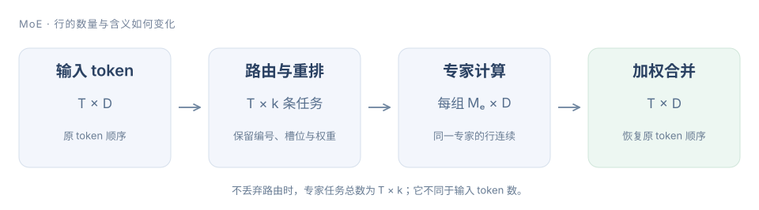

# 第八章 MoE 算子：路由、重排、专家计算与合并

MoE（Mixture of Experts，混合专家）先为 token 选择专家，把输入按专家重排，完成矩阵计算后，再按原 token 位置加权合并。一个 token 可以对应多条专家任务。

下面使用不丢弃 token 的 top-k 路由。路由权重、专家编号和逆映射随任务传递；共享专家、不同打分函数和多 GPU 分派分别扩展这条数据路径。

<figure class="diagram-frame">

<figcaption>一个 token 可以产生多条专家任务；combine 后恢复 token 数和原顺序。路由权重与逆映射必须随任务保留。</figcaption>
</figure>

## 1. 路由输出不是最终模型输出

令输入 X 为 [T,D]，E 个专家的 router logits 为 R[T,E]。对 token t 选出 k 个专家，输出专家编号 I[t,j] 和权重 G[t,j]。本章基础路由采用“选出 k 个最大 logits，再对它们做 Softmax”：

$$
\mathcal E_t=\operatorname{TopK}(R_{t,:},k),\qquad
G_{t,j}=\frac{\exp(R_{t,I_{t,j}})}
{\sum_{u=0}^{k-1}\exp(R_{t,I_{t,u}})}.
$$

分母只对选中的 k 个值求和，因此每行权重和为 1。先对全部 E 个 logits 做 Softmax，再选择并重新归一化，在精确算术下得到相同结果；若选择后不重新归一化，则不是同一算子。

例如 logits 为 [1,2,3,4]、k=2，选择专家 [3,2]，权重约 [0.7311,0.2689]。k=1 时权重是 1；k=E 时成为全量 Softmax。返回编号与返回权重的顺序必须对应，不能分别排序。

<!-- source-check: examples/semantics.py -->
~~~python
def route_topk(logits, k):
    if not logits or not 1 <= k <= len(logits) or not all(math.isfinite(x) for x in logits):
        raise ValueError("finite logits and 1 <= k <= E required")
    ids = sorted(range(len(logits)), key=lambda e: (-logits[e], e))[:k]
    maximum = max(logits[e] for e in ids)
    masses = [math.exp(logits[e] - maximum) for e in ids]
    total = sum(masses)
    return ids, [x / total for x in masses]
~~~

这段 CPU 模型显式规定平局时较小专家编号优先，便于检查。实际题面或模型若采用其他平局规则，需要相应匹配。若只是同一个选中集合的顺序不同，权重与编号配对后可以比较；若平局发生在 k 的边界，导致选中了不同专家，则专家输出可能改变，不能当作纯粹的排序展示差异。模型复现需要固定选择规则。NaN/Inf 会进一步影响排序，本章基础实现只接受有限值。

### 模型的 router 可能采用另一套语义

有的模型采用 sigmoid 打分、分组限选、额外 route scale，或者使用负载均衡 bias 辅助选专家。这些不能直接套用上面的 Softmax 公式。

尤其要区分“用于选谁的分数”和“用于加权的分数”。例如原始分数 [.4,.3,.2,.1]，仅选择阶段给最后一个专家加 .4，top-2 变成 [3,0]。如果模型规定加权仍用原始分数，归一化权重是 [.2,.8]，不是对 [.5,.4] 再归一化。把选择 bias 带进 combine，会改变数值语义。

## 2. 重排：把 token 顺序变成专家顺序

router 输出按 token 排列，GEMM 希望同一专家的输入行连续。每条任务至少保留三个信息：原 token 编号 t、该 token 的路由槽位 j、权重 g。专家编号决定放入哪个分组。

假设三个 token 的选择如下：

| token | 专家选择 | 两条任务 |
|---|---|---|
| 0 | [2,0] | (0,0)→E2，(0,1)→E0 |
| 1 | [2,0] | (1,0)→E2，(1,1)→E0 |
| 2 | [1,2] | (2,0)→E1，(2,1)→E2 |

分组后 E0 有 2 行，E1 有 1 行，E2 有 3 行。以专家顺序串起来，offsets=[0,2,3,6]；专家 e 负责 [offsets[e],offsets[e+1])。注意重排后有 T×k=6 行任务，不是原来的 3 行。

<!-- source-check: examples/semantics.py -->
~~~python
def group_routes(routes, experts):
    if experts <= 0:
        raise ValueError("positive expert count required")
    buckets = [[] for _ in range(experts)]
    for token, (ids, weights) in enumerate(routes):
        if len(ids) != len(weights) or len(ids) != len(set(ids)):
            raise ValueError("route ids and weights must match and be unique per token")
        for slot, (expert, weight) in enumerate(zip(ids, weights)):
            if not 0 <= expert < experts or not math.isfinite(weight) or weight < 0:
                raise ValueError("invalid expert or weight")
            buckets[expert].append((token, slot, weight))
    offsets = [0]
    for bucket in buckets:
        offsets.append(offsets[-1] + len(bucket))
    return offsets, [item for bucket in buckets for item in bucket]
~~~

GPU 上通常把这个过程拆成计数、前缀和、分配槽位、scatter。计数回答每个专家有多少任务，前缀和给出分组起点，scatter 才把输入或索引写入目标位置。若多个线程用原子加分配槽位，组内顺序可能变化；只要逆映射和权重一直对应，模型语义可以保持，但浮点合并顺序也可能变化。

空专家的起止 offset 相等，不能仍启动一个读取“第一行”的有效计算。分组 GEMM 的行数可以取真实 M_e，或按 tile 大小补齐；补齐行必须被 mask，不能凭空变成有效 token。

> [!IMPORTANT] 用任务的唯一身份检查重排
> 不丢弃路由的实现中，每个 (token,slot) 必须出现且只出现一次。只检查分组总行数为 T×k，查不出“丢了一行、又重复了一行”的错误。

## 3. 专家计算与 combine

以 SwiGLU 专家为例，隐藏维度为 I，专家 e 有三组权重：

$$
F_e(x)=\bigl[\operatorname{SiLU}(xW_e^{gate})
\odot(xW_e^{up})\bigr]W_e^{down}.
$$

每个专家分组形成 X_e[M_e,D]，两次输入投影得到 [M_e,I]，逐元素激活后再投影回 [M_e,D]。最终 token 输出为

$$
Y_t=\sum_{j=0}^{k-1}\bigl[G_{t,j}F_{I_{t,j}}(X_t)\bigr].
$$

有共享专家时，按模型规定另外加上共享分支输出；它不一定包含在这 k 个路由专家或其 Softmax 分母中。

### 权重应该乘在哪里

对纯线性且无 bias 的 F，gF(x)=F(gx)；存在 bias 或非线性时一般不成立。一个简单反例：F(x)=2x+4、g=0.25、x=3，gF(x)=2.5，而 F(gx)=5.5。

因此不能为了方便，把路由权重直接乘进输入后再执行整个 SwiGLU 专家。通常在专家输出或兼容的输出 epilogue 中应用路由权重，然后按 token 合并。融合变换必须针对具体计算式证明。

参考执行按专家遍历，但输出按原 token 累加：

<!-- source-check: examples/semantics.py -->
~~~python
def grouped_execute(inputs, routes, expert_functions):
    if len(inputs) != len(routes) or (inputs and any(len(row) != len(inputs[0]) for row in inputs)):
        raise ValueError("one route per token and rectangular inputs required")
    offsets, order = group_routes(routes, len(expert_functions))
    output = [[0.0] * len(row) for row in inputs]
    for expert, fn in enumerate(expert_functions):
        for token, slot, weight in order[offsets[expert]:offsets[expert+1]]:
            value = fn(inputs[token])
            if len(value) != len(output[token]):
                raise ValueError("expert output dimension mismatch")
            for d, v in enumerate(value):
                output[token][d] += weight * v
    return output
~~~

CPU 参考可以直接加到 output；GPU 若让不同专家同时写同一个 token，就有写冲突。可以使用原子加，或先写 [T,k,D] 临时输出，再由每个 token 的归约合并。后者增加临时数据，但容易固定合并顺序；原子路径可能受竞争与数值不确定性影响。两者都应与独立的 token-wise 参考比较。

### 专家权重“存着”与“本步读到”不同

若所有专家权重常驻设备，容量按总专家数 E 计算，不能按每个 token 激活的 k 个专家计算。对三矩阵 SwiGLU，路由专家权重约为 3EDI 个参数，另加 router、共享专家和其他模块。

但单次执行的计算量按被派发的任务计。不丢弃时 Σ_e M_e=T×k，三次 GEMM 的主要 FLOPs 约为

$$
F_{\mathrm{experts}}\approx6DI\sum_eM_e=6DITk.
$$

本批次会读取哪些专家权重，取决于所有 token 选择的并集。batch 增大后，这个并集可能覆盖多数专家；不能简单说每一步只读总权重的 k/E。权重 offload 则减少常驻容量，却引入传输、预取和缓存命中问题，也不能当作免费节省。

### 稀疏查表与专家计算不是同一种成本

DeepSeek-V4.1-Flash 还使用 Engram 条件记忆模块。它根据 token 序列确定查表位置，可以更早准备部分数据；这不同于先得到当前 hidden state、再由 router 决定专家的路径。两者都可能拥有很大的总参数量，却只访问其中一部分，但查表、专家矩阵计算和数据预取的瓶颈不能混用同一个估算。

对工程实现，先看地址什么时候已知，再决定是否能预取；先看数据在哪个设备或主机内存中，再计算传输量。拥有确定地址并不意味着传输免费，多个请求仍可能竞争互联、缓存与容量。

## 4. GPU 路由实现与优化

### 小 k 可以先用重复最大值选择

先让一个 Triton program 处理一行 E 个 logits。每次找最大值及其编号，记录后只排除这个编号，再选择下一项。不能排除所有等于最大值的元素，否则会错误丢掉并列值。

<!-- source-check: examples/moe_gpu.py -->
~~~python
@triton.jit
def gate_kernel(Logits, Weights, Indices, E: tl.constexpr, K: tl.constexpr,
                BLOCK_E: tl.constexpr, BLOCK_K: tl.constexpr):
    row = tl.program_id(0).to(tl.int64)
    e = tl.arange(0, BLOCK_E)
    slot = tl.arange(0, BLOCK_K)
    values = tl.load(Logits + row * E + e, mask=e < E, other=-float("inf"))
    selected = tl.full((BLOCK_K,), -float("inf"), tl.float32)
    for j in tl.static_range(K):
        best = tl.max(values, axis=0)
        expert = tl.min(tl.where((e < E) & (values == best), e, 2147483647), axis=0)
        selected = tl.where(slot == j, best, selected)
        tl.store(Indices + row * K + j, expert)
        values = tl.where(e == expert, -float("inf"), values)
    mass = tl.exp(selected - tl.max(selected, axis=0))
    weight = mass / tl.sum(mass, axis=0)
    tl.store(Weights + row * K + slot, weight, mask=slot < K)
~~~

padding logits 为 -inf，因此有限有效值优先；K 维的补齐槽位同样为 -inf，指数质量为零。这个基础实现限定有限 FP32 输入、E≤4096、k≤32，平局时较小编号优先。工作量近似 O(Ek)，适合小 k 起步，不是所有规模下的最佳 Top-K。

E 或 k 变大时，重复扫描、归约同步和寄存器压力会上升，可以比较分层候选选择、排序网络或其他选择算法。先保持相同平局、输出排序和 dtype 约定，避免把语义变化当作性能优化。

### Grouped GEMM 为什么有必要

逐专家启动 GEMM 简单，但很多专家可能只有几行，launch 数多且利用率低。Grouped GEMM 将多个独立矩阵问题交给一个调度器，使 GPU 在不同专家的 tile 之间分配工作。

给专家 e 的 tile 数 n_e，前缀 P_e=Σ_(j<e)n_j。全局 tile id 落在 [P_e,P_e+n_e) 时，才属于该专家；相对 tile id 再还原为输出行列。不同专家 M_e 不同，不能把最大 M_e 当作每组的有效行数。

固定数量的 CTA（Cooperative Thread Array，协作线程数组）可以循环领取 tile；更复杂的版本还会针对形状、异步搬运和矩阵指令调优。这里的调度目标是减少小矩阵造成的空闲，不能保证比每个专家独立使用库 GEMM 都快。

### 负载不均与数据搬运必须一起看

两个 batch 都有 T×k 条任务，但专家计数可能完全不同。均匀分配与全部挤向少数专家，得到的 GEMM 形状、权重复用和尾部浪费都不同。热点专家可能有更好的单矩阵效率，同时让其他设备或计算资源等待。

多 GPU 的 EP（Expert Parallelism，专家并行）把专家分到不同设备。dispatch 与 combine 会增加通信；是否能重叠取决于依赖、分块和资源竞争，不能直接把各段耗时相加或假设通信全能隐藏。先做单卡语义与性能，再研究跨卡路径。

capacity 限制、丢弃、重路由和负载均衡也属于模型/调度策略。本章不丢弃 token；为了跑快而默默截断过载专家，会改变模型结果。

| 优化对象 | 可调整项 | 对比时必须保留 |
|---|---|---|
| 路由 | 每行 program、候选选择、Softmax 融合 | 平局规则、编号顺序、归一化范围 |
| 重排 | 计数与 scan、索引分组、向量化 scatter | (token,slot) 的唯一性与逆映射 |
| 专家 GEMM | tile、grouped 调度、权重布局 | 每个 M_e、有效行、精度与矩阵边界 |
| 合并 | 原子加或临时输出再归约 | 路由权重、原 token 顺序、误差要求 |
| 整层 | 融合与通信重叠 | 包含路由、重排、计算、combine 的完整计时 |

## 5. 实践：先路由，再做完整分派与合并

### LeetGPU：正确性与代码归档

在 [LeetGPU 题库](https://leetgpu.com/challenges)完成 **MoE Top-K Gating（#67）**。输入 logits[M,E]，输出 topk_weights[M,k] 和 INT32 的 topk_indices[M,k]；它要求对选中的 logits 做 Softmax，不包含专家 GEMM、重排或 combine。

先验证 k=1、k=E、负 logits 和多行输入。无平局时可直接与 topk+softmax 对齐；有平局时单独核对平台约定。本章的固定平局规则只是明确的教学选择，不承诺与任意库版本的索引次序一致。

随后用一个很小的完整 MoE 参考验证数据组织：3 个 token、4 个专家、每 token 2 个选择。检查六个任务没有重复和遗漏，空专家正确跳过，按专家执行与按 token 执行得到相同结果：

~~~bash
python roadmap/curriculum/operators/08-moe/examples/semantics.py
~~~

CPU 中的专家函数刻意使用简单仿射函数，便于独立验证重排和加权；它不替代 SwiGLU GEMM 的真实 GPU 实验。

### 服务器：真实性能

保存对应题目的原始提交代码后，先比较 GPU 路由基线：

~~~bash
python roadmap/curriculum/operators/validate_baselines.py moe
python roadmap/curriculum/operators/validate_baselines.py moe --benchmark
~~~

脚本将有限、无平局的 logits 与 PyTorch topk+softmax 比较，另外测试本章的平局规则。性能测试包含输出分配与调用开销；它仅度量 router，不能写成整个 MoE 的加速比。

完整层实验应同时保存 M_e 分布、路由集合、输入输出 dtype、重排/专家/合并各段时间和整层时间。固定同一组 logits 或路由做比较，不能让两种实现碰巧得到不同负载，再把更均匀的一次当作优化成果。最终用模型的真实 router 和专家形状重新验证，而不是只保留均匀随机案例。

## 参考阅读

[CUDA Programming Guide](../../../../downloads/cuda-programming-guide.pdf) · [Triton Grouped GEMM](https://triton-lang.org/main/getting-started/tutorials/08-grouped-gemm.html) · [DeepSeek-V4.1-Flash 技术报告](../../../../downloads/DeepSeek_V41_Tech_Report.pdf)

## 章节导航

- [上一章：量化算子](../07-quantized-operators/README.md)
- [下一章：Sampling 与 KV 辅助算子](../09-sampling-kv/README.md)
